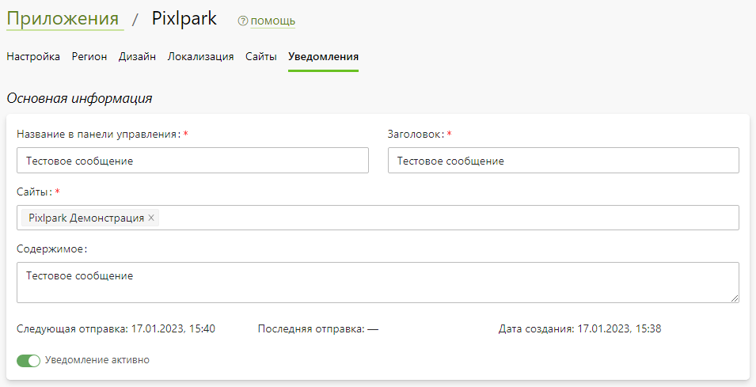
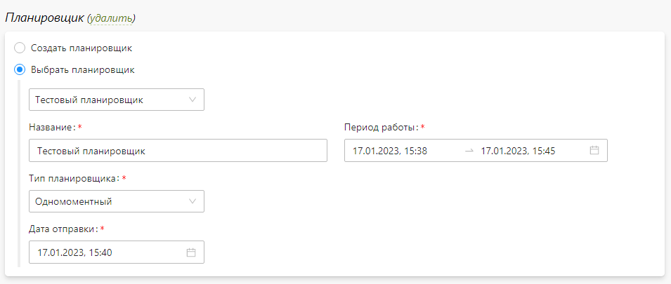
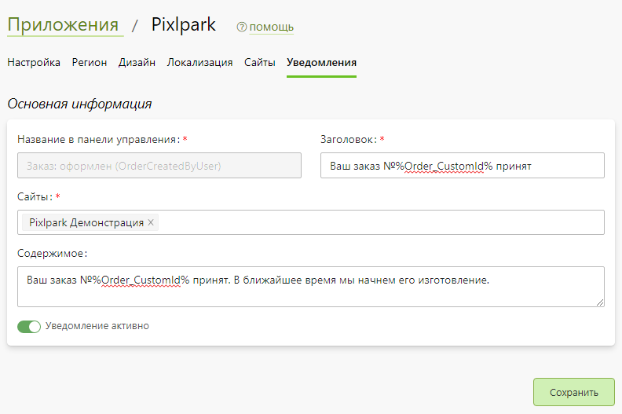

# Уведомления
* В данном разделе задаются настройки уведомлений для приложения.

## Индивидуальные шаблоны уведомлений
* В разделе можно создать индивидуальный шаблон уведомления, содержащий:
    + Название в панели управления.
    + Заголовок уведомления.
    + Список сайтов для уведомления.
    + Содержимое уведомления.
    + Информацию о последней отправке и дате создания.
    + Кнопку включения или отключения отправки уведомления.
* 
* Так же в разделе можно создать / выбрать / удалить планировщик для отправки индивидуального уведомления.

* Индивидуальные уведомления возможно принудительно отправлять, дублировать или удалять.

## Стандартные шаблоны уведомлений
* В данном разделе содержатся стандартные шаблоны уведомлений.
* Для каждого шаблона возможно задать:
    + Заголовок уведомления.
    + Список сайтов для уведомления.
    + Содержимое уведомления.
    + Включить или отключить отправку уведомления.
* 