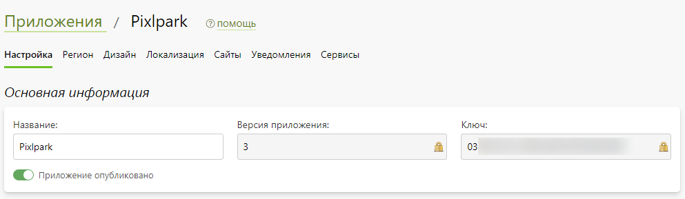
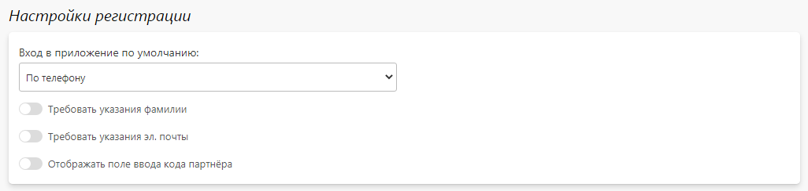
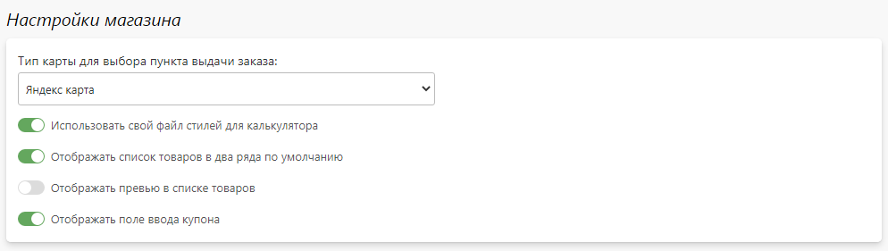
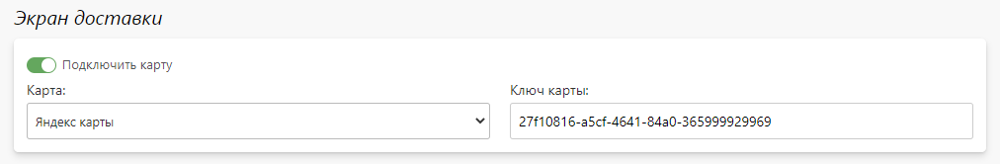

# Настройка
## Основная информация
* __Название__ - название приложения, которое будет отображаться в App Store и Play Маркет.
* __Ключ__ - системный идентификатор приложения, использующийся для его сборки.
* __Включить партнерскую программу__ - возможность ввода кода партнера на экране регистрации (при условии, что на выбранном сайте включена партнерская программа).

## Экран регистрации
* __Требовать указания фамилии__ - обязательный ввод фамилии на экране регистрации.
* __Требовать указания эл. почты__ - обязательный ввод электронной почты на экране регистрации.
* __Вход в приложение по умолчанию__ - настройки экрана входа по умолчанию:
    + По номеру телефона.
    + По адресу электронной почты.

## Экран заказов
* __Отображать заказы со всех сайтов__ - отображать в профиле клиента только заказы текущего выбранного сайта.
* __Отображать кнопку "Повторить заказ"__ - отображать на экране списка заказов кнопку "повторить заказ".
* __Отображать дополнительный номер заказа вместо основного__ - выводить на экране списка заказов дополнительный номер вместо основного.

## Экран магазина
* __Отображать список товаров в два ряда по умолчанию__ - по умолчанию выводить список товаров в виде иллюстраций в два ряда.

## Экран доставки
* __Подключить карту__ - использовать карту для просмотра и выбора точки выдачи.
