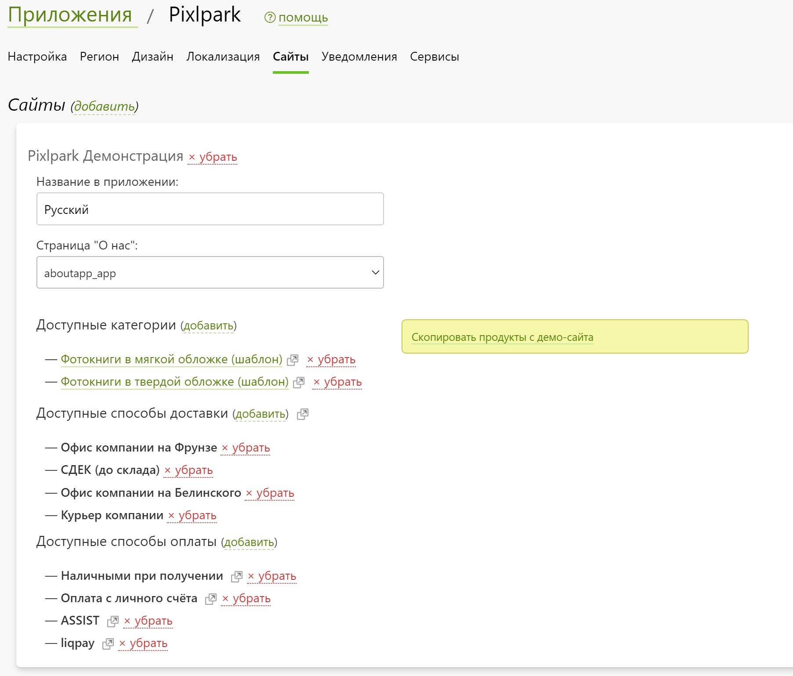
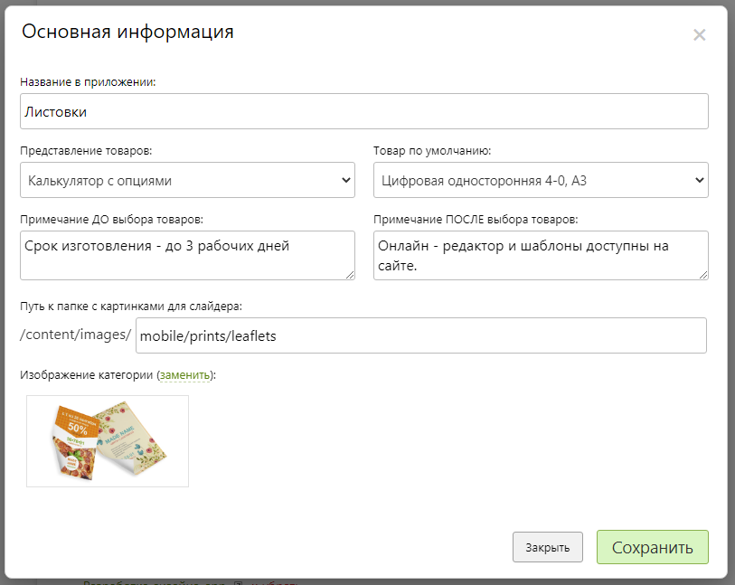

# Настройка магазина

* В данном разделе задается вся логика работы и содержимое раздела магазина.
* Исходя из того, что приложение является фактически отдельной витриной сайта, все его настройки, относящиеся к оформлению заказов расположены в настройках сайта.
* Более того, приложение может выступать в виде агрегатора сайтов. Например, каждый сайт может представлять собой отдельную локализацию приложения. В этом случае работа приложения начинается с экрана выбора сайта, который также можно сменить в личном кабинете.
* Для каждого выбранного сайта приложения можно задать:
    + Название, которое выводится на экране выбора сайта.
    + Страница "__О нас__", которая выводиться в личном кабинете.
    + Набор категорий продуктов из раздела "__Печать__" на сайте.
    + Набор способов доставки.
    + Набор способов оплаты.
* 
* 
* Для каждой категории в свою очередь можно:
    + Задавать название, выводящееся на экране списка категорий.
    + Создавать примечания До и После списка товаров на экране категории.
    + Выбирать изображение категории и товара по умолчанию.
    + Настроить использование калькулятора с поддержной опций.
    + Выводить список товаров в виде калькулятора.
    + По умолчанию выбирать первый товар в списке.
    + Скрывать цены в списке товаров.
*

* Редакторы, поддерживающие работу в приложении:
    + Редактор фотопечати.
    + Редактор товаров.
    + Редактор дизайнов.
    + Редактор макетов (работает как редактор товаров).
    + Редактор интерьера (работает как редактор дизайнов).