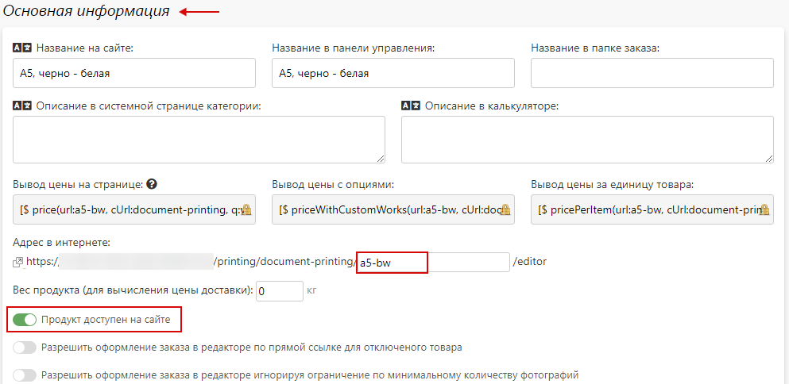
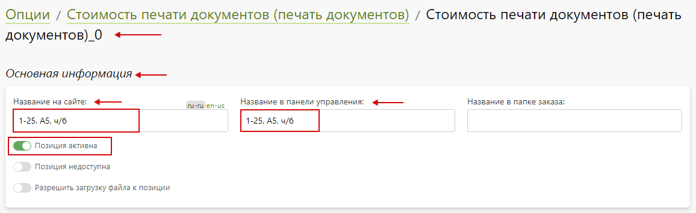
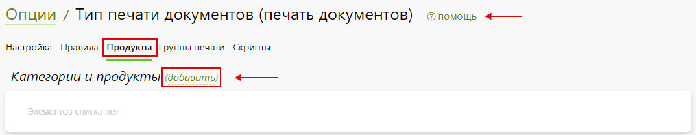
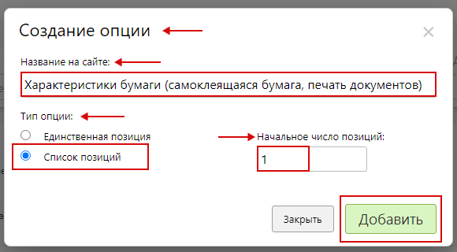
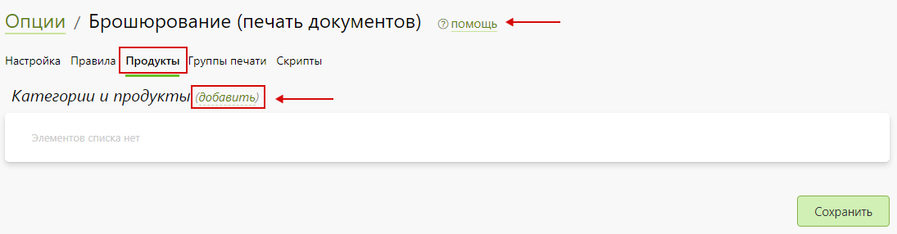
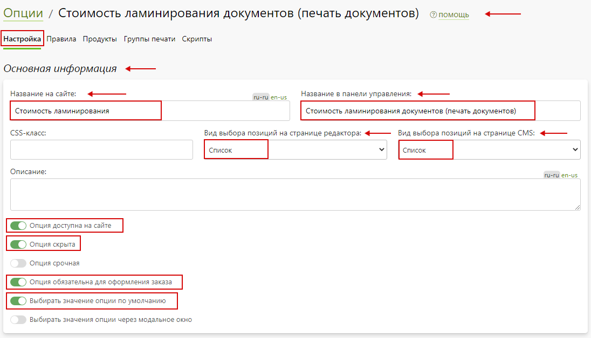
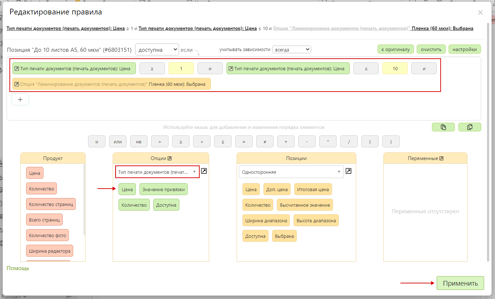
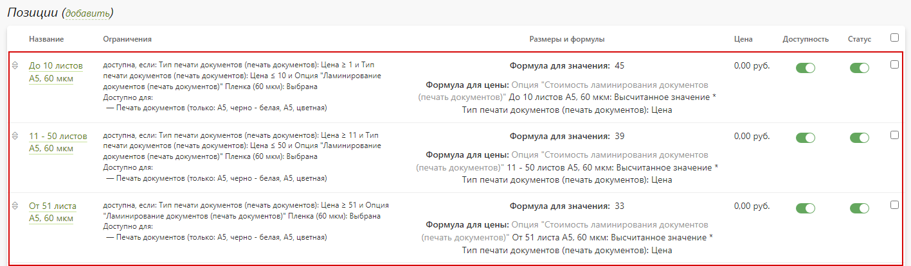
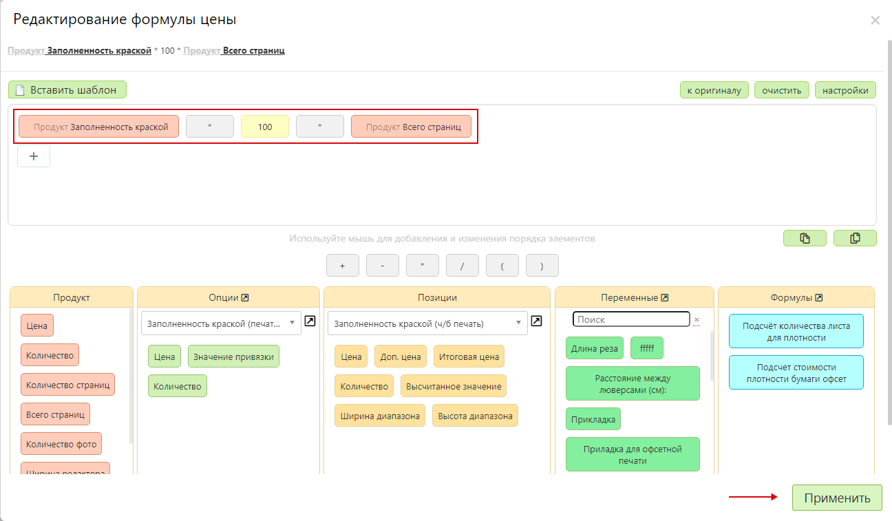
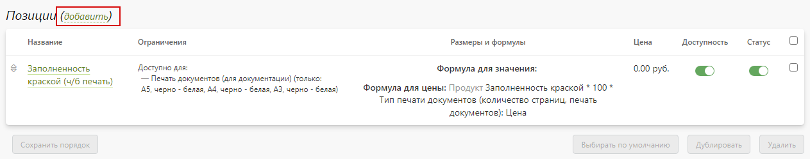

# [Печать документов](https://demo.pixlpark.ru/services/printing)
## Техническое задание
* Необходимо настроить расчет стоимости печати документов для форматов:
    - А5.
    - А4.
    - А3.

<table class="sheet-printing" id="document-printing-price">
	<thead>
		<tr>
			<th colspan="8">Стоимость печати листа в зависимости от тиражности</th>
		</tr>
		<tr>
			<th colspan="2">Формат печати</th>
			<th colspan="2">А5</th>
			<th colspan="2">А4</th>
			<th colspan="2">А3</th>
		</tr>
		<tr>
			<th colspan="2">Тираж, листов / Цветность</th>
			<th>Ч/б</th>
			<th>Цветная</th>
			<th>Ч/б</th>
			<th>Цветная</th>
			<th>Ч/б</th>
			<th>Цветная</th>
		</tr>
    </thead>
    <tbody>
		<tr>
			<td colspan="2">1 - 25</td>
			<td>9</td>
			<td>15</td>
			<td>12</td>
			<td>30</td>
			<td>24</td>
			<td>60</td>
		</tr>
		<tr>
			<td colspan="2">26 - 50</td>
			<td>7</td>
			<td>13</td>
			<td>9</td>
			<td>22,5</td>
			<td>18</td>
			<td>45</td>
		</tr>
		<tr>
			<td colspan="2">51 - 100</td>
			<td>6</td>
			<td>12</td>
			<td>7,5</td>
			<td>21</td>
			<td>15</td>
			<td>42</td>
		</tr>
		<tr>
			<td colspan="2">101 - 300</td>
			<td>5</td>
			<td>8</td>
			<td>6</td>
			<td>15</td>
			<td>12</td>
			<td>30</td>
		</tr>
		<tr>
			<td colspan="2">301 - 500</td>
			<td>4</td>
			<td>7</td>
			<td>4,5</td>
			<td>13,5</td>
			<td>9</td>
			<td>27</td>
		</tr>
		<tr>
			<td colspan="2">501 -1000</td>
			<td>3</td>
			<td>6</td>
			<td>3</td>
			<td>12</td>
			<td>6</td>
			<td>24</td>
		</tr>
	</tbody>
</table>

<table class="sheet-printing" id="document-printing-paper">
	<thead>
		<tr>
			<th colspan="5">Стоимость бумаги</th>
		</tr>
    </thead>
    <tbody>
		<tr>
			<td rowspan="5">Простая</td>
			<td>Плотность, г /м<sup>2</sup></td>
			<td>Стоимость А5, руб.</td>
			<td>Стоимость А4, руб.</td>
			<td>Стоимость А3, руб.</td>
		</tr>
		<tr>
			<td>80</td>
			<td>2</td>
			<td>3</td>
			<td>6</td>
		</tr>
		<tr>
			<td>130</td>
			<td>3</td>
			<td>4,5</td>
			<td>9</td>
		</tr>
		<tr>
			<td>200</td>
			<td>4,5</td>
			<td>7,5</td>
			<td>15</td>
		</tr>
		<tr>
			<td>300</td>
			<td>7</td>
			<td>11</td>
			<td>22</td>
		</tr>
		<tr>
			<td colspan="2">Самоклеящаяся бумага (односторонняя печать)</td>
			<td>38</td>
			<td>75</td>
			<td>150</td>
		</tr>
		<tr>
			<td colspan="2">Самоклеящаяся пленка (односторонняя печать)</td>
			<td>65</td>
			<td>130</td>
			<td>260</td>
		</tr>
		<tr>
			<td rowspan="14">Дизайнерская (односторонняя печать)</td>
			<td>Emotion Белый</td>
			<td rowspan="14">50</td>
			<td rowspan="14">75</td>
			<td rowspan="14">150</td>
		</tr>
		<tr>
			<td>Emotion Слоновая кость</td>
		</tr>
		<tr>
			<td>Majestic Белый мрамор</td>
		</tr>
		<tr>
			<td>Majestic Золотая лихорадка</td>
		</tr>
		<tr>
			<td>Majestic Золотой свет</td>
		</tr>
		<tr>
			<td>Majestic Свежая мята</td>
		</tr>
		<tr>
			<td>Cocktail Оранжевый</td>
		</tr>
		<tr>
			<td>Colorplan Светло-серый</td>
		</tr>
		<tr>
			<td>Colorplan Слоновая кость</td>
		</tr>
		<tr>
			<td>Planet Eco Kraft Brown</td>
		</tr>
		<tr>
			<td>Planet Eco Kraft Grey</td>
		</tr>
		<tr>
			<td>Planet Eco Folding Board Kraft</td>
		</tr>
		<tr>
			<td>Materica Kraft 120 г/м<sup>2</sup></td>
		</tr>
		<tr>
			<td>Materica Kraft 180 г/м<sup>2</sup></td>
		</tr>
		<tr>
			<td colspan="2">Бумага Touch Cover (односторонняя печать)</td>
			<td>150</td>
			<td>300</td>
			<td>450</td>
		</tr>
	</tbody>
</table>

<table class="sheet-printing" id="document-printing-bookleting">
	<thead>
		<tr>
			<th colspan="5">Стоимость брошюрования</th>
		</tr>
		<tr>
			<th colspan="2">Тип</th>
			<th>Стоимость А5, руб.</th>
			<th>Стоимость А4, руб.</th>
			<th>Стоимость А3, руб.</th>
		</tr>
    <thead>
    <tbody>
		<tr>
			<td colspan="2">Без брошюрования</td>
			<td>-</td>
			<td>-</td>
			<td>-</td>
		</tr>
		<tr>
			<td rowspan="4">Твердый переплет</td>
			<td>до 150 листов</td>
			<td>340</td>
			<td>490</td>
			<td>-</td>
		</tr>
		<tr>
			<td>151-200 листов</td>
			<td>380</td>
			<td>540</td>
			<td>-</td>
		</tr>
		<tr>
			<td>221-300 листов</td>
			<td>415</td>
			<td>590</td>
			<td>-</td>
		</tr>
		<tr>
			<td>50-300 листов</td>
			<td>-</td>
			<td>-</td>
			<td>790</td>
		</tr>
		<tr>
			<td rowspan="7">Пластиковая / металлическая пружина</td>
			<td>до 35 листов</td>
			<td>64</td>
			<td>90</td>
			<td>125</td>
		</tr>
		<tr>
			<td>36-65 листов</td>
			<td>88</td>
			<td>125</td>
			<td>180</td>
		</tr>
		<tr>
			<td>66-85 листов</td>
			<td>122</td>
			<td>175</td>
			<td>250</td>
		</tr>
		<tr>
			<td>86-125 листов</td>
			<td>150</td>
			<td>210</td>
			<td>310</td>
		</tr>
		<tr>
			<td>126-155 листов</td>
			<td>175</td>
			<td>250</td>
			<td>350</td>
		</tr>
		<tr>
			<td>156-250 листов</td>
			<td>190</td>
			<td>275</td>
			<td>385</td>
		</tr>
		<tr>
			<td>251-450 листов</td>
			<td>220</td>
			<td>315</td>
			<td>440</td>
		</tr>
		<tr>
			<td rowspan="3">Полиграфические болты / кольца</td>
			<td>2 шт.</td>
			<td colspan="3">120</td>
		</tr>
		<tr>
			<td>3 шт.</td>
			<td colspan="3">180</td>
		</tr>
		<tr>
			<td>4 шт.</td>
			<td colspan="3">240</td>
		</tr>
	</tbody>
</table>

<table class="sheet-printing" id="document-printing-lamination">
	<thead>
		<t>
			<th colspan="5">Стоимость ламинирования листа</th>
		</tr>
		<tr>
			<th colspan="2">Тип ламинирования</th>
			<th>Стоимость А5, руб.</th>
			<th>Стоимость А4, руб.</th>
			<th>Стоимость А3, руб.</th>
		</tr>
    </thead>
    <tbody>
		<tr>
			<td colspan="2">Нет</td>
			<td>-</td>
			<td>-</td>
			<td>-</td>
		</tr>
		<tr>
			<td rowspan="3">60 мкм</td>
			<td>1-10 листов</td>
			<td>45</td>
			<td>75</td>
			<td>105</td>
		</tr>
		<tr>
			<td>11-50 листов</td>
			<td>39</td>
			<td>65</td>
			<td>95</td>
		</tr>
		<tr>
			<td>от 51 листа</td>
			<td>33</td>
			<td>55</td>
			<td>85</td>
		</tr>
		<tr>
			<td rowspan="3">125 мкм</td>
			<td>1-10 листов</td>
			<td>57</td>
			<td>95</td>
			<td>130</td>
		</tr>
		<tr>
			<td>11-50 листов</td>
			<td>51</td>
			<td>85</td>
			<td>115</td>
		</tr>
		<tr>
			<td>от 51 листа</td>
			<td>45</td>
			<td>75</td>
			<td>105</td>
		</tr>
		<tr>
			<td rowspan="3">250 мкм</td>
			<td>1-10 листов</td>
			<td>72</td>
			<td>120</td>
			<td>180</td>
		</tr>
		<tr>
			<td>11-50 листов</td>
			<td>63</td>
			<td>105</td>
			<td>165</td>
		</tr>
		<tr>
			<td>от 51 листа</td>
			<td>57</td>
			<td>95</td>
			<td>155</td>
		</tr>
	</tbody>
</table>

##### Прочие надбавки
<table class="sheet-printing" id="document-printing-allowance">
	<thead>
		<tr>
			<th colspan="2">Наименование</th>
			<th>Стоимость, руб.</th>
		</tr>
    </thead>
    <tbody>
		<tr>
			<td rowspan="2">Тип печати</td>
			<td>Односторонняя</td>
			<td>-</td>
		</tr>
		<tr>
			<td>Двухсторонняя</td>
			<td>-</td>
		</tr>
		<tr>
			<td rowspan="2">Заполненность листа краской</td>
			<td>Ч/б печать</td>
			<td>100</td>
		</tr>
		<tr>
			<td>Цветная печать</td>
			<td>200</td>
		</tr>
	</tbody>
</table>

## Формула для расчета стоимости печати документа
```	formula
Стоимость печати = стоимость печати листов + стоимость бумаги + стоимость брошюрования + стоимость ламинирования + наценка за заполненность листа краской.
```

### Пример расчета для продукта
* Для проверки расчетов взять продукт с характеристиками согласно таблице.

| Тип продукта            | Документ pdf                  |
|:-----------------------:|:-----------------------------:|
| Количество страниц, шт. | 25                            |
| Цветность               | Ч/б                           |
| Формат печати           | А4                            |
| Тип печати              | Двусторонняя                  |
| Тип бумаги              | 80 г/м<sup>2</sup>            |
| Брошюрование            | Полиграфические болты – 3 шт. |
| Ламинирование           | Без ламинирования             |
* Этапы расчета:
    1.  Расчет стоимости печати
		+ Стоимость печати листа определяется таблицей [Стоимость печати листа в зависимости от тиражности](/calculators/document-printing?id=document-printing-price) технического задания. Указанное количество страниц попадает в диапазон от 1 до 25 листов, следовательно, стоимость ч/б печати одного листа равна 12 рублей. Для расчета стоимости печати необходимо умножить стоимость ч/б печати 1 листа на количество листов: 
        ``` formula
		12 руб. * 25 листов = 300 руб.
		```
    2.  Расчёт необходимого количества листов
        + Для определения необходимого количества листов для двусторонней печати необходимо разделить количество листов на 2 и округлить значение в большую сторону.
        ``` formula
		25 листов / 2 = 13 листов
		```
    3.  Расчет стоимости бумаги
        + Стоимость листа бумаги определяется в таблице [Стоимость бумаги](/calculators/document-printing?id=document-printing-paper) и для формата А4 плотностью 80 г/м<sup>2</sup> равна 3 рублям. Для расчета стоимости бумаги необходимо умножить стоимость 1 листа на количество листов из п.2:
        ```formula
		3 руб. * 13 листов = 39 рублей
		```
    4.  Расчет стоимости брошюрования
        + Стоимость брошюрования полиграфическими болтами определяется согласно таблице [Стоимость брошюрования](/calculators/document-printing?id=document-printing-bookleting) и при использовании 3 болтов равна 180 рублям.
* __Итоговая стоимость изготовления документа составит:__
	``` formula
	12 руб. * 25 + 3 руб. * 13 + 180 руб. = 519 руб.
	```

## Создание калькулятора
* Для создания калькулятора продукта "__Печать документов__" в разделе "__Печать / Продукты__" нажать кнопку "__Добавить / Обновить__".

* В открывшейся карточке создания категории заполнить форму, указав:
	+ "__Создать новую категорию__"- необходимо выбрать.
	+ "__Название на сайте__" - указать "__Печать документов__".
	+ "__Редактор__" – выбрать "__Редактор товаров__".
* 
* Далее, нажать "__Добавить__" для создания продукта.
* В подразделе "__Основная информация__" созданной категории продукта необходимо задать адрес в интернете латинскими буквами.

* После, нажать "__Сохранить__" и сбросить кэш сайта.
* В подразделе "__Страница категории__" раздела "__Печать / Продукты / Печать документов / Настройка__" выбрать страницу, на которой будет располагаться данный продукт, а также задать настройки подраздела "__Хлебные крошки__" для отображения хлебных крошек в формате "__страница-раздела__", "__страница-раздела / страница-продукта__".

* После, нажать "__Сохранить__" и сбросить кэш сайта.
* В подразделе "__Основная информация__" раздела "__Печать / Продукты / Печать документов / Атрибуты__" включить "__Использовать атрибуты для выбора продукта__" и добавить атрибуты при помощи "__Добавить__" :
	+ "__Формат__".
	+ "__Цветность печати__".
* 
* После, нажать "__Сохранить__" и сбросить кэш сайта.

### Создание продуктов категории "Печать документов"
* В подразделе "__Продукты__" раздела "__Печать / Продукты / Печать документов / Продукты__" добавить продукт нажав "__Добавить__". 

* В открывшейся карточке создания продукта заполнить поля, указав:
	+ "__Создать новый продукт с нуля__" - необходимо выбрать.
	+ "__Название на сайте__" – указать "__А5, черно - белая__".
* 
* Затем, нажать "__Добавить__".
* В подразделе "__Основная информация__" раздела "__Настройка__" созданного продукта задать адрес в интернете латинскими буквами и включить "__Продукт доступен на сайте__".

* В подразделе "__Тиражность__" раздела "__Настройка__" созданного продукта задать стоимость для количества от 1 до 1000 с шагом 1 шт. равной нулю.
> Стоимость равна нулю т.к. она будет сформирована при помощи опций. 
* 
* После, нажать "__Сохранить__" и сбросить кэш сайта.
* В разделе "__Атрибуты__" созданного продукта задать значения атрибутов:
	+ "__Формат__" – задать значение "__А5__".
	+ "__Цветность печати__" – задать значение "__Черно - белая__".
* 
* После, нажать "__Сохранить__" и сбросить кэш сайта.
* Аналогичным образом создаются и настраиваются оставшиеся согласно таблице продукты.
| **Название продукта** | **Атрибуты**                                     |
|:---------------------:|:------------------------------------------------:|
| А5, цветная           | Формат: А5 <br> Цветность печати: цветная        |
| А4, черно - белая     | Формат: А4 <br> Цветность печати: черно - белая  | 
| А4, цветная           | Формат: А4 <br> Цветность печати: цветная        |
| А3, черно - белая     | Формат: А3 <br> Цветность печати: черно - белая  |
| А3, цветная           | Формат: А3 <br> Цветность печати: цветная        |
* После внесения всех продуктов раздел выглядит следующим образом:
* 

## Опции для печати документов
* 
	+ [Стоимость печати документов (печать документов)](/calculators/document-printing?id=Стоимость-печати-документов-печать-документов).
    + [Тип печати документов (печать документов)](/calculators/document-printing?id=Тип-печати-документов-печать-документов).
    + [Тип бумаги для печати документов (печать документов)](/calculators/document-printing?id=Тип-бумаги-для-печати-документов-печать-документов).
    + [Характеристика бумаги (простая бумага, печать документов)](/calculators/document-printing?id=Характеристика-бумаги-простая-бумага-печать-документов).
	+ [Характеристика бумаги (самоклеящаяся бумага, печать документов)](/calculators/document-printing?id=Характеристика-бумаги-самоклеящаяся-бумага-печать-документов).
	+ [Характеристика бумаги (самоклеящаяся пленка, печать документов)](/calculators/document-printing?id=Характеристика-бумаги-самоклеящаяся-пленка-печать-документов).
	+ [Характеристика бумаги (дизайнерская бумага, печать документов)](/calculators/document-printing?id=Характеристика-бумаги-дизайнерская-бумага-печать-документов).
	+ [Характеристика бумаги (Touch Cover, печать документов)](/calculators/document-printing?id=Характеристика-бумаги-touch-cover-бумага-печать-документов).
	+ [Итоговая стоимость печати и бумаги (печать документов)](/calculators/document-printing?id=Итоговая-стоимость-печати-и-бумаги-печать-документов).
	+ [Брошюрование (печать документов)](/calculators/document-printing?id=Брошюрование-печать-документов).
	+ [Брошюрование (твердый переплет, печать документов)](/calculators/document-printing?id=Брошюрование-твердый-переплет-печать-документов).
	+ [Брошюрование (пружины, печать документов)](/calculators/document-printing?id=Брошюрование-пружины-печать-документов).
	+ [Брошюрование (полиграфические болты/кольца, печать документов)](/calculators/document-printing?id=Брошюрование-полиграфические-болтыкольца-печать-документов).
	+ [Ламинирование документов (печать документов)](/calculators/document-printing?id=Ламинирование-документов-печать-документов).
	+ [Стоимость ламинирования документов (печать документов)](/calculators/document-printing?id=Стоимость-ламинирования-документов-печать-документов).
	+ [Заполненность краской (печать документов)](/calculators/document-printing?id=Заполненность-краской-печать-документов).

### Стоимость печати документов (печать документов) 
> Назначение опции: определение стоимости печати листов документа в зависимости от формата и тиражности.
* В разделе "__Печать / Калькуляция / Опции__" нажать кнопку "__Добавить опцию__" для создания новой опции.

* В открывшейся карточке создания опции заполнить форму, указав:
    + "__Название на сайте__" - указать "__Стоимость печати документов (печать документов)__".
    + "__Тип опции__" - указать "__Список позиций__".
    + "__Начальное число позиций__" - указать "__1__".
* 
* Далее, нажать "__Добавить__" для создания опции.
* В подразделе "__Основная информация__" опции "__Стоимость печати документов (печать документов) / Настройка__" заполнить форму, указав:
    + "__Название на сайте__" – указать "__Стоимость печати документов__".
    + "__Название в панели управления__" – указать "__Стоимость печати документов (печать документов)__".
    + "__Вид выбора позиций на странице редактора__" и "__Вид выбора позиций на странице CMS__" - выбрать список.
    + "__Опция доступная на сайте__" - необходимо включить.
    + "__Опция скрыта__" - необходимо включить.
    + "__Опция обязательная для оформления заказа__" - необходимо включить.
    + "__Выбирать значение опции по умолчанию__" - необходимо включить.
* 
* В подразделе "__Расчет стоимости__" опции "__Стоимость печати документов (печать документов) / Настройка__" задать настройки:
    + "__Алгоритм расчета позиции__" – выбрать "__Цена позиции фиксированная__".
    + "__Алгоритм расчета опции__" – выбрать "__Цена опции = количество продуктов * количество страниц в продукте * цена позиции + дополнительная цена позиции__".
    + "__Алгоритм расчета количества опций__" – выбрать "__Количество опций равно количеству продуктов__".
    + "__Алгоритм выбора позиций__" - выбрать "__Возможен выбор только одной позиции__".
* 
* В подразделе "__Позиции__" опции "__Стоимость печати документов (печать документов) / Настройка__" содержится перечень позиций созданной опции.

* Далее, нажать кнопку "__Сохранить__" и сбросить кэш сайта.
* В подразделе "__Категории и продукты__" опции "__Стоимость печати документов (печать документов) / Продукты__" добавить продукты нажав кнопку "__Добавить__". 
> В данном разделе осуществляется привязка опции к необходимым продуктам. После осуществления привязки опция будет участвовать в формировании цены продуктов.
* 
* В появившемся окне выбора категории в поле поиска ввести название категории продукта, а после – выбрать нужный продукт в списке.

* Затем, нажать кнопку "__Выбрать__", а после - "__Сохранить__" и сбросить кэш сайта.

#### Позиции опции "Стоимость печати документов (печать документов)"
> Стоимость печати задается в соответствии с ТЗ. В данном случае создана одна позиция, настройка которой будет описываться ниже. Оставшиеся позиции опции создаются аналогично.
* Для настройки позиции опции "__Стоимость печати документов (печать документов)__" перейти в карточку позиции нажав на нее. Затем, заполнить подраздел "__Основная информация__", указав:
    + "__Название на сайте__" – указать "__1-25, А5, ч/б__".
    + "__Название в панели управления__" – указать "__1-25, А5, ч/б__".
    + "__Позиция активна__" - необходимо включить.
*  
* В подразделе "__Ограничения__" позиции опции "__Стоимость печати документов (печать документов)__" включить "__Ограничить позицию следующими категориями раздела Печать__" и выбрать категории печати нажав "__Выбрать__":
    + А5, черно – белая.
*  
* Затем, нажать "__Сохранить__".
* В подразделе "__Правила доступности__" позиции опции "__Стоимость печати документов (печать документов)__" добавить правило, нажав "__Добавить__":
``` formula
Позиция опции доступна если документ имеет от 1 до 25 листов включительно
```
> Ограничение позволяет использовать данную позицию при попадании количества листов документа в диапазон значений от 1 до 25.
*   
* Затем, нажать "__Применить__".
* В подразделе "__Стоимость__" позиции опции "__Стоимость печати документов (печать документов)__" задать стоимость "__9__" руб.

* Затем, нажать "__Сохранить__" и сбросить кэш сайта.
* Аналогичным образом настраиваются оставшиеся позиции согласно таблице [стоимости печати листа в зависимости от тиражности](/calculators/document-printing?id=document-printing-price).
> Добавить новую позицию опции можно при помощи "__Добавить__".
* 
> Также, позицию опции можно продублировать и скорректировать настройки в соответствии с нужными данными.
* После внесения всех данных подраздел "__Позиции__" опции "__Стоимость печати документов (печать документов)__" для формата А5 выглядит следующим образом:

> Для остальных форматов настройка осуществляется аналогично.

### Тип печати документов (печать документов)
> Назначение опции: рассчитывает количество листов документа в зависимости от типа печати (односторонняя либо двухсторонняя).
* В разделе "__Печать / Калькуляция / Опции__" нажать кнопку "__Добавить опцию__" для создания новой опции.

* В открывшейся карточке создания опции заполнить форму, указав:
    + "__Название на сайте__" - указать "__Тип печати документов (печать документов)__".
    + "__Тип опции__" - указать "__Список позиций__".
    + "__Начальное число позиций__" - указать "__1__".
*  
* Далее, нажать "__Добавить__" для создания опции.
* В подразделе "__Основная информация__" опции "__Тип печати документов (печать документов) / Настройка__" заполнить форму, указав:
    + "__Название на сайте__" – указать "__Тип печати__".
    + "__Название в панели управления__" – указать "__Тип печати документов (печать документов)__".
    + "__CSS-класс__" - указать "__col5__".
    + "__Вид выбора позиций на странице редактора__" и "__Вид выбора позиций на странице CMS__" - выбрать список.
    + "__Опция доступна на сайте__" - необходимо включить.
    + "__Опция обязательная для оформления заказа__" - необходимо включить.
    + "__Выбирать значение опции по умолчанию__" - необходимо включить.
* 
* В подразделе "__Расчет стоимости__" опции "__Тип печати документов (печать документов) / Настройка__" задать настройки:
    + "__Алгоритм расчета позиции__" – выбрать "__Цена позиции динамическая__".
    + "__Алгоритм расчета опции__" – выбрать "__Цена опции = цена позиции + доп. цена позиции__".
    + "__Алгоритм расчета количества опций__" – выбрать "__Количество опций равно количеству продуктов__".
    + "__Алгоритм выбора позиций__" - выбрать "__Возможен выбор только одной позиции__".
* 
* В подразделе "__Позиции__" опции "__Тип для печати документов (печать документов) / Настройка__" содержится перечень позиций созданной опции.

* Далее, нажать кнопку "__Сохранить__" и сбросить кэш сайта.
* В подразделе "__Категории и продукты__" опции "__Тип печати документов (печать документов) / Продукты__" добавить продукты нажав кнопку "__Добавить__". 

* В появившемся окне выбора категории в поле поиска ввести название категории продукта, а после – выбрать нужный продукт в списке.

* Затем, нажать кнопку "__Выбрать__", а после - "__Сохранить__" и сбросить кэш сайта.

#### Позиции опции "Тип печати документов (печать документов)"
> Позиции опции определяют тип печати и рассчитывают количество листов для документа.
* Для настройки позиции опции "__Тип печати документов (печать документов)__" перейти в карточку позиции нажав на нее. Затем, заполнить подраздел "__Основная информация__", указав:
    + "__Название на сайте__" – указать "__Односторонняя__".
    + "__Название в панели управления__" – указать "__Односторонняя__".
    + "__Позиция активна__" - необходимо включить.
* 
* В подразделе "__Стоимость__" позиции опции "__Тип печати документов (печать документов)__" задать способ расчета цены "__По формуле__". Затем, в поле "__Формула для цены__" задать формулу для расчета количества листов для печати:
``` formula
Количество листов для печати равно количеству страниц документа
```

* Затем, нажать "__Применить__".
* Далее, для результатов поля "__Формула для цены__" задать способ округления результата до целого числа в большую сторону.

> Округление значения в большую сторону позволит рассчитать целое значение количества листов.
* После, нажать "__Сохранить__" и сбросить кэш сайта.
* Аналогичным образом настраивается позиция для двусторонней печати с учетом разделения значения количества страниц продукта на 2.
> Добавить новую позицию опции можно при помощи "__Добавить__".
* 
> Также, позицию опции можно продублировать и скорректировать настройки в соответствии с нужными данными.
* После внесения всех данных подраздел "__Позиции__" опции "__Тип печати документов (печать документов)__" выглядит следующим образом:


### Тип бумаги для печати документов (печать документов)
> Назначение опции: позволяет выбрать тип бумаги для печати документа.
* В разделе "__Печать / Калькуляция / Опции__" нажать кнопку "__Добавить опцию__" для создания новой опции.

* В открывшейся карточке создания опции заполнить форму, указав:
    + "__Название на сайте__" - указать "__Тип бумаги для печати документов (печать документов)__".
    + "__Тип опции__" - указать "__Список позиций__".
    + "__Начальное число позиций__" - указать "__1__".
* 
* Далее, нажать "__Добавить__" для создания опции.
* В подразделе "__Основная информация__" опции "__Тип бумаги для печати документов (печать документов) / Настройка__" заполнить форму, указав:
    + "__Название на сайте__" – указать "__Тип бумаги__".
    + "__Название в панели управления__" – указать "__Тип бумаги для печати документов (печать документов)__".
    + "__CSS-класс__" - указать "__button—height col5__".
    + "__Вид выбора позиций на странице редактора__" и "__Вид выбора позиций на странице CMS__" - выбрать список.
    + "__Опция доступна на сайте__" - необходимо включить.
    + "__Опция обязательная для оформления заказа__" - необходимо включить.
    + "__Выбирать значение опции по умолчанию__" - необходимо включить.
* 
* В подразделе "__Расчет стоимости__" опции "__Тип бумаги для печати документов (печать документов) / Настройка__" задать настройки:
    + "__Алгоритм расчета позиции__" – выбрать "__Цена позиции фиксированная__".
    + "__Алгоритм расчета опции__" – выбрать "__Цена опции = цена позиции + доп. цена позиции__".
    + "__Алгоритм расчета количества опций__" – выбрать "__Количество опций равно количеству продуктов__".
    + "__Алгоритм выбора позиций__" - выбрать "__Возможен выбор только одной позиции__".
* 
* В подразделе "__Позиции__" опции "__Тип бумаги для печати документов (печать документов) / Настройка__" содержится перечень позиций созданной опции.

* Далее, нажать кнопку "__Сохранить__" и сбросить кэш сайта.
* В подразделе "__Категории и продукты__" опции "__Тип бумаги для печати документов (печать документов) / Продукты__" добавить продукты нажав кнопку "__Добавить__". 

* В появившемся окне выбора категории в поле поиска ввести название категории продукта, а после – выбрать нужный продукт в списке.

* Затем, нажать кнопку "__Выбрать__", а после - "__Сохранить__" и сбросить кэш сайта.

#### Позиции опции "Тип бумаги для печати документов (печать документов)"
> Позиции опции определяют доступность и тип бумаги в зависимости от типа печати.
* Для настройки позиции опции "__Тип бумаги для печати документов (печать документов)__" перейти в карточку позиции нажав на нее. Затем, заполнить подраздел "__Основная информация__", указав:
    + "__Название на сайте__" – указать "__Простая__".
    + "__Название в панели управления__" – указать "__Простая__".
    + "__Позиция активна__" - необходимо включить.
* 
* Затем, нажать "__Сохранить__" и сбросить кэш сайта.
* Аналогичным образом настраиваются оставшиеся позиции согласно таблице:

| **Тип бумаги**       | **Ограничения типа печати** |
|:--------------------:|:---------------------------:|
| Самоклеящаяся бумага | Односторонняя               |
| Самоклеящаяся пленка | Односторонняя               |
| Дизайнерская	       | Односторонняя               |
| Бумага Touch Cover   | Односторонняя               |
> Добавить новую позицию опции можно при помощи "__Добавить__".
*  
> Также, позицию опции можно продублировать и скорректировать настройки в соответствии с нужными данными. Ограничение типа печати задается в подразделе "__Правила доступности__" позиции опции.
* 
* После внесения всех данных подраздел "__Позиции__" опции "__Тип бумаги для печати документов (печать документов)__" выглядит следующим образом:


### Характеристика бумаги (простая бумага, печать документов)
> Назначение опции: позволяет выбрать плотность простой бумаги и задать её стоимость.
* В разделе "__Печать / Калькуляция / Опции__" нажать кнопку "__Добавить опцию__" для создания новой опции.

* В открывшейся карточке создания опции заполнить форму, указав:
    + "__Название на сайте__" - указать "__Характеристика бумаги (простая бумага, печать документов)__".
    + "__Тип опции__" - указать "__Список позиций__".
    + "__Начальное число позиций__" - указать "__1__".
*  
* Далее, нажать "__Добавить__" для создания опции.
* В подразделе "__Основная информация__" опции "__Характеристика бумаги (простая бумага, печать документов) / Настройка__" заполнить форму, указав:
    + "__Название на сайте__" – указать "__Плотность бумаги__".
    + "__Название в панели управления__" – указать "__Характеристика бумаги (простая бумага, печать документов)__".
    + "__Вид выбора позиций на странице редактора__" и "__Вид выбора позиций на странице CMS__" - выбрать список.
    + "__Опция доступна на сайте__" - необходимо включить.
    + "__Опция обязательная для оформления заказа__" - необходимо включить.
    + "__Выбирать значение опции по умолчанию__" - необходимо включить.
*  
* В подразделе "__Расчет стоимости__" опции "__Характеристика бумаги (простая бумага, печать документов) / Настройка__" задать настройки:
    + "__Алгоритм расчета позиции__" – выбрать "__Цена позиции фиксированная__".
    + "__Алгоритм расчета опции__" – выбрать "__Цена опции = цена позиции + доп. цена позиции__".
    + "__Алгоритм расчета количества опций__" – выбрать "__Количество опций равно количеству продуктов__".
    + "__Алгоритм выбора позиций__" - выбрать "__Возможен выбор только одной позиции__".
*  
* В подразделе "__Позиции__" опции "__Характеристика бумаги (простая бумага, печать документов) / Настройка__" содержится перечень позиций созданной опции.
 
* Далее, нажать кнопку "__Сохранить__" и сбросить кэш сайта.
* В подразделе "__Категории и продукты__" опции "__Характеристика бумаги (простая бумага, печать документов) / Продукты__" добавить продукты нажав кнопку "__Добавить__". 
 
* В появившемся окне выбора категории в поле поиска ввести название категории продукта, а после – выбрать нужный продукт в списке.
 
* Затем, нажать кнопку "__Выбрать__", а после - "__Сохранить__" и сбросить кэш сайта.
* Далее, в подразделе "__Правила доступности__" опции "__Характеристика бумаги (простая бумага, печать документов) / Правила__" добавить правило, нажав "__Добавить__":
``` formula
Опция "Характеристика бумаги (простая бумага, печать документов)" доступна если выбрана позиция "Простая" опции "Тип бумаги для печати документов (печать документов)"
```

* Далее, нажать "__Применить__", затем нажать кнопку "__Сохранить__" и сбросить кэш сайта.

#### Позиции опции "Характеристика бумаги (простая бумага, печать документов)"
> Стоимость за бумагу задается в соответствии с ТЗ. В данном случае создана одна позиция, настройка которой будет описываться ниже. Оставшиеся позиции опции создаются аналогично.
* Для настройки позиции опции "__Характеристика бумаги (простая бумага, печать документов)__" перейти в карточку позиции нажав на нее. Затем, заполнить подраздел "__Основная информация__", указав:
    + "__Название на сайте__" – указать "__80 г/м<sup>2</sup>__".
    + "__Название в панели управления__" – указать "__80 г/м<sup>2</sup> (А5)__".
    + "__Позиция активна__" - необходимо включить.
* 
* В подразделе "__Ограничения__" позиции опции "__Характеристика бумаги (простая бумага, печать документов)__" включить "__Ограничить позицию следующими категориями раздела "Печать__" и выбрать категории печати нажав "__Выбрать__":
    + А5, черно – белая.
    + А5, цветная.
* 
* Затем, нажать "__Сохранить__".
* В подразделе "__Стоимость__" позиции опции "__Характеристика бумаги (простая бумага, печать документов)__" задать стоимость "__2__" руб.

* Затем, нажать "__Сохранить__" и сбросить кэш сайта.
* Аналогичным образом настраиваются оставшиеся позиции согласно таблице [стоимости бумаги](/calculators/document-printing?id=document-printing-paper).
> Добавить новую позицию опции можно при помощи "__Добавить__".
* 
> Также, позицию опции можно продублировать и скорректировать настройки в соответствии с нужными данными.
* После внесения всех данных подраздел "__Позиции__" опции "__Характеристика бумаги (простая бумага, печать документов)__" выглядит следующим образом:


### Характеристика бумаги (самоклеящаяся бумага, печать документов)
> Назначение опции: позволяет задать стоимость самоклеящейся бумаги.
* В разделе "__Печать / Калькуляция / Опции__" нажать кнопку "__Добавить опцию__" для создания новой опции.

* В открывшейся карточке создания опции заполнить форму, указав:
    + "__Название на сайте__" - указать "__Характеристики бумаги (самоклеящаяся бумага, печать документов)__".
    + "__Тип опции__" - указать "__Список позиций__".
    + "__Начальное число позиций__" - указать "__1__".
* 
* Далее, нажать "__Добавить__" для создания опции.
* В подразделе "__Основная информация__" опции "__Характеристики бумаги (самоклеящаяся бумага, печать документов) / Настройка__" заполнить форму, указав:
    + "__Название на сайте__" – указать "__Характеристика бумаги__".
    + "__Название в панели управления__" – указать "__Характеристики бумаги (самоклеящаяся бумага, печать документов)__".
    + "__Вид выбора позиций на странице редактора__" и "__Вид выбора позиций на странице CMS__" - выбрать список.
    + "__Опция доступна на сайте__" - необходимо включить.
    + "__Опция скрыта__" - необходимо включить.
    + "__Опция обязательная для оформления заказа__" - необходимо включить.
    + "__Выбирать значение опции по умолчанию__" - необходимо включить.
*  
* В подразделе "__Расчет стоимости__" опции "__Характеристики бумаги (самоклеящаяся бумага, печать документов) / Настройка__" задать настройки:
    + "__Алгоритм расчета позиции__" – выбрать "__Цена позиции фиксированная__".
    + "__Алгоритм расчета опции__" – выбрать "__Цена опции = цена позиции + доп. цена позиции__".
    + "__Алгоритм расчета количества опций__" – выбрать "__Количество опций равно количеству продуктов__".
    + "__Алгоритм выбора позиций__" - выбрать "__Возможен выбор только одной позиции__".
*  
* В подразделе "__Позиции__" опции "__Характеристики бумаги (самоклеящаяся бумага, печать документов) / Настройка__" содержится перечень позиций созданной опции.

* Далее, нажать кнопку "__Сохранить__" и сбросить кэш сайта.
* В подразделе "__Категории и продукты__" опции "__Характеристики бумаги (самоклеящаяся бумага, печать документов) / Продукты__" добавить продукты нажав кнопку "__Добавить__". 

* В появившемся окне выбора категории в поле поиска ввести название категории продукта, а после – выбрать нужный продукт в списке.

* Затем, нажать кнопку "__Выбрать__", а после - "__Сохранить__" и сбросить кэш сайта.
* Далее, в подразделе "__Правила доступности__" опции "__Характеристика бумаги (самоклеящаяся бумага, печать документов) / Правила__" добавить правило, нажав "__Добавить__":
``` formula
Опция "Характеристика бумаги (самоклеящаяся бумага, печать документов)" доступна если выбрана позиция "Самоклеящаяся бумага" опции "Тип бумаги для печати документов (печать документов)" и если выбрана позиция "Односторонняя" опции "Тип печати документов (печать документов)"
```

* Далее, нажать "__Применить__", затем нажать кнопку "__Сохранить__" и сбросить кэш сайта.

#### Позиции опции "Характеристики бумаги (самоклеящаяся бумага, печать документов)"
> Стоимость за бумагу задается в соответствии с ТЗ. В данном случае создана одна позиция, настройка которой будет описываться ниже. Оставшиеся позиции опции создаются аналогично.
* Для настройки позиции опции "__Характеристики бумаги (самоклеящаяся бумага, печать документов)__" перейти в карточку позиции нажав на нее. Затем, заполнить подраздел "__Основная информация__", указав:
    + "__Название на сайте__" – указать "__А5__".
    + "__Название в панели управления__" – указать "__А5__".
    + "__Позиция активна__" - необходимо включить.
*  
* В подразделе "__Ограничения__" позиции опции "__Характеристики бумаги (самоклеящаяся бумага, печать документов)__" включить "__Ограничить позицию следующими категориями раздела "Печать__" и выбрать категории печати нажав "__Выбрать__":
    + А5, черно - белая.
    + А5, цветная.
* 
* Затем, нажать "__Сохранить__".
* В подразделе "__Стоимость__" позиции опции "__Характеристики бумаги (самоклеящаяся бумага, печать документов)__" задать стоимость "__38__" руб.
  
* Затем, нажать "__Сохранить__" и сбросить кэш сайта.
* Аналогичным образом настраиваются оставшиеся позиции согласно таблице [стоимости бумаги](/calculators/document-printing?id=document-printing-paper).
> Добавить новую позицию опции можно при помощи "__Добавить__".
*    
> Также, позицию опции можно продублировать и скорректировать настройки в соответствии с нужными данными.
* После внесения всех данных подраздел "__Позиции__" опции "__Характеристики бумаги (самоклеящаяся бумага, печать документов)__" выглядит следующим образом:
  

### Характеристика бумаги (самоклеящаяся пленка, печать документов)
> Назначение опции: позволяет задать стоимость самоклеящейся пленки.
* Опция и ее позиции настраиваются аналогично опции [Характеристика бумаги (самоклеящаяся бумага, печать документов)](/calculators/document-printing?id=Характеристика-бумаги-самоклеящаяся-бумага-печать-документов). Данная опция доступна при выборе "__Самоклеящаяся пленка__" в опции "__Тип бумаги для печати документов (печать документов)__" при учете односторонней печати. Позиции опции задают стоимость согласно ТЗ и соответствуют таблице [стоимости бумаги](/calculators/document-printing?id=document-printing-paper).

### Характеристика бумаги (дизайнерская бумага, печать документов)
> Назначение опции: позволяет задать тип и стоимость дизайнерской бумаги.
* Опция и ее позиции настраиваются аналогично опции [Характеристика бумаги (простая бумага, печать документов)](/calculators/document-printing?id=Характеристика-бумаги-простая-бумага-печать-документов). Данная опция доступна при выборе "__Дизайнерская бумага__" в опции "__Тип бумаги для печати документов (печать документов)__" при учете односторонней печати. Позиции опции задают стоимость согласно ТЗ и соответствуют таблице [стоимости бумаги](/calculators/document-printing?id=document-printing-paper).

### Характеристика бумаги (Touch Cover, печать документов)
> Назначение опции: позволяет задать стоимость бумаги Touch Cover.
* Опция и ее позиции настраиваются аналогично опции [Характеристика бумаги (самоклеящаяся бумага, печать документов)](/calculators/document-printing?id=Характеристика-бумаги-самоклеящаяся-бумага-печать-документов). Данная опция доступна при выборе "__Touch Cover__" в опции "__Тип бумаги для печати документов (печать документов)__" при учете односторонней печати. Позиции опции задают стоимость согласно ТЗ и соответствуют таблице [стоимости бумаги](/calculators/document-printing?id=document-printing-paper).

### Итоговая стоимость печати и бумаги (печать документов)
> Назначение опции: расчет итоговой стоимости печати и стоимости для бумаги.
* В разделе "__Печать / Калькуляция / Опции__" нажать кнопку "__Добавить опцию__" для создания новой опции.

* В открывшейся карточке создания опции заполнить форму, указав:
    + "__Название на сайте__" - указать "__Итоговая стоимость печати и бумаги (печать документов)__".
    + "__Тип опции__" - указать "__Итоговая стоимость печати и бумаги (печать документов)__".
    + "__Начальное число позиций__" - указать "__1__".
*   
* Далее, нажать "__Добавить__" для создания опции.
* В подразделе "__Основная информация__" опции "__Итоговая стоимость печати и бумаги (печать документов) / Настройка__" заполнить форму, указав:
    + "__Название на сайте__" – указать "__Итоговая стоимость печати и бумаги__".
    + "__Название в панели управления__" – указать "__Итоговая стоимость печати и бумаги (печать документов)__".
    + "__Вид выбора позиций на странице редактора__" и "__Вид выбора позиций на странице CMS__" - выбрать список.
    + "__Опция доступная на сайте__" - необходимо включить.
    + "__Опция скрыта__" - необходимо включить.
    + "__Опция обязательная для оформления заказа__" - необходимо включить.
    + "__Выбирать значение опции по умолчанию__" - необходимо включить.
*   
* В подразделе "__Расчет стоимости__" опции "__Итоговая стоимость печати и бумаги (печать документов) / Настройка__" задать настройки:
    + "__Алгоритм расчета позиции__" – выбрать "__Цена позиции динамическая__".
    + "__Алгоритм расчета опции__" – выбрать "__Цена опции = цена позиции + дополнительная цена позиции__".
    + "__Алгоритм расчета количества опций__" – выбрать "__Количество опций равно количеству продуктов__".
    + "__Алгоритм выбора позиций__" - выбрать "__Возможен выбор только одной позиции__".
*  
* В подразделе "__Позиции__" опции "__Итоговая стоимость печати и бумаги (печать документов) / Настройка__" содержится перечень позиций созданной опции.
  
* Далее, нажать кнопку "__Сохранить__" и сбросить кэш сайта.
* В подразделе "__Категории и продукты__" опции "__Итоговая стоимость печати и бумаги (печать документов) / Продукты__" добавить продукты нажав кнопку "__Добавить__". 
 
* В появившемся окне выбора категории в поле поиска ввести название категории продукта, а после – выбрать нужный продукт в списке.

* Затем, нажать кнопку "__Выбрать__", а после - "__Сохранить__" и сбросить кэш сайта.

#### Позиции опции "Итоговая стоимость печати и бумаги (печать документов)"
> Позиция опции задает формулу для расчета итоговой стоимости печати и бумаги.
* Для настройки позиции опции "__Итоговая стоимость печати и бумаги (печать документов)__" перейти в карточку позиции нажав на нее. Затем, заполнить подраздел "__Основная информация__", указав:
    + "__Название на сайте__" – указать "__Итоговая стоимость печати и бумаги__".
    + "__Название в панели управления__" – указать "__Итоговая стоимость печати и бумаги__".
    + "__Позиция активна__" - необходимо включить.
*   
* В подразделе "__Стоимость__" позиции опции "__Итоговая стоимость печати и бумаги (печать документов)__" задать способ расчета цены "__По формуле__". Затем, в поле "__Формула для значения__" задать формулу для расчета значения:
``` formula
Цена опции "Тип печати документов (печать документов)" + цена опции "Характеристика бумаги (простая бумага, печать документов)" + цена опции "Характеристика бумаги (самоклеящаяся пленка, печать документов)" + цена опции "Характеристика бумаги (самоклеящаяся бумага, печать документов)" + цена опции "Характеристика бумаги (дизайнерская бумага, печать документов)" + цена опции "Характеристика бумаги (Touch Cover, печать документов)"
```
  
> Формула предназначена для суммирования значений опций со стоимостью за единицу продукта, зависящих от количества страниц документа. Стоимость за ламинирование, брошюрование и заполненность листа будет учтена отдельно.
* Затем, нажать "__Применить__".
* Далее, в поле "__Формула для цены__" задать формулу для расчета стоимости печати с учетом необходимого количества листов бумаги:
``` formula
(Цена опции "Характеристика бумаги (простая бумага, печать документов)" + цена опции "Характеристика бумаги (самоклеящаяся пленка, печать документов)" + цена опции "Характеристика бумаги (самоклеящаяся бумага, печать документов)" + цена опции "Характеристика бумаги (дизайнерская бумага, печать документов)" + цена опции "Характеристика бумаги (Touch Cover, печать документов)") * цена опции "Тип печати документов (печать документов)" - высчитанное значение опции "Итоговая стоимость печати и бумаги"
```
  
* Затем, нажать "__Применить__", а после - "__Сохранить__" и сбросить кэш сайта.

### Брошюрование (печать документов)
> Назначение опции: опция позволяет выбрать тип брошюрования для документа.
* В разделе "__Печать / Калькуляция / Опции__" нажать кнопку "__Добавить опцию__" для создания новой опции.

* В открывшейся карточке создания опции заполнить форму, указав:
    + "__Название на сайте__" - указать "__Брошюрование (печать документов)__".
    + "__Тип опции__" - указать "__Список позиций__".
    + "__Начальное число позиций__" - указать "__1__".
*   
* Далее, нажать "__Добавить__" для создания опции.
* В подразделе "__Основная информация__" опции "__Брошюрование (печать документов) / Настройка__" заполнить форму, указав:
    + "__Название на сайте__" – указать "__Брошюрование__".
    + "__Название в панели управления__" – указать "__Брошюрование (печать документов)__".
    + "__CSS-класс__" - указать "__button—height col5__".
    + "__Вид выбора позиций на странице редактора__" и "__Вид выбора позиций на странице CMS__" - выбрать список.
    + "__Опция доступна на сайте__" - необходимо включить.
    + "__Опция обязательная для оформления заказа__" - необходимо включить.
    + "__Выбирать значение опции по умолчанию__" - необходимо включить.
*   
* В подразделе "__Расчет стоимости__" опции "__Брошюрование (печать документов) / Настройка__" задать настройки:
    + "__Алгоритм расчета позиции__" – выбрать "__Цена позиции фиксированная__".
    + "__Алгоритм расчета опции__" – выбрать "__Цена опции = цена позиции + доп. цена позиции__".
    + "__Алгоритм расчета количества опций__" – выбрать "__Количество опций равно количеству продуктов__".
    + "__Алгоритм выбора позиций__" - выбрать "__Возможен выбор только одной позиции__".
* 
* В подразделе "__Позиции__" опции "__Брошюрование (печать документов) / Настройка__" содержится перечень позиций созданной опции.

* Далее, нажать кнопку "__Сохранить__" и сбросить кэш сайта.
* В подразделе "__Категории и продукты__" опции "__Брошюрование (печать документов) / Продукты__" добавить продукты нажав кнопку "__Добавить__". 

* В появившемся окне выбора категории в поле поиска ввести название категории продукта, а после – выбрать нужный продукт в списке.

* Затем, нажать кнопку "__Сохранить__" и сбросить кэш сайта.

#### Позиции опции "Брошюрование (печать документов)"
> Позиции опции задают тип брошюрования.
* Для настройки позиции опции "__Брошюрование (печать документов)__" перейти в карточку позиции нажав на нее. Затем, заполнить подраздел "__Основная информация__", указав:
    + "__Название на сайте__" – указать "__Не требуется__".
    + "__Название в панели управления__" – указать "__Не требуется__".
    + "__Позиция активна__" - необходимо включить.
* 
* Затем, нажать "__Сохранить__" и сбросить кэш сайта.
* Аналогичным образом настраиваются оставшиеся позиции согласно таблице:

| **Тип брошюрования**   |
|:----------------------:|
| Твердый переплет       |
| Пластиковая пружина    |
| Металлическая пружина    |
| Полиграфические болты  |
| Полиграфические кольца |
> Добавить новую позицию опции можно при помощи "__Добавить__".
* 
> Также, позицию опции можно продублировать и скорректировать настройки в соответствии с нужными данными.
* После внесения всех данных подраздел "__Позиции__" опции "__Брошюрование (печать документов)__" выглядит следующим образом:


### Брошюрование (твердый переплет, печать документов)
> Назначение опции: опция позволяет задать стоимость брошюрования твердым переплетом в зависимости от количества и размера листов.
* В разделе "__Печать / Калькуляция / Опции__" нажать кнопку "__Добавить опцию__" для создания новой опции.

* В открывшейся карточке создания опции заполнить форму, указав:
    + "__Название на сайте__" - указать "__Брошюрование (печать документов)__".
    + "__Тип опции__" - указать "__Список позиций__".
    + "__Начальное число позиций__" - указать "__1__".
*   
* Далее, нажать "__Добавить__" для создания опции.
* В подразделе "__Основная информация__" опции "__Брошюрование (твердый переплет, печать документов) / Настройка__" заполнить форму, указав:
    + "__Название на сайте__" – указать "__Брошюрование__".
    + "__Название в панели управления__" – указать "__Брошюрование (твердый переплет, печать документов)__".
    +  "__Вид выбора позиций на странице редактора__" и "__Вид выбора позиций на странице CMS__" - выбрать список.
    + "__Опция доступна на сайте__" - необходимо включить.
    + "__Опция скрыта__" - необходимо включить.
    +  "__Опция обязательная для оформления заказа__" - необходимо включить.
    + "__Выбирать значение опции по умолчанию__" - необходимо включить.
*   
* В подразделе "__Расчет стоимости__" опции "__Брошюрование (твердый переплет, печать документов) / Настройка__" задать настройки:
    + "__Алгоритм расчета позиции__" – выбрать "__Цена позиции фиксированная__".
    + "__Алгоритм расчета опции__" – выбрать "__Цена опции = цена позиции + доп. цена позиции__".
    + "__Алгоритм расчета количества опций__" – выбрать "__Количество опций равно количеству продуктов__".
    + "__Алгоритм выбора позиций__" - выбрать "__Возможен выбор только одной позиции__".
* 
* В подразделе "__Позиции__" опции "__Брошюрование (твердый переплет, печать документов) / Настройка__" содержится перечень позиций созданной опции.
  
* Далее, нажать кнопку "__Сохранить__" и сбросить кэш сайта.
* В подразделе "__Категории и продукты__" опции "__Брошюрование (твердый переплет, печать документов) / Продукты__" добавить продукты нажав кнопку "__Добавить__". 
 
* В появившемся окне выбора категории в поле поиска ввести название категории продукта, а после – выбрать нужный продукт в списке.
 
* Затем, нажать кнопку "__Выбрать__", а после - "__Сохранить__" и сбросить кэш сайта.
* Далее, в подразделе "__Правила доступности__" опции "__Брошюрование (твердый переплет, печать документов) / Правила__" добавить правило, нажав "__Добавить__":
``` formula
Опция "Брошюрование (твердый переплет, печать документов)" доступна если выбрана позиция "Твердый переплет" опции "Брошюрование (печать документов)"
```
 
* Далее, нажать "__Применить__", затем нажать кнопку "__Сохранить__" и сбросить кэш сайта.

#### Позиции опции "Брошюрование (твердый переплет, печать документов)"
> Стоимость за брошюрование твердым переплетом задается в соответствии с ТЗ. В данном случае создана одна позиция, настройка которой будет описываться ниже. Оставшиеся позиции опции создаются аналогично.
* Для настройки позиции опции "__Брошюрование (твердый переплет, печать документов)__" перейти в карточку позиции нажав на нее. Затем, заполнить подраздел "__Основная информация__", указав:
    + "__Название на сайте__" – указать "__А5, до 150 листов__".
    + "__Название в панели управления__" – указать "__А5, до 150 листов__".
    + "__Позиция активна__" - необходимо включить.
* 
* В подразделе "__Ограничения__" позиции опции "__Брошюрование (твердый переплет, печать документов)__" включить "__Ограничить позицию следующими категориями раздела "Печать"__" и выбрать категории печати нажав "__Выбрать__":
    + А5, черно – белая.
    + А5, цветная.
* 
* Затем, нажать "__Сохранить__".
* В подразделе "__Правила доступности__" позиции опции "__Брошюрование (твердый переплет, печать документов)__" добавить правило, нажав "__Добавить__":
``` formula
Позиция опции доступна если цена опции "Тип документов (печать документов)" меньше или равна 150
```
> Под ценой в опции "__Тип документов (печать документов)__" рассчитано количество листов документа. 
* 
* В подразделе "__Стоимость__" позиции опции "__Брошюрование (твердый переплет, печать документов)__" задать стоимость "__340__" руб.

* Затем, нажать "__Сохранить__" и сбросить кэш сайта.
* Аналогичным образом настраиваются оставшиеся позиции согласно таблице [стоимости брошюрования](/calculators/document-printing?id=document-printing-bookleting).
> Добавить новую позицию опции можно при помощи "__Добавить__".
* 
> Также, позицию опции можно продублировать и скорректировать настройки в соответствии с нужными данными.
* После внесения всех данных подраздел "__Позиции__" опции "__Брошюрование (твердый переплет, печать документов)__" выглядит следующим образом:


### Брошюрование (пружины, печать документов)
> Назначение опции: опция позволяет задать стоимость брошюрования металлической или пластиковой пружиной в зависимости от количества и размера листов.
* Опция и ее позиции настраиваются аналогично опции [Брошюрование (твердый переплет, печать документов)](/calculators/document-printing?id=Брошюрование-твердый-переплет-печать-документов). Данная опция доступна при выборе позиций "__Пластиковая пружина__" или "__Металлическая пружина__" в опции "__Брошюрование (печать документов)__". Позиции опции задают стоимость согласно ТЗ и соответствуют таблице [стоимости брошюрования](/calculators/document-printing?id=document-printing-bookleting).

### Брошюрование (полиграфические болты/кольца, печать документов)
> Назначение опции: задание стоимости за брошюрование полиграфическими болтами.
* В разделе "__Печать / Калькуляция / Опции__" нажать кнопку "__Добавить опции__" для создания новой опции.

* В открывшейся карточке создания опции заполнить форму, указав:
    + "__Название на сайте__" - указать "__Брошюрование (полиграфические болты/кольца, печать документов)__".
    + "__Тип опции__" - указать "__Список позиций__".
    + "__Начальное число позиций__" - указать "__1__".
*   
* Далее, нажать "__Добавить__" для создания опции.
* В подразделе "__Основная информация__" опции "__Брошюрование (полиграфические болты, печать документов) / Настройка__" заполнить форму, указав:
    + "__Название на сайте__" – указать "__Количество__".
    + "__Название в панели управления__" – указать "__Брошюрование (полиграфические болты/кольца, печать документов)__".
    + "__CSS-класс__" - указать "__col5__".
    + "__Вид выбора позиций на странице редактора__" и "__Вид выбора позиций на странице CMS__" - выбрать список.
    + "__Опция доступна на сайте__" - необходимо включить.
    + "__Опция обязательная для оформления заказа__" - необходимо включить.
    + "__Выбирать значение опции по умолчанию__" - необходимо включить.
* 
* В подразделе "__Расчет стоимости__" опции "__Брошюрование (полиграфические болты/кольца, печать документов) / Настройка__" задать настройки:
    + "__Алгоритм расчета позиции__" – выбрать "__Цена позиции фиксированная__".
    + "__Алгоритм расчета опции__" – выбрать "__Цена опции = цена позиции + доп. цена позиции__".
    + "__Алгоритм расчета количества опций__" – выбрать "__Количество опций равно количеству продуктов__".
    + "__Алгоритм выбора позиций__" - выбрать "__Возможен выбор только одной позиции__".
*  
* В подразделе "__Позиции__" опции "__Брошюрование (полиграфические болты/кольца, печать документов) / Настройка__" содержится перечень позиций созданной опции.

* Далее, нажать кнопку "__Сохранить__" и сбросить кэш сайта.
* В подразделе "__Категории и продукты__" опции "__Брошюрование (полиграфические болты/кольца, печать документов) / Продукты__" добавить продукты нажав кнопку "__Добавить__". 

* В появившемся окне выбора категории в поле поиска ввести название категории продукта, а после – выбрать нужный продукт в списке.

* Затем, нажать кнопку "__Выбрать__", а после - "__Сохранить__" и сбросить кэш сайта.
* Далее, в подразделе "__Правила доступности__" опции "__Брошюрование (полиграфические болты/кольца, печать документов) / Правила__" добавить правило, нажав "__Добавить__":
``` formula
Опция "Брошюрование (полиграфические болты/кольца, печать документов)" доступна если выбрана позиция "Полиграфические болты" или "Полиграфические кольца" опции "Брошюрование (печать документов)"
```

* Далее, нажать "__Применить__", затем нажать кнопку "__Сохранить__" и сбросить кэш сайта.

#### Позиции опции "Брошюрование (полиграфические болты/кольца, печать документов)"
> Стоимость за брошюрование полиграфическими болтами/кольцами задается в соответствии с ТЗ. В данном случае создана одна позиция, настройка которой будет описываться ниже. Оставшиеся позиции опции создаются аналогично.
* Для настройки позиции опции "__Брошюрование (полиграфические болты/кольца, печать документов)__" перейти в карточку позиции нажав на нее. Затем, заполнить подраздел "__Основная информация__", указав:
    + "__Название на сайте__" – указать "__2 шт.__".
    + "__Название в панели управления__" – указать "__2 шт.__".
    + "__Позиция активна__" - необходимо включить.
* 
* В подразделе "__Стоимость__" позиции опции "__Брошюрование (полиграфические болты/кольца, печать документов)__" задать стоимость "__120__" руб.

* Затем, нажать "__Сохранить__" и сбросить кэш сайта.
* Аналогичным образом настраиваются оставшиеся позиции согласно таблице [стоимости брошюрования](/calculators/document-printing?id=document-printing-bookleting).
> Добавить новую позицию опции можно при помощи "__Добавить__".
* 
> Также, позицию опции можно продублировать и скорректировать настройки в соответствии с нужными данными.
* После внесения всех данных подраздел "__Позиции__" опции "__Брошюрование (полиграфические болты/кольца, печать документов)__" выглядит следующим образом:


### Ламинирование документов (печать документов)
> Назначение опции: позволяет выбрать тип ламинирования листов документа.
* В разделе "__Печать / Калькуляция / Опции__" нажать кнопку "__Добавить опции__" для создания новой опции.

* В открывшейся карточке создания опции заполнить форму, указав:
    + "__Название на сайте__" - указать "__Ламинирование документов (печать документов)__".
    + "__Тип опции__" - указать "__Список позиций__".
    + "__Начальное число позиций__" - указать "__1__".
* 
* Далее, нажать "__Добавить__" для создания опции.
* В подразделе "__Основная информация__" опции "__Ламинирование документов (печать документов) / Настройка__" заполнить форму, указав:
    + "__Название на сайте__" – указать "__Ламинирование__".
    + "__Название в панели управления__" – указать "__Ламинирование документов (печать документов)__".
    + "__CSS-класс__" - указать "__col5__".
    + "__Вид выбора позиций на странице редактора__" и "__Вид выбора позиций на странице CMS__" - выбрать список.
    + "__Опция доступна на сайте__" - необходимо включить.
    + "__Опция обязательная для оформления заказа__" - необходимо включить.
    + "__Выбирать значение опции по умолчанию__" - необходимо включить.
* 
* В подразделе "__Расчет стоимости__" опции "__Ламинирование документов (печать документов) / Настройка__" задать настройки:
    + "__Алгоритм расчета позиции__" – выбрать "__Цена позиции фиксированная__".
    + "__Алгоритм расчета опции__" – выбрать "__Цена опции = цена позиции + доп. цена позиции__".
    + "__Алгоритм расчета количества опций__" – выбрать "__Количество опций равно количеству продуктов__".
    + "__Алгоритм выбора позиций__" - выбрать "__Возможен выбор только одной позиции__".
*  
* В подразделе "__Позиции__" опции "__Ламинирование документов (печать документов) / Настройка__" содержится перечень позиций созданной опции.

* Далее, нажать кнопку "__Сохранить__" и сбросить кэш сайта.
* В подразделе "__Категории и продукты__" опции "__Ламинирование документов (печать документов) / Продукты__" добавить продукты нажав кнопку "__Добавить__". 

* В появившемся окне выбора категории в поле поиска ввести название категории продукта, а после – выбрать нужный продукт в списке.

* Затем, нажать кнопку "__Выбрать__", а после - "__Сохранить__" и сбросить кэш сайта.

#### Позиции опции "Ламинирование документов (печать документов)"
> Позиции опции определяют толщину пленки для ламинирования документов.
* Для настройки позиции опции "__Ламинирование документов (печать документов)__" перейти в карточку позиции нажав на нее. Затем, заполнить подраздел "__Основная информация__", указав:
    + "__Название на сайте__" – указать "__Не требуется__".
    + "__Название в панели управления__" – указать "__Не требуется__".
    + "__Позиция активна__" - необходимо включить.
* 
* Затем, нажать "__Сохранить__" и сбросить кэш сайта.
* Аналогичным образом настраиваются оставшиеся позиции согласно таблице [стоимости ламинирования листа](/calculators/document-printing?id=document-printing-lamination).
> Добавить новую позицию опции можно при помощи "__Добавить__".
* 
> Также, позицию опции можно продублировать и скорректировать настройки в соответствии с нужными данными.
* После внесения всех данных подраздел "__Позиции__" опции "__Ламинирование документов (печать документов)__" выглядит следующим образом:


### Стоимость ламинирования документов (печать документов)
> Назначение опции: задание стоимости ламинирования листов в зависимости от формата и тиражности.
* В разделе "__Печать / Калькуляция / Опции__" нажать кнопку "__Добавить опцию__" для создания новой опции.

* В открывшейся карточке создания опции заполнить форму, указав:
    + "__Название на сайте__" - указать "__Стоимость ламинирования документов (печать документов)__".
    + "__Тип опции__" - указать "__Список позиций__".
    + "__Начальное число позиций__" - указать "__1__".
* 
* Далее, нажать "__Добавить__" для создания опции.
* В подразделе "__Основная информация__" опции "__Стоимость ламинирования документов (печать документов) / Настройка__" заполнить форму, указав:
    + "__Название на сайте__" – указать "__Стоимость ламинирования__".
    + "__Название в панели управления__" – указать "__Стоимость ламинирования документов (печать документов)__".
    +  "__Вид выбора позиций на странице редактора__" и "__Вид выбора позиций на странице CMS__" - выбрать список.
    + "__Опция доступная на сайте__" - необходимо включить.
    + "__Опция скрыта__" - необходимо включить.
    + "__Опция обязательная для оформления заказа__" - необходимо включить.
    + "__Выбирать значение опции по умолчанию__" - необходимо включить.
* 
* В подразделе "__Расчет стоимости__" опции "__Стоимость ламинирования документов (печать документов) / Настройка__" задать настройки:
    + "__Алгоритм расчета позиции__" – выбрать "__Цена позиции динамическая__".
    + "__Алгоритм расчета опции__" – выбрать "__Цена опции = цена позиции + дополнительная цена позиции__".
    + "__Алгоритм расчета количества опций__" – выбрать "__Количество опций равно количеству продуктов__".
    + "__Алгоритм выбора позиций__" - выбрать "__Возможен выбор только одной позиции__".
* 
* В подразделе "__Позиции__" опции "__Стоимость печати документов (печать документов) / Настройка__" содержится перечень позиций созданной опции.

* Далее, нажать кнопку "__Сохранить__" и сбросить кэш сайта.
* В подразделе "__Категории и продукты__" опции "__Стоимость печати документов (печать документов) / Продукты__" добавить продукты нажав кнопку "__Добавить__". 

* В появившемся окне выбора категории в поле поиска ввести название категории продукта, а после – выбрать нужный продукт в списке.

* Затем, нажать кнопку "__Выбрать__", а после - "__Сохранить__".
* Далее, в подразделе "__Правила доступности__" опции "__Стоимость ламинирования документов (печать документов) / Правила__" добавить правило, нажав "__Добавить__":
``` formula
Опция "Стоимость ламинирования документов (печать документов)" не доступна если выбрана позиция "Не требуется" опции "Ламинирование документов (печать документов)"
```

* Далее, нажать "__Применить__", затем нажать кнопку "__Сохранить__" и сбросить кэш сайта.

#### Позиции опции "Стоимость ламинирования документов (печать документов)"
> Стоимость за ламинирование задается в соответствии с ТЗ. В данном случае создана одна позиция, настройка которой будет описываться ниже. Оставшиеся позиции опции создаются аналогично.
* Для настройки позиции опции "__Стоимость ламинирования документов (печать документов)__" перейти в карточку позиции нажав на нее. Затем, заполнить подраздел "__Основная информация__", указав:
    + "__Название на сайте__" – указать "__До 10 листов, 60 мкм__".
    + "__Название в панели управления__" – указать "__До 10 листов, 60 мкм__".
    + "__Позиция активна__" - необходимо включить.
* 
* В подразделе "__Ограничения__" позиции опции "__Стоимость печати документов (печать документов)__" включить "__Ограничить позицию следующими категориями раздела "Печать"__" и выбрать категории печати нажав "__Выбрать__":
    + А5, черно – белая.
    + А5, цветная.
* 
* Затем, нажать "__Сохранить__".
* В подразделе "__Правила доступности__" позиции опции "__Стоимость ламинирования документов (печать документов)__" добавить правило, нажав "__Добавить__":
``` formula
Позиция опции доступна если цена опции "Тип печати документов (печать документов)" от 1 до 25 включительно и выбрана позиция "Пленка (60 мкм)" опции "Ламинирование документов (печать документов)" выбрана.
```
> Ограничение позволяет использовать данную позицию при попадании количества листов документа в диапазон значений от 1 до 25 при выборе толщины пленки 60 мкм.
* 
* Затем, нажать "__Применить__".
* В подразделе "__Стоимость__" позиции опции "__Стоимость ламинирования документов (печать документов)__" задать способ расчета цены "__По формуле__". Затем, в поле "__Формула для значения__" задать значение "__45__":

* Затем, нажать "__Применить__".
* Затем, в поле "__Формула для цены__" формулу для расчета стоимости ламинирования:
``` formula
Высчитанное значение позиции "До 10 листов А5, 60 мкм" опции "Стоимость ламинирования документов (печать документов)" * цену опции "Тип печати документов (печать документов)"
```

* Затем, нажать "__Применить__", а после - "__Сохранить__" и сбросить кэш сайта.
* Аналогичным образом настраиваются оставшиеся позиции согласно таблице [стоимости ламинирования листа](/calculators/document-printing?id=document-printing-lamination).
> Добавить новую позицию опции можно при помощи "__Добавить__".
* 
> Также, позицию опции можно продублировать и скорректировать настройки в соответствии с нужными данными.
* После внесения всех данных подраздел "__Позиции__" опции "__Стоимость ламинирования документов (печать документов)__" для формата А5 выглядит следующим образом:

> Для остальных форматов настройка осуществляется аналогично.

### Заполненность краской (печать документов)
> Назначение опции: наценка за заполненность листов краской. Для работы опции в подразделе "__Настройка редактора__" раздела "__Печать / Продукты / Печать документов / Редактор__" необходимо включить "__Проверять степень заполняемости листа краской__".
* 
* В разделе "__Печать / Калькуляция / Опции__" нажать кнопку "__Добавить опцию__" для создания новой опции.

* В открывшейся карточке создания опции заполнить форму, указав:
    + "__Название на сайте__" - указать "__Заполненность краской (печать документов)__".
    + "__Тип опции__" - указать "__Список позиций__".
    + "__Начальное число позиций__" - указать "__1__".
* 
* Далее, нажать "__Добавить__" для создания опции.
* В подразделе "__Основная информация__" опции "__Заполненность краской (печать документов) / Настройка__" заполнить форму, указав:
    + "__Название на сайте__" – указать "__Заполненность краской__".
    + "__Название в панели управления__" – указать "__Заполненность краской (печать документов)__".
    + "__CSS-класс__" - указать "__col5__".
    +  "__Вид выбора позиций на странице редактора__" и "__Вид выбора позиций на странице CMS__" - выбрать список.
    + "__Опция доступная на сайте__" - необходимо включить.
    + "__Опция обязательная для оформления заказа__" - необходимо включить.
    + "__Выбирать значение опции по умолчанию__" - необходимо включить.
* 
* В подразделе "__Расчет стоимости__" опции "__Заполненность краской (печать документов) / Настройка__" задать настройки:
    + "__Алгоритм расчета позиции__" – выбрать "__Цена позиции динамическая__".
    + "__Алгоритм расчета опции__" – выбрать "__Цена опции = цена позиции + дополнительная цена позиции__".
    + "__Алгоритм расчета количества опций__" – выбрать "__Количество опций равно количеству продуктов__".
    + "__Алгоритм выбора позиций__" - выбрать "__Возможен выбор только одной позиции__".
* 
* В подразделе "__Позиции__" опции "__Заполненность краской (печать документов) / Настройка__" содержится перечень позиций созданной опции.

* Далее, нажать кнопку "__Сохранить__" и сбросить кэш сайта.
* В подразделе "__Категории и продукты__" опции "__Заполненность краской (печать документов) / Продукты__" добавить продукты нажав кнопку "__Добавить__". 

* В появившемся окне выбора категории в поле поиска ввести название категории продукта, а после – выбрать нужный продукт в списке.

* Затем, нажать кнопку "__Выбрать__", а после - "__Сохранить__" и сбросить кэш сайта.
> Опция работает после загрузки документа на странице редактора и в калькуляторе нет необходимости в её отображении. Скрытие опции в калькуляторе настраивается в подразделе "__Опции__" раздела "__Печать / Продукты / Печать документов / Калькулятор__".
* 

#### Позиции опции "Заполненность краской (печать документов)"
> Стоимость за заполненность листа краской задается в соответствии с ТЗ. В данном случае создана одна позиция, настройка которой будет описываться ниже. Оставшиеся позиции опции создаются аналогично.
* Для настройки позиции опции "__Заполненность краской (печать документов)__" перейти в карточку позиции нажав на нее. Затем, заполнить подраздел "__Основная информация__", указав:
    + "__Название на сайте__" – указать "__Заполненность краской (ч/б печать)__".
    + "__Название в панели управления__" – указать "__Заполненность краской (ч/б печать)__".
    + "__Позиция активна__" - необходимо включить.
* 
* В подразделе "__Ограничения__" позиции опции "__Заполненность краской (печать документов)__" включить "__Ограничить позицию следующими категориями раздела "Печать"__" и выбрать категории печати нажав "__Выбрать__":
    + А5, черно – белая.
    + А4, черно – белая.
    + А3, черно – белая.
* 
* Затем, нажать "__Сохранить__".
* В подразделе "__Стоимость__" позиции опции "__Заполненность краской (печать документов)__" задать способ расчета цены "__По формуле__". Затем, в поле "__Формула для цены__" задать формулу для расчета дополнительной стоимости:
``` formula
Заполненность краской * 100 * общее количество страниц документа
```

* Затем, нажать "__Применить__", а после - "__Сохранить__" и сбросить кэш сайта.
* Аналогичным образом настраиваются оставшаяся позиция согласно таблице [прочих надбавок](/calculators/document-printing?id=Прочие-надбавки).
> Добавить новую позицию опции можно при помощи "__Добавить__".
* 
> Также, позицию опции можно продублировать и скорректировать настройки в соответствии с нужными данными.
* После внесения данных подраздел "__Позиции__" опции "__Заполненность краской (печать документов)__" выглядит следующим образом:
