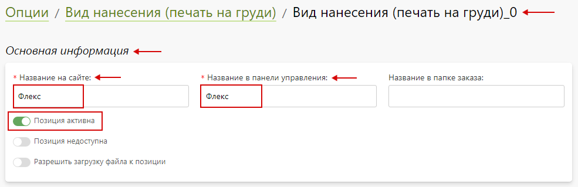
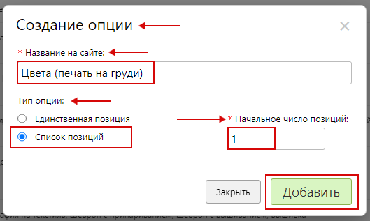
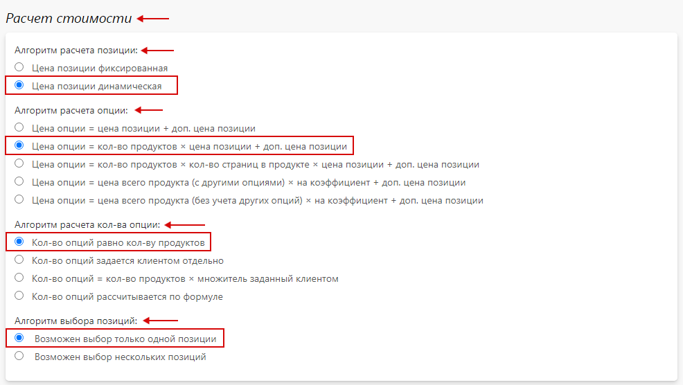
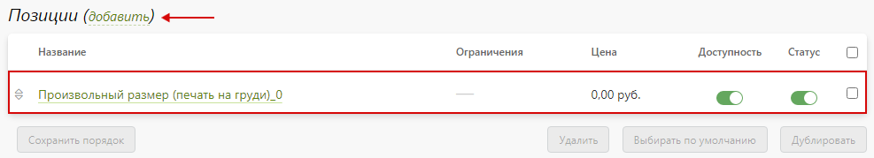

# [Нанесение на бизнес-сувениры](http://gifts.pixlpark.com/catalog/futbolki/futbolka-imperial-190-belaya-137460)

## Техническое задание
* Необходимо настроить расчет стоимости нанесения печати для футболок в зависимости от площади, места и вида нанесения.

<table class="sheet-printing" id="drawing-chest-back">
	<thead>
		<tr>
			<th colspan="3">Стоимость нанесения печати на грудь или спину для футболок</th>
		</tr>
		<tr>
			<th>Вид нанесения</th>
			<th>Площадь нанесения, кв. см.</th>
			<th>Стоимость нанесения, руб.</th>
		</tr>
    </thead>
    <tbody>
		<tr>
			<td rowspan="3">Флекс</td>
			<td>до 1250</td>
			<td>3895</td>
		</tr>
		<tr>
			<td>произвольный размер (до 1250)</td>
			<td>3895</td>
		</tr>
		<tr>
			<td>произвольный размер (1251 - 1440)</td>
			<td>4450</td>
		</tr>
		<tr>
			<td rowspan="4">Шелкография на текстиль</td>
			<td>до 155</td>
			<td>309</td>
		</tr>
		<tr>
			<td>до 310</td>
			<td>358</td>
		</tr>
		<tr>
			<td>до 620</td>
			<td>379</td>
		</tr>
		<tr>
			<td>до 1250</td>
			<td>440</td>
		</tr>
		<tr>
			<td rowspan="4">Шеврон  с припариванием / вышиванием </td>
			<td>до 10</td>
			<td>754</td>
		</tr>
		<tr>
			<td>произвольный размер (до 100)</td>
			<td>949</td>
		</tr>
		<tr>
			<td>произвольный размер (101 - 300)</td>
			<td>1549</td>
		</tr>
		<tr>
			<td>произвольный размер (301 - 784)</td>
			<td>3001</td>
		</tr>
		<tr>
			<td rowspan="4">Вышивка</td>
			<td>до 10</td>
			<td>679</td>
		</tr>
		<tr>
			<td>произвольный размер (до 100)</td>
			<td>949</td>
		</tr>
		<tr>
			<td>произвольный размер (101 – 300)</td>
			<td>1549</td>
		</tr>
		<tr>
			<td>произвольный размер (301 – 784)</td>
			<td>3001</td>
		</tr>
	</tbody>
</table>

<table class="sheet-printing" id="drawing-sleeve">
	<thead>
		<tr>
			<th colspan="3">Стоимость нанесения печати на рукав для футболок</th>
		</tr>
		<tr>
			<th>Вид нанесения</th>
			<th>Площадь нанесения, кв. см.</th>
			<th>Стоимость нанесения, руб.</th>
		</tr>
    </thead>
    <tbody>
		<tr>
			<td rowspan="5">Флекс</td>
			<td>до 100</td>
			<td>445</td>
		</tr>
		<tr>
			<td>произвольный размер (до 15)</td>
			<td>200</td>
		</tr>
		<tr>
			<td>произвольный размер (16 – 25)</td>
			<td>220</td>
		</tr>
		<tr>
			<td>произвольный размер (26 – 50)</td>
			<td>295</td>
		</tr>
		<tr>
			<td>произвольный размер (51 – 100)</td>
			<td>445</td>
		</tr>
		<tr>
			<td>Шелкография на текстиль</td>
			<td>до 100</td>
			<td>1508</td>
		</tr>
		<tr>
			<td rowspan="5">Шеврон  с припариванием / вышиванием </td>
			<td>до 10</td>
			<td>754</td>
		</tr>
		<tr>
			<td>произвольный размер (до 15)</td>
			<td>774</td>
		</tr>
		<tr>
			<td>произвольный размер (16 – 25)</td>
			<td>814</td>
		</tr>
		<tr>
			<td>произвольный размер (26 – 50)</td>
			<td>914</td>
		</tr>
		<tr>
			<td>произвольный размер (51 – 100)</td>
			<td>1114</td>
		</tr>
		<tr>
			<td rowspan="5">Вышивка</td>
			<td>до 10</td>
			<td>679</td>
		</tr>
		<tr>
			<td>произвольный размер (до 15)</td>
			<td>774</td>
		</tr>
		<tr>
			<td>произвольный размер (16 – 25)</td>
			<td>814</td>
		</tr>
		<tr>
			<td>произвольный размер (26 – 50)</td>
			<td>914</td>
		</tr>
		<tr>
			<td>произвольный размер (51 – 100)</td>
			<td>1114</td>
		</tr>
	</tbody>
</table>

##### Прочие надбавки
<table class="sheet-printing" id="additionally-t-shirt-drawing">
	<thead>
		<tr>
			<th>Цветность шелкографии</th>
			<th>Стоимость, руб.</th>
		</tr>
    </thead>
    <tbody>
		<tr>
			<td>Белый</td>
			<td rowspan="10">0</td>
		</tr>
		<tr>
			<td>Черный</td>
		</tr>
		<tr>
			<td>Голубой</td>
		</tr>
		<tr>
			<td>Желтый</td>
		</tr>
		<tr>
			<td>Зеленый</td>
		</tr>
		<tr>
			<td>Оранжевый</td>
		</tr>
		<tr>
			<td>Красный</td>
		</tr>
		<tr>
			<td>Серый</td>
		</tr>
		<tr>
			<td>Синий</td>
		</tr>
		<tr>
			<td>Фиолетовый</td>
		</tr>
	</tbody>
</table>

## Формула для расчета стоимости нанесения печати
```	formula
Стоимость продуктов = (стоимость продукта без печати + стоимость нанесения печати на груди + стоимость нанесения печати на спине + стоимость нанесение печати на правом рукаве + стоимость нанесения печати на левом рукаве) * количество продуктов.
```

### Пример расчета для продукта
* Для проверки расчетов взять продукт с характеристиками согласно таблице. 

| **Тип продукта**        			  | **Футболка**           		  |
|:-----------------------------------:|:-----------------------------:|
| Стоимость продукта без печати, руб. | 229                           |
| Место нанесения                     | Грудь                         |
| Вид нанесения                       | Флекс                         |
| Площадь нанесения, см. кв.          | 600   			              |
| Количество продуктов                | 5             				  |
* Этапы расчета:
> Согласно формуле, общая стоимость изготовления продуктов состоит из произведения стоимости одного продукта и количества продуктов. Поэтому в этапах расчета 1 – 2 (см. ниже) будет приведен расчет стоимости одного продукта, а в итоговой стоимости осуществлен рассчет для необходимого количества продуктов.
1. Стоимость продукта без печати
	+ Стоимость продукта без печати задается согласно ТЗ и составляет 229 рублей за одну футболку: 
	``` formula
		229 руб. * 1 шт. = 229 руб.
	```
2. Расчет стоимости нанесения
	+ Стоимость нанесения определяется техническим заданием и для нанесения "__Флекс__" на грудь с площадью нанесения 600 кв. см. составит 3895 руб.
* Итоговая стоимость продуктов с учетом количества по ТЗ составит:
	``` formula
	(229 руб. + 3895 руб.) * 5 шт.  = 20620 руб.
	```

## Создание калькулятора
* Калькулятор для продукта "__Футболки__" создается автоматически из [карточки продукта](/gift/list?id=Карточка-продукта) после выгрузки каталогов от поставщика.
* При необходимости возможно изменить базовую цену от поставщика при помощи правил тиражности.
* Расчет стоимости печати бизнес – сувениров осуществляется за счет опций.

## Создание групп печати бизнес - сувениров
* Для создания группы печати бизнес – сувениров в разделе "__Сувениры / Группы печати__" нажать кнопку "__Добавить__".

* В открывшейся карточке создания группы печати заполнить форму, указав название группы печати.

* Далее, нажать "__Добавить__" для создания группы печати.
* Добавить необходимый продукт в группу печати можно при помощи "__Добавить__".

* Затем, нажать "__Сохранить__" и сбросить кэш сайта.

## Опции для нанесения на бизнес - сувениры
* 
	+ [Место нанесения](/calculators/gift?id=Место-нанесения).
	+ [Вид нанесения (печать на груди)](/calculators/gift?id=Вид-нанесения-печать-на-груди).
	+ [Цвета (печать на груди)](/calculators/gift?id=Цвета-печать-на-груди).
	+ [Площадь нанесения (печать на груди)](/calculators/gift?id=Площадь-нанесения-печать-на-груди).
	+ [Произвольный размер (печать на груди)](/calculators/gift?id=Произвольный-размер-печать-на-груди).
	+ [Вид нанесения (печать на спине)](/calculators/gift?id=Вид-нанесения-печать-на-спине).
	+ [Цвета (печать на спине)](/calculators/gift?id=Цвета-печать-на-спине).
	+ [Площадь нанесения (печать на спине)](/calculators/gift?id=Площадь-нанесения-печать-на-спине).
	+ [Произвольный размер (печать на спине)](/calculators/gift?id=Произвольный-размер-печать-на-спине).
	+ [Вид нанесения (правый рукав)](/calculators/gift?id=Вид-нанесения-правый-рукав).
	+ [Цвета (правый рукав)](/calculators/gift?id=Цвета-правый-рукав).
	+ [Площадь нанесения (правый рукав)](/calculators/gift?id=Площадь-нанесения-правый-рукав).
	+ [Произвольный размер (правый рукав)](/calculators/gift?id=Произвольный-размер-правый-рукав).
	+ [Вид нанесения (левый рукав)](/calculators/gift?id=Вид-нанесения-левый-рукав).
	+ [Цвета (левый рукав)](/calculators/gift?id=Цвета-левый-рукав).
	+ [Площадь нанесения (левый рукав)](/calculators/gift?id=Площадь-нанесения-левый-рукав).
	+ [Произвольный размер (левый рукав)](/calculators/gift?id=Произвольный-размер-левый-рукав).

### Место нанесения
> Назначение опции: задает место нанесения печати.
* В разделе "__Печать / Калькуляция / Опции__" нажать кнопку "__Добавить опцию__" для создания новой опции.

* В открывшейся карточке создания опции заполнить форму, указав:
	+ "__Название на сайте__" - указать "__Место нанесения__".
	+ "__Тип опции__" - указать "__Список позиций__".
	+ "__Начальное число позиций__" - указать "__1__".
* 
* Далее, нажать "__Добавить__" для создания опции.
* В подразделе "__Основная информация__" опции "__Место нанесения / Настройка__" заполнить форму, указав:
	+ "__Название на сайте__" – указать "__Место нанесения__".
	+ "__Название в панели управления__" – указать "__Место нанесения__".
	+ "__Вид выбора позиций на странице редактора__" и "__Вид выбора позиций на странице CMS__" - выбрать список.
	+ "__Опция доступная на сайте__" - необходимо включить.
* 
* В подразделе "__Расчет стоимости__" опции "__Место нанесения / Настройка__" задать настройки:
	+ "__Алгоритм расчета позиции__" – выбрать "__Цена позиции фиксированная__".
	+ "__Алгоритм расчета опции__" – выбрать "__Цена опции = количество продуктов * цена позиции + дополнительная цена позиции__".
	+ "__Алгоритм расчета количества опций__" – выбрать "__Количество опций равно количеству продуктов__".
	+ "__Алгоритм выбора позиций__" - выбрать "__Возможен выбор нескольких позиций__".
* 
* В подразделе "__Позиции__" опции "__Место нанесения / Настройка__" содержится перечень позиций созданной опции.

* Далее, нажать кнопку "__Сохранить__" и сбросить кэш сайта.
* В подразделе "__Группы печати__" опции "__Место нанесения / Группы печати__" добавить продукт в группу печати. 

* Затем, нажать "__Сохранить__" и сбросить кэш сайта.

#### Позиции опции "Место нанесения"
* Для настройки позиции опции "__Место нанесения__" перейти в карточку позиции нажав на нее. Затем, заполнить подраздел "__Основная информация__", указав:
	+ "__Название на сайте__" – указать "__Грудь__".
	+ "__Название в панели управления__" – указать "__Грудь__".
	+ "__Позиция активна__" - необходимо включить.
* 
* В подразделе "__Стоимость__" позиции опции "__Место нанесения__" задать стоимость "__0__" руб.

* Затем, нажать "__Сохранить__" и сбросить кэш сайта.
* Аналогичным образом настраиваются оставшиеся позиции согласно таблице:

<table class="sheet-printing sheet-printing--mb">
	<thead>
		<tr>
			<th>Место нанесения печати</th>
			<th>Стоимость нанесения, руб.</th>
		</tr>
	</thead>
	<tbody>
		<tr>
			<td>Спина</td>
			<td rowspan="3">0</td>
		</tr>
		<tr>
			<td>Левый рукав</td>
		</tr>
		<tr>
			<td>Правый рукав</td>
		</tr>
	</tbody>
</table>

> Добавить новую позицию опции можно при помощи "__Добавить__".
* 
> Также, позицию опции можно продублировать и скорректировать настройки в соответствии с нужными данными.
* После внесения всех данных подраздел "__Позиции__" опции "__Место нанесения__" выглядит следующим образом:


### Вид нанесения (печать на груди)
> Назначение опции: определяет вид нанесения печати на груди.
* В разделе "__Печать / Калькуляция / Опции__" нажать кнопку "__Добавить опцию__" для создания новой опции.

* В открывшейся карточке создания опции заполнить форму, указав:
	+ "__Название на сайте__" - указать "__Вид нанесения (печать на груди)__".
	+ "__Тип опции__" - указать "__Список позиций__".
	+ "__Начальное число позиций__" - указать "__1__".
* 
* Далее, нажать "__Добавить__" для создания опции.
* В подразделе "__Основная информация__" опции "__Вид нанесения (печать на груди) / Настройка__" заполнить форму, указав:
	+ "__Название на сайте__" – указать "__Вид нанесения (печать на груди)__".
	+ "__Название в панели управления__" – указать "__Вид нанесения (печать на груди)__".
	+ "__Вид выбора позиций на странице редактора__" и "__Вид выбора позиций на странице CMS__" - выбрать список.
	+ "__Опция доступна на сайте__" - необходимо включить.
	+ "__Опция обязательная для оформления заказа__" - необходимо включить.
	+ "__Выбирать значение опции по умолчанию__" - необходимо включить.
* 
* В подразделе "__Расчет стоимости__" опции "__Вид нанесения (печать на груди) / Настройка__" задать настройки:
	+ "__Алгоритм расчета позиции__" – выбрать "__Цена позиции фиксированная__"
	+ "__Алгоритм расчета опции__" – выбрать "__Цена опции = количество продуктов * цена позиции + дополнительная цена позиции__".
	+ "__Алгоритм расчета количества опций__" – выбрать "__Количество опций равно количеству продуктов__".
	+ "__Алгоритм выбора позиций__" - выбрать "__Возможен выбор только одной позиции__".
* 
* В подразделе "__Позиции__" опции "__Вид нанесения (печать на груди) / Настройка__" содержится перечень позиций созданной опции.

* Далее, нажать кнопку "__Сохранить__" и сбросить кэш сайта.
* В подразделе "__Группы печати__" опции "__Вид нанесения (печать на груди) / Группы печати__" добавить продукт в группу печати. 

* Затем, нажать "__Сохранить__" и сбросить кэш сайта.
* В подразделе "__Правила доступности__" опции "__Вид нанесения (печать на груди) / Правила__" добавить правило, нажав "__Добавить__": 
``` formula
Опция доступна если выбрана позиция "Грудь" опции "Место нанесения"
```
* 
* Далее, нажать "__Применить__", а затем нажать кнопку "__Сохранить__" и сбросить кэш сайта.

#### Позиции опции "Вид нанесения (на груди)"
* Для настройки позиции опции "__Вид нанесения (на груди)__" перейти в карточку позиции нажав на нее. Затем, заполнить подраздел "__Основная информация__", указав:
	+ "__Название на сайте__" – указать "__Флекс__".
	+ "__Название в панели управления__" – указать "__Флекс__".
	+ "__Позиция активна__" - необходимо включить.
* 
* В подразделе "__Стоимость__" позиции опции "__Вид нанесения (на груди)__" задать стоимость "__0__" руб.

* Затем, нажать "__Сохранить__" и сбросить кэш сайта.
* Аналогичным образом настраиваются оставшиеся позиции согласно таблице:

<table class="sheet-printing sheet-printing--mb">
	<thead>
		<tr>
			<th>Вид нанесения</th>
			<th>Стоимость нанесения</th>
		</tr>
	</thead>
	<tbody>
		<tr>
			<td>Шелкография на текстиль</td>
			<td rowspan="3">0</td>
		</tr>
		<tr>
			<td>Шеврон  с припариванием / вышиванием</td>
		</tr>
		<tr>
			<td>Вышивка</td>
		</tr>
	</tbody>
</table>

> Добавить новую позицию опции можно при помощи "__Добавить__".
* 
> Также, позицию опции можно продублировать и скорректировать настройки в соответствии с нужными данными.
* После внесения всех данных подраздел "__Позиции__" опции "__Вид нанесения (печать на груди)__" выглядит следующим образом:


### Цвета (печать на груди)
> Назначение опции: позволяет выбрать цвет для вида нанесения печати "__Шелкография на текстиль__".
* В разделе "__Печать / Калькуляция / Опции__" нажать кнопку "__Добавить опцию__" для создания новой опции.

* В открывшейся карточке создания опции заполнить форму, указав:
	+ "__Название на сайте__" - указать "__Цвета (печать на груди)__".
	+ "__Тип опции__" - указать "__Список позиций__".
	+ "__Начальное число позиций__" - указать "__1__".
* 
* Далее, нажать "__Добавить__" для создания опции.
* В подразделе "__Основная информация__" опции "__Цвета (печать на груди) / Настройка__" заполнить форму, указав:
	+ "__Название на сайте__" – указать "__Цвета (печать на груди)__".
	+ "__Название в панели управления__" – указать "__Цвета (печать на груди)__".
	+ "__Вид выбора позиций на странице редактора__" и "__Вид выбора позиций на странице CMS__" - выбрать список.
	+ "__Опция доступна на сайте__" - необходимо включить.
	+ "__Опция обязательная для оформления заказа__" - необходимо включить.
	+ "__Выбирать значение опции по умолчанию__" - необходимо включить.
* 
* В подразделе "__Расчет стоимости__" опции "__Тип бумаги для печати документов (печать документов) / Настройка__" задать настройки:
	+ "__Алгоритм расчета позиции__" – выбрать "__Цена позиции фиксированная__".
	+ "__Алгоритм расчета опции__" – выбрать "__Цена опции = количество продуктов * цена позиции + дополнительная цена позиции__".
	+ "__Алгоритм расчета количества опций__" – выбрать "__Количество опций равно количеству продуктов__".
	+ "__Алгоритм выбора позиций__" - выбрать "__Возможен выбор только одной позиции__".
* 
* В подразделе "__Позиции__" опции "__Цвета (печать на груди) / Настройка__" содержится перечень позиций созданной опции.

* Далее, нажать кнопку "__Сохранить__" и сбросить кэш сайта.
* В подразделе "__Группы печати__" опции "__Цвета (печать на груди) / Группы печати__" добавить продукт в группу печати. 

* Затем, нажать "__Сохранить__" и сбросить кэш сайта.
* В подразделе "__Правила доступности__" опции "__Цвета (печать на груди) / Правила__" добавить правило, нажав "__Добавить__":
``` formula
Опция доступна если выбрана позиция "Шелкография на текстиль" опции "Вид нанесения (печать на грудь)"
```
* 
* Далее, нажать "__Применить__", а затем нажать кнопку "__Сохранить__" и сбросить кэш сайта.

#### Позиции опции "Цвета (печать на груди)"
* Для настройки позиции опции "__Цвета (печать на груди)__" перейти в карточку позиции нажав на нее. Затем, заполнить подраздел "__Основная информация__", указав:
	+ "__Название на сайте__" – указать "__Белый__".
	+ "__Название в панели управления__" – указать "__Белый__".
	+ "__Позиция активна__" - необходимо включить.
* 
* Затем, нажать "__Сохранить__" и сбросить кэш сайта.
* В подразделе "__Стоимость__" позиции опции "__Цвета (печать на груди)__" задать стоимость "__0__" руб.

* Затем, нажать "__Сохранить__" и сбросить кэш сайта.
* Аналогичным образом настраиваются оставшиеся позиции согласно таблице:

<table class="sheet-printing sheet-printing--mb">
	<thead>
		<tr>
			<th>Цветность для шелкографии на текстиле</th>
			<th>Стоимость, руб.</th>
		</tr>
	</thead>
	<tbody>
		<tr>
			<td>Черный</td>
			<td rowspan="9">0</td>
		</tr>
		<tr>
			<td>Голубой</td>
		</tr>
		<tr>
			<td>Желтый</td>
		</tr>
		<tr>
			<td>Зеленый</td>
		</tr>
		<tr>
			<td>Оранжевый</td>
		</tr>
		<tr>
			<td>Красный</td>
		</tr>
		<tr>
			<td>Серый</td>
		</tr>
		<tr>
			<td>Синий</td>
		</tr>
		<tr>
			<td>Фиолетовый</td>
		</tr>
	</tbody>
</table>

> Добавить новую позицию опции можно при помощи "__Добавить__".
* 
> Также, позицию опции можно продублировать и скорректировать настройки в соответствии с нужными данными.
* После внесения всех данных подраздел "__Позиции__" опции "__Цвета (печать на груди)__" выглядит следующим образом:


### Площадь нанесения (печать на груди)
> Назначение опции: позволяет задать стоимость печати в зависимости от её площади.
* В разделе "__Печать / Калькуляция / Опции__" нажать кнопку "__Добавить опцию__" для создания новой опции.

* В открывшейся карточке создания опции заполнить форму, указав:
	+ "__Название на сайте__" - указать "__Площадь нанесения (печать на груди)__".
	+ "__Тип опции__" - указать "__Список позиций__".
	+ "__Начальное число позиций__" - указать "__1__".
* 
* Далее, нажать "__Добавить__" для создания опции.
* В подразделе "__Основная информация__" опции "__Площадь нанесения (печать на груди) / Настройка__" заполнить форму, указав:
	+ "__Название на сайте__" – указать "__Площадь нанесения (печать на груди)__".
	+ "__Название в панели управления__" – указать "__Площадь нанесения (печать на груди)__".
	+ "__Вид выбора позиций на странице редактора__" и "__Вид выбора позиций на странице CMS__" - выбрать список.
	+ "__Опция доступна на сайте__" - необходимо включить.
	+ "__Опция обязательная для оформления заказа__" - необходимо включить.
	+ "__Выбирать значение опции по умолчанию__" - необходимо включить.
* 
* В подразделе "__Расчет стоимости__" опции "__Площадь нанесения (печать на груди) / Настройка__" задать настройки:
	+ "__Алгоритм расчета позиции__" – выбрать "__Цена позиции фиксированная__".
	+ "__Алгоритм расчета опции__" – выбрать "__Цена опции = количество продуктов * цена позиции + дополнительная цена позиции__".
	+ "__Алгоритм расчета количества опций__" – выбрать "__Количество опций равно количеству продуктов__".
	+ "__Алгоритм выбора позиций__" - выбрать "__Возможен выбор только одной позиции__".
* 
* В подразделе "__Позиции__" опции "__Площадь нанесения (печать на груди) / Настройка__" содержится перечень позиций созданной опции.

* Далее, нажать кнопку "__Сохранить__" и сбросить кэш сайта.
* В подразделе "__Группы печати__" опции "__Площадь нанесения (печать на груди) / Группы печати__" добавить продукт в группу печати. 

* Затем, нажать "__Сохранить__" и сбросить кэш сайта.
* В подразделе "__Правила доступности__" опции "__Площадь нанесения (печать на груди) / Правила__" добавить правило, нажав "__Добавить__": 
```formula
	Опция доступна если выбрана позиция "Шелкография на текстиль" опции "Вид нанесения (печать на груди)" или выбрана позиция "Флекс" опции "Вид нанесения (печать на груди)" или выбрана позиция "Шеврон с припариванием" опции "Вид нанесения (печать на груди)" или выбрана позиция "Шеврон с вышиванием" опции "Вид нанесения (печать на груди)" или выбрана позиция "Вышивка" опции "Вид нанесения (печать на груди)".
```
* 
* Далее, нажать "__Применить__", а затем нажать кнопку "__Сохранить__" и сбросить кэш сайта.

#### Позиции опции "Площадь нанесения (печать на груди)"
* Для настройки позиции опции "__Площадь нанесения (печать на груди)__" перейти в карточку позиции нажав на нее. Затем, заполнить подраздел "__Основная информация__", указав:
	+ "__Название на сайте__" – указать "__До 1250 кв. см.__".
	+ "__Название в панели управления__" – указать "__До 1250 кв. см.__".
	+ "__Позиция активна__" - необходимо включить.
* 
* В подразделе "__Правила доступности__" позиции опции "__Площадь нанесения (печать на груди)__" добавить правило, нажав "__Добавить__":
```formula
Позиция опции доступна если позиция "Флекс" опции "Вид нанесения (печать на груди)" выбрана и позиция "Грудь" опции "Место нанесения" выбрана.
```
* 
* Затем, нажать "__Применить__".
* В подразделе "__Стоимость__" позиции опции "__Площадь нанесения (печать на груди)__" задать стоимость "__3895__" руб.

* Затем, нажать "__Сохранить__" и сбросить кэш сайта.
* Аналогичным образом настраиваются оставшиеся позиции согласно таблице:

<table class="sheet-printing sheet-printing--mb">
	<thead>
		<tr>
			<th>Вид нанесения</th>
			<th>Площадь нанесения, кв. м.</th>
			<th>Стоимость нанесения, руб.</th>
		</tr>
	</thead>
	<tbody>
		<tr>
			<td>Флекс</td>
			<td>свой размер</td>
			<td>0</td>
		</tr>
		<tr>
			<td rowspan="4">Шелкография на текстиль</td>
			<td>до 155</td>
			<td>309</td>
		</tr>
		<tr>
			<td>до 310</td>
			<td>358</td>
		</tr>
		<tr>
			<td>до 620</td>
			<td>379</td>
		</tr>
		<tr>
			<td>до 1250</td>
			<td>440</td>
		</tr>
		<tr>
			<td rowspan="2">Шеврон с припариванием / вышиванием</td>
			<td>до 10</td>
			<td>754</td>
		</tr>
		<tr>
			<td>свой размер</td>
			<td>0</td>
		</tr>
		<tr>
			<td rowspan="2">Вышивка</td>
			<td>до 10</td>
			<td>679</td>
		</tr>
		<tr>
			<td>свой размер</td>
			<td>0</td>
		</tr>
	</tbody>
</table>

> Добавить новую позицию опции можно при помощи "__Добавить__".
* 
> Также, позицию опции можно продублировать и скорректировать настройки в соответствии с нужными данными.
* После внесения всех данных подраздел "__Позиции__" опции "__Площадь нанесения (печать на груди)__" выглядит следующим образом:


### Произвольный размер (печать на груди)
> Назначение опции: расчет стоимости нанесения печати для произвольного размера.
* В разделе "__Печать / Калькуляция / Опции__" нажать кнопку "__Добавить опцию__" для создания новой опции.

* В открывшейся карточке создания опции заполнить форму, указав:
	+ "__Название на сайте__" - указать "__Произвольный размер (печать на груди)__".
	+ "__Тип опции__" - указать "__Список позиций__".
	+ "__Начальное число позиций__" - указать "__1__".
* 
* Далее, нажать "__Добавить__" для создания опции.
* В подразделе "__Основная информация__" опции "__Произвольный размер (печать на груди) / Настройка__" заполнить форму, указав:
	+ "__Название на сайте__" – указать "__Произвольный размер (печать на груди)__".
	+ "__Название в панели управления__" – указать "__Произвольный размер (печать на груди)__".
	+ "__Вид выбора позиций на странице редактора__" и "__Вид выбора позиций на странице CMS__" - выбрать список.
	+ "__Опция доступна на сайте__" - необходимо включить.
	+ "__Опция обязательная для оформления заказа__" - необходимо включить.
	+ "__Выбирать значение опции по умолчанию__" - необходимо включить.
* 
* В подразделе "__Расчет стоимости__" опции "__Произвольный размер (печать на груди) / Настройка__" задать настройки:
	+ "__Алгоритм расчета позиции__" – выбрать "__Цена позиции динамическая__".
	+ "__Алгоритм расчета опции__" – выбрать "__Цена опции = количество продуктов * цена позиции + дополнительная цена позиции__".
	+ "__Алгоритм расчета количества опций__" – выбрать "__Количество опций равно количеству продуктов__".
	+ "__Алгоритм выбора позиций__" - выбрать "__Возможен выбор только одной позиции__".
* 
* В подразделе "__Позиции__" опции "__Произвольный размер (печать на груди) / Настройка__" содержится перечень позиций созданной опции.

* Далее, нажать кнопку "__Сохранить__" и сбросить кэш сайта.
* В подразделе "__Группы печати__" опции "__Произвольный размер (печать на груди) / Группы печати__" добавить продукт в группу печати. 

* Затем, нажать "__Сохранить__" и сбросить кэш сайта.
* В подразделе "__Правила доступности__" опции "__Произвольный размер (печать на груди) / Правила__" добавить правило, нажав "__Добавить__": 
```formula
	Опция доступна если выбрана позиция "Грудь" опции "Место нанесения" или выбрана позиция "Флекс" опции "Место нанесения" и выбрана позиция "Свой размер" опции "Площадь нанесения (печать на груди)" и выбрана позиция "Флекс" опции "Вид нанесения (печать на груди)" или выбрана позиция "Шеврон с припариванием" опции "Вид нанесения (печать на груди)" или выбрана позиция "Шеврон с вышиванием" опции "Вид нанесения (печать на груди)" или выбрана позиция "Вышивка" опции "Вид нанесения (печать на груди)".
```
* 
* Далее, нажать "__Применить__", а затем нажать кнопку "__Сохранить__" и сбросить кэш сайта.

#### Позиции опции "Произвольный размер (печать на груди)"
* Для настройки позиции опции "__Произвольный размер (печать на груди)__" перейти в карточку позиции нажав на нее. Затем, заполнить подраздел "__Основная информация__", указав:
	+ "__Название на сайте__" – указать "__до 1440 кв. см.__".
	+ "__Название в панели управления__" – указать "__до 1440 кв. см.__".
	+ "__Позиция активна__" - необходимо включить.
* 
* В подразделе "__Правила доступности__" позиции опции "__Произвольный размер (печать на груди)__" добавить правило, нажав "__Добавить__":
```formula
	Позиция опции доступна если позиция "Грудь" опции "Место нанесения" выбрана и позиция "Флекс" опции "Вид нанесения (печать на груди)" выбрана.
```
* 
* Затем, нажать "__Применить__".
* В подразделе "__Стоимость__" позиции опции "__Произвольный размер (печать на груди)__" задать способ расчета цены "__По диапазонам размеров__".  Затем, в поле "__Диапазон размеров__" задать значение от "__1 х 1__" до "__36 х 40__", а также значение цены в зависимости от площади согласно правилу:
	+ от 1 до 1250 мм<sup>2</sup> – 3895 руб.
	+ от 1251 до 1440 мм<sup>2</sup> – 4450 руб.
* В поле "__Выбранный по умолчанию размер__" задать значение от "__36 х 40 мм__".
* 
> Добавить дополнительное правило можно при помощи "__Добавить правило__".
* 
* Затем, нажать "__Сохранить__" и сбросить кэш сайта.
* Аналогичным образом настраиваются оставшаяся позиция согласно таблице:

<table class="sheet-printing sheet-printing--mb">
	<thead>
		<tr>
			<th>Вид нанесения</th>
			<th>Площадь нанесения, кв. см.</th>
			<th>Стоимость нанесения, руб.</th>
		</tr>
	</thead>
	<tbody>
		<tr>
			<td rowspan="3">Шеврон  с припариванием / вышиванием</td>
			<td>Произвольный размер ( до 100)</td>
			<td>949</td>
		</tr>
		<tr>
			<td>Произвольный размер (101 - 300)</td>
			<td>1549</td>
		</tr>
		<tr>
			<td>Произвольный размер (301 - 784)</td>
			<td>3001</td>
		</tr>
		<tr>
			<td rowspan="3">Вышивка</td>
			<td>Произвольный размер ( до 100)</td>
			<td>949</td>
		</tr>
		<tr>
			<td>Произвольный размер (101 – 300)</td>
			<td>1549</td>
		</tr>
		<tr>
			<td>Произвольный размер (301 – 784)</td>
			<td>3001</td>
		</tr>
	</tbody>
</table>

> Добавить новую позицию опции можно при помощи "__Добавить__".
* 
> Также, позицию опции можно продублировать и скорректировать настройки в соответствии с нужными данными.
* После внесения всех данных подраздел "__Позиции__" опции "__Произвольный размер (печать на груди)__" выглядит следующим образом:


### Вид нанесения (печать на спине)
> Назначение опции: определяет вид нанесения печати на спине. 
* Опция и ее позиции настраиваются аналогично опции [Вид нанесения (печать на груди)](/calculators/gift?id=Вид-нанесения-печать-на-груди). Данная опция доступна при выборе позиции "__Спина__" в опции "__Место нанесения__". Позиции опции задают стоимость согласно ТЗ и соответствуют таблице:

<table class="sheet-printing">
	<thead>
		<tr>
			<th>Вид нанесения</th>
			<th>Стоимость нанесения, руб.</th>
		</tr>
	</thead>
	<tbody>
		<tr>
			<td>Флекс</td>
			<td rowspan="4">0</td>
		</tr>
		<tr>
			<td>Шелкография на текстиль</td>
		</tr>
		<tr>
			<td>Шеврон  с припариванием / вышиванием</td>
		</tr>
		<tr>
			<td>Вышивка</td>
		</tr>
	</tbody>
</table>

### Цвета (печать на спине)
> Назначение опции: позволяет выбрать цвет для вида нанесения печати "__Шелкография на текстиль__".
* Опция и ее позиции настраиваются аналогично опции [Цвета (печать на груди)](/calculators/gift?id=Цвета-печать-на-груди). Данная опция доступна при выборе позиции "__Шелкография на текстиль__" в опции "__Вид нанесения (печать на спине)__". Позиции опции задают стоимость согласно ТЗ и соответствуют таблице:

<table class="sheet-printing">
	<thead>
		<tr>
			<th>Цветность для шелкографии</th>
			<th>Стоимость, руб.</th>
		</tr>
	</thead>
	<tbody>
		<tr>
			<td>Белый</td>
			<td rowspan="10">0</td>
		</tr>
		<tr>
			<td>Черный</td>
		</tr>
		<tr>
			<td>Голубой</td>
		</tr>
		<tr>
			<td>Желтый</td>
		</tr>
		<tr>
			<td>Зеленый</td>
		</tr>
		<tr>
			<td>Оранжевый</td>
		</tr>
		<tr>
			<td>Красный</td>
		</tr>
		<tr>
			<td>Серый</td>
		</tr>
		<tr>
			<td>Синий</td>
		</tr>
		<tr>
			<td>Фиолетовый</td>
		</tr>
	</tbody>
</table>

### Площадь нанесения (печать на спине)
> Назначение опции: позволяет задать стоимость печати в зависимости от её площади.
* Опция и ее позиции настраиваются аналогично опции [Площадь нанесения (печать на груди)](/calculators/gift?id=Площадь-нанесения-печать-на-груди). Данная опция доступна при выборе позиции "__Шелкография на текстиль / Флекс / Шефрон с припариванием / Шеврон с пришиванием / Вышивка__" в опции "__Площадь нанесения (печать на спине)__". Позиции опции задают стоимость согласно ТЗ и соответствуют таблице:

<table class="sheet-printing">
	<thead>
		<tr>
			<th>Вид нанесения</th>
			<th>Площадь нанесения, кв. см.</th>
			<th>Стоимость нанесения, руб.</th>
		</tr>
	</thead>
	<tbody>
		<tr>
			<td rowspan="2">Флекс</td>
			<td>до 1250</td>
			<td>3895</td>
		</tr>
		<tr>
			<td>свой размер</td>
			<td>0</td>
		</tr>
		<tr>
			<td rowspan="2">Шелкография на текстиль</td>
			<td>до 155</td>
			<td>309</td>
		</tr>
		<tr>
			<td>до 310</td>
			<td>358</td>
		</tr>
		<tr>
			<td rowspan="2">Шеврон  с припариванием / вышиванием </td>
			<td>до 10</td>
			<td>754</td>
		</tr>
		<tr>
			<td>свой размер</td>
			<td>0</td>
		</tr>
		<tr>
			<td rowspan="2">Вышивка</td>
			<td>до 10</td>
			<td>679</td>
		</tr>
		<tr>
			<td>свой размер</td>
			<td>0</td>
		</tr>
	</tbody>
</table>

### Произвольный размер (печать на спине)
> Назначение опции: расчет стоимости нанесения печати для произвольного размера.
* Опция и ее позиции настраиваются аналогично опции [Произвольный раздел (печать на груди)](/calculators/gift?id=Произвольный-размер-печать-на-груди). Данная опция доступна при выборе позиции "__Спина__" в опции "__Место нанесения__" и позиции "__Свой размер__" опции "__Площадь нанесения (печать на спине)__" и выборе позиции "__Флекс / Шеврон с припариванием / Шеврон с вышиванием / Вышивка__" опции "__Вид нанесения (печать на спине)__".  Позиции опции задают стоимость согласно ТЗ и соответствуют таблице:

<table class="sheet-printing">
	<thead>
		<tr>
			<th>Вид нанесения</th>
			<th>Площадь нанесения, кв. см.</th>
			<th>Стоимость нанесения, руб.</th>
		</tr>
	</thead>
	<tbody>
		<tr>
			<td rowspan="2">Флекс</td>
			<td>Произвольный размер (до 1250)</td>
			<td>3895</td>
		</tr>
		<tr>
			<td>Произвольный размер ( 1251 - 1440)</td>
			<td>4450</td>
		</tr>
		<tr>
			<td rowspan="3">Шеврон  с припариванием / вышиванием</td>
			<td>Произвольный размер ( до 100)</td>
			<td>949</td>
		</tr>
		<tr>
			<td>Произвольный размер (101 - 300)</td>
			<td>1549</td>
		</tr>
		<tr>
			<td>Произвольный размер (301 - 784)</td>
			<td>3001</td>
		</tr>
		<tr>
			<td rowspan="3">Вышивка</td>
			<td>Произвольный размер ( до 100)</td>
			<td>949</td>
		</tr>
		<tr>
			<td>Произвольный размер (101 – 300)</td>
			<td>1549</td>
		</tr>
		<tr>
			<td>Произвольный размер (301 – 784)</td>
			<td>3001</td>
		</tr>
	</tbody>
</table>

### Вид нанесения (правый рукав)
> Назначение опции: определяет вид нанесения на правом рукаве. 
* Опция и ее позиции настраиваются аналогично опции [Вид нанесения (печать на груди)](/calculators/gift?id=Вид-нанесения-печать-на-груди). Данная опция доступна при выборе позиции "__Правый рукав__" в опции "__Место нанесения__". Позиции опции задают стоимость согласно ТЗ и соответствуют таблице:

<table class="sheet-printing">
	<thead>
		<tr>
			<th>Вид нанесения</th>
			<th>Стоимость нанесения, руб.</th>
		</tr>
	</thead>
	<tbody>
		<tr>
			<td>Флекс</td>
			<td rowspan="4">0</td>
		</tr>
		<tr>
			<td>Шелкография на текстиль</td>
		</tr>
		<tr>
			<td>Шеврон  с припариванием / вышиванием</td>
		</tr>
		<tr>
			<td>Вышивка</td>
		</tr>
	</tbody>
</table>

### Цвета (правый рукав)
> Назначение опции: позволяет выбрать цвет для вида нанесения печати "__Шелкография на текстиль__".
* Опция и ее позиции настраиваются аналогично опции [Цвета (печать на груди)](/calculators/gift?id=Цвета-печать-на-груди). Данная опция доступна при выборе позиции "__Шелкография на текстиль__" в опции "__Вид нанесения (правый рукав)__". Позиции опции задают стоимость согласно ТЗ и соответствуют таблице:

<table class="sheet-printing">
	<thead>
		<tr>
			<th>Цветность для шелкографии</th>
			<th>Стоимость, руб.</th>
		</tr>
	</thead>
	<tbody>
		<tr>
			<td>Белый</td>
			<td rowspan="10">0</td>
		</tr>
		<tr>
			<td>Черный</td>
		</tr>
		<tr>
			<td>Голубой</td>
		</tr>
		<tr>
			<td>Желтый</td>
		</tr>
		<tr>
			<td>Зеленый</td>
		</tr>
		<tr>
			<td>Оранжевый</td>
		</tr>
		<tr>
			<td>Красный</td>
		</tr>
		<tr>
			<td>Серый</td>
		</tr>
		<tr>
			<td>Синий</td>
		</tr>
		<tr>
			<td>Фиолетовый</td>
		</tr>
	</tbody>
</table>

### Площадь нанесения (правый рукав)
> Назначение опции: позволяет задать стоимость печати в зависимости от её площади.
* Опция и ее позиции настраиваются аналогично опции [Площадь нанесения (печать на груди)](/calculators/gift?id=Площадь-нанесения-печать-на-груди). Данная опция доступна при выборе позиции "__Флекс / Шелкография на текстиль / Шефрон с припариванием / Шеврон с пришиванием / Вышивка__" в опции "__Площадь нанесения (правый рукав)__". Позиции опции задают стоимость согласно ТЗ и соответствуют таблице:

<table class="sheet-printing">
	<thead>
		<tr>
			<th>Вид нанесения</th>
			<th>Площадь нанесения, кв. см.</th>
			<th>Стоимость нанесения, руб.</th>
		</tr>
	</thead>
	<tbody>
		<tr>
			<td rowspan="2">Флекс</td>
			<td>до 100</td>
			<td>445</td>
		</tr>
		<tr>
			<td>свой размер</td>
			<td>0</td>
		</tr>
		<tr>
			<td>Шелкография на текстиль</td>
			<td>до 100</td>
			<td>1508</td>
		</tr>
		<tr>
			<td rowspan="2">Шеврон  с припариванием / вышиванием</td>
			<td>до 10</td>
			<td>754</td>
		</tr>
		<tr>
			<td>свой размер</td>
			<td>0</td>
		</tr>
		<tr>
			<td rowspan="2">Вышивка</td>
			<td>до 10</td>
			<td>679</td>
		</tr>
		<tr>
			<td>свой размер</td>
			<td>0</td>
		</tr>
	</tbody>
</table>

### Произвольный размер (правый рукав)
> Назначение опции: расчет стоимости нанесения печати для произвольного размера.
* Опция и ее позиции настраиваются аналогично опции [Произвольный раздел (печать на груди)](/calculators/gift?id=Произвольный-размер-печать-на-груди). Данная опция доступна при выборе позиции "__Правый рукав__" в опции "__Место нанесения__" и позиции "__Свой размер__" опции "__Площадь нанесения (правый рукав)__" и выборе позиции "__Флекс / Шеврон с припариванием / Шеврон с вышиванием / Вышивка__" опции "__Вид нанесения (правый рукав)__".  Позиции опции задают стоимость согласно ТЗ и соответствуют таблице:

<table class="sheet-printing">
	<thead>
		<tr>
			<th>Вид нанесения</th>
			<th>Площадь нанесения, кв. см.</th>
			<th>Стоимость нанесения, руб.</th>
		</tr>
	</thead>
	<tbody>
		<tr>
			<td rowspan="4">Флекс</td>
			<td>Произвольный размер (до 15)</td>
			<td>200</td>
		</tr>
		<tr>
			<td>Произвольный размер (16 – 25)</td>
			<td>220</td>
		</tr>
		<tr>
			<td>Произвольный размер (26 – 50)</td>
			<td>295</td>
		</tr>
		<tr>
			<td>Произвольный размер (51 – 100)</td>
			<td>445</td>
		</tr>
		<tr>
			<td rowspan="4">Шеврон  с припариванием / вышиванием</td>
			<td>Произвольный размер (до 15)</td>
			<td>774</td>
		</tr>
		<tr>
			<td>Произвольный размер (16 – 25)</td>
			<td>814</td>
		</tr>
		<tr>
			<td>Произвольный размер (26 – 50)</td>
			<td>914</td>
		</tr>
		<tr>
			<td>Произвольный размер (51 – 100)</td>
			<td>1114</td>
		</tr>
		<tr>
			<td rowspan="4">Вышивка</td>
			<td>Произвольный размер (до 15)</td>
			<td>774</td>
		</tr>
		<tr>
			<td>Произвольный размер (16 – 25)</td>
			<td>814</td>
		</tr>
		<tr>
			<td>Произвольный размер (26 – 50)</td>
			<td>914</td>
		</tr>
		<tr>
			<td>Произвольный размер (51 – 100)</td>
			<td>1114</td>
		</tr>
	</tbody>
</table>

### Вид нанесения (левый рукав)
> Назначение опции: определяет вид нанесения печати на левом рукаве. 
* Опция и ее позиции настраиваются аналогично опции [Вид нанесения (печать на груди)](/calculators/gift?id=Вид-нанесения-печать-на-груди). Данная опция доступна при выборе позиции "__Левый рукав__" в опции "__Место нанесения__". Позиции опции задают стоимость согласно ТЗ и соответствуют таблице:

<table class="sheet-printing">
	<thead>
		<tr>
			<th>Вид нанесения</th>
			<th>Площадь нанесения, кв. см.</th>
			<th>Стоимость нанесения, руб.</th>
		</tr>
	</thead>
	<tbody>
		<tr>
			<td rowspan="2">Флекс</td>
			<td>до 100</td>
			<td>445</td>
		</tr>
		<tr>
			<td>свой размер</td>
			<td>0</td>
		</tr>
		<tr>
			<td>Шелкография на текстиль</td>
			<td>до 100</td>
			<td>1508</td>
		</tr>
		<tr>
			<td rowspan="2">Шеврон  с припариванием / вышиванием</td>
			<td>до 10</td>
			<td>754</td>
		</tr>
		<tr>
			<td>свой размер</td>
			<td>0</td>
		</tr>
		<tr>
			<td rowspan="2">Вышивка</td>
			<td>до 10</td>
			<td>679</td>
		</tr>
		<tr>
			<td>свой размер</td>
			<td>0</td>
		</tr>
	</tbody>
</table>

### Цвета (левый рукав)
> Назначение опции: позволяет выбрать цвет для вида нанесения печати "__Шелкография на текстиль__".
* Опция и ее позиции настраиваются аналогично опции [Цвета (печать на груди)](/calculators/gift?id=Цвета-печать-на-груди). Данная опция доступна при выборе позиции "__Шелкография на текстиль__" в опции "__Вид нанесения (левый рукав)__". Позиции опции задают стоимость согласно ТЗ и соответствуют таблице:

<table class="sheet-printing">
	<thead>
		<tr>
			<th>Цветность для шелкографии</th>
			<th>Стоимость, руб.</th>
		</tr>
	</thead>
	<tbody>
		<tr>
			<td>Белый</td>
			<td rowspan="10">0</td>
		</tr>
		<tr>
			<td>Черный</td>
		</tr>
		<tr>
			<td>Голубой</td>
		</tr>
		<tr>
			<td>Желтый</td>
		</tr>
		<tr>
			<td>Зеленый</td>
		</tr>
		<tr>
			<td>Оранжевый</td>
		</tr>
		<tr>
			<td>Красный</td>
		</tr>
		<tr>
			<td>Серый</td>
		</tr>
		<tr>
			<td>Синий</td>
		</tr>
		<tr>
			<td>Фиолетовый</td>
		</tr>
	</tbody>
</table>

### Площадь нанесения (левый рукав)
> Назначение опции: позволяет задать стоимость печати в зависимости от её площади.
* Опция и ее позиции настраиваются аналогично опции [Площадь нанесения (печать на груди)](/calculators/gift?id=Площадь-нанесения-печать-на-груди). Данная опция доступна при выборе позиции "__Флекс / Шелкография на текстиль / Шефрон с припариванием / Шеврон с пришиванием / Вышивка__" в опции "__Площадь нанесения (левый рукав)__". Позиции опции задают стоимость согласно ТЗ и соответствуют таблице:

<table class="sheet-printing">
	<thead>
		<tr>
			<th>Вид нанесения</th>
			<th>Площадь нанесения, кв. см.</th>
			<th>Стоимость нанесения, руб.</th>
		</tr>
	</thead>
	<tbody>
		<tr>
			<td rowspan="2">Флекс</td>
			<td>до 100</td>
			<td>445</td>
		</tr>
		<tr>
			<td>свой размер</td>
			<td>0</td>
		</tr>
		<tr>
			<td>Шелкография на текстиль</td>
			<td>до 100</td>
			<td>1508</td>
		</tr>
		<tr>
			<td rowspan="2">Шеврон  с припариванием / вышиванием</td>
			<td>до 10</td>
			<td>754</td>
		</tr>
		<tr>
			<td>свой размер</td>
			<td>0</td>
		</tr>
		<tr>
			<td rowspan="2">Вышивка</td>
			<td>до 10</td>
			<td>679</td>
		</tr>
		<tr>
			<td>свой размер</td>
			<td>0</td>
		</tr>
	</tbody>
</table>

### Произвольный размер (левый рукав)
> Назначение опции: расчет стоимости нанесения печати для произвольного размера.
* Опция и ее позиции настраиваются аналогично опции [Произвольный раздел (печать на груди)](/calculators/gift?id=Произвольный-размер-печать-на-груди). Данная опция доступна при выборе позиции "__Левый рукав__" в опции "__Место нанесения__" и позиции "__Свой размер__" опции "__Площадь нанесения (левый рукав)__" и выборе позиции "__Флекс / Шеврон с припариванием / Шеврон с вышиванием / Вышивка__" опции "__Вид нанесения (левый рукав)__".  Позиции опции задают стоимость согласно ТЗ и соответствуют таблице:

<table class="sheet-printing">
	<thead>
		<tr>
			<th>Вид нанесения</th>
			<th>Площадь нанесения, кв. см.</th>
			<th>Стоимость нанесения, руб.</th>
		</tr>
	</thead>
	<tbody>
		<tr>
			<td rowspan="4">Флекс</td>
			<td>Произвольный размер (до 15)</td>
			<td>200</td>
		</tr>
		<tr>
			<td>Произвольный размер (16 – 25)</td>
			<td>220</td>
		</tr>
		<tr>
			<td>Произвольный размер (26 – 50)</td>
			<td>295</td>
		</tr>
		<tr>
			<td>Произвольный размер (51 – 100)</td>
			<td>445</td>
		</tr>
		<tr>
			<td rowspan="4">Шеврон  с припариванием / вышиванием</td>
			<td>Произвольный размер (до 15)</td>
			<td>774</td>
		</tr>
		<tr>
			<td>Произвольный размер (16 – 25)</td>
			<td>814</td>
		</tr>
		<tr>
			<td>Произвольный размер (26 – 50)</td>
			<td>914</td>
		</tr>
		<tr>
			<td>Произвольный размер (51 – 100)</td>
			<td>1114</td>
		</tr>
		<tr>
			<td rowspan="4">Вышивка</td>
			<td>Произвольный размер (до 15)</td>
			<td>774</td>
		</tr>
		<tr>
			<td>Произвольный размер (16 – 25)</td>
			<td>814</td>
		</tr>
		<tr>
			<td>Произвольный размер (26 – 50)</td>
			<td>914</td>
		</tr>
		<tr>
			<td>Произвольный размер (51 – 100)</td>
			<td>1114</td>
		</tr>
	</tbody>
</table>

## Калькулятор расчета стоимости нанесения печати на футболки
* Калькулятор расположен на [странице](https://gifts.pixlpark.ru/catalog/futbolki/futbolka-zhenskaya-30w-biryuzovyj-neon-30w).