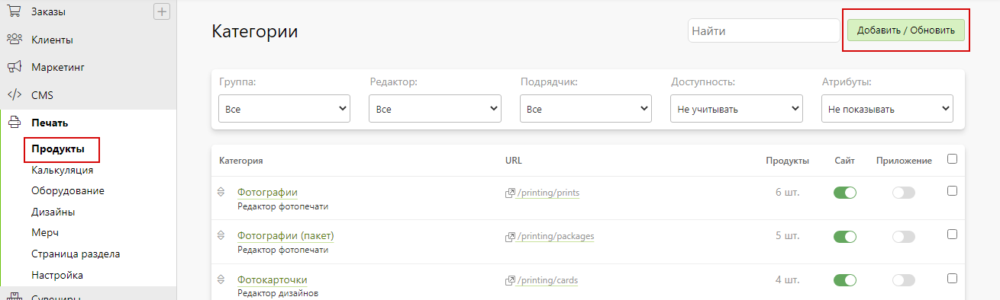
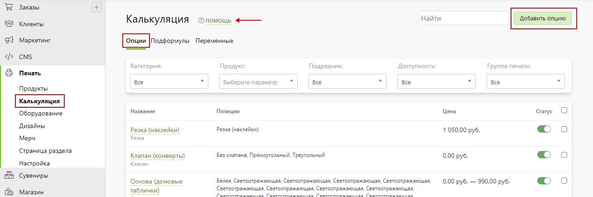
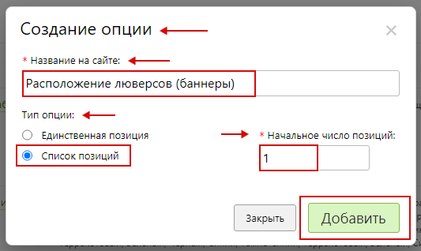
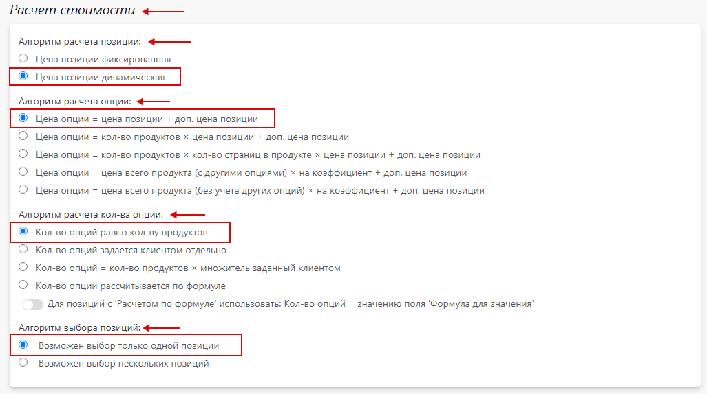
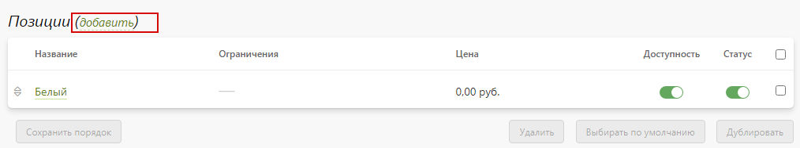

# [Широкоформатная печать](https://demo.pixlpark.ru/signs/banners)
## Техническое задание
* Необходимо настроить расчет стоимости широкоформатной печати баннеров произвольного размера с разрешением печати:
    - 360 dpi.
    - 720 dpi.
    - 1440 dpi.

<table class="sheet-printing" id="banners-price">
	<thead>
		<tr>
			<th rowspan="3">Тип изделия</th>
			<th colspan="3">Стоимость 1 м<sup>2</sup> баннера, руб.</th>
		</tr>
		<tr>
			<th colspan="3">Разрешение, dpi</th>
		</tr>
		<tr>
			<th>360</th>
			<th>720</th>
			<th>1440</th>
		</tr>
    </thead>
    <tbody>
		<tr>
			<td>Литой 440 г/м<sup>2</sup></td>
			<td>370</td>
			<td>745</td>
			<td>1025</td>
		</tr>
		<tr>
			<td>BackLit 510 г/м<sup>2</sup></td>
			<td>600</td>
			<td>925</td>
			<td>1300</td>
		</tr>
		<tr>
			<td>BackOut 510 г/м<sup>2</sup></td>
			<td>500</td>
			<td>750</td>
			<td>1200</td>
		</tr>
		<tr>
			<td>Сетка баннерная 270 г/м<sup>2</sup></td>
			<td>370</td>
			<td>790</td>
			<td>1100</td>
		</tr>
	</tbody>
</table>

##### Прочие надбавки
<table class="sheet-printing" id="other-price">
	<thead>
		<tr>
			<th>Наименование надбавки</th>
			<th>Стоимость</th>
		</tr>
    </thead>
    <tbody>
		<tr>
			<td>Люверсы (без люверсов / по углам / сверху и снизу / справа / слева / снизу / сверху / справа и слева / по периметру)</td>
			<td>2 руб. / шт. </td>
		</tr>
		<tr>
			<td>Цвет люверсов (белый / серебряный / золотой)</td>
			<td>-</td>
		</tr>
	</tbody>
</table>

## Формула для расчета стоимости широкоформатной печати
```	formula
Стоимость печати = стоимость люверсов + стоимость печати баннера
```

### Пример расчета для продукта
* Для проверки расчетов взять продукт с характеристиками согласно таблице.
| Тип продукта                        | Характеристики        |
|:-----------------------------------:|:---------------------:|
| Баннер литой 440 г/м<sup>2</sup>    | 1 шт.                 |
| Разрешение                          | 720 dpi               |
| Размер                              | 1 * 1 м.              |
| Расположение люверсов               | По периметру          |
| Расстояние между люверсами          | 50 см.                |
| Цвет люверсов                       | Белый                 |

* Этапы расчета:

1. Расчет количества люверсов и их стоимости.
    + Количество люверсов определяется исходя из деления суммы ширины и длинны баннера на указанное расстояние согласно формуле:
    ```formula
		((Длина баннера + Ширина баннера) / Расстояние между люверсами) * 2 * Стоимость 1 люверса
	```
    + Стоимость люверсов согласно формуле, составит:
    ```formula
		((100 см. + 100 см.) / 50 см.) * 2 * 2 руб. = 16 руб.
	```
2. Расчет площади печати.
    + Площадь печати определяется произведением длины и ширины баннера:
    ```formula
		1 м. * 1 м. = 1 кв. м.
	```
3. Расчёт стоимости печати.
    + Стоимость печати определяется исходя из произведения площади печати и стоимости печати за 1 кв.м. в соответствии с разрешением:
    ```formula
		1 кв. м. * 745 руб. = 745 руб.
	```
* __Итоговая стоимость изготовления баннера составит:__
    ```formula
		((100 см. + 100 см.) / 50 см.) * 2 * 2 руб. + 1 кв. м. * 745 руб. = 761 руб.
	```
## Создание калькулятора
* Для создания калькулятора продукта "__Баннеры__" в разделе "__Печать / Продукты__" нажать кнопку "__Добавить / Обновить__".

* В открывшейся карточке создания категории заполнить форму, указав:
	+ "__Создать новую категорию__"- необходимо выбрать.
	+ "__Название на сайте__" - указать "__Баннеры__".
	+ "__Редактор__" – выбрать "__Редактор дизайнов__".
* 
* Далее, нажать "__Добавить__" для создания продукта.
* В подразделе "__Основная информация__" созданной категории продукта необходимо задать:
    + "__Название в панели управления__" - указать "__Баннеры (дизайн)__".
    + Адрес в интернете латинскими буквами.
* 
* После, нажать "__Сохранить__" и сбросить кэш сайта.
* В подразделе "__Страница категории__" раздела "__Печать / Продукты / Баннеры (дизайн) / Настройка__" выбрать страницу, на которой будет располагаться данный продукт, а также задать настройки подраздела "__Хлебные крошки__" для отображения хлебных крошек в формате "__страница-раздела__", "__страница-раздела / страница-продукта__".

* После, нажать "__Сохранить__" и сбросить кэш сайта.
* В подразделе "__Основная информация__" раздела "__Печать / Продукты / Баннеры (дизайн) / Атрибуты__" включить "__Использовать атрибуты для выбора продукта__" и добавить атрибуты при помощи "__Добавить__" :
    + "__Тип изделия__".
    + "__Разрешение__".
* 
* После, нажать "__Сохранить__" и сбросить кэш сайта.

## Создание продуктов категории "Баннеры (дизайн)"
* В подразделе "__Продукты__" раздела "__Печать / Продукты / Баннеры (дизайн) / Продукты__" добавить продукт нажав "__Добавить__". 

* В открывшейся карточке создания продукта заполнить поля, указав:
	+ "__Создать новый продукт с нуля__" - необходимо выбрать.
	+ "__Название на сайте__" – указать "__Баннер Литой 440 г/м<sup>2</sup> (360 dpi)__".
* 
* В подразделе "__Основная информация__" раздела "__Настройка__" созданного продукта задать адрес в интернете латинскими буквами и включить "__Продукт доступен на сайте__".
* 
* В подразделе "__Тиражность__" раздела "__Настройка__" созданного продукта задать стоимость для количества от 1 до 1000 с шагом 1 шт. равной нулю и включить использование кнопок "Плюс / минус" в калькуляторе.
> Стоимость равна нулю т.к. она будет сформирована при помощи опций. 
* 
* После, нажать "__Сохранить__" и сбросить кэш сайта.
* В подразделе "__Поверхности печати__" раздела "__Редактор__" созданного продукта добавить поверхность нажав "__Добавить поверхность__".

* В появившемся окне создания и редактирования поверхностей заполнить поля, указав:
    + "__Название поверхности__" - указать "__Произвольный размер__".
    + "__Использовать произвольные размеры__" - необходимо включить и указать диапазон от 1 до 10000 мм.
    + "__Размерность на сайте__" - указать "__м.__".
* 
* После, нажать "__Сохранить__" и сбросить кэш сайта.
* В разделе "__Атрибуты__" созданного продукта задать значения атрибутов:
    + "__Тип изделия__" - задать значение "__Баннер Литой 440 г / м<sup>2</sup> (360 dpi)__".
    + "__Разрешение__" - задать значение "__360 dpi__".
* 
* После, нажать "__Сохранить__" и сбросить кэш сайта.
* Аналогичным образом создаются и настраиваются оставшиеся согласно таблице продукты.

<table class="sheet-printing-products">
	<tbody>
		<tr>
			<th>Название продукта</th>
			<th>Атрибуты</th>
		</tr>
    </thead>
    <tbody>
		<tr>
			<td>Баннер BackLit 510 г/м² (360dpi)</td>
			<td>Тип изделия: Баннер BackLit 510 г/м² (360dpi)<br>
Разрешение: 360 dpi
</td>
		</tr>
		<tr>
			<td>Баннер BlackOut 510 г/м² (360dpi)</td>
			<td>Тип изделия: Баннер BlackOut 510 г/м² (360dpi)<br>
Разрешение: 360 dpi
</td>
		</tr>
		<tr>
			<td>Сетка баннерная 270 г/м² (360dpi)</td>
			<td>Тип изделия: Сетка баннерная 270 г/м² (360dpi)<br>
Разрешение: 360 dpi
</td>
		</tr>
		<tr>
			<td>Баннер Литой 440 г/м² (720dpi)</td>
			<td>Тип изделия: Баннер Литой 440 г/м² (720dpi)<br>
Разрешение: 720 dpi
</td>
		</tr>
		<tr>
			<td>Баннер BackLit 510 г/м² (720dpi)</td>
			<td>Тип изделия: Баннер BackLit 510 г/м² (720dpi)<br>
Разрешение: 720 dpi
</td>
		</tr>
		<tr>
			<td>Баннер BlackOut 510 г/м² (720dpi)</td>
			<td>Тип изделия: Баннер BlackOut 510 г/м² (720dpi)<br>
Разрешение: 720 dpi
</td>
		</tr>
		<tr>
			<td>Сетка баннерная 270 г/м² (720dpi)</td>
			<td>Тип изделия: Сетка баннерная 270 г/м² (720dpi)<br>
Разрешение: 720 dpi
</td>
		</tr>
		<tr>
			<td>Баннер Литой 440 г/м² (1440dpi)</td>
			<td>Тип изделия: Баннер Литой 440 г/м² (1440dpi)<br>
Разрешение: 1440 dpi
</td>
		</tr>
		<tr>
			<td>Баннер BackLit 510 г/м² (1440dpi) </td>
			<td>Тип изделия: Баннер BackLit 510 г/м² (1440dpi)<br>
Разрешение: 1440 dpi
</td>
		</tr>
		<tr>
			<td>Баннер BlackOut 510 г/м² (1440dpi)</td>
			<td>Тип изделия: Баннер BlackOut 510 г/м² (1440dpi)<br>
Разрешение: 1440 dpi
</td>
		</tr>
		<tr>
			<td>Сетка баннерная 270 г/м² (1440dpi)</td>
			<td>Тип изделия: Сетка баннерная 270 г/м² (1440dpi) <br>
Разрешение: 1440 dpi
</td>
		</tr>
	</tbody>
</table>

## Опции
* 
	+ [Переменная "Расстояние между люверсами"](/calculators/large-format-printing?id=Переменная-quotРасстояние-между-люверсамиquot).
	+ [Переменная "Люверсы для баннеров"](/calculators/large-format-printing?id=Переменная-quotЛюверсы-для-баннеровquot).
    + [Расположение люверсов (баннеры)](/calculators/large-format-printing?id=Расположение-люверсов-баннеры).
    + [Цвет люверсов](/calculators/large-format-printing?id=Цвет-люверсов).
    + [Расчет стоимости баннеров](/calculators/large-format-printing?id=Расчёт-стоимости-баннеров).

### Переменная "Расстояние между люверсами"
> Назначение: ввод расстояния между люверсами.
* В разделе "__Печать / Калькуляция / Переменные__" нажать кнопку "__Добавить переменную__" для создания новой переменной.

* В открывшейся карточке создания переменной заполнить форму, указав:
    + "**Уникальное имя (только латинские буквы и символ _)**" - указать "__luvers__".
    + "__Название на сайте__" - указать "__Расстояние между люверсами (см)__".
* 
* Далее, нажать "__Добавить__" для создания переменной.
* В подразделе "__Основная информация__" переменной "__Расстояние между люверсами (см) / Настройка__" заполнить форму, указав:
    + "__Название на сайте__" – указать "__Расстояние между люверсами (см)__".
    + "__Название в панели управления__" – указать "__Расстояние между люверсами (см)__".
    + "__Тип возвращаемого значения__" - указать "__Целое число__".
    + "__По умолчанию__" - указать "__10__".
    + "__Тип данных__" - указать "__Значение из диапазона__".
    + "__Минимальное значение__" - указать "__1__".
    + "__Максимальное значение__" - указать "__1000__".
* 
* Далее, нажать кнопку "__Сохранить__" и сбросить кэш сайта.

### Переменная "Люверсы для баннеров"
> Назначение: определение цены за 1 люверс.
* В разделе "__Печать / Калькуляция / Переменные__" нажать кнопку "__Добавить переменную__" для создания новой переменной.

* В открывшейся карточке создания переменной заполнить форму, указав:
    + "**Уникальное имя (только латинские буквы и символ _)**" - указать "**eyelet_banners**".
    + "__Название на сайте__" - указать "__Люверсы для баннеров__".
* 
* Далее, нажать "__Добавить__" для создания переменной.
* В подразделе "__Основная информация__" переменной "__Люверсы для баннеров / Настройка__" заполнить форму, указав:
    + "__Название на сайте__" – указать "__Люверсы для баннеров__".
    + "__Название в панели управления__" – указать "__Люверсы для баннеров__".
    + "__Тип возвращаемого значения__" - указать "__Целое число__".
    + "__По умолчанию__" - указать "__2__".
    + "__Тип данных__" - указать "__Константа__".
* 
* Далее, нажать кнопку "__Сохранить__" и сбросить кэш сайта.

### Расположение люверсов (баннеры)
> Назначение опции: опция задает расположение люверсов относительно краев баннера.
* В разделе "__Печать / Калькуляция / Опции__" нажать кнопку "__Добавить опцию__" для создания новой опции.

* В открывшейся карточке создания опции заполнить форму, указав:
    + "__Название на сайте__" - указать "__Расположение люверсов (баннеры)__".
    + "__Тип опции__" - указать "__Список позиций__".
    + "__Начальное число позиций__" - указать "__1__".
* 
* Далее, нажать "__Добавить__" для создания опции.
* В подразделе "__Основная информация__" опции "__Расположение люверсов (баннеры) / Настройка__" заполнить форму, указав:
    + "__Название на сайте__" – указать "__Расположение люверсов__".
    + "__Название в панели управления__" – указать "__Расположение люверсов (баннеры)__".
    + "__CSS-класс__" - указать "__inline-checkbox two-rows__".
    + "__Вид выбора позиций на странице редактора__" и "__Вид выбора позиций на странице CMS__" - выбрать список.
    + "__Опция доступная на сайте__" - необходимо включить.
    + "__Опция обязательная для оформления заказа__" - необходимо включить.
    + "__Выбирать значение опции по умолчанию__" - необходимо включить.
* 
* В подразделе "__Расчет стоимости__" опции "__Расположение люверсов (баннеры) / Настройка__" задать настройки:
    + "__Алгоритм расчета позиции__" – выбрать "__Цена позиции динамическая__".
    + "__Алгоритм расчета опции__" – выбрать "__Цена опции = цена позиции + доп. цена позиции__".
    + "__Алгоритм расчета количества опций__" – выбрать "__Количество опций равно количеству продуктов__".
    + "__Алгоритм выбора позиций__" - выбрать "__Возможен выбор только одной позиции__".
* 
> Алгоритм расчета позиции – динамический, т.к. расчет будет осуществляться по формуле.
* В подразделе "__Позиции__" опции "__Расположение люверсов (баннеры) / Настройка__" содержится перечень позиций созданной опции.

* Далее, нажать кнопку "__Сохранить__" и сбросить кэш сайта.
* В подразделе "__Категории и продукты__" опции "__Расположение люверсов (баннеры) / Продукты__" добавить продукты нажав кнопку "__Добавить__". 
> В данном разделе осуществляется привязка опции к необходимым продуктам. После осуществления привязки опция будет участвовать в формировании цены продуктов.
* 
* В появившемся окне выбора категории в поле поиска ввести название категории продукта, а после – выбрать нужный продукт в списке и нажать "__Выбрать__".

* После, нажать кнопку "__Сохранить__" и сбросить кэш сайта.

#### Позиции опции "Расположение люверсов (баннеры)"
##### Позиция опции "Без люверсов"
* Для настройки позиции опции "__Расположение люверсов (баннеры)__" перейти в карточку позиции нажав на нее. Затем, заполнить подраздел "__Основная информация__", указав:
    + "__Название на сайте__" – указать "__Без люверсов__".
    + "__Название в панели управления__" – указать "__Без люверсов__".
    + "__Позиция активна__" - необходимо включить.
* 
* Затем, нажать "__Сохранить__" и сбросить кэш сайта.

##### Позиция опции "По углам"
> Позиция опции осуществляет расчет количества люверсов согласно указанному расстоянию и габаритным размерам баннера. <br>
> Добавить новую позицию опции можно при помощи "__Добавить__".
* 
> Также, позицию опции можно продублировать и скорректировать настройки в соответствии с нужными данными.
* Для настройки позиции опции "__Расположение люверсов (баннеры)__" перейти в карточку позиции нажав на нее. Затем, заполнить подраздел "__Основная информация__", указав:
    + "__Название на сайте__" – указать "__По углам__".
    + "__Название в панели управления__" – указать "__По углам__".
    + "__Позиция активна__" - необходимо включить.
* 
* Затем, нажать "__Сохранить__" и сбросить кэш сайта.
* В подразделе "__Стоимость__" позиции опции "__Расположение люверсов (баннеры)__" задать способ расчета цены "__По формуле__". Затем, в поле "__Формула для цены__" задать формулу для расчета количества люверсов:
	```formula
	4 * Константа "Люверсы для баннеров"
	```
* 
* Затем, нажать "__Применить__".
* Далее, для результатов поля "__Формула для цены__" задать способ округления результата до целого значения по умолчанию.

* Затем, нажать "__Сохранить__" и сбросить кэш сайта.

##### Позиция опции "Сверху и снизу"
> Позиция опции осуществляет расчет количества люверсов согласно указанному расстоянию и габаритным размерам баннера для верхнего и нижнего краев. <br>
> Добавить новую позицию опции можно при помощи "__Добавить__".
* 
> Также, позицию опции можно продублировать и скорректировать настройки в соответствии с нужными данными.
* Для настройки позиции опции "__Расположение люверсов (баннеры)__" перейти в карточку позиции нажав на нее. Затем, заполнить подраздел "__Основная информация__", указав:
    + "__Название на сайте__" – указать "__Сверху и снизу__".
    + "__Название в панели управления__" – указать "__Сверху и снизу__".
    + "__Позиция активна__" - необходимо включить.
* 
* Затем, нажать "__Сохранить__" и сбросить кэш сайта.
* В подразделе "__Стоимость__" позиции опции "__Расположение люверсов (баннеры)__" задать способ расчета цены "__По страницам__". Затем, в поле "__Развороты__" добавить разворот нажав "__Добавить__" и в подразделе "__Цена размеров__" указать формулу:
	```formula
	(1 + (Ширина редактора / Переменная "Расстояние между люверсами")) * 2 * Константа "Люверсы для баннеров"
	```
* 
* Затем, нажать "__Применить__", с после - нажать "__Сохранить__" и сбросить кэш сайта.
* Аналогичным образом настраиваются оставшиеся позиции согласно таблице.

<table class="sheet-printing-products">
	<thead>
		<tr>
			<th>Наименование позиции</th>
			<th>Способ расчета</th>
			<th>Формула</th>
		</tr>
    </thead>
    <tbody>
		<tr>
			<td>Справа</td>
			<td rowspan="6">По страницам документа</td>
			<td>(1+ (Высота редактора / Переменная "Расстояние между люверсами")) * Константа "Люверсы для баннеров"</td>
		</tr>
		<tr>
			<td>Слева</td>
			<td>(1+ (Высота редактора / Переменная "Расстояние между люверсами")) * Константа "Люверсы для баннеров"</td>
		</tr>
		<tr>
			<td>Снизу</td>
			<td>(1+ (Ширина редактора / Переменная "Расстояние между люверсами")) * Константа "Люверсы для баннеров"</td>
		</tr>
		<tr>
			<td>Сверху</td>
			<td>(1+ (Ширина редактора / Переменная "Расстояние между люверсами")) * Константа "Люверсы для баннеров"</td>
		</tr>
		<tr>
			<td>Справа и слева</td>
			<td>(1+ (Высота редактора / Переменная "Расстояние между люверсами")) * 2 * Константа "Люверсы для баннеров"</td>
		</tr>
		<tr>
			<td>По периметру</td>
			<td>((Ширина редактора * Высота редактора) / Переменная "Расстояние между люверсами") * 2 * Константа "Люверсы для баннеров"</td>
		</tr>
	</tbody>
</table>

* После внесения всех данных подраздел "__Позиции__" опции "__Расположение люверсов (баннеры)__" выглядит следующим образом:


### Цвет люверсов (баннеры)
> Назначение опции: задает выбор цвета люверсов.
* В разделе "__Печать / Калькуляция / Опции__" нажать кнопку "__Добавить опцию__" для создания новой опции.

* В открывшейся карточке создания опции заполнить форму, указав:
    + "__Название на сайте__" - указать "__Цвет люверсов (баннеры)__".
    + "__Тип опции__" - указать "__Список позиций__".
    + "__Начальное число позиций__" - указать "__1__".
* 
* Далее, нажать "__Добавить__" для создания опции.
* В подразделе "__Основная информация__" опции "__Цвет люверсов (баннеры) / Настройка__" заполнить форму, указав:
    + "__Название на сайте__" – указать "__Цвет люверсов__".
    + "__Название в панели управления__" – указать "__Цвет люверсов (баннеры)__".
    + "__CSS-класс__" - указать "__inline-checkbox two-rows__".
    + "__Вид выбора позиций на странице редактора__" и "__Вид выбора позиций на странице CMS__" - выбрать список.
    + "__Опция доступна на сайте__" - необходимо включить.
    + "__Опция обязательная для оформления заказа__" - необходимо включить.
    + "__Выбирать значение опции по умолчанию__" - необходимо включить.
* 
* В подразделе "__Расчет стоимости__" опции "__Цвет люверсов (баннеры) / Настройка__" задать настройки:
    + "__Алгоритм расчета позиции__" – выбрать "__Цена позиции фиксированная__".
    + "__Алгоритм расчета опции__" – выбрать "__Цена опции = цена позиции + доп. цена позиции__".
    + "__Алгоритм расчета количества опций__" – выбрать "__Количество опций равно количеству продуктов__".
    + "__Алгоритм выбора позиций__" - выбрать "__Возможен выбор только одной позиции__".
* 
* В подразделе "__Позиции__" опции "__Цвет люверсов (баннеры) / Настройка__" содержится перечень позиций созданной опции.

* Далее, нажать кнопку "__Сохранить__" и сбросить кэш сайта.
* В подразделе "__Категории и продукты__" опции "__Цвет люверсов (баннеры) / Продукты__" добавить продукты нажав кнопку "__Добавить__". 

* В появившемся окне выбора категории в поле поиска ввести название категории продукта, а после – выбрать нужный продукт в списке и нажать "__Выбрать__".

* Затем, нажать кнопку "__Сохранить__" и сбросить кэш сайта.

#### Позиции опции "Цвет люверсов (баннеры)"
* Для настройки позиции опции "__Цвет люверсов (баннеры)__" перейти в карточку позиции нажав на нее. Затем, заполнить подраздел "__Основная информация__", указав:
    + "__Название на сайте__" – указать "__Белый__".
    + "__Название в панели управления__" – указать "__Белый__".
    + "__Позиция активна__" - необходимо включить.
* 
* Затем, нажать "__Сохранить__".
* Аналогичным образом настраиваются оставшиеся позиции опции "__Цвет люверсов (баннеры)__":

| Наименование позиции                | Стоимость, руб.       |
|:-----------------------------------:|:---------------------:|
| Серебрянный                         | -                     |
| Золотой                             | -                     |
* 
> Добавить новую позицию опции можно при помощи "__Добавить__".
* 
> Также, позицию опции можно продублировать и скорректировать настройки в соответствии с нужными данными.
* После внесения всех данных подраздел "__Позиции__" опции "__Цвет люверсов (баннеры)__" выглядит следующим образом:


### Расчёт стоимости баннеров
> Назначение опции: задает стоимость печати баннеров в зависимости от разрешения.
* В разделе "__Печать / Калькуляция / Опции__" нажать кнопку "__Добавить опцию__" для создания новой опции.

* В открывшейся карточке создания опции заполнить форму, указав:
    + "__Название на сайте__" - указать "__Расчёт стоимости баннеров__".
    + "__Тип опции__" - указать "__Список позиций__".
    + "__Начальное число позиций__" - указать "__1__".
* 
* Далее, нажать "__Добавить__" для создания опции.
* В подразделе "__Основная информация__" опции "__Расчет стоимости баннеров / Настройка__" заполнить форму, указав:
    + "__Название на сайте__" – указать "__Расчет стоимости баннеров__".
    + "__Название в панели управления__" – указать "__Расчет стоимости баннеров__".
    + "__Вид выбора позиций на странице редактора__" и "__Вид выбора позиций на странице CMS__" - выбрать список.
    + "__Опция доступна на сайте__" - необходимо включить.
    + "__Опция скрыта__" - необходимо включить.
    + "__Опция обязательная для оформления заказа__" - необходимо включить.
    + "__Выбирать значение опции по умолчанию__" - необходимо включить.
* 
* В подразделе "__Расчет стоимости__" опции "__Расчет стоимости баннеров / Настройка__" задать настройки:
    + "__Алгоритм расчета позиции__" – выбрать "__Цена позиции динамическая__".
    + "__Алгоритм расчета опции__" – выбрать "__Цена опции = количество продуктов * цена позиции + доп. цена позиции__".
    + "__Алгоритм расчета количества опций__" – выбрать "__Количество опций равно количеству продуктов__".
    + "__Алгоритм выбора позиций__" - выбрать "__Возможен выбор только одной позиции__".
* 
* В подразделе "__Позиции__" опции "__Расчет стоимости баннеров / Настройка__" содержится перечень позиций созданной опции.
* 
* Далее, нажать кнопку "__Сохранить__" и сбросить кэш сайта.
* В подразделе "__Категории и продукты__" опции "__Расчет стоимости баннеров / Продукты__" добавить продукты нажав кнопку "__Добавить__". 
* 
* В появившемся окне выбора категории в поле поиска ввести название категории продукта, а после – выбрать нужный продукт в списке и нажать "__Выбрать__".
* 
* Затем, нажать кнопку "__Сохранить__" и сбросить кэш сайта.

#### Позиции опции "Расчет стоимости баннеров"
* Для настройки позиции опции "__Расчет стоимости баннеров__" перейти в карточку позиции нажав на нее. Затем, заполнить подраздел "__Основная информация__", указав:
    + "__Название на сайте__" – указать "__Расчёт__".
    + "__Название в панели управления__" – указать "__Расчёт стоимости (Баннер Литой 440 г/м<sup>2</sup>)__".
    + "__Позиция активна__" - необходимо включить.
* 
* В подразделе "__Ограничения__" позиции опции "__Расчет стоимости баннеров__" включить "__Ограничить позицию следующими категориями раздела "Печать"__" и выбрать категории печати нажав "__Выбрать__":
    + Баннер Литой 440 г/м<sup>2</sup> (360dpi).
* 
* Затем, нажать "__Сохранить__".
* В подразделе "__Стоимость__" позиции опции "__Расчет стоимости баннеров__" задать способ расчета цены "__По формуле__". Затем, в поле "__Формула для цены__" задать формулу для расчета стоимости баннера:
	```formula
	Ширина редактора * Высота редактора * 0,00037
	```
* 
> Стоимость задается исходя из ширины и высоты редактора в мм.
* Затем, нажать "__Применить__", а после нажать "__Сохранить__" и сбросить кэш сайта.
* Аналогичным образом настраиваются оставшиеся позиции согласно [таблице](/calculators/large-format-printing?id=banners-price).
* После внесения всех данных подраздел "__Позиции__" опции "__Расчет стоимости баннеров__" выглядит следующим образом:
* 

## Дополнительные настройки при использовании редактора макетов
* Категория продукта и продукты настраиваются аналогично категории [Баннеры (дизайн)](/calculators/large-format-printing?id=pасчет-стоимости-по-произвольным-размерам-в-калькуляторе). К данному калькулятору необходимо привязать ранее создаваемые опции [Расположение люверсов (баннеры)]() и [Цвет люверсов (баннеры)]()
с дополнениями, описанными ниже.

##### Необходимые дополнения:
1. Для категории продукта использовать редактор макетов.
Для этого при создании калькулятора в разделе "__Печать / Продукты__" необходимо выбрать его из перечня редакторов.

После создания категории продукта в подразделе "__Проверка растровых документов__" разделе "__Печать / Продукты / Баннеры (по макету) / Редактор__" задать настройки для разрешения от 70 до 600 dpi.

2. При создании продуктов категории в каждом продукте необходимо настроить редактор. Для этого в подразделе "__Настройка страниц__" раздела "__Редактор__" создаваемого продукта заполнить форму, указав:
	+ "__Печатный блок__" - необходимо включить.
	+ "__Количество файлов__" - указать диапазон от 1 до 100 штук.
	+ "__Использовать произвольные размеры__" - необходимо включить.
	+ "__Ширина__" - указать диапазон от 100 до 1000000 мм.
	+ "__Высота__" - указать диапазон от 100 до 1000000 мм.
	+ "__Допустимая погрешность в размере__" - указать "__5__".

> В данной конфигурации возможен расчет стоимости по страницам загруженного PDF-документа.
3. В опции [Расчет стоимости баннеров](calculators/large-format-printing?id=Расчёт-стоимости-баннеров) добавить позиции для расчета стоимости согласно таблице.

<table class="sheet-printing">
	<thead>
		<tr>
			<th>Наименование позиции</th>
			<th>Ограничения</th>
			<th>Способ расчета для разворотов</th>
			<th>Формула</th>
		</tr>
	</thead>
	<tbody>
		<tr>
			<td>Расчёт стоимости (Баннер Литой 440 г/м<sup>2</sup>)</td>
			<td>Баннер Литой 440 г/м <sup>2</sup>(360dpi)</td>
			<td rowspan="12">По страницам документа</td>
			<td>Ширина редактора * Высота редактора * 0,00037</td>
		</tr>
		<tr>
			<td>Расчёт стоимости (Баннер BackLit 510 г/м<sup>2</sup>)</td>
			<td>Баннер BackLit 510 г/м<sup>2</sup> (360dpi)</td>
			<td>Ширина редактора * Высота редактора * 0,0006</td>
		</tr>
		<tr>
			<td>Расчёт стоимости (Баннер BlackOut 510 г/м<sup>2</sup>)</td>
			<td>Баннер BlackOut 510 г/м<sup>2</sup> (360dpi)</td>
			<td>Ширина редактора * Высота редактора * 0,0005</td>
		</tr>
		<tr>
			<td>Расчёт стоимости (Сетка баннерная 270 г/м<sup>2</sup>)</td>
			<td>Сетка баннерная 270 г/м<sup>2</sup> (360dpi)</td>
			<td>Ширина редактора * Высота редактора * 0,00037</td>
		</tr>
		<tr>
			<td>Расчёт стоимости (Баннер Литой 440 г/м<sup>2</sup>)</td>
			<td>Баннер Литой 440 г/м <sup>2</sup>(720dpi)</td>
			<td>Ширина редактора * Высота редактора * 0,000745</td>
		</tr>
		<tr>
			<td>Расчёт стоимости (Баннер BackLit 510 г/м<sup>2</sup>)</td>
			<td>Баннер BackLit 510 г/м<sup>2</sup> (720dpi)</td>
			<td>Ширина редактора * Высота редактора * 0,000925</td>
		</tr>
		<tr>
			<td>Расчёт стоимости (Баннер BlackOut 510 г/м<sup>2</sup>)</td>
			<td>Баннер BlackOut 510 г/м<sup>2</sup> (720dpi)</td>
			<td>Ширина редактора * Высота редактора * 0,00075</td>
		</tr>
		<tr>
			<td>Расчёт стоимости (Сетка баннерная 270 г/м<sup>2</sup>)</td>
			<td>Сетка баннерная 270 г/м<sup>2</sup> (720dpi)</td>
			<td>Ширина редактора * Высота редактора * 0,00079</td>
		</tr>
		<tr>
			<td>Расчёт стоимости (Баннер Литой 440 г/м<sup>2</sup>)</td>
			<td>Баннер Литой 440 г/м <sup>2</sup>(1440dpi)</td>
			<td>Ширина редактора * Высота редактора * 0,001025</td>
		</tr>
		<tr>
			<td>Расчёт стоимости (Баннер BackLit 510 г/м<sup>2</sup>)</td>
			<td>Баннер BackLit 510 г/м<sup>2</sup> (1440dpi)</td>
			<td>Ширина редактора * Высота редактора * 0,0013</td>
		</tr>
		<tr>
			<td>Расчёт стоимости (Баннер BlackOut 510 г/м<sup>2</sup>)</td>
			<td>Баннер BlackOut 510 г/м<sup>2</sup> (1440dpi)</td>
			<td>Ширина редактора * Высота редактора * 0,0012</td>
		</tr>
		<tr>
			<td>Расчёт стоимости (Сетка баннерная 270 г/м<sup>2</sup>)</td>
			<td>Сетка баннерная 270 г/м<sup>2</sup> (1440dpi)</td>
			<td>Ширина редактора * Высота редактора * 0,0011</td>
		</tr>
	</tbody>
</table>

<!-- ## Калькулятор расчета печати баннеров по произвольным размерам в калькуляторе (дизайн) и в онлайн-редакторе (макет)
<div id="integratedCalculator" class="url-banners" style="position: relative; min-height: 150px;"></div>
<script>
    let container = document.getElementById("integratedCalculator");
    let  params = { 
            materialType: "banners",
        };
        let integrated = new PxpCalcManager(container, params);
		    if(window.innerWidth<=800) {
				window.onCompleteLoadPxpCalc = (calc) => {
				calc.totalPriceCalculator.stickyBlock.isEnable(false);
				calc.totalPriceCalculator.stickyBlock.isEnable.subscribe(val=>{
				calc.totalPriceCalculator.stickyBlock.isEnable(false)});
    }}
</script> -->