# [Лазерная резка](https://demo.pixlpark.ru/services/laser-cutting)
## Техническое задание
* Необходимо настроить расчет стоимости лазерной резки для материалов различной толщины.

<table class="sheet-printing" id="laser-cutting-price">
	<thead>
		<tr>
			<th rowspan="2">Материал</th>
			<th colspan="8">Стоимость материала и 1 п.м. реза в зависимости от толщины, руб.</th>
		</tr>
		<tr>
			<th>до 1 мм</th>
			<th>до 2 мм</th>
			<th>до 4 мм</th>
			<th>до 6 мм</th>
			<th>до 8 мм</th>
			<th>до 10 мм</th>
			<th>до 12 мм</th>
			<th>до 20 мм</th>
		</tr>
		</thead>
		<tbody>
		<tr>
			<td>Фанера</td>
			<td>-</td>
			<td>15</td>
			<td>20</td>
			<td>30</td>
			<td>35</td>
			<td>40</td>
			<td>60</td>
			<td>-</td>
		</tr>
		<tr>
			<td>Акрил / оргстекло</td>
			<td>10</td>
			<td>13</td>
			<td>17</td>
			<td>25</td>
			<td>28</td>
			<td>35</td>
			<td>-</td>
			<td>-</td>
		</tr>
		<tr>
			<td>Ткань / Фетр</td>
			<td>10</td>
			<td>-</td>
			<td>-</td>
			<td>-</td>
			<td>-</td>
			<td>-</td>
			<td>-</td>
			<td>-</td>
		</tr>
		<tr>
			<td>Кожа</td>
			<td>12</td>
			<td>15</td>
			<td>-</td>
			<td>-</td>
			<td>-</td>
			<td>-</td>
			<td>-</td>
			<td>-</td>
		</tr>
		<tr>
			<td>Картон / бумага</td>
			<td>8</td>
			<td>-</td>
			<td>-</td>
			<td>-</td>
			<td>-</td>
			<td>-</td>
			<td>-</td>
			<td>-</td>
		</tr>
		<tr>
			<td>Микрогофрокартон</td>
			<td>9</td>
			<td>-</td>
			<td>-</td>
			<td>-</td>
			<td>-</td>
			<td>-</td>
			<td>-</td>
			<td>-</td>
		</tr>
		<tr>
			<td>Гофрокартон</td>
			<td>-</td>
			<td>-</td>
			<td>15</td>
			<td>-</td>
			<td>-</td>
			<td>-</td>
			<td>-</td>
			<td>-</td>
		</tr>
		<tr>
			<td>ПЭТ</td>
			<td>12</td>
			<td>13</td>
			<td>17</td>
			<td>-</td>
			<td>-</td>
			<td>-</td>
			<td>-</td>
			<td>-</td>
		</tr>
		<tr>
			<td>ЭВА материал</td>
			<td>-</td>
			<td>-</td>
			<td>-</td>
			<td>-</td>
			<td>-</td>
			<td>-</td>
			<td>-</td>
			<td>30</td>
		</tr>
	</tbody>
</table>

## Формула для расчета стоимости лазерной резки
```	formula
Стоимость лазерной резки = стоимость материала и 1 м.п. реза * длина реза
```

### Пример расчета для продукта
* Для проверки расчетов взять продукт с характеристиками согласно таблице.

| Материал         | ПЭТ       |
|:----------------:|:---------:|
|Толщина материала | 2 мм      |
|Длина реза		   | 10 мм     |

* Стоимость материала задана с учетом толщины и стоимости реза 1 погонного метра и составляет 13 рублей. Для расчета итоговой стоимости лазерной резки необходимо умножить данное значение на длину реза:
```formula
13 рублей * 10 м. = 130 рублей.
```
* __Итоговая стоимость лазерной резки составит:__
```	formula
13 руб. * 10 м.  = 130 руб.
```

## Создание калькулятора
* Для создания калькулятора продукта "__Лазерная резка__" в разделе "__Печать / Продукты__" нажать кнопку "__Добавить / Обновить__".

* В открывшейся карточке создания категории заполнить форму, указав:
	+ "__Создать новую категорию__" - необходимо выбрать.
	+ "__Название на сайте__" – указать "__Лазерная резка__".
	+ "__Редактор__" – выбрать "__Редактор товаров__".
* 
* Далее, нажать "__Добавить__" для создания продукта.
* В подразделе "__Основная информация__" созданной категории продукта необходимо задать адрес в интернете латинскими буквами.

* Дополнительно включить "__Использовать радио – кнопки вместо выпадающего списка для выбора товара__" для выбора типа материала в редакторе при помощи радио – кнопок.

* После, нажать кнопку "__Сохранить__" и сбросить кэш сайта.
* В подразделе "__Страница категории__" раздела "__Печать / Продукты / Лазерная резка / Настройка__" выбрать страницу, на которой будет располагаться данный продукт, а также задать настройки подраздела "__Хлебные крошки__" для отображения хлебных крошек в формате "__страница-раздела__", "__страница-раздела / страница-продукта__".

* После, нажать кнопку "__Сохранить__" и сбросить кэш сайта.
* В подразделе "__Основная информация__" раздела "__Печать / Продукты / Лазерная резка / Дизайны__" включить:
	+ "__Отображать ссылку перехода в редактор без шаблона на странице списка шаблонов__".
	+ "__Отображать раздел "Фотобанк"__" в модальном окне выбора фотографий в редакторе.
* В подразделе "__Настройки отображения__" раздела "__Печать / Продукты / Лазерная резка / Дизайны__" включить:
	+ "__Отображать обложку шаблона при наведении на него на странице списка шаблонов__".
* 
* После, нажать кнопку "__Сохранить__" и сбросить кэш сайта.

### Создание продуктов категории "Лазерная резка"
* В подразделе "__Продукты__" раздела "__Печать / Продукты / Лазерная резка / Продукты__" добавить продукт нажав кнопку "__Добавить__". 

* В открывшейся карточке создания продукта заполнить поля, указав:
    + "__Создать новый продукт с нуля__" - необходимо выбрать.
    + "__Название на сайте__" – указать "__Фанера__".
* 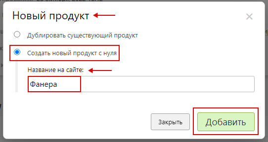
* Затем, нажать "__Добавить__".
* В подразделе "__Основная информация__" раздела "__Настройка__" созданного продукта задать адрес в интернете латинскими буквами и включить "__Продукт доступен на сайте__".

* В подразделе "__Тиражность__" раздела "__Настройка__" созданного продукта задать стоимость для количества от 1 до 1000 с шагом 1 шт. равной ноль рублей.
> Стоимость равна нулю т.к. она будет сформирована при помощи опций. 
* 
* После, нажать кнопку "__Сохранить__" и сбросить кэш сайта.
* Аналогичным образом создаются и настраиваются оставшиеся согласно [таблице стоимости материала и 1 п.м. реза](/calculators/laser-cutting?id=laser-cutting-price) материалы.
* После внесения всех продуктов раздел выглядит следующим образом:


## Опции для лазерной резки
*	+ [Толщина материала (Фанера)](/calculators/laser-cutting?id=Толщина-материала-Фанера).
	+ [Толщина материала (Акрил / Оргстекло)](/calculators/laser-cutting?id=Толщина-материала-Акрил-Оргстекло).
	+ [Толщина материала (Ткань / Фетр)](/calculators/laser-cutting?id=Толщина-материала-Ткань-Фетр).
	+ [Толщина материала (Кожа)](/calculators/laser-cutting?id=Толщина-материала-Кожа).
	+ [Толщина материала (Картон)](/calculators/laser-cutting?id=Толщина-материала-Картон).
	+ [Толщина материала (Гофрокартон)](/calculators/laser-cutting?id=Толщина-материала-Гофрокартон).
	+ [Толщина материала (ПЭТ)](/calculators/laser-cutting?id=Толщина-материала-ПЭТ).
	+ [Толщина материала (Микрогофрокартон)](/calculators/laser-cutting?id=Толщина-материала-Микрогофрокартон).
	+ [Толщина материала (Эва материал)](/calculators/laser-cutting?id=Толщина-материала-Эва-материал).
	+ [Подформула для расчета стоимости (лазерная резка)](/calculators/laser-cutting?id=Подформула-для-расчета-стоимости-лазерная-резка).
	+ [Переменная для определения длины реза (лазерная резка)](/calculators/laser-cutting?id=Переменная-для-определения-длины-реза-лазерная-резка).
	+ [Загрузка фотографий (лазерная резка)](/calculators/laser-cutting?id=Загрузка-фотографий-лазерная-резка).


### Толщина материала (Фанера)
> Назначение опции: задание стоимости с учетом толщины и 1 погонного метра реза для материала "__Фанера__".
* В разделе "__Печать / Калькуляция / Опции__" нажать кнопку "__Добавить опцию__" для создания новой опции.

* В открывшейся карточке создания опции заполнить форму, указав:
    + "__Название на сайте__" - указать "__Толщина материала (Фанера)__".
    + "__Тип опции__" - указать "__Список позиций__".
    + "__Начальное число позиций__" - указать "__1__".
* 
* Далее, нажать "__Добавить__" для создания опции.
* В подразделе "__Основная информация__" опции "__Толщина материала (Фанера) / Настройка__" заполнить форму, указав:
    + "__Название на сайте__" – указать "__Толщина материала__".
    + "__Название в панели управления__" – указать "__Толщина материала (Фанера)__".
    +  "__Вид выбора позиций на странице редактора__" и "__Вид выбора позиций на странице CMS__" - выбрать список.
    + "__Опция доступная на сайте__" - необходимо включить.
    +  "__Опция обязательная для оформления заказа__" - необходимо включить.
    + "__Выбирать значение опции по умолчанию__" - необходимо включить.
* 
* В подразделе "__Расчет стоимости__" опции "__Толщина материала (Фанера) / Настройка__" задать настройки:
    + "__Алгоритм расчета позиции__" – выбрать "__Цена позиции фиксированная__".
    + "__Алгоритм расчета опции__" – выбрать "__Цена опции = цена позиции + дополнительная цена позиции__".
    + "__Алгоритм расчета количества опций__" – выбрать "__Количество опций равно количеству продуктов__".
    + "__Алгоритм выбора позиций__" - выбрать "__Возможен выбор только одной позиции__".
* 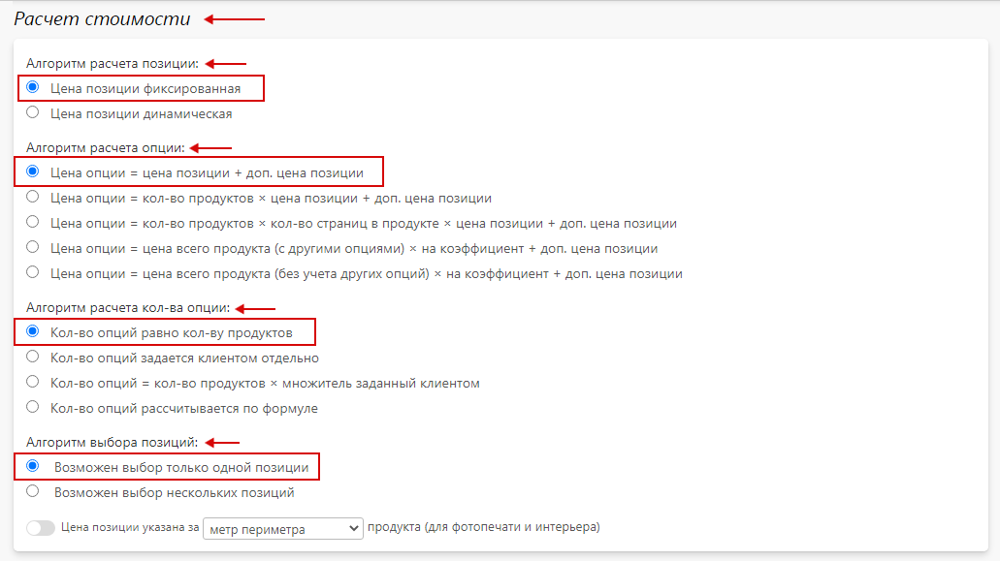
* В подразделе "__Позиции__" опции "__Толщина материала (Фанера) / Настройка__" содержится перечень позиций созданной опции.

* Далее, нажать кнопку "__Сохранить__" и сбросить кэш сайта.
* В подразделе "__Категории и продукты__" опции "__Толщина материала (Фанера) / Продукты__" добавить продукты нажав кнопку "__Добавить__". 
> В данном разделе осуществляется привязка опции к необходимым продуктам. После осуществления привязки опция будет участвовать в формировании цены продуктов.
* 
* В появившемся окне выбора категории в поле поиска ввести название категории продукта, а после – выбрать нужный продукт в списке и нажать "__Выбрать__".
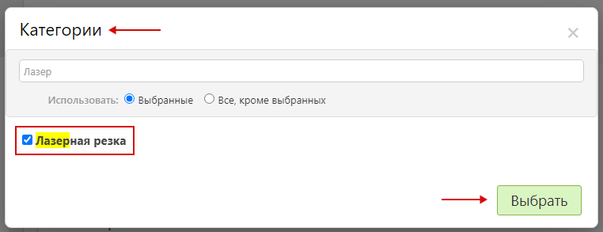
* Затем, нажать кнопку "__Выбрать__".
* После, скорректировать привязку для продукта "__Фанера__".
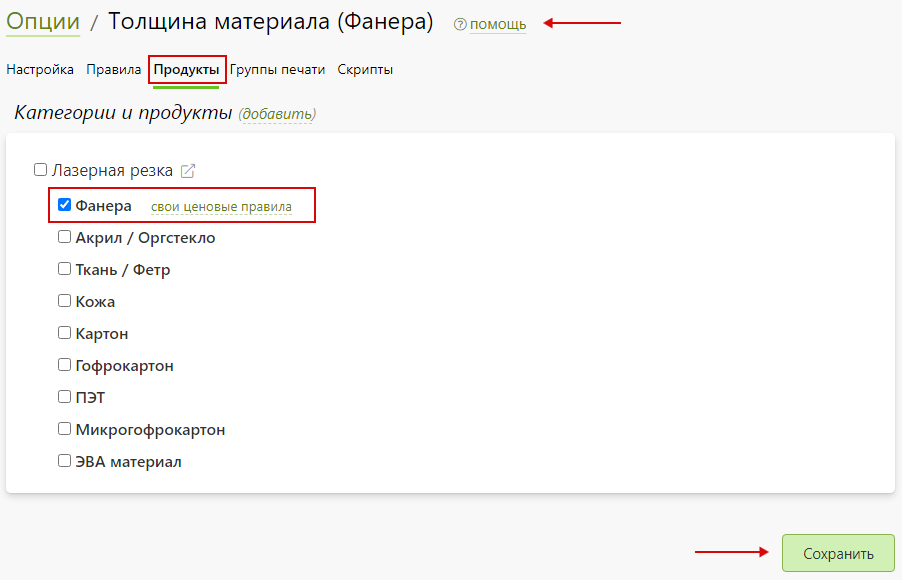
* Затем -  нажать "__Сохранить__" и сбросить кэш сайта.

#### Позиции опции "Толщина материала (Фанера)"
* Для настройки позиции опции "__Толщина материала (Фанера)__" перейти в карточку позиции нажав на нее. Затем, заполнить подраздел "__Основная информация__", указав:
    + "__Название на сайте__" – указать "__2 мм__".
    + "__Название в панели управления__" – указать "__2 мм__".
    + "__Позиция активна__" - необходимо включить.
* 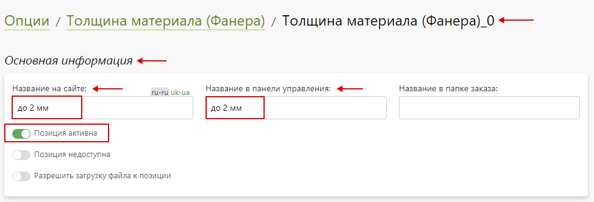
* В подразделе "__Стоимость__" позиции опции "__Толщина материала (Фанера)__" задать стоимость "__15__" руб.
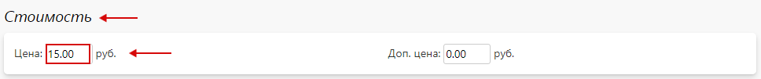
* Затем, нажать "__Сохранить__" и сбросить кэш сайта.
* Аналогичным образом настраиваются оставшиеся согласно [таблице стоимости материала и 1 п.м. реза](/calculators/laser-cutting?id=laser-cutting-price) позиции для материала "__Фанера__".
> Добавить новую позицию опции можно при помощи "__Добавить__".
* 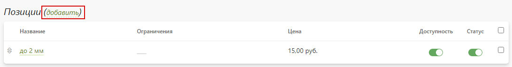
> Также, позицию опции можно продублировать и скорректировать настройки в соответствии с нужными данными.
* После внесения всех данных подраздел "__Позиции__" опции "__Толщина материала (Фанера)__" выглядит следующим образом:


### Толщина материала (Акрил / Оргстекло)
> Назначение опции: задание стоимости с учетом толщины и 1 погонного метра реза для материала "__Акрил / Оргстекло__".
* Опция и ее позиции настраиваются аналогично опции "__Толщина материала (Фанера)__". Позиции опции задают стоимость согласно [таблице стоимости материала и 1 п.м. реза](/calculators/laser-cutting?id=laser-cutting-price) для материала "__Акрил / Оргстекло__".

### Толщина материала (Ткань / Фетр)
> Назначение опции: задание стоимости с учетом толщины и 1 погонного метра реза для материала "__Ткань / Фетр__".
* Опция и ее позиции настраиваются аналогично опции "__Толщина материала (Фанера)__". Позиции опции задают стоимость согласно  [таблице стоимости материала и 1 п.м. реза](/calculators/laser-cutting?id=laser-cutting-price) для материала "__Ткань / Фетр__".

### Толщина материала (Кожа)
> Назначение опции: задание стоимости с учетом толщины и 1 погонного метра реза для материала "__Кожа__".
* Опция и ее позиции настраиваются аналогично опции "__Толщина материала (Фанера)__". Позиции опции задают стоимость согласно [таблице стоимости материала и 1 п.м. реза](/calculators/laser-cutting?id=laser-cutting-price) для материала "__Кожа__".

### Толщина материала (Картон)
> Назначение опции: задание стоимости с учетом толщины и 1 погонного метра реза для материала "__Картон__".
* Опция и ее позиции настраиваются аналогично опции "__Толщина материала (Фанера)__". Позиции опции задают стоимость согласно [таблице стоимости материала и 1 п.м. реза](/calculators/laser-cutting?id=laser-cutting-price) для материала "__Картон__".

### Толщина материала (Гофрокартон)
> Назначение опции: задание стоимости с учетом толщины и 1 погонного метра реза для материала "__Гофрокартон__".
* Опция и ее позиции настраиваются аналогично опции "__Толщина материала (Фанера)__". Позиции опции задают стоимость согласно [таблице стоимости материала и 1 п.м. реза](/calculators/laser-cutting?id=laser-cutting-price) для материала "__Гофрокартон__".

### Толщина материала (ПЭТ)
> Назначение опции: задание стоимости с учетом толщины и 1 погонного метра реза для материала "__ПЭТ__".
* Опция и ее позиции настраиваются аналогично опции "__Толщина материала (Фанера)__". Позиции опции задают стоимость согласно [таблице стоимости материала и 1 п.м. реза](/calculators/laser-cutting?id=laser-cutting-price) для материала "__ПЭТ__".

### Толщина материала (Микрогофрокартон)
> Назначение опции: задание стоимости с учетом толщины и 1 погонного метра реза для материала "__Микрогофрокартон__".
* Опция и ее позиции настраиваются аналогично опции "__Толщина материала (Фанера)__". Позиции опции задают стоимость согласно [таблице стоимости материала и 1 п.м. реза](/calculators/laser-cutting?id=laser-cutting-price) для материала "__Микрогофрокартон__".

### Толщина материала (Эва материал)
> Назначение опции: задание стоимости с учетом толщины и 1 погонного метра реза для материала "__Эва материал__".
* Опция и ее позиции настраиваются аналогично опции "__Толщина материала (Фанера)__". Позиции опции задают стоимость согласно [таблице стоимости материала и 1 п.м. реза](/calculators/laser-cutting?id=laser-cutting-price) для материала "__Эва материал__".

### Подформула для расчета стоимости (лазерная резка)
> Назначение подформулы: суммирование и возможность повторного использования значений толщин материалов для лазерной резки. 
* В разделе "__Печать / Калькуляция / Подформулы__" нажать кнопку "__Добавить подформулу__" для создания новой подформулы.
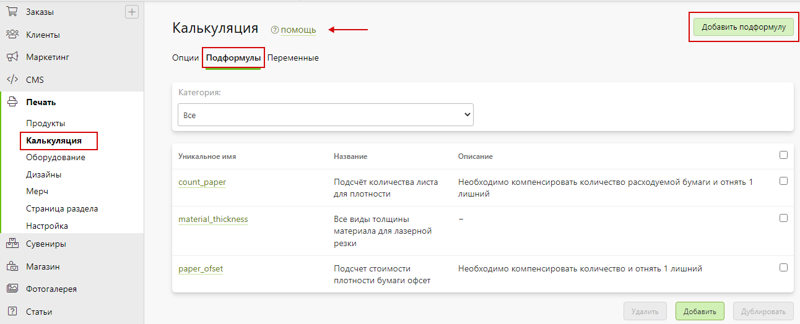
В открывшейся карточке создания подформулы заполнить форму, указав:
    + "**Уникальное имя (только латинские буквы и символ _)**" - указать "**material_thickness**".
    + "__Название__" - указать "__Все виды толщины материала для лазерной резки__".
* 
* Далее, нажать "__Добавить__" для создания подформулы.
* В подразделе "__Основная информация__" подформулы "__Все виды толщины материала для лазерной резки__" добавить текст подформулы нажав "__Редактировать__":
```formula
Цена опции "Толщина материала (Фанера)" + цена опции "Толщина материала (Акрил / Оргстекло)" + цена опции "Толщина материала (Ткань / Фетр)" + цена опции "Толщина материала (Кожа)" + Цена опции "Толщина материала (Картон)" + цена опции "Толщина материала (Микрогофрокартон)" + цена опции "Толщина материала (Гофрокартон)" + цена опции "Толщина материала (ПЭТ)" + цена опции "Толщина материала (ЭВА материал)"
```

* Затем, нажать "__Применить__", а после – "__Сохранить__" и сбросить кэш сайта.

### Переменная для определения длины реза (лазерная резка)
> Назначение переменной: ввод длины реза для расчета стоимости лазерной резки.
* В разделе "__Печать / Калькуляция / Переменные__" нажать кнопку "__Добавить переменную__" для создания новой переменной.

* В открывшейся карточке создания переменной заполнить форму, указав:
    + "**Уникальное имя (только латинские буквы и символ _)**" - указать "**dlina_reza**".
    + "__Название__" - указать "__Длина реза (лазерная резка)__".
* 
* Далее, нажать "__Добавить__" для создания переменной.
* В подразделе "__Основная информация__" переменной "__Длина реза (лазерная резка) / Настройка__" заполнить форму, указав:
    + "__Название на сайте__" – указать "__Длина реза__".
    + "__Название в панели управления__" – указать "__Длина реза (лазерная резка)__".
    + "__Размерность__" - указать "__п. м.__".
    + "__Тип возвращаемого значения__" - указать "__Дробное число__".
    + "__Тип данных__" - указать "__Значение из диапазона__".
    + "__Минимальное значение__" - указать "__1__".
    + "__Максимальное значение__" - указать "__1000__".
* 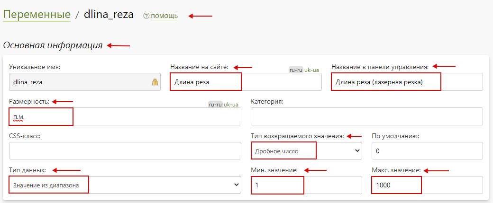
* Далее, нажать кнопку "__Сохранить__" и сбросить кэш сайта.

### Расчет стоимости (лазерная резка)
> Назначение опции: расчет стоимости лазерной резки выбранного материала с учетом указанной длинны реза.
* В разделе "__Печать / Калькуляция / Опции__" нажать кнопку "__Добавить опцию__" для создания новой опции.

* В открывшейся карточке создания опции заполнить форму, указав:
    + "__Название на сайте__" - указать "__Расчет стоимости (лазерная резка)__".
    + "__Тип опции__" - указать "__Список позиций__".
    + "__Начальное число позиций__" - указать "__1__".
* 
* Далее, нажать "__Добавить__" для создания опции.
* В подразделе "__Основная информация__" опции "__Расчет стоимости (лазерная резка) / Настройка__" заполнить форму, указав:
    + "__Название на сайте__" – указать "__Длина реза__".
    + "__Название в панели управления__" – указать "__Расчет стоимости (лазерная резка)__".
    + "__CSS-класс__" - указать "__inline-checkbox__".
    +  "__Вид выбора позиций на странице редактора__" и "__Вид выбора позиций на странице CMS__" - выбрать список.
    + "__Опция доступна на сайте__" - необходимо включить.
    + "__Опция обязательная для оформления заказа__" - необходимо включить.
    + "__Выбирать значение опции по умолчанию__" - необходимо включить.
* 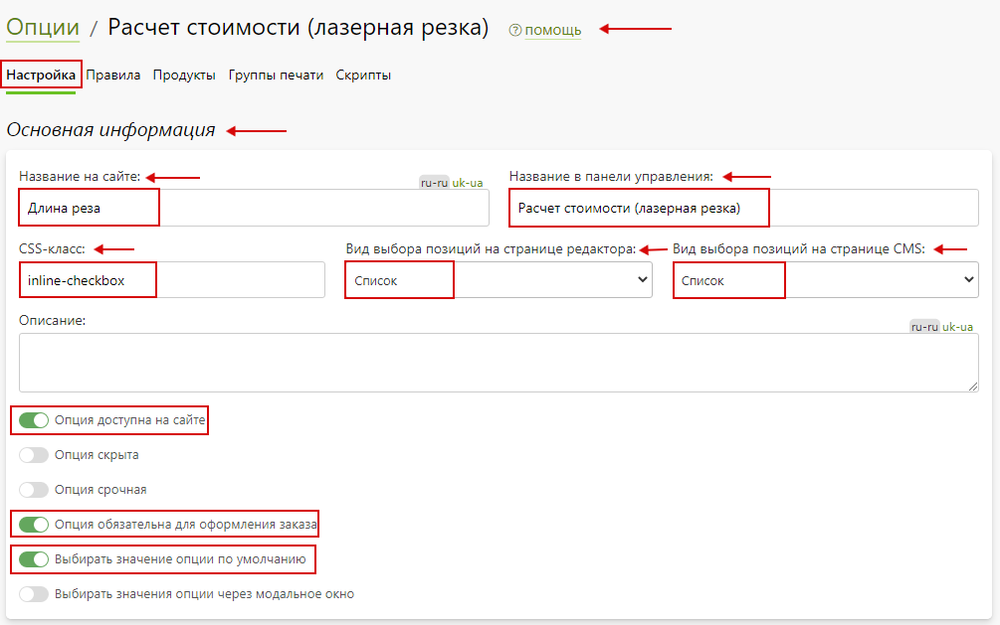
* В подразделе "__Расчет стоимости__" опции "__Расчет стоимости (лазерная резка) / Настройка__" задать настройки:
    + "__Алгоритм расчета позиции__" – выбрать "__Цена позиции динамическая__"
    + "__Алгоритм расчета опции__" – выбрать "__Цена опции = цена позиции + дополнительная цена позиции__".
    + "__Алгоритм расчета количества опций__" – выбрать "__Количество опций равно количеству продуктов__".
    + "__Алгоритм выбора позиций__" - выбрать "__Возможен выбор только одной позиции__".
* 
* В подразделе "__Позиции__" опции "__Расчет стоимости (лазерная резка) / Настройка__" содержится перечень позиций созданной опции.

* Далее, нажать кнопку "__Сохранить__" и сбросить кэш сайта.
* В подразделе "__Категории и продукты__" опции "__Расчет стоимости (лазерная резка) / Продукты__" добавить продукты нажав кнопку "__Добавить__". 

* В появившемся окне выбора категории в поле поиска ввести название категории продукта, а после – выбрать нужный продукт в списке и нажать "__Выбрать__".

* Затем, нажать кнопку "__Выбрать__", а затем - "__Сохранить__" и сбросить кэш сайта.

#### Позиции опции "Расчет стоимости (лазерная резка)"
> Позиция опции задает формулу для расчета стоимости лазерной резки материала.
* Для настройки позиции опции "__Расчет стоимости (лазерная резка)__" перейти в карточку позиции нажав на нее. Затем, заполнить подраздел "__Основная информация__", указав:
    + "__Название на сайте__" – указать "__Расчет стоимости__".
    + "__Название в панели управления__" – указать "__Расчет стоимости__".
    + "__Позиция активна__" - необходимо включить.
* 
* В подразделе "__Стоимость__" позиции опции "__Расчет стоимости (лазерная резка)__" задать способ расчета цены "__По формуле__". Затем, в поле "__Формула для цены__" задать формулу:
```formula
Подформула "Все виды толщины материала для лазерной резки" * переменная "Длина реза (лазерная резка)" - подформула "Все виды толщины материала для лазерной резки"
```
> Вычитание значений толщин материалов необходимо т.к. их значения прибавляются за счет опций.
* 
Затем, нажать "__Применить__".

### Загрузка фотографий (лазерная резка)
> Назначение опции: позволяет загрузить файл макета для лазерной резки.
* В разделе "__Печать / Калькуляция / Опции__" нажать кнопку "__Добавить опцию__" для создания новой опции.

* В открывшейся карточке создания опции заполнить форму, указав:
    + "__Название на сайте__" - указать "__Загрузка фотографий (лазерная резка)__".
    + "__Тип опции__" - указать "__Список позиций__".
    + "__Начальное число позиций__" - указать "__1__".
* 
* Далее, нажать "__Добавить__" для создания опции.
* В подразделе "__Основная информация__" опции "__Загрузка фотографий (лазерная резка) / Настройка__" заполнить форму, указав:
    + "__Название на сайте__" – указать "__Загрузка фотографий__".
    + "__Название в панели управления__" – указать "__Загрузка фотографий (лазерная резка)__".
    +  "__Вид выбора позиций на странице редактора__" и "__Вид выбора позиций на странице CMS__" - выбрать список.
    + "__Опция доступная на сайте__" - необходимо включить.
    + "__Опция обязательная для оформления заказа__" - необходимо включить.
    + "__Выбирать значение опции по умолчанию__" - необходимо включить.
* 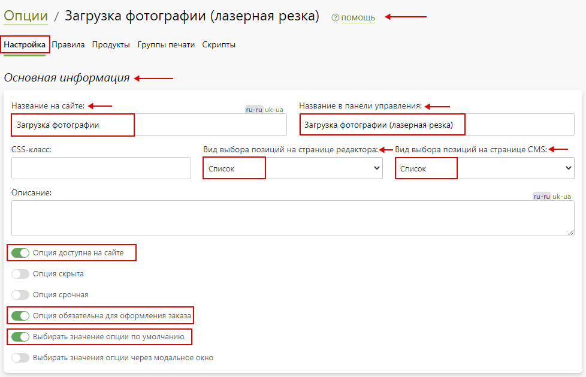
* В подразделе "__Расчет стоимости__" опции "__Загрузка фотографий (лазерная резка) / Настройка__" задать настройки:
    + "__Алгоритм расчета позиции__" – выбрать "__Цена позиции фиксированная__".
    + "__Алгоритм расчета опции__" – выбрать "__Цена опции = цена позиции + дополнительная цена позиции__".
    + "__Алгоритм расчета количества опций__" – выбрать "__Количество опций равно количеству продуктов__".
    + "__Алгоритм выбора позиций__" - выбрать "__Возможен выбор только одной позиции__".
* 
* В подразделе "__Позиции__" опции "__Загрузка фотографий (лазерная резка) / Настройка__" содержится перечень позиций созданной опции.

* Далее, нажать кнопку "__Сохранить__" и сбросить кэш сайта.
* В подразделе "__Категории и продукты__" опции "__Загрузка фотографий (лазерная резка) / Продукты__" добавить продукты нажав кнопку "__Добавить__".

* В появившемся окне выбора категории в поле поиска ввести название категории продукта, а после – выбрать нужный продукт в списке и нажать "__Выбрать__".
* 
* После, нажать кнопку "__Выбрать__".
* Затем -  нажать "__Сохранить__" и сбросить кэш сайта.

#### Позиции опции "Загрузка фотографий (лазерная резка)"
> Позиция опции дает возможность загрузки фалов необходимого формата.
* Для настройки позиции опции "__Загрузка фотографий (лазерная резка)__" перейти в карточку позиции нажав на нее. Затем, заполнить подраздел "__Основная информация__", указав:
    + "__Название на сайте__" – указать "__Выбрать файлы__".
    + "__Название в панели управления__" – указать "__Выбрать файлы__".
    + "__Позиция активна__" - необходимо включить.
    + "__Разрешить загрузку файлов к позиции__" - необходимо включить.
    + "__Загрузка файла__" - включить "__Не обязательная__".
    + "__Разрешить загрузку следующих типов файлов__" - включить нужные форматы.
* 
Затем, нажать "__Сохранить__" и сбросить кэш сайта.

## Калькулятор расчета стоимости лазерной резки
<div id="integratedCalculator" class="url-laser-cutting" style="position: relative; min-height: 150px;"></div>
<script>
    let container = document.getElementById("integratedCalculator");
    let  params = { 
            materialType: "laser-cutting-new",
        };
        let integrated = new PxpCalcManager(container, params);
</script>
<style>
    .loading-wheel:before{position:absolute;top:50%;left:50%;content:'';z-index:1112;display:block;width:32px;height:32px;margin:-16px 0 0 -16px;border:2px solid rgb(117,117,117);border-radius:50%;border-left-color:transparent;border-right-color:transparent;animation:cssload-spin 500ms infinite linear;-o-animation:cssload-spin 500ms infinite linear;-ms-animation:cssload-spin 500ms infinite linear;-webkit-animation:cssload-spin 500ms infinite linear;-moz-animation:cssload-spin 500ms infinite linear}
    .loading-wheel:after{position:absolute;top:0;left:0;bottom:0;right:0;content:'';background:#fff;z-index:1111;opacity:.9;display:block}
</style>