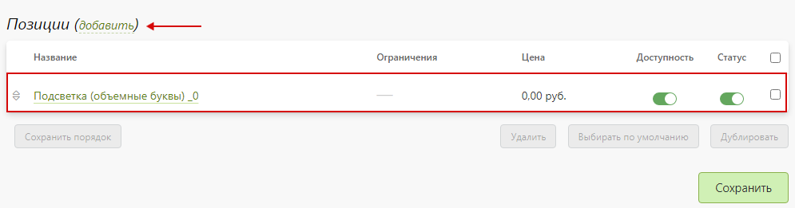
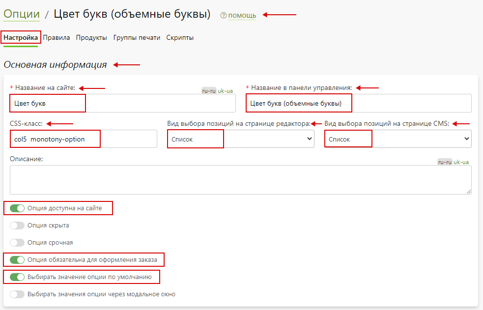
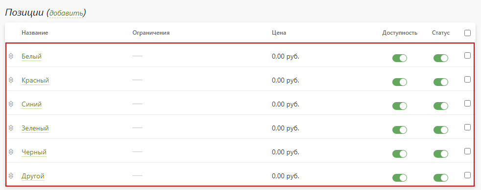
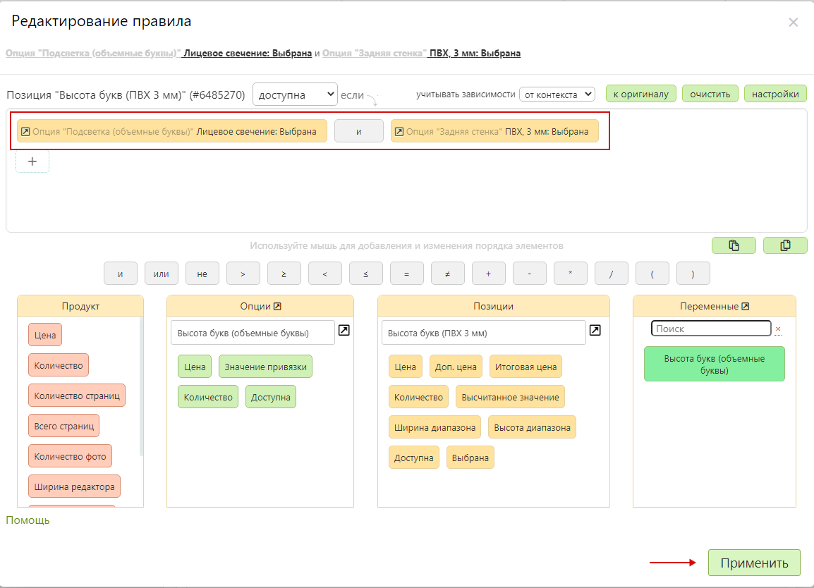
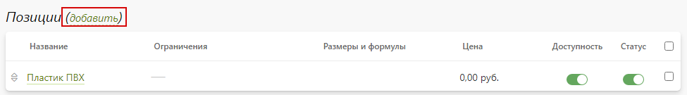
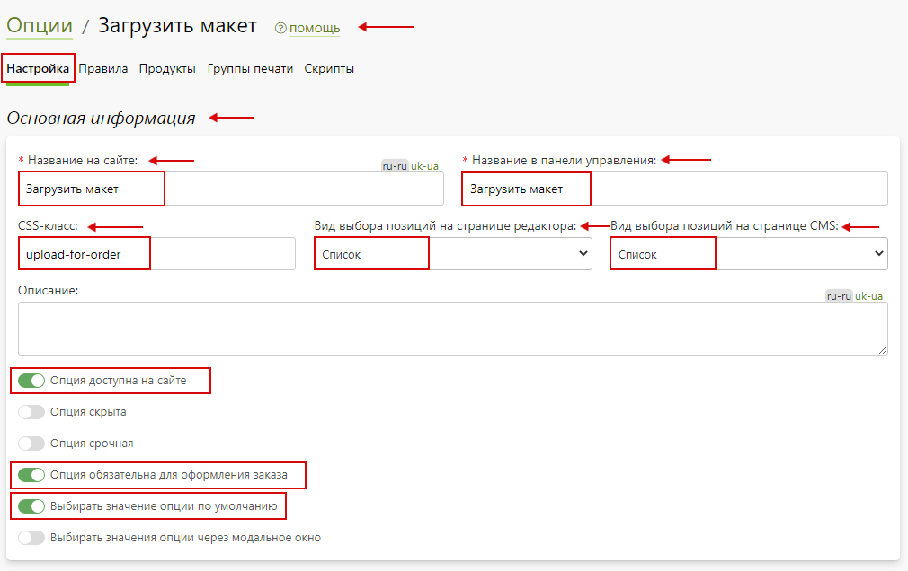

# [Объемные буквы](https://demo.pixlpark.ru/signs/letters)
## Техническое задание
* Необходимо настроить расчет стоимости изготовления объемных букв двух типов:
    - Световые.
    - Не световые.

<table class="sheet-printing" id="3d-letters">
	<thead>
		<tr>
			<th colspan="3">Характеристики объемных букв</th>
		</tr>
    </thead>
    <tbody>
		<tr>
			<td>Тип объемных букв</td>
			<td>Световые</td>
			<td>Не световые</td>
		</tr>
		<tr>
			<td rowspan="3">Подсветка</td>
			<td>Лицевое свечение</td>
			<td>-</td>
		</tr>
		<tr>
			<td>Полное свечение</td>
			<td>-</td>
		</tr>
		<tr>
			<td>С контражуром</td>
			<td>-</td>
		</tr>
		<tr>
			<td rowspan="2">Светодиодное оснащение</td>
			<td>Кластеры</td>
			<td>-</td>
		</tr>
		<tr>
			<td>Лента</td>
			<td>-</td>
		</tr>
		<tr>
			<td rowspan="6">Цвет букв</td>
			<td colspan="2">Белый</td>
		</tr>
		<tr>
			<td colspan="2">Красный</td>
		</tr>
		<tr>
			<td colspan="2">Синий</td>
		</tr>
		<tr>
			<td colspan="2">Зеленый</td>
		</tr>
		<tr>
			<td colspan="2">Черный</td>
		</tr>
		<tr>
			<td colspan="2">Другой</td>
		</tr>
		<tr>
			<td rowspan="3">Шрифтовое начертание</td>
			<td colspan="2">Прямой шрифт</td>
		</tr>
		<tr>
			<td colspan="2">С засечками</td>
		</tr>
		<tr>
			<td colspan="2">Курсив</td>
		</tr>
		<tr>
			<td rowspan="3">Лицевая поверхность</td>
			<td colspan="2">Пластик ПВХ</td>
		</tr>
		<tr>
			<td colspan="2">Оргстекло</td>
		</tr>
		<tr>
			<td>-</td>
			<td>Сталь</td>
		</tr>
		<tr>
			<td rowspan="3">Боковая поверхность</td>
			<td colspan="2">Пластик ПВХ</td>
		</tr>
		<tr>
			<td colspan="2">Оргстекло</td>
		</tr>
		<tr>
			<td>-</td>
			<td>Сталь</td>
		</tr>
		<tr>
			<td rowspan="3">Задняя поверхность</td>
			<td colspan="2">ПВХ 3 мм.</td>
		</tr>
		<tr>
			<td colspan="2">ПВХ 6 мм.</td>
		</tr>
		<tr>
			<td colspan="2">ПВХ 10 мм.</td>
		</tr>
	</tbody>
</table>

<table class="sheet-printing" id="price-light">
	<thead>
		<tr>
			<th colspan="4">Стоимость 1 см. буквы световых букв с задней поверхностью ПВХ, руб.</th>
		</tr>
		<tr>
			<th rowspan="2">Подсветка</th>
			<th colspan="3">Толщина поверхности ПВХ</th>
		</tr>
		<tr>
			<th>3 мм.</th>
			<th>6 мм.</th>
			<th>10 мм.</th>
		</tr>
    </thead>
    <tbody>
		<tr>
			<td>Лицевое свечение</td>
			<td>110</td>
			<td>127</td>
			<td>160</td>
		</tr>
		<tr>
			<td>Полное свечение</td>
			<td>135</td>
			<td>152</td>
			<td>180</td>
		</tr>
		<tr>
			<td>С контражуром</td>
			<td>98</td>
			<td>110</td>
			<td>130</td>
		</tr>
	</tbody>
</table>

<table class="sheet-printing" id="price-non-light">
	<thead>
		<tr>
			<th colspan="3">Стоимость 1 см. буквы не световых букв с задней поверхностью ПВХ, руб.</th>
		</tr>
		<tr>
			<th colspan="3">Толщина поверхности ПВХ, мм.</th>
		</tr>
		<tr>
			<th>3</th>
			<th>6</th>
			<th>9</th>
		</tr>
    </thead>
    <tbody>
		<tr>
			<td>80</td>
			<td>95</td>
			<td>100</td>
		</tr>
	</tbody>
</table>

##### Прочие надбавки
<table class="sheet-printing"  id="other-allowances">
	<thead>
		<tr>
			<th>Наименование надбавки</th>
			<th>Стоимость, руб.</th>
		</tr>
    </thead>
    <tbody>
		<tr>
			<td>Загрузка макета</td>
			<td>-</td>
		</tr>
		<tr>
			<td>Комментарий к заказу</td>
			<td>-</td>
		</tr>
		<tr>
			<td rowspan="3">Шрифтовое начертание</td>
			<td>Прямой шрифт – 0 %</td>
		</tr>
		<tr>
			<td>С засечками – 10 %</td>
		</tr>
		<tr>
			<td>Курсив – 20 %</td>
		</tr>
		<tr>
			<td rowspan="3">Высота букв в зависимости от материала лицевой поверхности</td>
			<td>ПВХ – 0</td>
		</tr>
		<tr>
			<td>Оргстекло – 50%</td>
		</tr>
		<tr>
			<td>Сталь – 150 %</td>
		</tr>
		<tr>
			<td rowspan="3">Высота букв в зависимости от материала боковой поверхности</td>
			<td>ПВХ – 0</td>
		</tr>
		<tr>
			<td>Оргстекло – 50%</td>
		</tr>
		<tr>
			<td>Сталь – 150 %</td>
		</tr>
	</tbody>
</table>

## Формула для расчета стоимости объемных букв
```	formula
Стоимость изготовления букв = стоимость объемной буквы * количество букв + стоимость лицевой поверхности + стоимость боковой поверхности + стоимость шрифтового начертания,
где
стоимость объемной буквы = высота буквы * стоимость 1 см. буквы с задней поверхностью ПВХ.
```

### Пример расчета для продукта
* Для проверки расчетов взять продукт с характеристиками согласно таблице.
| Тип продукта           | Световые буквы   |
|:----------------------:|:----------------:|
| Подсветка              | Лицевое свечение |
| Светодиодное оснащение | Лента            |
| Цвет букв              | Белый            |
| Шрифтовое начертание   | Прямой шрифт     |
| Лицевая поверхность    | Оргстекло        |
| Боковая поверхность    | Оргстекло        |
| Задняя поверхность     | ПВХ 6 мм.        |
| Текст                  | АВС              |
| Высота букв, см.       | 20               |

* Этапы расчета:
    1. Расчет стоимости объемной буквы.<br>
    Для расчета стоимости объемной буквы необходимо умножить значение введенной пользователем высоты на стоимость 1 см. буквы, определяемой [таблицей стоимости 1 см. буквы световых букв с задней поверхностью ПВХ](/calculators/letters?id=price-light) (для световых букв) / [стоимости 1 см. буквы не световых букв с задней поверхностью ПВХ](/calculators/letters?id=price-non-light) (для не световых букв):
    ```formula
		127 руб. * 20 см. = 2540 руб.
	```
    2. Расчет стоимости объемных букв.<br>
    Для расчета стоимости объемных букв необходимо умножить стоимость одной буквы из п. 1 на количество букв:
    ```formula
		2540 руб. * 3 = 7620 руб.
	```
    3. Стоимость лицевой стороны объемных букв. <br>
    Стоимость лицевой стороны определяется таблицей прочих надбавок и для материала "__Оргстекло__" составляет 50% стоимости объемной буквы:
    ```formula
		2540 руб. * 0,5 = 1270 руб.
	```
    4. Стоимость боковой стороны объемных букв.<br>
    Стоимость боковой стороны определяется таблицей прочих надбавок и для материала "__Оргстекло__" составляет 50% стоимости объемной буквы:
    ```formula
		2540 руб. * 0,5 = 1270 руб.
	```
* __Итоговая стоимость изготовления объемных букв составит:__
	```formula
	(127 руб. * 20 см.) * 3 + (127 руб. * 20 см.) * 0,5 + (127 руб. * 20 см.) * 0,5 = 10160 руб.
	```

## Создание калькулятора
* Для создания калькулятора продукта "__Объемные буквы__" в разделе "__Печать / Продукты__" нажать кнопку "__Добавить / Обновить__".

* В открывшейся карточке создания категории заполнить форму, указав:
    + "__Создать новую категорию__" - необходимо выбрать.
    + "__Название на сайте__" - указать "__Объемные буквы__".
    + "__Редактор__" – выбрать "__Редактор товаров__".
* 
* Далее, нажать "__Добавить__" для создания продукта.
* В подразделе "__Основная информация__" созданной категории продукта необходимо задать адрес в интернете латинскими буквами.

* После, нажать "__Сохранить__" и сбросить кэш сайта.
* В подразделе "__Страница категории__" раздела "__Печать / Продукты / Объемные буквы / Настройка__" выбрать страницу, на которой будет располагаться данный продукт, а также задать настройки подраздела "__Хлебные крошки__" для отображения хлебных крошек в формате "__страница-раздела__", "__страница-раздела / страница-продукта__".

* После, нажать "__Сохранить__" и сбросить кэш сайта.

### Создание продуктов категории "__Объемные буквы__"
* В подразделе "__Продукты__" раздела "__Печать / Продукты / Объемные буквы / Продукты__" добавить продукт нажав кнопку "__Добавить__".

* В открывшейся карточке создания продукта заполнить поля, указав:
    + "__Создать новый продукт с нуля__" - необходимо выбрать.
    + "__Название на сайте__" – указать "__Световые__".
* 
* Затем, нажать "__Добавить__".
* В подразделе "__Основная информация__" раздела "__Настройка__" созданного продукта задать адрес в интернете латинскими буквами и включить "__Продукт доступен на сайте__".

* В подразделе "__Тиражность__" раздела "__Настройка__" созданного продукта задать стоимость для количества от 1 до 1000 с шагом 1 шт. равной нулю.
> Стоимость равна нулю т.к. она будет сформирована при помощи опций. 
* 
* После, нажать кнопку "__Сохранить__" и сбросить кэш сайта.
* Аналогичным образом создается и настраивается оставшийся согласно [таблице характеристик объемных букв](/calculators/letters?id=3d-letters), продукт "__Несветовые__".

## Опции
* 
    + [Подсветка (объемные буквы)](/calculators/letters?id=Подсветка-объемные-буквы)
    + [Светодиодное оснащение](/calculators/letters?id=Светодиодное-оснащение)
    + [Цвет букв (объемные буквы)](/calculators/letters?id=Цвет-букв-объемные-буквы)
    + [Введите свой цвет (объемные буквы)](/calculators/letters?id=Введите-свой-цвет-объемные-буквы)
    + [Шрифтовое начертание букв](/calculators/letters?id=Шрифтовое-начертание-букв)
    + [Задняя стенка](/calculators/letters?id=Задняя-стенка)
    + [Переменная "Высота букв (объемные буквы)"](/calculators/letters?id=Переменная-quotВысота-букв-объемные-буквыquot)
    + [Высота букв (объемные буквы)](/calculators/letters?id=Высота-букв-объемные-буквы)
    + [Текст вывески (объемные буквы)](/calculators/letters?id=Текст-вывески-объемные-буквы)
    + [Расчет стоимости (объемные буквы)](/calculators/letters?id=Расчет-стоимости-объемные-буквы)
    + [Лицевая поверхность](/calculators/letters?id=Лицевая-поверхность)
    + [Боковая поверхность](/calculators/letters?id=Боковая-поверхность)
    + [Загрузить макет](/calculators/letters?id=Загрузить-макет)
    + [Комментарий к макету](/calculators/letters?id=Комментарий-к-макету)
    + [Дополнительные настройки](/calculators/letters?id=Дополнительные-настройки)

### Подсветка (объемные буквы)
> Назначение опции: определяет вид подсветки световых объемных букв.
* В разделе "__Печать / Калькуляция / Опции__" нажать кнопку "__Добавить опцию__" для создания новой опции.

    + "__Название на сайте__" - указать "__Подсветка (объемные буквы)__".
    + "__Тип опции__" - указать "__Список позиций__".
    + "__Начальное число позиций__" - указать "__1__".
* 
* Далее, нажать "__Добавить__" для создания опции.
* В подразделе "__Основная информация__" опции "__Подсветка (объемные буквы) / Настройка__" заполнить форму, указав:
    + "__Название на сайте__" – указать "__Подсветка__".
    + "__Название в панели управления__" – указать "__Подсветка (объемные буквы)__".
    + "__CSS-класс__" - указать "__col5 monotony-option__".
    + "__Вид выбора позиций на странице редактора__" и "__Вид выбора позиций на странице CMS__" - выбрать список.
    +  "__Опция доступная на сайте__" - необходимо включить.
    + "__Опция скрыта__" - необходимо включить.
    + "__Опция обязательная для оформления заказа__" - необходимо включить.
    + "__Выбирать значение опции по умолчанию__" - необходимо включить.
* 
* В подразделе "__Расчет стоимости__" опции "__Подсветка (объемные буквы) / Настройка__" задать настройки:
    + "__Алгоритм расчета позиции__" – выбрать "__Цена позиции фиксированная__".
    + "__Алгоритм расчета опции__" – выбрать "__Цена опции = цена позиции + доп. цена позиции__".
    + "__Алгоритм расчета количества опций__" – выбрать "__Количество опций равно количеству продуктов__".
    + "__Алгоритм выбора позиций__" - выбрать "__Возможен выбор только одной позиции__".
* 
* В подразделе "__Позиции__" опции "__Подсветка (объемные буквы) / Настройка__" содержится перечень позиций созданной опции.

* Далее, нажать "__Сохранить__" и сбросить кэш сайта.
* В подразделе "__Категории и продукты__" опции "__Подсветка (объемные буквы) / Продукты__" добавить продукты нажав кнопку "__Добавить__".
> В данном разделе осуществляется привязка опции к необходимым продуктам. После осуществления привязки опция будет участвовать в формировании цены продуктов.
* 
* В появившемся окне выбора категории в поле поиска ввести название категории продукта, а после – выбрать нужный продукт в списке и нажать "__Выбрать__".

* Далее, скорректировать привязку для продукта "__Световые__" категории "__Объемные буквы__".

* После, нажать кнопку "__Сохранить__" и сбросить кэш сайта.

#### Позиции опции "Подсветка (объемные буквы)"
* Для настройки позиции опции "__Подсветка (объемные буквы)__" перейти в карточку позиции нажав на нее. Затем, заполнить подраздел "__Основная информация__", указав:
    + "__Название на сайте__" – указать "__Лицевое свечение__".
    + "__Название в панели управления__" – указать "__Лицевое свечение__".
    + "__Позиция активна__" - необходимо включить.
* 
* Затем, нажать "__Сохранить__" и сбросить кэш сайта.
* Аналогичным образом настраиваются оставшиеся позиции согласно [таблице характеристик объемных букв](/calculators/letters?id=3d-letters).
> Добавить новую позицию можно при помощи "__Добавить__".
* 
> Также, позицию опции можно продублировать и скорректировать настройки в соответствии с нужными данными.
* После внесения всех данных подраздел "__Позиции__" опции "__Подсветка (объемные буквы)__" выглядит следующим образом.


### Светодиодное оснащение
> Назначение опции: определяет выбор светодиодного оснащения объемных букв.
* Опция и ее позиции настраиваются аналогично опции "__Подсветка (Объемные буквы)__". Позиции опции задают выбор светодиодного оснащения объемных букв согласно [таблице характеристик объемных букв](/calculators/letters?id=3d-letters).

### Цвет букв (объемные буквы)
> Назначение опции: позволяет выбрать цвет объемных букв.
* В разделе "__Печать / Калькуляция / Опции__" нажать кнопку "__Добавить опцию__" для создания новой опции.

* В открывшейся карточке создания опции заполнить форму, указав:
    + "__Название на сайте__" - указать "__Цвет букв__".
    + "__Тип опции__" - указать "__Список позиций__".
    + "__Начальное число позиций__" - указать "__1__".
* 
* Далее, нажать "__Добавить__" для создания опции.
* В подразделе "__Основная информация__" опции "__Цвет букв (объемные буквы) / Настройка__" заполнить форму, указав:
    + "__Название на сайте__" – указать "__Цвет букв__".
    + "__Название в панели управления__" – указать "__Цвет букв (объемные буквы)__".
    + "__CSS-класс__" - указать "__col5 monotony-option__".
    + "__Вид выбора позиций на странице редактора__" и "__Вид выбора позиций на странице CMS__" - выбрать список.
    + "__Опция доступна на сайте__" - необходимо включить.
    + "__Опция обязательная для оформления заказа__" - необходимо включить.
    + "__Выбирать значение опции по умолчанию__" - необходимо включить.
* 
* В подразделе "__Расчет стоимости__" опции "__Цвет букв (объемные буквы) / Настройка__" задать настройки:
    + "__Алгоритм расчета позиции__" – выбрать "__Цена позиции фиксированная__".
    + "__Алгоритм расчета опции__" – выбрать "__Цена опции = цена позиции + доп. цена позиции__".
    + "__Алгоритм расчета количества опций__" – выбрать "__Количество опций равно количеству продуктов__".
    + "__Алгоритм выбора позиций__" - выбрать "__Возможен выбор только одной позиции__".
* 
* В подразделе "__Позиции__" опции "__Цвет букв (объемные буквы)/ Настройка__" содержится перечень позиций созданной опции.
* 
* Далее, нажать кнопку "__Сохранить__" и сбросить кэш сайта.
* В подразделе "__Категории и продукты__" опции "__Цвет букв (объемные буквы) / Продукты__" добавить продукты нажав кнопку "__Добавить__". 

* В появившемся окне выбора категории в поле поиска ввести название категории продукта, а после – выбрать нужный продукт в списке и нажать "__Выбрать__".

* Затем, нажать "__Сохранить__" и сбросить кэш сайта.

#### Позиции опции "Цвет букв (объемные буквы)"
* Для настройки позиции опции "__Цвет букв (объемные буквы)__" перейти в карточку позиции нажав на нее. Затем, заполнить подраздел "__Основная информация__", указав:
    + "__Название на сайте__" – указать "__Белый__".
    + "__Название в панели управления__" – указать "__Белый__".
    + "__Позиция активна__" - необходимо включить.
* 
* Затем, нажать "__Сохранить__" и сбросить кэш сайта.
* Аналогичным образом настраиваются оставшиеся позиции согласно [таблице характеристик объемных букв](/calculators/letters?id=3d-letters).
> Добавить новую позицию можно при помощи "__Добавить__".
* 
> Также, позицию опции можно продублировать и скорректировать настройки в соответствии с нужными данными.
* После внесения всех данных подраздел "__Позиции__" опции "__Цвет букв (объемные буквы)__" выглядит следующим образом:


### Введите свой цвет (объемные буквы)
> Назначение опции: позволяет ввести необходимый цвет при выборе в опции "__Цвет букв (объемные буквы)__" позиции "__Другой__".
* В разделе "__Печать / Калькуляция / Опции__" нажать кнопку "__Добавить опцию__" для создания новой опции.

* В открывшейся карточке создания опции заполнить форму, указав:
    + "__Название на сайте__" - указать "__Введите свой цвет (объемные буквы)__".
    + "__Тип опции__" - указать "__Список позиций__".
    + "__Начальное число позиций__" - указать "__1__".
* 
* Далее, нажать "__Добавить__" для создания опции.
* В подразделе "__Основная информация__" опции "__Введите свой цвет (объемные буквы) / Настройка__" заполнить форму, указав:
    + "__Название на сайте__" – указать "__Введите свой цвет__".
    + "__Название в панели управления__" – указать "__Введите свой цвет (объемные буквы)__".
    + "__CSS - класс__" - указать "__comment-for-order monotony-option no-description__".
    + "__Вид выбора позиций на странице редактора__" и "__Вид выбора позиций на странице CMS__" - выбрать список.
    + "__Опция доступна на сайте__" - необходимо включить.
    +  "__Опция обязательная для оформления заказа__" - необходимо включить.
    + "__Выбирать значение опции по умолчанию__" - необходимо включить.
* 
* В подразделе "__Расчет стоимости__" опции "__Введите свой цвет (объемные буквы) / Настройка__" задать настройки:
    + "__Алгоритм расчета позиции__" – выбрать "__Цена позиции динамическая__".
    + "__Алгоритм расчета опции__" – выбрать "__Цена опции = цена позиции + доп. цена позиции__".
    + "__Алгоритм расчета количества опций__" – выбрать "__Количество опций равно количеству продуктов__".
    + "__Алгоритм выбора позиций__" - выбрать "__Возможен выбор только одной позиции__".
* 
* В подразделе "__Позиции__" опции "__Введите свой цвет (Объемные буквы) / Настройка__" содержится перечень позиций созданной опции.

* Далее, нажать кнопку "__Сохранить__" и сбросить кэш сайта.
* В подразделе "__Категории и продукты__" опции "__Введите свой цвет (объемные буквы) / Продукты__" добавить продукты нажав кнопку "__Добавить__". 

* В появившемся окне выбора категории в поле поиска ввести название категории продукта, а после – выбрать нужный продукт в списке и нажать "__Выбрать__".

* Далее, в подразделе "__Правила доступности__" опции "__Введите свой цвет (объемные буквы)__" добавить правило нажав "__Добавить__":
	```formula
	Опция "Введите свой цвет (объемные буквы)" доступна если выбрана позиция "Другой" опции "Цвет букв (объемные буквы)".
	```
* 
* Далее, нажать "__Применить__", а затем нажать кнопку "__Сохранить__" и сбросить кэш сайта.

#### Позиции опции "Введите свой цвет (объемные буквы)"
> Позиция опции позволяет пользователю ввести необходимый цвет вручную.
* Для настройки позиции опции "__Введите цвет букв (объемные буквы)__" перейти в карточку позиции нажав на нее.  Затем, заполнить подраздел "__Основная информация__", указав:
    + "__Название на сайте__" – указать "__Свой цвет__".
    + "__Название в панели управления__" – указать "__Свой цвет__".
    + "__Позиция активна__" - необходимо включить.
* 
* В подразделе "__Стоимость__" позиции опции "__Введите свой цвет (объемные буквы)__" задать способ расчета "__По тексту пользователя__" и цену "__0__" рублей за символ.

* Затем, нажать "__Сохранить__" и сбросить кэш сайта.

### Шрифтовое начертание букв
> Назначение опции: позволяет выбрать начертание букв и добавить наценку за начертание.
* В разделе "__Печать / Калькуляция / Опции__" нажать кнопку "__Добавить опцию__" для создания новой опции.

* В открывшейся карточке создания опции заполнить форму, указав:
    + "__Название на сайте__" - указать "__Шрифтовое начертание букв__".
    + "__Тип опции__" - указать "__Список позиций__".
    + "__Начальное число позиций__" - указать "__1__".
* 
* Далее, нажать "__Добавить__" для создания опции.
* В подразделе "__Основная информация__" опции "__Шрифтовое начертание букв / Настройка__" заполнить форму, указав:
    + "__Название на сайте__" – указать "__Шрифтовое начертание__".
    + "__Название в панели управления__" – указать "__Шрифтовое начертание букв__".
    + "__CSS класс__" – указать "__col5 monotony-option__".
    + "__Вид выбора позиций на странице редактора__" и "__Вид выбора позиций на странице CMS__" - выбрать список.
    + "__Опция доступна на сайте__" - необходимо включить.
    +  "__Опция обязательная для оформления заказа__" - необходимо включить.
    + "__Выбирать значение опции по умолчанию__" - необходимо включить.
* 
* В подразделе "__Расчет стоимости__" опции "__Шрифтовое начертание букв / Настройка__" задать настройки:
    + "__Алгоритм расчета позиции__" – выбрать "__Цена позиции фиксированная__".
    + "__Алгоритм расчета опции__" – выбрать "__Цена опции = цена всего продукта (с другими опциями) * на коэффициент + дополнительная цена позиции__".
    + "__Алгоритм расчета количества опций__" – выбрать "__Количество опций равно количеству продуктов__".
    + "__Алгоритм выбора позиций__" - выбрать "__Возможен выбор только одной позиции__".
* 
* В подразделе "__Позиции__" опции "__Шрифтовое начертание букв / Настройка__" содержится перечень позиций созданной опции.

* Далее, нажать кнопку "__Сохранить__" и сбросить кэш сайта.
* В подразделе "__Категории и продукты__" опции "__Шрифтовое начертание букв / Продукты__" добавить продукты нажав кнопку "__Добавить__". 

* В появившемся окне выбора категории в поле поиска ввести название категории продукта, а после – выбрать нужный продукт в списке и нажать "__Выбрать__".

* Затем, нажать кнопку "__Сохранить__" и сбросить кэш сайта.

#### Позиции опции "Шрифтовое начертание букв"
> Стоимость за шрифтовое начертание задается в соответствии с ТЗ.
* Для настройки позиции опции "__Шрифтовое начертание букв__" перейти в карточку позиции нажав на нее. Затем, заполнить подраздел "__Основная информация__", указав:
    + "__Название на сайте__" – указать "__Прямой шрифт__".
    + "__Название в панели управления__" – указать "__Прямой шрифт__".
    + "__Позиция активна__" - необходимо включить.
* 
* Затем, нажать "__Сохранить__".
* Аналогичным образом настраиваются оставшиеся позиции согласно [таблице характеристик объемных букв](/calculators/letters?id=3d-letters) и [таблице прочих надбавок](/calculators/letters?id=Прочие-надбавки).
>  Добавить новую позицию можно при помощи "__Добавить__".
* 
> Также, позицию опции можно продублировать и скорректировать настройки в соответствии с нужными данными.
* После внесения всех данных подраздел "__Позиции__" опции "__Шрифтовое начертание букв__" выглядит следующим образом:
* 

### Задняя стенка
> Назначение опции: позволяет выбрать толщину задней стенки объемных букв.
* В разделе "__Печать / Калькуляция / Опции__" нажать кнопку "__Добавить опцию__" для создания новой опции.

В открывшейся карточке создания опции заполнить форму, указав:
    + "__Название на сайте__" - указать "__Задняя стенка__".
    + "__Тип опции__" - указать "__Список позиций__".
    + "__Начальное число позиций__" - указать "__1__".
* 
* Далее, нажать "__Добавить__" для создания опции.
* В подразделе "__Основная информация__" опции "__Задняя стенка / Настройка__" заполнить форму, указав:
    + "__Название на сайте__" – указать "__Задняя стенка__".
    + "__Название в панели управления__" – указать "__Задняя стенка__".
    + "__CSS-класс__" - указать "__col5 monotony-option__".
    + "__Вид выбора позиций на странице редактора__" и "__Вид выбора позиций на странице CMS__" - выбрать список.
    + "__Опция доступна на сайте__" - необходимо включить.
    + "__Опция обязательная для оформления заказа__" - необходимо включить.
    + "__Выбирать значение опции по умолчанию__" - необходимо включить.
* 
* В подразделе "__Расчет стоимости__" опции "__Задняя стенка / Настройка__" задать настройки:
    + "__Алгоритм расчета позиции__" – выбрать "__Цена позиции фиксированная__".
    + "__Алгоритм расчета опции__" – выбрать "__Цена опции = цена позиции + доп. цена позиции__".
    + "__Алгоритм расчета количества опций__" – выбрать "__Количество опций равно количеству продуктов__".
    + "__Алгоритм выбора позиций__" - выбрать "__Возможен выбор только одной позиции__".
* 
* В подразделе "__Позиции__" опции "__Задняя стенка / Настройка__" содержится перечень позиций созданной опции.

* Далее, нажать кнопку "__Сохранить__" и сбросить кэш сайта.
* В подразделе "__Категории и продукты__" опции "__Задняя стенка / Продукты__" добавить продукты нажав кнопку "__Добавить__".

* В появившемся окне выбора категории в поле поиска ввести название категории продукта, а после – выбрать нужный продукт в списке и нажать "__Выбрать__".


#### Позиции опции "Задняя стенка"
* Для настройки позиции опции "__Задняя стенка__" перейти в карточку позиции нажав на нее. Затем, заполнить подраздел "__Основная информация__", указав:
    + "__Название на сайте__" – указать "__ПВХ, 3 мм__".
    + "__Название в панели управления__" – указать "__ПВХ, 3 мм__".
    + "__Позиция активна__" - необходимо включить.
* 
* Затем, нажать "__Сохранить__" и сбросить кэш сайта.
* Аналогичным образом настраиваются оставшиеся позиции согласно [таблице характеристик объемных букв](/calculators/letters?id=3d-letters).
>  Добавить новую позицию можно при помощи "__Добавить__".
* 
> Также, позицию опции можно продублировать и скорректировать настройки в соответствии с нужными данными.
* После внесения всех данных подраздел "__Позиции__" опции "__Задняя стенка__" выглядит следующим образом:


### Переменная "Высота букв (объемные буквы)"
> Назначение: ввод значения высоты объемных букв.
* В разделе "__Печать / Калькуляция / Переменные__" нажать кнопку "__Добавить переменную__" для создания новой переменной.

* В открывшейся карточке создания переменной заполнить форму, указав:
    + **"Уникальное имя (только латинские буквы и символ _)"** - указать **"letter_height"**.
    + "__Название__" - указать "__Высота букв (объемные буквы)__".
* 
* Далее, нажать "__Добавить__" для создания переменной.
* В подразделе "__Основная информация__" переменной "__Высота букв (объемные буквы) / Настройка__" заполнить форму, указав:
    + "__Название на сайте__" – указать "__Высота букв (см.)__".
    + "__Название в панели управления__" – указать "__Высота букв (объемные буквы)__".
    + "__Тип возвращаемого значения__" - указать "__Целое число__".
    + "__По умолчанию__" - указать "__10__".
    + "__Тип данных__" - указать "__Значение из диапазона__".
    + "__Минимальное значение__" - указать "__1__".
    + "__Максимальное значение__" - указать "__500__".
* 
* Далее, нажать кнопку "__Сохранить__" и сбросить кэш сайта.

### Высота букв (объемные буквы)
> Назначение опции: определение стоимости объемных букв в зависимости от их высоты.
* В разделе "__Печать / Калькуляция / Опции__" нажать кнопку "__Добавить опцию__" для создания новой опции.

* В открывшейся карточке создания опции заполнить форму, указав:
    + "__Название на сайте__" - указать "__Высота букв (объемные буквы)__".
    + "__Тип опции__" - указать "__Список позиций__".
    + "__Начальное число позиций__" - указать "__1__".
* 
* Далее, нажать "__Добавить__" для создания опции.
* В подразделе "__Основная информация__" опции "__Высота букв (объемные буквы) / Настройка__" заполнить форму, указав:
    + "__Название на сайте__" – указать "__Высота букв__".
    + "__Название в панели управления__" – указать "__Высота букв (объемные буквы)__".
    + "__CSS – класс__" – указать "__inline-checkbox letter-height__".
    + "__Вид выбора позиций на странице редактора__" и "__Вид выбора позиций на странице CMS__" - выбрать список.
    + "__Опция доступна на сайте__" - необходимо включить.
    + "__Опция обязательная для оформления заказа__" - необходимо включить.
    + "__Выбирать значение опции по умолчанию__" - необходимо включить.
* 
* В подразделе "__Расчет стоимости__" опции "__Высота букв (объемные буквы) / Настройка__" задать настройки:
    + "__Алгоритм расчета позиции__" – выбрать "__Цена позиции динамическая__".
    + "__Алгоритм расчета опции__" – выбрать "__Цена опции = цена позиции + дополнительная цена позиции__".
    + "__Алгоритм расчета количества опций__" – выбрать "__Количество опций равно количеству продуктов__".
    + "__Алгоритм выбора позиций__" - выбрать "__Возможен выбор только одной позиции__".
* 
* В подразделе "__Позиции__" опции "__Высота букв (объемные буквы) / Настройка__" содержится перечень позиций созданной опции.

* Далее, нажать кнопку "__Сохранить__" и сбросить кэш сайта.
* В подразделе "__Категории и продукты__" опции "__Высота букв (объемные буквы) / Продукты__" добавить продукты нажав кнопку "__Добавить__". 

* В появившемся окне выбора категории в поле поиска ввести название категории продукта, а после – выбрать нужный продукт в списке и нажать "__Выбрать__".

* Далее, нажать кнопку "__Сохранить__" и сбросить кэш сайта.

#### Позиции опции "Высота букв (объемные буквы)"
* Для настройки позиции опции "__Высота букв (объемные буквы)__" перейти в карточку позиции нажав на нее. Затем, заполнить подраздел "__Основная информация__", указав:
    + "__Название на сайте__" – указать "__Высота букв__".
    + "__Название в панели управления__" – указать "__Высота букв (ПВХ 3 мм)__".
    + "__Позиция активна__" - необходимо включить.
* 
* Затем, нажать "__Сохранить__" и сбросить кэш сайта.
* В подразделе "__Ограничения__" позиции опции "__Высота букв (объемные буквы)__" включить "__Ограничить позицию следующими категориями раздела "Печать"__" и выбрать категории печати нажав "__Выбрать__":
    + Световые.
* 
* Затем, нажать "__Сохранить__".
* В подразделе "__Правила доступности__" позиции опции "__Высота букв (объемные буквы)__" добавить правило, нажав "__Добавить__":
	```formula
    Позиция опции доступна если выбраны позиция "Лицевое свечение" опции "Подсветка (объемные буквы)" и позиция "ПВХ, 3 мм" опции "Задняя стенка".
	```
* 
* Затем, нажать "__Применить__".
* В подразделе "__Стоимость__" позиции опции "__Высота букв (объемные буквы)__" задать способ расчета цены "__По формуле__". Затем, в поле "__Формула для цены__" задать формулу для расчета высоты букв:
	```formula
    Переменная "Высота букв (объемные буквы)" * 110
	```
* Затем, нажать "__Применить__", а после "__Сохранить__" и сбросить кэш сайта.
* Аналогичным образом создаются и настраиваются оставшиеся позиции согласно [таблице стоимости 1 см. буквы световых букв с задней поверхностью ПВХ](/calculators/letters?id=price-light).
> Добавить новую позицию можно при помощи "__Добавить__".
* 
> Также, позицию опции можно продублировать и скорректировать настройки в соответствии с нужными данными.
* После внесения позиции подраздел "__Позиции__" опции "__Высота букв (объемные буквы)__" выглядит следующим образом:


### Текст вывески (объемные буквы)
> Назначение опции: позволяет ввести текст объемных букв.
* В разделе "__Печать / Калькуляция / Опции__" нажать кнопку "__Добавить опцию__" для создания новой опции.

В открывшейся карточке создания опции заполнить форму, указав:
    + "__Название на сайте__" - указать "__Текст вывески (объемные буквы)__".
    + "__Тип опции__" - указать "__Список позиций__".
    + "__Начальное число позиций__" - указать "__1__".
* 
* Далее, нажать "__Добавить__" для создания опции.
* В подразделе "__Основная информация__" опции "__Текст вывески (объемные буквы) / Настройка__" заполнить форму, указав:
    + "__Название на сайте__" – указать "__Текст вывески__".
    + "__Название в панели управления__" – указать "__Текст вывески (объемные буквы)__".
    + "__CSS - класс__" - указать "__comment-for-order monotony-option no-description__".
    + "__Вид выбора позиций на странице редактора__" и "__Вид выбора позиций на странице CMS__" - выбрать список.
    + "__Опция доступна на сайте__" - необходимо включить.
    + "__Опция обязательная для оформления заказа__" - необходимо включить.
    + "__Выбирать значение опции по умолчанию__" - необходимо включить.
* 
* В подразделе "__Расчет стоимости__" опции "__Текст вывески (объемные буквы) / Настройка__" задать настройки:
    + "__Алгоритм расчета позиции__" – выбрать "__Цена позиции динамическая__".
    + "__Алгоритм расчета опции__" – выбрать "__Цена опции = количество продуктов * цена позиции + доп. цена позиции__".
    + "__Алгоритм расчета количества опций__" – выбрать "__Количество опций равно количеству продуктов__".
    + "__Алгоритм выбора позиций__" - выбрать "__Возможен выбор только одной позиции__".
* 
* В подразделе "__Позиции__" опции "__Текст вывески (объемные буквы) / Настройка__" содержится перечень позиций созданной опции.

* Далее, нажать кнопку "__Сохранить__" и сбросить кэш сайта.
* В подразделе "__Категории и продукты__" опции "__Текст вывески (объемные буквы) / Продукты__" добавить продукты нажав кнопку "__Добавить__".
* 
* В появившемся окне выбора категории в поле поиска ввести название категории продукта, а после – выбрать нужный продукт в списке и нажать "__Выбрать__".

* Затем нажать кнопку "__Сохранить__" и сбросить кэш сайта.

#### Позиции опции "Текст вывески (объемные буквы)"
* Для настройки позиции опции "__Текст вывески (объемные буквы)__" перейти в карточку позиции нажав на нее. Затем, заполнить подраздел "__Основная информация__", указав:
    + "__Название на сайте__" – указать "__Надпись__".
    + "__Название в панели управления__" – указать "__Надпись__".
    + "__Позиция активна__" - необходимо включить.
* 
* В подразделе "__Стоимость__" позиции опции "__Текст вывески (объемные буквы)__" задать способ расчета "__По тексту пользователя__" и цену "__1__" рубль за символ.

* Затем, нажать "__Сохранить__" и сбросить кэш сайта.
* После внесения данных подраздел "__Позиции__" опции "__Текст вывески (объемные буквы)__" выглядит следующим образом:


### Расчет стоимости (объемные буквы)
> Назначение опции: расчет стоимости объемных букв.
* В разделе "__Печать / Калькуляция / Опции__" нажать кнопку "__Добавить опцию__" для создания новой опции.

* В открывшейся карточке создания опции заполнить форму, указав:
    + "__Название на сайте__" - указать "__Расчет стоимости (объемные буквы)__".
    + "__Тип опции__" - указать "__Список позиций__".
    + "__Начальное число позиций__" - указать "__1__".
* 
* Далее, нажать "__Добавить__" для создания опции.
* В подразделе "__Основная информация__" опции "__Расчет стоимости (объемные буквы) / Настройка__" заполнить форму, указав:
    + "__Название на сайте__" – указать "__Расчет стоимости__".
    + "__Название в панели управления__" – указать "__Расчет стоимости (объемные буквы)__".
    + "__CSS – класс__" – указать **"col5 monotony-option"**.
    + "__Вид выбора позиций на странице редактора__" и "__Вид выбора позиций на странице CMS__" - выбрать список.
    + "__Опция доступна на сайте__" - необходимо включить.
    + "__Опция скрыта__" - необходимо включить.
    + "__Опция обязательная для оформления заказа__" - необходимо включить.
    + "__Выбирать значение опции по умолчанию__" - необходимо включить.
* 
* В подразделе "__Расчет стоимости__" опции "__Расчет стоимости (объемные буквы) / Настройка__" задать настройки:
    + "__Алгоритм расчета позиции__" – выбрать "__Цена позиции динамическая__".
    + "__Алгоритм расчета опции__" – выбрать "__Цена опции = цена позиции + дополнительная цена позиции__".
    + "__Алгоритм расчета количества опций__" – выбрать "__Количество опций равно количеству продуктов__".
    + "__Алгоритм выбора позиций__" - выбрать "__Возможен выбор только одной позиции__".
* 
* В подразделе "__Позиции__" опции "__Расчет стоимости (объемные буквы) / Настройка__" содержится перечень позиций созданной опции.

* Далее, нажать кнопку "__Сохранить__" и сбросить кэш сайта.
* В подразделе "__Категории и продукты__" опции "__Расчет стоимости (объемных букв) / Продукты__" добавить продукты нажав кнопку "__Добавить__". 

* В появившемся окне выбора категории в поле поиска ввести название категории продукта, а после – выбрать нужный продукт в списке и нажать "__Выбрать__".

* Далее, нажать кнопку "__Сохранить__" и сбросить кэш сайта.

#### Позиции опции "Расчет стоимости (объемные буквы)"
* Для настройки позиции опции "__Расчет стоимости (объемные буквы)__" перейти в карточку позиции нажав на нее. Затем, заполнить подраздел "__Основная информация__", указав:
    + "__Название на сайте__" – указать "__Расчет стоимости__".
    + "__Название в панели управления__" – указать "__Расчет стоимости__".
    + "__Позиция активна__" - необходимо включить.
* 
* Затем, нажать "__Сохранить__" и сбросить кэш сайта.
* В подразделе "__Стоимость__" позиции опции "__Расчет стоимости (объемные буквы)__" задать способ расчета цены "__По формуле__". Затем, в поле "__Формула для цены__" задать формулу для расчета стоимости:
	```formula
        (Цена опции "Высота букв (объемные буквы)" * цена опции "Текст вывески (объемные буквы))" - цена опции "Высота букв (объемные буквы)" - цена опции "Текст вывески (объемные буквы)"
	```
> Вычитание стоимости высоты букв и текста вывески происходит т.к. эти значения прибавляются за счет созданных и привязанных к продукту опций.
* 
* Затем, нажать "__Применить__", а после "__Сохранить__" и сбросить кэш сайта.

### Лицевая поверхность
> Назначение опции: добавляет стоимость лицевой поверхности объемных букв.
* В разделе "__Печать / Калькуляция / Опции__" нажать кнопку "__Добавить опцию__" для создания новой опции.

* В открывшейся карточке создания опции заполнить форму, указав:
    + "__Название на сайте__" - указать "__Лицевая поверхность__".
    + "__Тип опции__" - указать "__Список позиций__".
    + "__Начальное число позиций__" - указать "__1__".
* 
* Далее, нажать "__Добавить__" для создания опции.
* В подразделе "__Основная информация__" опции "__Лицевая поверхность / Настройка__" заполнить форму, указав:
    + "__Название на сайте__" – указать "__Лицевая поверхность__".
    + "__Название в панели управления__" – указать "__Лицевая поверхность__".
    + "__CSS – класс__" – указать **"col5 monotony-option"**.
    + "__Вид выбора позиций на странице редактора__" и "__Вид выбора позиций на странице CMS__" - выбрать список.
    + "__Опция доступна на сайте__" - необходимо включить.
    + "__Опция обязательная для оформления заказа__" - необходимо включить.
    + "__Выбирать значение опции по умолчанию__" - необходимо включить.
* 
* В подразделе "__Расчет стоимости__" опции "__Лицевая поверхность / Настройка__" задать настройки:
    + "__Алгоритм расчета позиции__" – выбрать "__Цена позиции динамическая__".
    + "__Алгоритм расчета опции__" – выбрать "__Цена опции = количество продуктов * цена позиции + дополнительная цена позиции__".
    + "__Алгоритм расчета количества опций__" – выбрать "__Количество опций равно количеству продуктов__".
    + "__Алгоритм выбора позиций__" - выбрать "__Возможен выбор только одной позиции__".
* 
* В подразделе "__Позиции__" опции "__Лицевая поверхность / Настройка__" содержится перечень позиций созданной опции.

* Далее, нажать кнопку "__Сохранить__" и сбросить кэш сайта.
* В подразделе "__Категории и продукты__" опции "__Лицевая поверхность / Продукты__" добавить продукты нажав кнопку "__Добавить__". 

* В появившемся окне выбора категории в поле поиска ввести название категории продукта, а после – выбрать нужный продукт в списке и нажать "__Выбрать__".

* Далее, нажать кнопку "__Сохранить__" и сбросить кэш сайта.

#### Позиции опции "Лицевая поверхность"
* Для настройки позиции опции "__Лицевая поверхность__" перейти в карточку позиции нажав на нее. Затем, заполнить подраздел "__Основная информация__", указав:
    + "__Название на сайте__" – указать "__Пластик ПВХ__".
    + "__Название в панели управления__" – указать "__Пластик ПВХ__".
    + "__Позиция активна__" - необходимо включить.
* 
* Затем, нажать "__Сохранить__" и сбросить кэш сайта.
* В подразделе "__Стоимость__" позиции опции "__Лицевая поверхность__" задать способ расчета цены "__По фиксированным размерам__". 

* Затем, нажать "__Применить__", а после "__Сохранить__" и сбросить кэш сайта.
* Аналогичным образом создаются и настраиваются оставшиеся позиции согласно [таблице прочих надбавок](/calculators/letters?id=Прочие-надбавки).
> Добавить новую позицию можно при помощи "__Добавить__".
* 
> Также, позицию опции можно продублировать и скорректировать настройки в соответствии с нужными данными.
* После внесения позиции подраздел "__Позиции__" опции "__Лицевая поверхность__" выглядит следующим образом:


### Боковая поверхность
> Назначение опции: добавляет стоимость боковой поверхности.
* Опция и ее позиции настраиваются аналогично опции "__Лицевая поверхность__". Позиции опции задают стоимость согласно [таблице прочих надбавок](/calculators/letters?id=Прочие-надбавки) для высоты букв, в зависимости от материала боковой поверхности.

### Загрузить макет
> Назначение опции: добавляет загрузить макет объемных букв.
* В разделе "__Печать / Калькуляция / Опции__" нажать кнопку "__Добавить опцию__" для создания новой опции.

* В открывшейся карточке создания опции заполнить форму, указав:
    + "__Название на сайте__" - указать "__Загрузить макет__".
    + "__Тип опции__" - указать "__Список позиций__".
    + "__Начальное число позиций__" - указать "__1__".
* 
* Далее, нажать "__Добавить__" для создания опции.
* В подразделе "__Основная информация__" опции "__Загрузить макет / Настройка__" заполнить форму, указав:
    + "__Название на сайте__" – указать "__Загрузить макет__".
    + "__Название в панели управления__" – указать "__Загрузить макет__".
    + "__CSS-класс__" - указать "__upload-for-order__".
    + "__Вид выбора позиций на странице редактора__" и "__Вид выбора позиций на странице CMS__" - выбрать список.
    + "__Опция доступная на сайте__" - необходимо включить.
    + "__Опция обязательная для оформления заказа__" - необходимо включить.
    + "__Выбирать значение опции по умолчанию__" - необходимо включить.
* 
* В подразделе "__Расчет стоимости__" опции "__Загрузить макет / Настройка__" задать настройки:
    + "__Алгоритм расчета позиции__" – выбрать "__Цена позиции фиксированная__".
    + "__Алгоритм расчета опции__" – выбрать "__Цена опции = цена позиции + доп. цена позиции__".
    + "__Алгоритм расчета количества опций__" – выбрать "__Количество опций равно количеству продуктов__".
    + "__Алгоритм выбора позиций__" - выбрать "__Возможен выбор только одной позиции__".
* 
* В подразделе "__Позиции__" опции "__Загрузить макет / Настройка__" содержится перечень позиций созданной опции.

* Далее, нажать кнопку "__Сохранить__" и сбросить кэш сайта.
* В подразделе "__Категории и продукты__" опции "__Загрузить макет / Продукты__" добавить продукты нажав кнопку "__Добавить__". 

* В появившемся окне выбора категории в поле поиска ввести название категории продукта, а после – выбрать нужный продукт в списке и нажать "__Выбрать__".

* После, нажать кнопку "__Сохранить__" и сбросить кэш сайта.

#### Позиции опции "Загрузить макет"
> Позиция опции дает возможность загрузки файлов необходимого формата.
* Для настройки позиции опции "__Загрузить макет__" перейти в карточку позиции нажав на нее. Затем, заполнить подраздел "__Основная информация__", указав:
    + "__Название на сайте__" – указать "__Загрузить макет__".
    + "__Название в панели управления__" – указать "__Загрузить макет__".
    + "__Позиция активна__" - необходимо включить.
    + "__Разрешить загрузку файла к позиции__" - необходимо включить.
    + "__Загрузка файла__" - включить "__Не обязательна__".
    + "__Разрешить загрузку следующих типов файлов__" - включить нужные форматы.

* Затем, нажать "__Сохранить__" и сбросить кэш сайта.

### Комментарий к макету
> Назначение опции: позволяет добавить комментарий к макету для объемных букв.
* В разделе "__Печать / Калькуляция / Опции__" нажать кнопку "__Добавить опцию__" для создания новой опции.

* В открывшейся карточке создания опции заполнить форму, указав:
    + "__Название на сайте__" - указать "__Комментарий к макету__".
    + "__Тип опции__" - указать "__Список позиций__".
    + "__Начальное число позиций__" - указать "__1__".
* 
Далее, нажать "__Добавить__" для создания опции.
В подразделе "__Основная информация__" опции "__Комментарий к макету / Настройка__" заполнить форму, указав:
    + "__Название на сайте__" – указать "__Комментарий к макету__".
    + "__Название в панели управления__" – указать "__Комментарий к макету__".
    + "__CSS-класс__" - указать "__comment-for-order monotony-option no-description__".
    + "__Вид выбора позиций на странице редактора__" и "__Вид выбора позиций на странице CMS__" - выбрать список.
    +  "__Опция доступная на сайте__" - необходимо включить.
    + "__Опция обязательная для оформления заказа__" - необходимо включить.
    + "__Выбирать значение опции по умолчанию__" - необходимо включить.
* 
* В подразделе "__Расчет стоимости__" опции "__Комментарий к макету / Настройка__" задать настройки:
    + "__Алгоритм расчета позиции__" – выбрать "__Цена позиции динамическая__".
    + "__Алгоритм расчета опции__" – выбрать "__Цена опции = цена позиции + доп. цена позиции__".
    + "__Алгоритм расчета количества опций__" – выбрать "__Количество опций равно количеству продуктов__".
    + "__Алгоритм выбора позиций__" - выбрать "__Возможен выбор только одной позиции__".
* 
* В подразделе "__Позиции__" опции "__Комментарий к макету / Настройка__" содержится перечень позиций созданной опции.

* Далее, нажать кнопку "__Сохранить__" и сбросить кэш сайта.
* В подразделе "__Категории и продукты__" опции "__Комментарий к макету / Продукты__" добавить продукты нажав кнопку "__Добавить__". 

* В появившемся окне выбора категории в поле поиска ввести название категории продукта, а после – выбрать нужный продукт в списке и нажать "__Выбрать__".

* После, нажать кнопку "__Сохранить__" и сбросить кэш сайта.

#### Позиции опции "Комментарий к макету"
* Для настройки позиции опции "__Комментарий к макету__" перейти в карточку позиции нажав на нее. Затем, заполнить подраздел "__Основная информация__", указав:
    + "__Название на сайте__" – указать "__Комментарий к макету__".
    + "__Название в панели управления__" – указать "__Комментарий к макету__".
    + "__Позиция активна__" - необходимо включить.
    + "__Разрешить загрузку файла к позиции__" - необходимо включить.
* 
* Затем, нажать "__Сохранить__" и сбросить кэш сайта.
* В подразделе "__Стоимость__" опции "__Комментарий к макету__" задать способ расчета "__По тексту пользователя__" и цену "__0__" рублей за символ.

* Затем, нажать "__Сохранить__" и сбросить кэш сайта.

### Дополнительные настройки
* В настройках калькулятора есть опции, которые должны осуществлять надбавку к стоимости в зависимости от цены продукта с учетом всех опций. По этой причине для корректного расчета необходимо расположить настроенные опции в следующем порядке:
    + Подсветка (объемные буквы).
    + Светодиодное оснащение (объемные буквы).
    + Цвет букв (объемные буквы).
    + Введите свой цвет (объемные буквы).
    + Шрифтовое начертание (объемные буквы).
    + Задняя стенка.
    + Высота букв (объемные буквы).
    + Текст вывески (объемные буквы).
    + Расчет стоимости (объемные буквы).
    + Лицевая поверхность.
    + Боковая поверхность.
    + Загрузить макет.
    + Комментарий к макету.

## Калькулятор расчета стоимости объемных букв
<div id="integratedCalculator" class="url-letters" style="position: relative; min-height: 150px;"></div>
<script>
    let container = document.getElementById("integratedCalculator");
    let params = { 
            materialType: "letters",
        };
    let integrated = new PxpCalcManager(container, params);
    if(window.innerWidth<=800) {
	window.onCompleteLoadPxpCalc = (calc) => {
      calc.totalPriceCalculator.stickyBlock.isEnable(false);
      calc.totalPriceCalculator.stickyBlock.isEnable.subscribe(val=>{
      calc.totalPriceCalculator.stickyBlock.isEnable(false)});
    }}
</script>