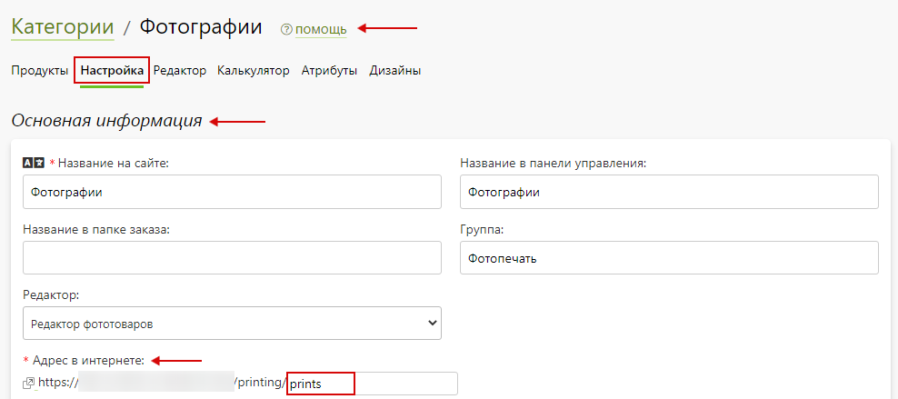
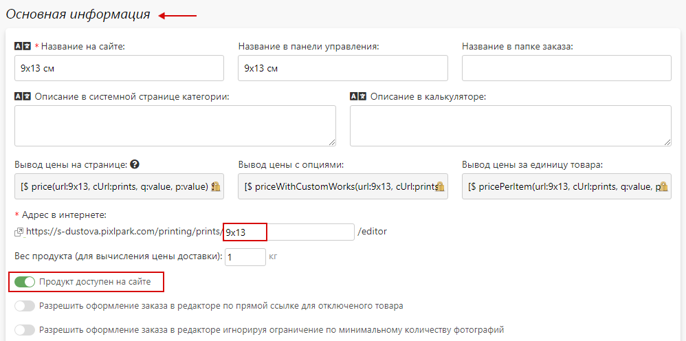

# [Печать по прайсу](https://demo.pixlpark.ru/photos/prints)
## Техническое задание
* Необходимо настроить расчет стоимости печати фотографий для форматов:
    + 9 x 13.
    + 10 x 15.
    + 13 x 18.
    + 15 x 21.
    + 20 x 30.

<table class="sheet-printing" id="price-printing">
	<thead>
		<tr>
			<th colspan="7">Стоимость печати фотографий в зависимости от тиражности</th>
		</tr>
		<tr>
			<th colspan="2">Формат фотопечати</th>
			<th>9 x 13</th>
			<th>10 х 15</th>
			<th>13 x 18</th>
			<th>15 x 21</th>
			<th>20 x 30</th>
		</tr>
    </thead>
    <tbody>  
		<tr>
			<td rowspan="12">Тиражность</td>
			<td>1 - 100</td>
			<td>23</td>
			<td>23</td>
			<td>34</td>
			<td>-</td>
			<td>-</td>
		</tr>
		<tr>
			<td>101 - 300</td>
			<td>20</td>
			<td>20</td>
			<td>30</td>
			<td>-</td>
			<td>-</td>
		</tr>
		<tr>
			<td>301 - 500</td>
			<td>17</td>
			<td>17</td>
			<td>26</td>
			<td>-</td>
			<td>-</td>
		</tr>
		<tr>
			<td>501 - 10000</td>
			<td>14</td>
			<td>14</td>
			<td>23</td>
			<td>-</td>
			<td>-</td>
		</tr>
		<tr>
			<td>1 - 50</td>
			<td>-</td>
			<td>-</td>
			<td>-</td>
			<td>45</td>
			<td>-</td>
		</tr>
		<tr>
			<td>51 - 100</td>
			<td>-</td>
			<td>-</td>
			<td>-</td>
			<td>39</td>
			<td>-</td>
		</tr>
		<tr>
			<td>101 - 200</td>
			<td>-</td>
			<td>-</td>
			<td>-</td>
			<td>33</td>
			<td>-</td>
		</tr>
		<tr>
			<td>201 - 10000</td>
			<td>-</td>
			<td>-</td>
			<td>-</td>
			<td>28</td>
			<td>-</td>
		</tr>
		<tr>
			<td>1 - 10</td>
			<td>-</td>
			<td>-</td>
			<td>-</td>
			<td>-</td>
			<td>90</td>
		</tr>
		<tr>
			<td>11 - 30</td>
			<td>-</td>
			<td>-</td>
			<td>-</td>
			<td>-</td>
			<td>77</td>
		</tr>
		<tr>
			<td>31 - 50</td>
			<td>-</td>
			<td>-</td>
			<td>-</td>
			<td>-</td>
			<td>64</td>
		</tr>
		<tr>
			<td>51 - 10000</td>
			<td>-</td>
			<td>-</td>
			<td>-</td>
			<td>-</td>
			<td>51</td>
		</tr>
	</tbody>
</table>

##### Прочие надбавки
<table class="sheet-printing" id="price-printing-allowance">
	<thead>
		<tr>
			<th colspan="2">Наименование надбавки</th>
			<th>Стоимость, руб.</th>
		</tr>
    </thead>
    <tbody>
		<tr>
			<td rowspan="3">Тип бумаги</td>
			<td>Матовая</td>
			<td>-</td>
		</tr>
		<tr>
			<td>Глянцевая</td>
			<td>-</td>
		</tr>
		<tr>
			<td>Шелк</td>
			<td>-</td>
		</tr>
		<tr>
			<td rowspan="3">Срочность исполнения</td>
			<td>3 дня</td>
			<td>-</td>
		</tr>
		<tr>
			<td>24 часа</td>
			<td>-</td>
		</tr>
		<tr>
			<td>2 часа</td>
			<td>50%</td>
		</tr>
	</tbody>
</table>

## Формула для расчета стоимости печати фотографий
```	formula
Стоимость печати фотографий = стоимость печати фотографии * количество фотографий + (стоимость печати фотографии * количество фотографий * надбавка за срочность изготовления).
```

### Пример расчета для продукта
* Для проверки расчетов взять продукт с характеристиками согласно таблице.

| Формат продукта         | 10 х 15                 |
|:-----------------------:|:-----------------------:|
| Количество              | 10                      |
| Тип бумаги              | Глянцевая               |
| Срочность исполнения    | 2 часа                  |
* Этапы расчета:
    1. Расчет стоимости печати
        + Стоимость печати листа определяется [таблицей стоимости печати фотографий в зависимости от тиражности](/calculators/price-printing?id=price-printing) технического задания. Указанное количество страниц попадает в диапазон от 1 до 100 штук, следовательно, стоимость печати одной фотографии формата 10 х 15 равна 23 рубля. Для расчета стоимости печати необходимо умножить стоимость печати 1 фотографии на количество фотографий:
        ``` formula
		23 руб. * 10 шт. = 230 руб.
		```
    2. Расчёт надбавки за срочность печати
        + Величина надбавки за срочность печати определяется [таблицей прочих надбавок](/calculators/price-printing?id=price-printing-allowance) и для значения "__2 часа__" составляет 50%. Для определения суммы надбавки необходимо умножить стоимость печати фотографий из п. 1 на 50%.
        ``` formula
		230 руб. * 50/100 = 115 руб.
		```
* __Итоговая стоимость печати фотографий составит:__
	``` formula
	23 руб. * 10 + (23 руб. * 10 * 50 / 100) = 345 руб.
	```

## Создание калькулятора
* Для создания калькулятора продукта "__Фотографии__" в разделе "__Печать / Продукты__" нажать кнопку "__Добавить / Обновить__".

* В открывшейся карточке создания категории заполнить форму, указав:
	+ "__Создать новую категорию__"- необходимо выбрать.
	+ "__Название на сайте__" - указать "__Фотографии__".
	+ "__Редактор__" – выбрать "__Редактор фотопечати__".
* 
* Далее, нажать "__Добавить__" для создания продукта.
* В подразделе "__Основная информация__" созданной категории продукта необходимо задать адрес в интернете латинскими буквами.

* После, нажать "__Сохранить__" и сбросить кэш сайта.
* В подразделе "__Страница категории__" раздела "__Печать / Продукты / Фотографии / Настройка__" выбрать страницу, на которой будет располагаться данный продукт, а также задать настройки подраздела "__Хлебные крошки__" для отображения хлебных крошек в формате "__страница-раздела__", "__страница-раздела / страница-продукта__".

* После, нажать "__Сохранить__" и сбросить кэш сайта.

### Создание продуктов категории "Фотографии"
* В подразделе "__Продукты__" раздела "__Печать / Продукты / Фотографии / Продукты__" добавить продукт нажав "__Добавить__". 

* В открывшейся карточке создания продукта заполнить поля, указав:
	+ "__Создать новый продукт с нуля__" - необходимо выбрать.
	+ "__Название на сайте__" – указать "__9 x 13 см__".
* 
* Затем, нажать "__Добавить__".
* В подразделе "__Основная информация__" раздела "__Настройка__" созданного продукта задать адрес в интернете латинскими буквами и включить "__Продукт доступен на сайте__".

* В подразделе "__Тиражность__" раздела "__Настройка__" созданного продукта выбрать "__Произвольные тиражи__" и задать стоимость в соответствии с [таблицей стоимости печати фотографий в зависимости от тиражности](/calculators/price-printing?id=price-printing) для формата фотопечати 9 х 13:
* 
* После, нажать "__Сохранить__" и сбросить кэш сайта.
> Добавить графы для тиражности можно при помощи "__Добавить__".
* 
* Аналогичным образом создаются и настраиваются оставшиеся согласно таблице продукты.

<table class="sheet-printing">
	<thead>
		<tr>
			<th colspan="2">Формат фотопечати</th>
			<th>10 x 15</th>
			<th>13 x 18</th>
			<th>15 x 21</th>
			<th>20 x 30</th>
		</tr>
    </thead>
    <tbody>
		<tr>
			<td rowspan="13">Тиражность</td>
			<td>1 - 100</td>
			<td>23</td>
			<td>34</td>
			<td>-</td>
			<td>-</td>
		</tr>
		<tr>
			<td>101 - 300</td>
			<td>20</td>
			<td>30</td>
			<td>-</td>
			<td>-</td>
		</tr>
		<tr>
			<td>301 - 500</td>
			<td>17</td>
			<td>26</td>
			<td>-</td>
			<td>-</td>
		</tr>
		<tr>
			<td>501 - 10000</td>
			<td>14</td>
			<td>23</td>
			<td>-</td>
			<td>-</td>
		</tr>
		<tr>
			<td>1 - 50</td>
			<td>-</td>
			<td>-</td>
			<td>45</td>
			<td>-</td>
		</tr>
		<tr>
			<td>51 - 100</td>
			<td>-</td>
			<td>-</td>
			<td>39</td>
			<td>-</td>
		</tr>
		<tr>
			<td>101 - 200</td>
			<td>-</td>
			<td>-</td>
			<td>33</td>
			<td>-</td>
		</tr>
		<tr>
			<td>201 - 10000</td>
			<td>-</td>
			<td>-</td>
			<td>33</td>
			<td>-</td>
		</tr>
		<tr>
			<td>1 - 10</td>
			<td>-</td>
			<td>-</td>
			<td>-</td>
			<td>90</td>
		</tr>
		<tr>
			<td>11 - 30</td>
			<td>-</td>
			<td>-</td>
			<td>-</td>
			<td>77</td>
		</tr>
		<tr>
			<td>31 - 50</td>
			<td>-</td>
			<td>-</td>
			<td>-</td>
			<td>64</td>
		</tr>
		<tr>
			<td>51 - 10000</td>
			<td>-</td>
			<td>-</td>
			<td>-</td>
			<td>51</td>
		</tr>
	</tbody>
</table>

* После внесения всех продуктов раздел выглядит следующим образом:
* 

## Опции для печати фотографий

*   
    + [Тип бумаги (фотопечать)](/calculators/price-printing?id=Тип-бумаги-фотопечать)
    + [Срок исполнения (фотографии)](/calculators/price-printing?id=Срок-исполнения-фотографии)

### Тип бумаги (фотопечать)
> Назначение опции: определение типа бумаги для фотопечати.
* В разделе "__Печать / Калькуляция / Опции__" нажать кнопку "__Добавить опцию__" для создания новой опции.

* В открывшейся карточке создания опции заполнить форму, указав:
    + "__Название на сайте__" - указать "__Тип бумаги (фотопечать)__".
    + "__Тип опции__" - указать "__Список позиций__".
    + "__Начальное число позиций__" - указать "__1__".
* 
* Далее, нажать "__Добавить__" для создания опции.
* В подразделе "__Основная информация__" опции "__Тип бумаги (фотопечать) / Настройка__" заполнить форму, указав:
    + "__Название на сайте__" – указать "__Тип бумаги__".
    + "__Название в панели управления__" – указать "__Тип бумаги (фотопечать)__".
    + "__CSS-класс__" - указать "__col5 col-cena no-description__".
    + "__Вид выбора позиций на странице редактора__" и "__Вид выбора позиций на странице CMS__" - выбрать список.
    + "__Опция доступная на сайте__" - необходимо включить.
    + "__Опция обязательная для оформления заказа__" - необходимо включить.
    + "__Выбирать значение опции по умолчанию__" - необходимо включить.
* 
* В подразделе "__Расчет стоимости__" опции "__Тип бумаги (фотопечать) / Настройка__" задать настройки:
    + "__Алгоритм расчета позиции__" – выбрать "__Цена позиции фиксированная__".
    + "__Алгоритм расчета опции__" – выбрать "__Цена опции = количество продуктов * цена позиции + дополнительная цена позиции__".
    + "__Алгоритм расчета количества опций__" – выбрать "__Количество опций равно количеству продуктов__".
    + "__Алгоритм выбора позиций__" - выбрать "__Возможен выбор только одной позиции__".
* 
* В подразделе "__Позиции__" опции "__Тип бумаги (фотопечать) / Настройка__" содержится перечень позиций созданной опции.

* Далее, нажать кнопку "__Сохранить__" и сбросить кэш сайта.
* В подразделе "__Категории и продукты__" опции "__Тип бумаги (фотопечать) / Продукты__" добавить продукты нажав кнопку "__Добавить__". 
> В данном разделе осуществляется привязка опции к необходимым продуктам. После осуществления привязки опция будет участвовать в формировании цены продуктов.
* 
* В появившемся окне выбора категории в поле поиска ввести название категории продукта, а после – выбрать нужный продукт в списке.

* Затем, нажать кнопку "__Выбрать__", а после - "__Сохранить__" и сбросить кэш сайта.

#### Позиции опции "Тип бумаги (фотопечать)"
* Для настройки позиции опции "__Тип бумаги (фотопечать)__" перейти в карточку позиции нажав на нее. Затем, заполнить подраздел "__Основная информация__", указав:
    + "__Название на сайте__" – указать "__Матовая__".
    + "__Название в панели управления__" – указать "__Матовая__".
    + "__Позиция активна__" - необходимо включить.
*  
* Затем, нажать "__Сохранить__" и сбросить кэш сайта.
* Аналогичным образом настраиваются оставшиеся позиции согласно [таблице прочих надбавок](/calculators/price-printing?id=price-printing-allowance).
> Добавить новую позицию опции можно при помощи "__Добавить__".
* 
> Также, позицию опции можно продублировать и скорректировать настройки в соответствии с нужными данными.
* После внесения всех данных подраздел "__Позиции__" опции "__Тип бумаги (фотопечать)__" выглядит следующим образом:


### Срок исполнения (фотографии)
> Назначение опции: добавление дополнительной стоимости за срочность изготовления фотографий.
* В разделе "__Печать / Калькуляция / Опции__" нажать кнопку "__Добавить опцию__" для создания новой опции.

* В открывшейся карточке создания опции заполнить форму, указав:
	+ "__Название на сайте__" - указать "__Срок исполнения (фотографии)__".
	+ "__Тип опции__" - указать "__Список позиций__".
	+ "__Начальное число позиций__" - указать "__1__".
* 
* Далее, нажать "__Добавить__" для создания опции.
* В подразделе "__Основная информация__" опции "__Срок исполнения (фотографии) / Настройка__" заполнить форму, указав:
	+ "__Название на сайте__" – указать "__Срок исполнения__".
	+ "__Название в панели управления__" – указать "__Срок исполнения (фотографии)__".
	+ "__CSS - класс__" – указать "__col5__".
	+ "__Вид выбора позиций на странице редактора__" и "__Вид выбора позиций на странице CMS__" - выбрать список.
	+ "__Опция доступная на сайте__" - необходимо включить.
	+ "__Опция срочная__" - необходимо включить.
	+ "__Опция обязательная для оформления заказа__" - необходимо включить.
	+ "__Выбирать значение опции по умолчанию__" - необходимо включить.
* 
* В подразделе "__Расчет стоимости__" опции "__Срок исполнения (фотографии) / Настройка__" задать настройки:
	+ "__Алгоритм расчета позиции__" – выбрать "__Цена позиции фиксированная__".
	+ "__Алгоритм расчета опции__" – выбрать "__Цена опции = цена всего продукта (с другими опциями) * коэффициент + доп. цена позиции__".
	+ "__Алгоритм расчета количества опций__" – выбрать "__Количество опций равно количеству продуктов__".
	+ "__Алгоритм выбора позиций__" - выбрать "__Возможен выбор только одной позиции__".
* 
* В подразделе "__Позиции__" опции "__Срок исполнения (фотографии) / Настройка__" содержится перечень позиций созданной опции.

* Далее, нажать "__Сохранить__" и сбросить кэш сайта.
* В подразделе "__Категории и продукты__" опции "__Срок исполнения (фотографии) / Продукты__" добавить продукты нажав "__Добавить__". 

* В появившемся окне выбора категории в поле поиска ввести название категории продукта, а после – выбрать нужный продукт в списке и нажать "__Выбрать__".

* Далее, нажать "__Сохранить__" и сбросить кэш сайта.

#### Позиции опции "Срок исполнения (фотографии)"
* Для настройки позиции опции "__Срок исполнения (фотографии)__" перейти в карточку позиции нажав на нее. Затем, заполнить подраздел "__Основная информация__", указав:
	+ "__Название на сайте__" – указать "__3 рабочих дня__".
	+ "__Название в панели управления__" – указать "__3 рабочих дня__".
	+ "__Позиция активна__" - необходимо включить.

* В подразделе "__Стоимость__" позиции опции "__Срок исполнения (фотографии)__" задать коэффициент для цены продукта со значением "__0__".

* В подразделе "__Время исполнения__" позиции опции "__Срок исполнения (фотографии)__" задать время исполнение в часах со значением "__72__".

* Аналогичным образом настраиваются оставшиеся позиции согласно [таблице прочих надбавок](/calculators/price-printing?id=price-printing-allowance).
* После внесения всех данных подраздел "__Позиции__" опции "__Срок исполнения (фотографии)__" выглядит следующим образом:


## Калькулятор расчета стоимости печати фотографий
<div id="integratedCalculator" class="url-prints" style="position: relative; min-height: 150px;"></div>
<script>
    let container = document.getElementById("integratedCalculator");
    let  params = { 
            materialType: "prints",
        };
        let integrated = new PxpCalcManager(container, params);
</script>
<style>
    .loading-wheel:before{position:absolute;top:50%;left:50%;content:'';z-index:1112;display:block;width:32px;height:32px;margin:-16px 0 0 -16px;border:2px solid rgb(117,117,117);border-radius:50%;border-left-color:transparent;border-right-color:transparent;animation:cssload-spin 500ms infinite linear;-o-animation:cssload-spin 500ms infinite linear;-ms-animation:cssload-spin 500ms infinite linear;-webkit-animation:cssload-spin 500ms infinite linear;-moz-animation:cssload-spin 500ms infinite linear}
    .loading-wheel:after{position:absolute;top:0;left:0;bottom:0;right:0;content:'';background:#fff;z-index:1111;opacity:.9;display:block}
</style>