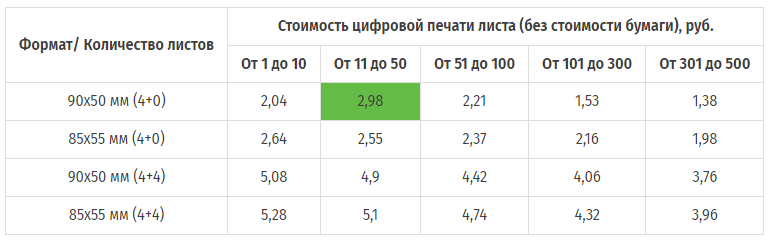
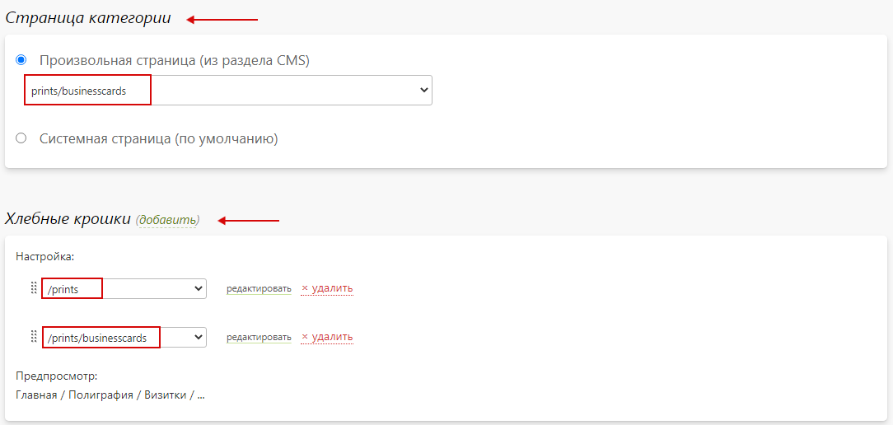
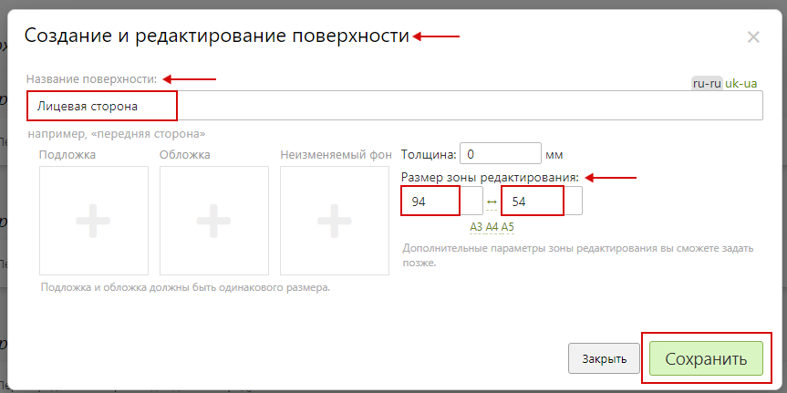
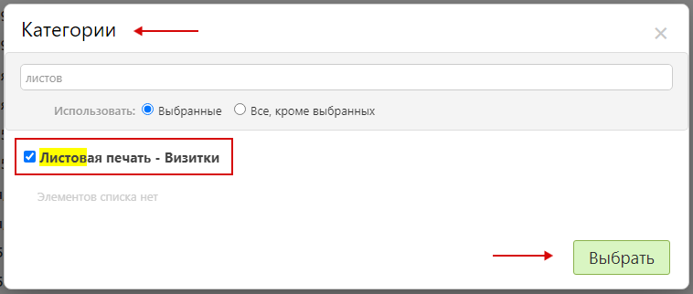

# [Листовая печать](https://demo.pixlpark.ru/prints/businesscards)
## Техническое задание
* Необходимо настроить расчет стоимости цифровой и офсетной печати визитных карточек на листах SRА3 (450 х 320мм) для двух форматов:
    - 90 х 50 мм (24 визитки на листе).
    - 85 х 55 мм (21 визитки на листе).

<table class="sheet-printing" id="digital-printing-price">
	<thead>
		<tr>
			<th rowspan="2">Формат/ Количество листов</th>
			<th colspan="5">Стоимость цифровой печати листа (без стоимости бумаги), руб.</th>
		</tr>
		<tr>
			<th>От 1 до 10</th>
			<th>От 11 до 50</th>
			<th>От 51 до 100</th>
			<th>От 101 до 300</th>
			<th>От 301 до 500</th>
		</tr>
    </thead>
    <tbody>
		<tr>
			<td>90x50 мм (4+0)</td>
			<td>2,04</td>
			<td>2,98</td>
			<td>2,21</td>
			<td>1,53</td>
			<td>1,38</td>
		</tr>
		<tr>
			<td>85x55 мм (4+0)</td>
			<td>2,64</td>
			<td>2,55</td>
			<td>2,37</td>
			<td>2,16</td>
			<td>1,98</td>
		</tr>
		<tr>
			<td>90x50 мм (4+4)</td>
			<td>5,08</td>
			<td>4,9</td>
			<td>4,42</td>
			<td>4,06</td>
			<td>3,76</td>
		</tr>
		<tr>
			<td>85x55 мм (4+4)</td>
			<td>5,28</td>
			<td>5,1</td>
			<td>4,74</td>
			<td>4,32</td>
			<td>3,96</td>
		</tr>
	</tbody>
</table>

<table class="sheet-printing" id="offset-printing-price">
    <thead>
		<tr>
			<th rowspan="2">Формат / Количество визиток</th>
			<th colspan="6">Стоимость офсетной печати листа (со стоимостью бумаги), руб.</th>
		</tr>
		<tr>
			<th>От 1000 до 1499</th>
			<th>От 1500 до 1999</th>
			<th>От 2000 до 2499</th>
			<th>От 2500 до 2999</th>
			<th>От 3000 до 4999</th>
			<th>От 5000</th>
		</tr>
	</thead>
    <tbody>
    	<tr>
			<td>90x50 мм (4+0)</td>
			<td>85</td>
			<td>79</td>
			<td>73</td>
			<td>69</td>
			<td>68</td>
			<td>64</td>
		</tr>
		<tr>
			<td>85x55 мм (4+0)</td>
			<td>78</td>
			<td>72</td>
			<td>67</td>
			<td>64</td>
			<td>62</td>
			<td>59</td>
		</tr>
		<tr>
			<td>90x50 мм (4+4)</td>
			<td>107</td>
			<td>104</td>
			<td>100</td>
			<td>92</td>
			<td>87</td>
			<td>71</td>
		</tr>
		<tr>
			<td>85x55 мм (4+4)</td>
			<td>97</td>
			<td>93</td>
			<td>91</td>
			<td>78</td>
			<td>72</td>
			<td>69</td>
		</tr>
	</tbody>
</table>

<table class="sheet-printing" id="digital-printing-sheet">
	<thead>
		<tr>
			<th rowspan="2">Тип бумаги/Тиражность</th>
			<th colspan="5">Стоимость листа бумаги SRA3 для цифровой печати, руб.</th>
		</tr>
		<tr>
			<th>От 1 до 10</th>
			<th>От 11 до 50</th>
			<th>От 51 до 100</th>
			<th>От 101 до 300</th>
			<th>От 301 до 500</th>
		</tr>
    </thead>
    <tbody>
		<tr>
			<td>Мелованная</td>
			<td>22,65</td>
			<td>21,6</td>
			<td>20,94</td>
			<td>20,76</td>
			<td>20,4</td>
		</tr>
		<tr>
			<td>Матовая</td>
			<td>22,65</td>
			<td>21,6</td>
			<td>20,94</td>
			<td>20,76</td>
			<td>20,4</td>
		</tr>
		<tr>
			<td>Лён</td>
			<td>40,77</td>
			<td>38,88</td>
			<td>37,69</td>
			<td>37,37</td>
			<td>36,72</td>
		</tr>
		<tr>
			<td>Крафт</td>
			<td>52,09</td>
			<td>49,68</td>
			<td>48,16</td>
			<td>47,75</td>
			<td>46,92</td>
		</tr>
		<tr>
			<td>Калька</td>
			<td>135,9</td>
			<td>129,6</td>
			<td>125,94</td>
			<td>124,56</td>
			<td>122,4</td>
		</tr>
		<tr>
			<td>Дизайнерская</td>
			<td>113,25</td>
			<td>108</td>
			<td>104,7</td>
			<td>103,8</td>
			<td>102</td>
		</tr>
	</tbody>
</table>

<table class="sheet-printing" id="offset-printing-sheet">
	<thead>
		<tr>
			<th>Плотность бумаги</th>
			<th>Стоимость листа бумаги SRA3 для офсетной печати, руб.</th>
		</tr>
    </thead>
    <tbody>
		<tr>
			<td>80 г / м2</td>
			<td>1,5</td>
		</tr>
		<tr>
			<td>115 г / м2</td>
			<td>2</td>
		</tr>
		<tr>
			<td>130 г /м2</td>
			<td>2,3</td>
		</tr>
	</tbody>
</table>

##### Прочие надбавки
<table class="sheet-printing">
	<thead>
		<tr>
			<th>Наименование надбавки</th>
			<th>Стоимость</th>
		</tr>
	</thead>
    <tbody>
    	<tr>
			<td>Скругление углов</td>
			<td>1 руб. за визитку</td>
		</tr>
		<tr>
			<td>Срочность изготовления</td>
			<td>3 рабочих дня и более – 0 %. <br/>
                24 часа – 50 %.<br/>
                2 часа – 100 %.
            </td>
		</tr>
	</tbody>
</table>

## Формула для расчета стоимости цифровой печати
```	formula
Стоимость печати = стоимость печати одной визитки * количество визиток + стоимость листа бумаги * количество листов + надбавка за скругление углов + надбавка за срочность изготовления,

где 
количество листов = количество визиток / кратность визиток на листе.
```

### Пример расчета для продукта
* Для проверки расчетов взять продукт с характеристиками согласно таблице.

| Тип продукта           | Визитка               |
|:----------------------:|:---------------------:|
| Количество, шт.        | 600                   |
| Размер                 | 90 х 50 мм            |
| Ориентация             | Горизонтальная        |
| Тип печати             | 4 + 0 (односторонняя) |
| Вид печати             | Цифровая              |
| Тип бумаги             | Матовая               |
| Скругление углов       | Есть                  |
| Срочность изготовления | Нет                   |

* Этапы расчета:
	1. Размер продукта 90 х 50 мм, а на 1 листе можно расположить 24 визитки указанного размера.
	2. Расчёт необходимого количества листов
		+ Для определения необходимого количества листов для изготовления 600 визиток необходимо разделить это количество на количество визиток, которое можно расположить на одном листе:
		```formula
		600 / 24 = 25 листов
		```
	3. Стоимость печати визиток зависит от количества листов, используемых для изготовления указанного количества визиток. Данная зависимость определена в [таблице стоимости цифровой печати листа (без стоимости бумаги)](/calculators/sheet-printing?id=digital-printing-price) технического задания.
		+ Согласно расчетам, в п.2, для изготовления 600 визиток необходимо 25 листов бумаги. Данное количество листов попадает в диапазон от 11 до 50, следовательно, стоимость печати одной визитки 90 х 50 мм (4+0) согласно таблице, составит 2,98 руб.
		
		+ Для того чтобы рассчитать стоимость печати визиток, необходимого стоимость печати одной визитки умножить на их количество:
		```formula
		2,98 * 600 = 1788 руб.
		```
	4. Расчет стоимости бумаги
		+ Стоимость листа бумаги зависит от количества листов, используемых для изготовления указанного количества визиток. Данная зависимость определена в [таблице стоимости листа бумаги SPA3 для цифровой печати](/calculators/sheet-printing?id=digital-printing-sheet) технического задания.
		+ Согласно расчетам, в п.2, для изготовления 600 визиток необходимо 25 листов бумаги. Данное количество листов попадает в диапазон от 11 до 50, следовательно, стоимость одного листа матовой бумаги согласно таблице, составит 21,6 руб.
		
		* Для того чтобы рассчитать стоимость бумаги, необходимо умножить количество необходимых листов на стоимость одного листа:
		```formula
		21,6 * 25 = 540 руб.
		```
	5. Наценка за скругление углов
		+ Для того чтобы рассчитать надбавку за скругление углов, необходимо умножить количество визиток на стоимость надбавки за 1 визитку:
		```formula
		1 * 600 = 600 руб.
		```
* __Итоговая стоимость изготовления визиток составит:__
	```formula
	2,98 руб. * 600 + 21,6 руб. * 25 + 1 руб. * 600 = 2928 руб.
	```

## Формула для расчета стоимости офсетной печати
```	formula
Стоимость печати = стоимость печати листа * количество листов + стоимость бумаги * количество листов + надбавка за скругление углов + надбавка за срочность изготовления
```

### Пример расчета для продукта
* Для проверки расчетов взять продукт с характеристиками согласно таблице.

| Тип продукта           | Визитка               |
|:----------------------:|:---------------------:|
| Количество, шт.        | 1500                  |
| Размер                 | 90 х 50 мм            |
| Ориентация             | Горизонтальная        |
| Тип печати             | 4 + 4 (двухсторонняя) |
| Вид печати             | Офсетная              |
| Тип бумаги             | 80 г/м<sup>2</sup>    |
| Скругление углов       | Нет                   |
| Срочность изготовления | Нет                   |

* Этапы расчета:
	1. Размер продукта 90 х 50 мм, а на 1 листе можно расположить 24 визитки указанного размера. 
	2. Расчёт необходимого количества листов
		+ Для определения необходимого количества листов для изготовления 1500 визиток необходимо разделить это количество на количество визиток, которое можно расположить на одном листе  и округлить значение в большую сторону:
		```formula
		1500 / 24 = 63 листа
		```
	3. Расчет стоимости печати визиток
		+ Стоимость печати визиток зависит от количества листов, используемых для изготовления указанного количества визиток. Данная зависимость определена в [таблице стоимости офсетной печати листа (со стоимостью бумаги)](/calculators/sheet-printing?id=offset-printing-price) технического задания.
		+ Согласно расчетам, в п.2, для изготовления 1500 визиток необходимо 63 листа бумаги. Данное количество листов попадает в диапазон от 1500 до 1999, следовательно, стоимость печати одного листа с визитками (24 штуки) согласно таблице, составит 104 руб.
		
		+ Для того чтобы рассчитать стоимость печати визиток, необходимо умножить стоимость печати одного листа с визитками на их количество:
		```formula
		104 * 63 = 6552 руб.
		```
	4. Расчет стоимости бумаги
		+ Стоимость листа бумаги зависит от плотности и определяется в [таблице стоимости листа бумаги SRA3 для офсетной печати](/calculators/sheet-printing?id=offset-printing-sheet) технического задания.
		+ Для того чтобы рассчитать стоимость бумаги, необходимо умножить количество необходимых листов на стоимость одного листа и округлить значение в большую сторону:
		```formula
		1,5 * 63 = 95 руб.
		```
* __Итоговая стоимость изготовления визиток составит:__
	```formula
	104 руб. * 63 + 1,5 руб. * 63 = 6647 руб.
	```

## Создание калькулятора
* Для создания калькулятора продукта "__Визитки__" в разделе "__Печать / Продукты__" нажать кнопку "__Добавить / Обновить__".

* В открывшейся карточке создания категории заполнить форму, указав:
	+ "__Создать новую категорию__"- необходимо выбрать.
	+ "__Название на сайте__" - указать "__Листовая печать - Визитки__".
	+ "__Редактор__" – выбрать "__Редактор дизайнов__".
* 
* Далее, нажать "__Добавить__" для создания продукта.
* В подразделе "__Основная информация__" созданной категории продукта необходимо задать адрес в интернете латинскими буквами.

* После, нажать "__Сохранить__" и сбросить кэш сайта.
* В подразделе "__Страница категории__" раздела "__Печать / Продукты / Листовая печать – Визитки / Настройка__" выбрать страницу, на которой будет располагаться данный продукт, а также задать настройки подраздела "__Хлебные крошки__" для отображения хлебных крошек в формате "__страница-раздела__", "__страница-раздела / страница-продукта__".

* После, нажать "__Сохранить__" и сбросить кэш сайта.
* В подразделе "__Основная информация__" раздела "__Печать / Продукты / Листовая печать – Визитки / Атрибуты__" включить "__Использовать атрибуты для выбора продукта__" и добавить атрибуты при помощи "__Добавить__" :
	+ "__Тип печати__".
	+ "__Ориентация__".
	+ "__Формат__".
	+ "__Цветность печати__".
* 
* После, нажать "__Сохранить__" и сбросить кэш сайта.

### Создание продуктов категории "Листовая печать – Визитки"
* В подразделе "__Продукты__" раздела "__Печать / Продукты / Листовая печать – Визитки / Продукты__" добавить продукт нажав "__Добавить__". 

* В открывшейся карточке создания продукта заполнить поля, указав:
	+ "__Создать новый продукт с нуля__" - необходимо выбрать.
	+ "__Название на сайте__" – указать "__Цифровая 4+0, горизонтальная, 90х50мм__".
* 
* Затем, нажать "__Добавить__".
* В подразделе "__Основная информация__" раздела "__Настройка__" созданного продукта задать адрес в интернете латинскими буквами и включить "__Продукт доступен на сайте__".

* В подразделе "__Тиражность__" раздела "__Настройка__" созданного продукта задать стоимость для количества от 1 до 1000 с шагом 1 шт. равной нулю.
> Стоимость равна нулю т.к. она будет сформирована при помощи опций. 
* 
* После, нажать "__Сохранить__" и сбросить кэш сайта.
* В подразделе "__Поверхности печати__" раздела "__Редактор__" созданного продукта добавить поверхность нажав "__Добавить поверхность__".

* В появившемся окне создания и редактирования поверхностей заполнить поля, указав:
	+ "__Название поверхности__" – указать "__Лицевая сторона__".
	+ "__Размеры зоны редактирования__" – задать значение "__94 x 54 мм__".
* 
* Далее, нажать на название поверхности и задать дополнительные настройки зоны печати:
	+ "__Название зоны редактирования__" - указать "__94 x 54 мм__".
	+ "__Количество dpi__" – задать значение "__600__".
	+ "__Отображать вспомогательные линии в редакторе__" - необходимо включить и задать значения для каждой из сторон:
		+ 5 – для ограничителя текста.
		+ 2 – общее ограничение без каких-либо характеристик.
* 
* > Дополнительное поле для вспомогательных линий можно добавить при помощи "__Добавить__".
* Затем, нажать "__Сохранить__" для сохранения дополнительных настроек, а после – нажать "__Сохранить__" и сбросить кэш сайта.
* В разделе "__Атрибуты__" созданного продукта задать значения атрибутов:
	+ "__Цветность печати__" – задать значение "__4 + 0__".
	+ "__Тип печати__" – задать значение "__Цифровая__".
	+ "__Ориентация__" – задать значение "__Горизонтальная__".
	+ "__Формат__" – задать значение "__90 х 50 мм__".
* 
* После, нажать "__Сохранить__" и сбросить кэш сайта.
* Аналогичным образом создаются и настраиваются оставшиеся согласно таблице продукты.

<table class="sheet-printing-products">
	<thead>
		<tr>
			<th rowspan="2">Название продукта</th>
			<th colspan="2">Поверхность печати</th>
			<th rowspan="2">Атрибуты</th>
		</tr>
		<tr>
			<th>Лицевая</th>
			<th>Обратная</th>
		</tr>
	</thead>
	<tbody>
		<!-- <tr>
			<td>Цифровая 4 + 0, горизонтальная, 90 x 50 мм</td>
			<td>94 x 54 мм</td>
			<td>-</td>
			<td>
				Цветность печати: 4 + 0 <br/>
				Тип печати: цифровая <br/>
				Ориентация: горизонтальная <br/>
				Формат: 90 х 50 мм
			</td>
		</tr> -->
		<tr>
			<td>Цифровая 4 + 4, горизонтальная, 90 x 50 мм</td>
			<td>94 x 54 мм</td>
			<td>94 x 54 мм</td>
			<td>
				Цветность печати: 4 + 4 <br/>
				Тип печати: цифровая <br/>
				Ориентация: горизонтальная <br/>
				Формат: 90 х 50 мм
			</td>
		</tr>
		<tr>
			<td>Цифровая 4 + 0, вертикальная, 50 x 90 мм</td>
			<td>54 x 94 мм</td>
			<td>-</td>
			<td>
				Цветность печати: 4 + 0 <br/>
				Тип печати: цифровая <br/>
				Ориентация: вертикальная <br/>
				Формат: 50 х 90 мм
			</td>
		</tr>
		<tr>
			<td>Цифровая 4 + 4, вертикальная, 50 x 90 мм</td>
			<td>54 x 94 мм</td>
			<td>54 x 94 мм</td>
			<td>
				Цветность печати: 4 + 4 <br/>
				Тип печати: цифровая <br/>
				Ориентация: вертикальная <br/>
				Формат: 50 х 90 мм
			</td>
		</tr>
		<tr>
			<td>Цифровая 4 + 0, горизонтальная, 85 x 55 мм</td>
			<td>89 x 59 мм</td>
			<td>-</td>
			<td>
				Цветность печати: 4 + 0 <br/>
				Тип печати: цифровая <br/>
				Ориентация: горизонтальная <br/>
				Формат: 85 х 55 мм
			</td>
		</tr>
		<tr>
			<td>Цифровая 4 + 4, горизонтальная, 85 x 55 мм</td>
			<td>89 x 59 мм</td>
			<td>89 x 59 мм</td>
			<td>
				Цветность печати: 4 + 4 <br/>
				Тип печати: цифровая <br/>
				Ориентация: горизонтальная <br/>
				Формат: 85 х 55 мм
			</td>
		</tr>
		<tr>
			<td>Цифровая 4 + 0, вертикальная, 55 x 85 мм</td>
			<td>59 x 89 мм</td>
			<td>-</td>
			<td>
				Цветность печати: 4 + 0 <br/>
				Тип печати: цифровая <br/>
				Ориентация: вертикальная <br/>
				Формат: 55 х 85 мм
			</td>
		</tr>
		<tr>
			<td>Цифровая 4 + 4, вертикальная, 55 x 85 мм</td>
			<td>59 x 89 мм</td>
			<td>59 x 89 мм</td>
			<td>
				Цветность печати: 4 + 4 <br/>
				Тип печати: цифровая <br/>
				Ориентация: вертикальная <br/>
				Формат: 55 х 85 мм
			</td>
		</tr>
		<tr>
			<td>Офсетная 4 + 0, горизонтальная, 90 x 50 мм</td>
			<td>94 x 54 мм</td>
			<td>-</td>
			<td>
				Цветность печати: 4 + 0 <br/>
				Тип печати: офсетная <br/>
				Ориентация: горизонтальная <br/>
				Формат: 90 х 50 мм
			</td>
		</tr>
		<tr>
			<td>Офсетная 4 + 4, горизонтальная, 90 x 50 мм</td>
			<td>94 x 54 мм</td>
			<td>94 x 54 мм</td>
			<td>
				Цветность печати: 4 + 4 <br/>
				Тип печати: офсетная <br/>
				Ориентация: горизонтальная <br/>
				Формат: 90 х 50 мм
			</td>
		</tr>
		<tr>
			<td>Офсетная 4 + 0, вертикальная, 50 x 90 мм</td>
			<td>54 x 94 мм</td>
			<td>-</td>
			<td>
				Цветность печати: 4 + 0 <br/>
				Тип печати: офсетная <br/>
				Ориентация: вертикальная <br/>
				Формат: 50 х 90 мм
			</td>
		</tr>
		<tr>
			<td>Офсетная 4 + 4, вертикальная, 50 x 90 мм</td>
			<td>54 x 94 мм</td>
			<td>54 x 94 мм</td>
			<td>
				Цветность печати: 4 + 4 <br/>
				Тип печати: офсетная <br/>
				Ориентация: вертикальная <br/>
				Формат: 50 х 90 мм
			</td>
		</tr>
		<tr>
			<td>Офсетная 4 + 0, горизонтальная, 85 x 55 мм</td>
			<td>89 x 59 мм</td>
			<td>-</td>
			<td>
				Цветность печати: 4 + 0 <br/>
				Тип печати: офсетная <br/>
				Ориентация: горизонтальная <br/>
				Формат: 85 х 55 мм
			</td>
		</tr>
		<tr>
			<td>Офсетная 4 + 4, горизонтальная, 85 x 55 мм</td>
			<td>89 x 59 мм</td>
			<td>89 x 59 мм</td>
			<td>
				Цветность печати: 4 + 4 <br/>
				Тип печати: офсетная <br/>
				Ориентация: горизонтальная <br/>
				Формат: 85 х 55 мм
			</td>
		</tr>
		<tr>
			<td>Офсетная 4 + 0, вертикальная, 55 x 85 мм</td>
			<td>59 x 89 мм</td>
			<td>-</td>
			<td>
				Цветность печати: 4 + 0 <br/>
				Тип печати: офсетная <br/>
				Ориентация: вертикальная <br/>
				Формат: 55 х 85 мм
			</td>
		</tr>
		<tr>
			<td>Офсетная 4 + 4, вертикальная, 55 x 85 мм</td>
			<td>59 x 89 мм</td>
			<td>59 x 89 мм</td>
			<td>
				Цветность печати: 4 + 4 <br/>
				Тип печати: офсетная <br/>
				Ориентация: вертикальная <br/>
				Формат: 55 х 85 мм
			</td>
		</tr>
	</tbody>
</table>

## Опции для цифровой печати
* 
	+ [Расчет стоимости (Визитки – цифровая печать)](/calculators/sheet-printing?id=Расчет-стоимости-Визитки-цифровая-печать).
	+ [Стоимость за печать (Визитки – цифровая печать)](/calculators/sheet-printing?id=Стоимость-за-печать-Визитки-цифровая-печать).
	+ [Тип бумаги (Визитки – цифровая печать)](/calculators/sheet-printing?id=Тип-бумаги-Визитки-цифровая-печать).
	+ [Дополнительные настройки для позиции опции "Расчет стоимости (Визитки – цифровая печать)](/calculators/sheet-printing?id=Дополнительные-настройки-для-позиции-опции-quotРасчет-стоимости-Визитки-цифровая-печатьquot).

### Расчет стоимости (Визитки – цифровая печать)
> Назначение опции: расчет полной стоимости печати визиток.
* В разделе "__Печать / Калькуляция / Опции__" нажать кнопку "__Добавить опцию__" для создания новой опции.

* В открывшейся карточке создания опции заполнить форму, указав:
	+ "__Название на сайте__" - указать "__Расчет стоимости (Визитки – цифровая печать)__".
	+ "__Тип опции__" - указать "__Список позиций__".
	+ "__Начальное число позиций__" - указать "__1__".
* 
* Далее, нажать "__Добавить__" для создания опции.
* В подразделе "__Основная информация__" опции "__Расчет стоимости (Визитки – цифровая печать) / Настройка__" заполнить форму, указав:
	+ "__Название на сайте__" – указать "__Расчет стоимости__".
	+ "__Название в панели управления__" – указать "__Расчет стоимости (Визитки – цифровая печать)__".
	+ "__Вид выбора позиций на странице редактора__" и "__Вид выбора позиций на странице CMS__" - выбрать список.
	+ "__Опция доступна на сайте__" - необходимо включить.
	+ "__Опция скрыта__" - необходимо включить.
	+ "__Опция обязательная для оформления заказа__" - необходимо включить.
	+ "__Выбирать значение опции по умолчанию__" - необходимо включить.
* 
* В подразделе "__Расчет стоимости__" опции "__Расчет стоимости (Визитки – цифровая печать) / Настройка__" задать настройки:
	+ "__Алгоритм расчета позиции__" – выбрать "__Цена позиции динамическая__".
	+ "__Алгоритм расчета опции__" – выбрать "__Цена опции = цена позиции + дополнительная цена позиции__".
	+ "__Алгоритм расчета количества опций__" – выбрать "__Количество опций равно количеству продуктов__".
	+ "__Алгоритм выбора позиций__" - выбрать "__Возможен выбор только одной позиции__".
* 
> Алгоритм расчета позиции – динамический, т.к. расчет будет осуществляться по формуле.
* В подразделе "__Позиции__" опции "__Расчет стоимости (Визитки – цифровая печать) / Настройка__" содержится перечень позиций созданной опции.

* Далее, нажать "__Сохранить__" и сбросить кэш сайта.
* В подразделе "__Категории и продукты__" опции "__Расчет стоимости (Визитки – цифровая печать) / Продукты__" добавить продукты нажав "__Добавить__". 
> В данном разделе осуществляется привязка опции к необходимым продуктам. После осуществления привязки опция будет участвовать в формировании цены продуктов.
* 
* В появившемся окне выбора категории в поле поиска ввести название категории продукта, а после – выбрать нужный продукт в списке и нажать "__Выбрать__".

* Далее, скорректировать привязку для продуктов с цифровой печатью и задать значение привязки согласно размеру визитки:
	+ 90 х 50 мм, 50 х 90 мм – значение привязки "__24__".
	+ 85 х 55 мм, 55 х 85 мм – значение привязки "__21__".
* 
* После, нажать "__Сохранить__" и сбросить кэш сайта.

#### Позиции опции "Расчет стоимости (Визитки - цифровая печать)"
* Для настройки позиции опции "__Расчет стоимости (Визитки - цифровая печать)__" перейти в карточку позиции нажав на нее. Затем, заполнить подраздел "__Основная информация__", указав:
	+ "__Название на сайте__" – указать "__Расчет стоимости__".
	+ "__Название в панели управления__" – указать "__Расчет стоимости__".
	+ "__Позиция активна__" - необходимо включить.
* 
* В подразделе "__Стоимость__" позиции опции "__Расчет стоимости (Визитки - цифровая печать)__" задать способ расчета цены "__По формуле__". Затем, в поле "__Формула для значения__" задать формулу для расчета количества листов, необходимый для печати указанного количества визиток:
	```formula
	Количество продукта / значение привязки продукта опции "Расчет стоимости (Визитки – цифровая печать)"
	
	где:
	количество продукта – количество визиток, указанное клиентом в калькуляторе;
	значение привязки – количество визиток, которое можно расположить на одном листе.
	```
* 
* Затем, нажать "__Применить__".
* Далее, для результатов поля "__Формула для значения__" задать способ округления результата до целого значения в большую сторону.

> Округление значения в большую сторону позволит рассчитать целое значение для количества листов.
* После, нажать "__Сохранить__" и сбросить кэш сайта.

### Стоимость за печать (Визитки – цифровая печать)
> Назначение опции: задает стоимость цифровой печати листа (без стоимости бумаги).
* В разделе "__Печать / Калькуляция / Опции__" нажать кнопку "__Добавить опцию__" для создания новой опции.

* В открывшейся карточке создания опции заполнить форму, указав:
	+ "__Название на сайте__" - указать "__Стоимость за печать (Визитки - цифровая печать)__".
	+ "__Тип опции__" - указать "__Список позиций__".
	+ "__Начальное число позиций__" - указать "__1__".
* 
* Далее, нажать "__Добавить__" для создания опции.
* В подразделе "__Основная информация__" опции "__Стоимость за печать (Визитки - цифровая печать) / Настройка__" заполнить форму, указав:
	+ "__Название на сайте__" – указать "__Стоимость за печать__".
	+ "__Название в панели управления__" – указать "__Стоимость за печать (Визитки - цифровая печать)__".
	+ "__Вид выбора позиций на странице редактора__" и "__Вид выбора позиций на странице CMS__" - выбрать список.
	+ "__Опция доступна на сайте__" - необходимо включить.
	+ "__Опция скрыта__" - необходимо включить.
	+ "__Опция обязательная для оформления заказа__" - необходимо включить.
	+ "__Выбирать значение опции по умолчанию__" - необходимо включить.
* 
* В подразделе "__Расчет стоимости__" опции "__Стоимость за печать (Визитки - цифровая печать) / Настройка__" задать настройки:
	+ "__Алгоритм расчета позиции__" – выбрать "__Цена позиции фиксированная__".
	+ "__Алгоритм расчета опции__" – выбрать "__Цена опции = цена позиции + дополнительная цена позиции__".
	+ "__Алгоритм расчета количества опций__" – выбрать "__Количество опций равно количеству продуктов__".
	+ "__Алгоритм выбора позиций__" - выбрать "__Возможен выбор только одной позиции__".
* 
* В подразделе "__Позиции__" опции "__Стоимость за печать (Визитки - цифровая печать) / Настройка__" содержится перечень позиций созданной опции.

* Далее, нажать "__Сохранить__" и сбросить кэш сайта.
* В подразделе "__Категории и продукты__" опции "__Стоимость за печать (Визитки - цифровая печать) / Продукты__" добавить продукты нажав "__Добавить__". 

* В появившемся окне выбора категории в поле поиска ввести название категории продукта, а после – выбрать нужный продукт в списке и нажать "__Выбрать__".

* Далее, скорректировать привязку для продуктов с цифровой печатью.

* Затем, нажать "__Сохранить__" и сбросить кэш сайта.

#### Позиции опции "Стоимость за печать (Визитки - цифровая печать)"
> Стоимость за печать задается в соответствии с ТЗ. Ниже описана настройка позиции опции для продуктов  "__Цифровая 4+0, горизонтальная, 90x50 мм__" и  "__Цифровая 4+0, вертикальная, 50x90 мм__". Позиции для оставшихся согласно ТЗ продуктов настраиваются аналогично.
* Для настройки позиции опции "__Стоимость за печать (Визитки - цифровая печать)__" перейти в карточку позиции нажав на нее. Затем, заполнить подраздел "__Основная информация__", указав:
	+ "__Название на сайте__" – указать "__От 1 до 10__".
	+ "__Название в панели управления__" – указать "__От 1 до 10__".
	+ "__Позиция активна__" - необходимо включить.
* 
* В подразделе "__Ограничения__" позиции опции "__Стоимость за печать (Визитки - цифровая печать)__" включить "__Ограничить позицию следующими категориями раздела "Печать"__" и выбрать категории печати нажав "__Выбрать__":
	+ Цифровая 4 + 0, горизонтальная, 90х50мм.
	+ Цифровая 4 + 0, вертикальная, 50х90мм.
* 
* Затем, нажать "__Сохранить__".
* В подразделе "__Правила доступности__" позиции опции "__Стоимость за печать (Визитки - цифровая печать)__" добавить правило, нажав "__Добавить__":
	```formula
	Позиция опции доступна если высчитанное значение позиции опции "Расчет стоимости (Визитки – цифровая печать)" больше или равно 1 и меньше или равно 10
	
	где:
	высчитанное значение – вычисленное количество листов из опции "Расчет стоимости (Визитки – цифровая печать)".
	```
> Ограничение позволяет использовать данную позицию при попадании количества листов в данный диапазон значений (от 1 до 10 листов).
* 
* Затем, нажать "__Применить__".
* В подразделе "__Стоимость__" позиции опции "__Стоимость за печать (Визитки - цифровая печать)__" задать стоимость "__2,04__" руб.

* Затем, нажать "__Сохранить__" и сбросить кэш сайта.
* Аналогичным образом настраиваются оставшиеся позиции для цифровой печати согласно [таблице стоимости цифровой печати листа](/calculators/sheet-printing?id=digital-printing-price).
> Добавить новую позицию опции можно при помощи "__Добавить__".
* 
> Также, позицию опции можно продублировать и скорректировать настройки в соответствии с нужными данными.
* После внесения всех данных подраздел "__Позиции__" опции "__Стоимость за печать (Визитки - цифровая печать)__" выглядит следующим образом:


### Тип бумаги (Визитки – цифровая печать)
> Назначение опции: делает возможным выбор бумаги для цифровой печати и добавляет за нее стоимость.
* В разделе "__Печать / Калькуляция / Опции__" нажать кнопку "__Добавить опцию__" для создания новой опции.

* В открывшейся карточке создания опции заполнить форму, указав:
	+ "__Название на сайте__" - указать "__Тип бумаги (Визитки - цифровая печать)__".
	+ "__Тип опции__" - указать "__Список позиций__".
	+ "__Начальное число позиций__" - указать "__1__".
* 
* Далее, нажать "__Добавить__" для создания опции.
* В подразделе "__Основная информация__" опции "__Тип бумаги (Визитки - цифровая печать) / Настройка__" заполнить форму, указав:
	+ "__Название на сайте__" – указать "__Тип бумаги__".
	+ "__Название в панели управления__" – указать "__Тип бумаги (Визитки - цифровая печать)__".
	+ "__CSS-класс__" - указать "__col5 monotony-option__".
	+ "__Вид выбора позиций на странице редактора__" и "__Вид выбора позиций на странице CMS__" - выбрать список.
	+ "__Опция доступна на сайте__" - необходимо включить.
	+  "__Опция обязательная для оформления заказа__" - необходимо включить.
	+ "__Выбирать значение опции по умолчанию__" - необходимо включить.
* 
* В подразделе "__Расчет стоимости__" опции "__Тип бумаги (Визитки - цифровая печать) / Настройка__" задать настройки:
	+ "__Алгоритм расчета позиции__" – выбрать "__Цена позиции фиксированная__".
	+ "__Алгоритм расчета опции__" – выбрать "__Цена опции = цена позиции + дополнительная цена позиции__".
	+ "__Алгоритм расчета количества опций__" – выбрать "__Количество опций равно количеству продуктов__".
	+ "__Алгоритм выбора позиций__" - выбрать "__Возможен выбор только одной позиции__".
* 
* В подразделе "__Позиции__" опции "__Тип бумаги (Визитки - цифровая печать) / Настройка__" содержится перечень позиций созданной опции.

* Далее, нажать "__Сохранить__" и сбросить кэш сайта.
* В подразделе "__Категории и продукты__" опции "__Тип бумаги (Визитки - цифровая печать) / Продукты__" добавить продукты нажав "__Добавить__". 

* В появившемся окне выбора категории в поле поиска ввести название категории продукта, а после – выбрать нужный продукт в списке и нажать "__Выбрать__".

* Далее, скорректировать привязку для продуктов с цифровой печатью.

* Затем, нажать "__Сохранить__" и сбросить кэш сайта.

#### Позиции опции "Тип бумаги (Визитки - цифровая печать)"
> Стоимость за бумагу задается в соответствии с ТЗ. В данном случае создана одна позиция, настройка которой будет описываться ниже. Оставшиеся позиции опции создаются аналогично.
* Для настройки позиции опции "__Тип бумаги (Визитки - цифровая печать)__" перейти в карточку позиции нажав на нее. Затем, заполнить подраздел "__Основная информация__", указав:
	+ "__Название на сайте__" – указать "__Мелованная__".
	+ "__Название в панели управления__" – указать "__Мелованная (от 1 до 10)__".
	+ "__Позиция активна__" - необходимо включить.
* 
* В подразделе "__Правила доступности__" позиции опции "__Тип бумаги (Визитки - цифровая печать)__" добавить правило, нажав "__Добавить__":
	```formula
	Позиция опции доступна если высчитанное значение позиции опции "Расчет стоимости (Визитки – цифровая печать)" больше или равно 1 и меньше или равно 10
	
	где: 
	высчитанное значение – вычисленное количество листов из опции "Расчет стоимости (Визитки – цифровая печать)".
	```
> Ограничение позволяет использовать данную позицию при попадании количества листов в данный диапазон значений (от 1 до 10 листов).
* 
* Затем, нажать "__Применить__".
* В подразделе "__Стоимость__" позиции опции "__Стоимость за печать (Визитки - цифровая печать)__" задать стоимость "__22.65__" руб. 

* Затем, нажать "__Сохранить__" и сбросить кэш сайта.
* Аналогичным образом настраиваются оставшиеся позиции для цифровой печати согласно [таблице стоимости листа бумаги SRA3 для цифровой печати](/calculators/sheet-printing?id=digital-printing-sheet).
* После внесения всех данных подраздел "__Позиции__" опции "__Стоимость за печать (Визитки - цифровая печать)__" выглядит следующим образом:


### Дополнительные настройки для позиции опции "Расчет стоимости (Визитки – цифровая печать)"
* По завершении настройки всех вышеперечисленных опций необходимо добавить формулу в позицию данной опции, позволяющую рассчитать итоговую стоимость изготовления визиток.
* В подразделе "__Стоимость__" позиции опции "__Расчет стоимости (Визитки - цифровая печать)__" в поле "__Формула для цены__" задать формулу:
	```formula
	Количество продукта * Цена опции "Стоимость за печать (Визитки – цифровая печать)" + Высчитанное значение позиции опции "Расчет стоимости (Визитки – цифровая печать)" * Цена опции "Тип бумаги (визитки – цифровая печать)" - Цена опции "Тип бумаги (визитки – цифровая печать)" - Цена опции "Стоимость за печать (Визитки – цифровая печать)"
	```
* 
> Вычитание стоимости типа бумаги и стоимости за печать происходит т.к. эти значения прибавляются за счет созданных и привязанных к продукту опций.
* Затем, нажать "__Применить__", а после нажать "__Сохранить__" и сбросить кэш сайта.

## Опции для офсетной печати
*	+ [Стоимость печати (Визитки - офсетная печать)](/calculators/sheet-printing?id=Стоимость-печати-Визитки-офсетная-печать).
	+ [Плотность бумаги (полиграфия)](/calculators/sheet-printing?id=Плотность-бумаги-Полиграфия).
	+ [Расчет стоимости (Визитки – офсетная печать)](/calculators/sheet-printing?id=Расчет-стоимости-Визитки-офсетная-печать).

### Стоимость печати (Визитки - офсетная печать)
> Назначение опции: задает стоимость офсетной печати листа (со стоимостью бумаги).
* В разделе "__Печать / Калькуляция / Опции__" нажать кнопку "__Добавить опцию__" для создания новой опции.

* В открывшейся карточке создания опции заполнить форму, указав:
	+ "__Название на сайте__" - указать "__Стоимость печати (Визитки - офсетная печать)__".
	+ "__Тип опции__" - указать "__Список позиций__".
	+ "__Начальное число позиций__" - указать "__1__".
* 
* Далее, нажать "__Добавить__" для создания опции.
* В подразделе "__Основная информация__" опции "__Стоимость печати (Визитки - офсетная печать) / Настройка__" заполнить форму, указав:
	+ "__Название на сайте__" – указать "__Стоимость печати__".
	+ "__Название в панели управления__" – указать "__Стоимость печати (Визитки - офсетная печать)__".
	+ "__Вид выбора позиций на странице редактора__" и "__Вид выбора позиций на странице CMS__" - выбрать список.
	+ "__Опция доступна на сайте__" - необходимо включить.
	+ "__Опция скрыта__" - необходимо включить.
	+ "__Опция обязательная для оформления заказа__" - необходимо включить.
	+ "__Выбирать значение опции по умолчанию__" - необходимо включить.
* 
* В подразделе "__Расчет стоимости__" опции "__Стоимость печати (Визитки - офсетная печать) / Настройка__" задать настройки:
	+ "__Алгоритм расчета позиции__" – выбрать "__Цена позиции фиксированная__".
	+ "__Алгоритм расчета опции__" – выбрать "__Цена опции = цена позиции + дополнительная цена позиции__".
	+ "__Алгоритм расчета количества опций__" – выбрать "__Количество опций равно количеству продуктов__".
	+ "__Алгоритм выбора позиций__" - выбрать "__Возможен выбор только одной позиции__".
* 
* В подразделе "__Позиции__" опции "__Стоимость печати (Визитки - офсетная печать) / Настройка__" содержится перечень позиций созданной опции.

* Далее, нажать "__Сохранить__" и сбросить кэш сайта.
* В подразделе "__Категории и продукты__" опции "__Стоимость печати (Визитки - офсетная печать) / Продукты__" добавить продукты нажав "__Добавить__". 

* В появившемся окне выбора категории в поле поиска ввести название категории продукта, а после – выбрать нужный продукт в списке и нажать "__Выбрать__".

* Далее, скорректировать привязку для продуктов с офсетной печатью.

* Затем, нажать "__Сохранить__" и сбросить кэш сайта.

#### Позиции опции "Стоимость печати (Визитки - офсетная печать)"
> Стоимость за печать задается в соответствии с ТЗ.  Ниже описана настройка позиции опции для продуктов  "__Офсетная 4+0, горизонтальная, 90x50 мм__" и  "__Офсетная 4+0, вертикальная, 50x90 мм__". Позиции для оставшихся согласно ТЗ продуктов настраиваются аналогично.
* Для настройки позиции опции "__Стоимость печати (Визитки - офсетная печать)__" перейти в карточку позиции нажав на нее. Затем, заполнить подраздел "__Основная информация__", указав:
	+ "__Название на сайте__" – указать "__4 + 0__".
	+ "__Название в панели управления__" – указать "__4 + 0 (1000 – 1499)__".
	+ "__Позиция активна__" - необходимо включить.
* 
* В подразделе "__Ограничения__" позиции опции "__Стоимость печати (Визитки - офсетная печать)__" включить "__Ограничить позицию следующими категориями раздела "Печать"__" и выбрать категории печати нажав "__Выбрать__":
	+ Офсетная 4 + 0, горизонтальная, 90 х 50 мм.
	+ Офсетная 4 + 0, вертикальная, 50 х 90 мм.
* 
* Затем, нажать "__Сохранить__".
* В подразделе "__Правила доступности__" позиции опции "__Стоимость печати (Визитки - офсетная печать)__" добавить правило, нажав "__Добавить__":
	```formula
	Позиция опции доступна если количество продукта больше или равно 1000 и меньше или равно 1499
	```
> Ограничение позволяет использовать данную позицию при попадании количества визиток в данный диапазон значений (от 1000 до 1499 листов).
* 
* Затем, нажать "__Применить__".
* В подразделе "__Стоимость__" позиции опции "__Стоимость печати (Визитки - офсетная печать)__" задать стоимость "__85__" руб.

* Затем, нажать "__Сохранить__" и сбросить кэш сайта.
* Аналогичным образом настраиваются оставшиеся позиции для цифровой печати согласно [таблице стоимости офсетной печати листа (со стоимостью бумаги)](/calculators/sheet-printing?id=offset-printing-price).
* После внесения всех данных подраздел "__Позиции__" опции "__Стоимость печати (Визитки - офсетная печать)__" выглядит следующим образом:


### Плотность бумаги (Полиграфия)
> Назначение опции: задает стоимость листа в зависимости от плотности бумаги и рассчитывает количество листов, необходимых для печати визиток.
* В разделе "__Печать / Калькуляция / Опции__" нажать кнопку "__Добавить опцию__" для создания новой опции.

* В открывшейся карточке создания опции заполнить форму, указав:
	+ "__Название на сайте__" - указать "__Плотность бумаги (Полиграфия)__".
	+ "__Тип опции__" - указать "__Список позиций__".
	+ "__Начальное число позиций__" - указать "__1__".
* 
* Далее, нажать "__Добавить__" для создания опции.
	+ "__Название на сайте__" – указать "__Плотность бумаги__".
	+ "__Название в панели управления__" – указать "__Плотность бумаги (Полиграфия)__".
	+ "__CSS класс__" – указать "__col5__".
	+ "__Вид выбора позиций на странице редактора__" и "__Вид выбора позиций на странице CMS__" - выбрать список.
	+ "__Опция доступна на сайте__" - необходимо включить.
	+  "__Опция обязательная для оформления заказа__" - необходимо включить.
	+ "__Выбирать значение опции по умолчанию__" - необходимо включить.
* 
* В подразделе "__Расчет стоимости__" опции "__Плотность бумаги (Полиграфия) / Настройка__" задать настройки:
	+ "__Алгоритм расчета позиции__" – выбрать "__Цена позиции динамическая__".
	+ "__Алгоритм расчета опции__" – выбрать "__Цена опции = цена позиции + дополнительная цена позиции__".
	+ "__Алгоритм расчета количества опций__" – выбрать "__Количество опций равно количеству продуктов__".
	+ "__Алгоритм выбора позиций__" - выбрать "__Возможен выбор только одной позиции__".
* 
* В подразделе "__Позиции__" опции "__Плотность бумаги (Полиграфия) / Настройка__" содержится перечень позиций созданной опции.

* Далее, нажать "__Сохранить__" и сбросить кэш сайта.
* В подразделе "__Категории и продукты__" опции "__Плотность бумаги (Полиграфия) / Продукты__" добавить продукты нажав "__Добавить__". 

* В появившемся окне выбора категории в поле поиска ввести название категории продукта, а после – выбрать нужный продукт в списке и нажать "__Выбрать__".

* Далее, скорректировать привязку для продуктов с офсетной печатью и задать значение привязки согласно размеру визитки:
	+ 90 х 50 мм, 50 х 90 мм – значение привязки "__24__".
	+ 85 х 55 мм, 55 х 85 мм – значение привязки "__21__".
* 
* Затем, нажать "__Сохранить__" и сбросить кэш сайта.
* Далее, необходимо внести данные о стоимости листа в зависимости от его плотности согласно ТЗ. Для этого в разделе "__Печать / Калькуляция / Переменные__" нажать кнопку "__Добавить переменную__" для создания новой переменной.

* В открывшейся карточке создания переменной заполнить форму, указав:
	+ "__Уникальное имя__" - указать "**sheet_ofset_80_a3**".
	+ "__Название на сайте__" - указать "__Стоимость листа А3 (80 г/м<sup>2</sup>)__".
* 
* Далее, нажать "__Добавить__" для создания переменной.
* В подразделе "__Основная информация__" переменной "__Стоимость листа А3 (80 г/м<sup>2</sup>)__" заполнить форму, указав:
	+ "__Тип возвращаемого значения__" – указать "__Дробное число__".
	+ "__По умолчанию__" – указать "__1,5__".
	+ "__Тип данных__" – указать "__Константа__".
* 
* Далее, нажать "__Сохранить__" и сбросить кэш сайта.
* Аналогичным образом настраиваются оставшиеся переменные согласно [таблице стоимости листа бумаги SRA3 для офсетной печати](/calculators/sheet-printing?id=offset-printing-sheet).
* После внесения всех переменных они отражаются в разделе "__Печать / Калькуляция / Переменные__".


#### Позиции опции "__Плотность бумаги (Полиграфия)__"
> Стоимость за печать задается в соответствии с ТЗ.  Позиции для оставшихся согласно ТЗ продуктов настраиваются аналогично.
* Для настройки позиции опции "__Плотность бумаги (Полиграфия)__" перейти в карточку позиции нажав на нее. Затем, заполнить подраздел "__Основная информация__", указав:
	+ "__Название на сайте__" – указать "__80 г/м<sup>2</sup>__".
	+ "__Название в панели управления__" – указать "__80 г/м<sup>2</sup>__".
	+ "__Позиция активна__" - необходимо включить.
* 
* В подразделе "__Ограничения__" позиции опции "__Плотность бумаги (Полиграфия)__" включить "__Ограничить позицию следующими категориями раздела "Печать"__" и выбрать продукты с офсетной печатью нажав "__Выбрать__".

* Затем, нажать "__Сохранить__".
* В подразделе "__Стоимость__" позиции опции "__Плотность бумаги (Полиграфия)__" задать способ расчета цены "__По формуле__". Затем, в поле "__Формула для значения__" задать формулу для расчета количества листов, необходимый для печати указанного количества визиток:
	```formula
	Количество продукта / значение привязки опции "Плотность бумаги (Полиграфия)"
	
	где: 
	количество продукта – количество визиток, указанное клиентом в калькуляторе;
	значение привязки – количество визиток, которое можно расположить на одном листе.
	```
* 
* Затем, нажать "__Применить__".
* Затем, в поле "__Формула для цены__" задать формулу для расчета итоговой стоимости печати указанного количества визиток:
<pre v-pre class="formula" data-lang="formula">
	<code class="lang-formula">
		Высчитанное значение позиции "80 г/м<sup>2</sup>" опции "Плотность бумаги (Полиграфия)" * константа "Стоимость листа А3 (80 г/м<sup>2</sup>)"
	</code>
</pre>
* 
* Затем, нажать "__Применить__".
* Далее, для результатов полей "__Формула для значения__" и "__Формула для цены__" задать способ округления результата до целого значения в большую сторону.

* Затем, нажать "__Сохранить__" и сбросить кэш сайта.
* Аналогичным образом настраиваются оставшиеся позиции для опции "__Плотность бумаги (полиграфия)__" согласно ТЗ. 
* После внесения всех данных подраздел "__Позиции__" опции "__Плотность бумаги (Полиграфия)__" выглядит следующим образом:


### Расчет стоимости (Визитки – офсетная печать)
> Назначение опции: расчет полной стоимости офсетной печати визиток.
* В разделе "__Печать / Калькуляция / Опции__" нажать кнопку "__Добавить опцию__" для создания новой опции.

* В открывшейся карточке создания опции заполнить форму, указав:
	+ "__Название на сайте__" - указать "__Расчет стоимости (Визитки – офсетная печать)__".
	+ "__Тип опции__" - указать "__Список позиций__".
	+ "__Начальное число позиций__" - указать "__1__".
* 
* Далее, нажать "__Добавить__" для создания опции.
* В подразделе "__Основная информация__" опции "__Расчет стоимости (Визитки – офсетная печать) / Настройка__" заполнить форму, указав:
	+ "__Название на сайте__" – указать "__Расчет стоимости__".
	+ "__Название в панели управления__" – указать "__Расчет стоимости (Визитки – офсетная печать)__".
	+ "__Вид выбора позиций на странице редактора__" и "__Вид выбора позиций на странице CMS__" - выбрать список.
	+ "__Опция доступна на сайте__" - необходимо включить.
	+ "__Опция скрыта__" - необходимо включить.
	+ "__Опция обязательная для оформления заказа__" - необходимо включить.
	+ "__Выбирать значение опции по умолчанию__" - необходимо включить.
* 
* В подразделе "__Расчет стоимости__" опции "__Расчет стоимости (Визитки – офсетная печать) / Настройка__" задать настройки:
	+ "__Алгоритм расчета позиции__" – выбрать "__Цена позиции динамическая__".
	+ "__Алгоритм расчета опции__" – выбрать "__Цена опции = цена позиции + дополнительная цена позиции__".
	+ "__Алгоритм расчета количества опций__" – выбрать "__Количество опций равно количеству продуктов__".
	+ "__Алгоритм выбора позиций__" - выбрать "__Возможен выбор только одной позиции__".
* 
* В подразделе "__Позиции__" опции "__Расчет стоимости (Визитки – офсетная печать) / Настройка__" содержится перечень позиций созданной опции.

* Далее, нажать "__Сохранить__" и сбросить кэш сайта.
* В подразделе "__Категории и продукты__" опции "__Расчет стоимости (Визитки – офсетная печать) / Продукты__" добавить продукты нажав "__Добавить__". 

* В появившемся окне выбора категории в поле поиска ввести название категории продукта, а после – выбрать нужный продукт в списке и нажать "__Выбрать__".

* Далее, скорректировать привязку для продуктов с офсетной печатью и задать значение привязки согласно размеру визитки:
	+ 90 х 50 мм, 50 х 90 мм – значение привязки "__24__".
	+ 85 х 55 мм, 55 х 85 мм – значение привязки "__21__".
* 
* Далее, нажать "__Сохранить__" и сбросить кэш сайта.

#### Позиции опции "Расчет стоимости (Визитки - офсетная печать)"
* Для настройки позиции опции "__Расчет стоимости (Визитки - офсетная печать)__" перейти в карточку позиции нажав на нее. Затем, заполнить подраздел "__Основная информация__", указав:
	+ "__Название на сайте__" – указать "__Расчет стоимости__".
	+ "__Название в панели управления__" – указать "__Расчет стоимости__".
	+ "__Позиция активна__" - необходимо включить.
* 
* В подразделе "__Стоимость__" позиции опции "__Расчет стоимости (Визитки - офсетная печать)__" задать способ расчета цены "__По формуле__". Затем, в поле "__Формула для значения__" задать формулу для расчета количества листов, необходимый для печати указанного количества визиток:
	```formula
	Количество продукта / значение привязки продукта опции "Расчет стоимости (Визитки – офсетная печать)"

	где:
	количество продукта – количество визиток, указанное клиентом в калькуляторе;
	значение привязки – количество визиток, которое можно расположить на одном листе.
	```
* 
* Затем, нажать "__Применить__".
* Затем, в поле "__Формула для цены__" задать формулу для расчета итоговой стоимости печати указанного количества визиток:
	```formula
	Высчитанное значение опции "Расчет стоимости (Визитки – офсетная печать)" * Цена опции "Стоимость печати (Визитки – офсетная печать)" - Цена опции "Стоимость печати (Визитки – офсетная печать)"
	```
* 
> Вычитание стоимости печати необходимо т.к. это значение прибавляются за счет созданной и привязанной к продукту опции.
* Далее, для результатов полей "__Формула для значения__" и "__Формула для цены__" задать способ округления результата до целого значения в большую сторону.

* Затем, нажать "__Сохранить__" и сбросить кэш сайта.


## Опции для прочих надбавок
*	+ [Скругление углов 45° (Визитки)](/calculators/sheet-printing?id=Скругление-углов-45°-Визитки).
	+ [Срок исполнения (Визитки)](/calculators/sheet-printing?id=Срок-исполнения-Визитки).

### Скругление углов 45° (Визитки)
> Назначение опции: надбавка каждой визитки за скругление углов визитки.
* В разделе "__Печать / Калькуляция / Опции__" нажать кнопку "__Добавить опцию__" для создания новой опции.

* В открывшейся карточке создания опции заполнить форму, указав:
	+ "__Название на сайте__" - указать "__Скругление углов 45° (Визитки)__".
	+ "__Тип опции__" - указать "__Список позиций__".
	+ "__Начальное число позиций__" - указать "__1__".
* 
* Далее, нажать "__Добавить__" для создания опции.
* В подразделе "__Основная информация__" опции "__Скругление углов 45° (Визитки) / Настройка__" заполнить форму, указав:
	+ "__Название на сайте__" – указать "__Скругление углов 45°__".
	+ "__Название в панели управления__" – указать "__Скругление углов 45° (Визитки)__".
	+ "__CSS – класс__" – указать "__col5  monotony-option__".
	+ "__Вид выбора позиций на странице редактора__" и "__Вид выбора позиций на странице CMS__" - выбрать список.
	+ "__Опция доступна на сайте__" - необходимо включить.
	+ "__Опция обязательная для оформления заказа__" - необходимо включить.
	+ "__Выбирать значение опции по умолчанию__" - необходимо включить.
* 
* В подразделе "__Расчет стоимости__" опции "__Скругление углов 45° (Визитки) / Настройка__" задать настройки:
	+ "__Алгоритм расчета позиции__" – выбрать "__Цена позиции фиксированная__".
	+ "__Алгоритм расчета опции__" – выбрать "__Цена опции = кол-во продуктов * цена позиции + дополнительная цена позиции__".
	+ "__Алгоритм расчета количества опций__" – выбрать "__Количество опций равно количеству продуктов__".
	+ "__Алгоритм выбора позиций__" - выбрать "__Возможен выбор только одной позиции__".
* 
* В подразделе "__Позиции__" опции "__Скругление углов 45° (Визитки) / Настройка__" содержится перечень позиций созданной опции.

* Далее, нажать "__Сохранить__" и сбросить кэш сайта.
* В подразделе "__Категории и продукты__" опции "__Скругление углов 45° (Визитки) / Продукты__" добавить продукты нажав "__Добавить__". 

* В появившемся окне выбора категории в поле поиска ввести название категории продукта, а после – выбрать нужный продукт в списке и нажать "__Выбрать__".

> Данная опция относится к продуктам с цифровой и офсетной печатью.
* 
* Далее, нажать "__Сохранить__" и сбросить кэш сайта.

#### Позиции опции "Скругление углов 45° (Визитки)"
* Для настройки позиции опции "__Скругление углов 45° (Визитки)__" перейти в карточку позиции нажав на нее. Затем, заполнить подраздел "__Основная информация__", указав:
	+ "__Название на сайте__" – указать "__Не требуется__".
	+ "__Название в панели управления__" – указать "__Не требуется__".
	+ "__Позиция активна__" - необходимо включить.
* 
* Затем, нажать "__Сохранить__" и сбросить кэш сайта.
* Аналогичным образом настраиваются дополнительная позиция опции "__Скругление углов 45° (Визитки)__" со стоимостью 1 рубль согласно ТЗ.
* После внесения позиции подраздел "__Позиции__" опции "__Скругление углов 45° (Визитки)__" выглядит следующим образом:


### Срок исполнения (Визитки)
> Назначение опции: добавление дополнительной стоимости за срочность изготовления визиток.
* В разделе "__Печать / Калькуляция / Опции__" нажать кнопку "__Добавить опцию__" для создания новой опции.

* В открывшейся карточке создания опции заполнить форму, указав:
	+ "__Название на сайте__" - указать "__Срок исполнения (Визитки)__".
	+ "__Тип опции__" - указать "__Список позиций__".
	+ "__Начальное число позиций__" - указать "__1__".
* 
* Далее, нажать "__Добавить__" для создания опции.
* В подразделе "__Основная информация__" опции "__Срок исполнения (Визитки) / Настройка__" заполнить форму, указав:
	+ "__Название на сайте__" – указать "__Срок исполнения__".
	+ "__Название в панели управления__" – указать "__Срок исполнения (Визитки)__".
	+ "__CSS – класс__" – указать "__col5__".
	+ "__Вид выбора позиций на странице редактора__" и "__Вид выбора позиций на странице CMS__" - выбрать список.
	+ "__Опция доступная на сайте__" - необходимо включить.
	+ "__Опция срочная__" - необходимо включить.
	+ "__Опция обязательная для оформления заказа__" - необходимо включить.
	+ "__Выбирать значение опции по умолчанию__" - необходимо включить.
* 
* В подразделе "__Расчет стоимости__" опции "__Срок исполнения (Визитки) / Настройка__" задать настройки:
	+ "__Алгоритм расчета позиции__" – выбрать "__Цена позиции фиксированная__".
	+ "__Алгоритм расчета опции__" – выбрать "__Цена опции = цена всего продукта (с другими опциями) * коэффициент + дополнительная цена позиции__".
	+ "__Алгоритм расчета количества опций__" – выбрать "__Количество опций равно количеству продуктов__".
	+ "__Алгоритм выбора позиций__" - выбрать "__Возможен выбор только одной позиции__".
* 
* В подразделе "__Позиции__" опции "__Срок исполнения (Визитки) / Настройка__" содержится перечень позиций созданной опции.

* Далее, нажать "__Сохранить__" и сбросить кэш сайта.
* В подразделе "__Категории и продукты__" опции "__Срок исполнения (Визитки) / Продукты__" добавить продукты нажав "__Добавить__". 
* В появившемся окне выбора категории в поле поиска ввести название категории продукта, а после – выбрать нужный продукт в списке и нажать "__Выбрать__".

> Данная опция относится к продуктам с цифровой и офсетной печатью.
* 
* Далее, нажать "__Сохранить__" и сбросить кэш сайта.

#### Позиции опции "Срок исполнения (Визитки)"
* Для настройки позиции опции "__Срок исполнения (Визитки)__" перейти в карточку позиции нажав на нее. Затем, заполнить подраздел "__Основная информация__", указав:
	+ "__Название на сайте__" – указать "__3 рабочих дня__".
	+ "__Название в панели управления__" – указать "__В течение 3 рабочих дней__".
	+ "__Позиция активна__" - необходимо включить.

* В подразделе "__Стоимость__" позиции опции "__Срок исполнения (Визитки)__" задать коэффициент для цены продукта со значением "__0__".

* В подразделе "__Время исполнения__" позиции опции "__Срок исполнения (Визитки)__" задать время исполнение в часах со значением "__27__".

* Аналогичным образом настраиваются оставшиеся позиции для цифровой печати согласно [таблице со стоимостью надбавок](/calculators/sheet-printing?id=Прочие-надбавки).
* После внесения всех данных подраздел "__Позиции__" опции "__Срок исполнения (Визитки)__" выглядит следующим образом:


## Калькулятор расчета стоимости листовой печати для визиток
<div id="integratedCalculator" class="url-businesscards" style="position: relative; min-height: 150px;"></div>
<script>
    let container = document.getElementById("integratedCalculator");
    let  params = { 
            materialType: "sheet-printing",
        };
    let integrated = new PxpCalcManager(container, params);
    if(window.innerWidth<=800) {
	window.onCompleteLoadPxpCalc = (calc) => {
      calc.totalPriceCalculator.stickyBlock.isEnable(false);
      calc.totalPriceCalculator.stickyBlock.isEnable.subscribe(val=>{
      calc.totalPriceCalculator.stickyBlock.isEnable(false)});
    }}
</script>