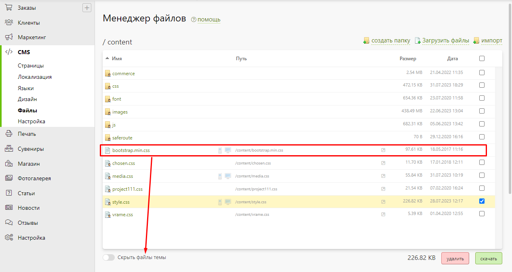
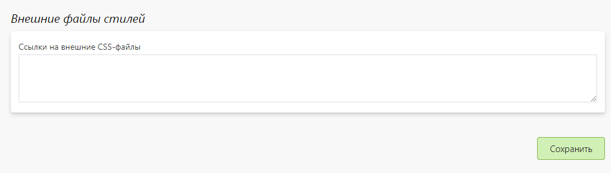

# Менеджер файлов
* В данном разделе представлены файлы, используемые на страницах сайта. Сюда добавляются файлы с изображеними для сайта, css- и js-файлы. Для удобства работы с ними рекомендуем организовывать многоуровневую структуру (папки).
* Каждый файл имеет своё название и индивидуальный путь к нему. Для удобства обращения к файлу в коде, в столбце "Путь" указан краткий путь к нему. Также для файлов указываются их размер и дата загрузки.
* Новые стили для сайта можно указывать либо в файле `style.css`, либо создать новый файл в папке css.
* Функция "__Скрыть файлы темы__" скрывает системные файлы.

* Также можно подключить стороние файлы стилей, используя тег `<link>`. Лучше подключать стили внутри тега `<head>`, но это необязательно.
* Например:
* `<head>`
*   `<link href="external.css" rel="stylesheet">`
* `</head>`
