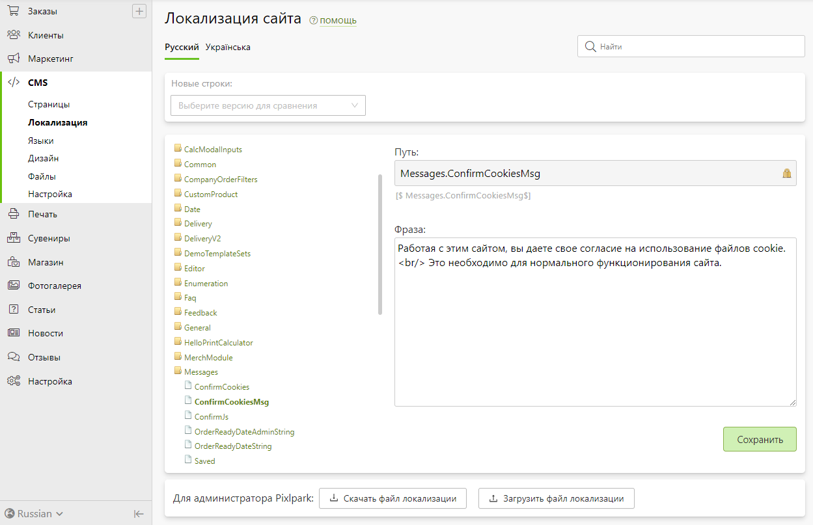

# Локализация сайта
* В данном разделе представлен набор коротких фраз, которые используются на сайте для перевода интерфейса. Это могут быть кнопки, информационные сообщения, заголовки таблиц или что-то еще.
* Для удобства изменения фраз:
    + Они сгруппированы в виде раскрывающегося дерева (слева).
    + В поле "__фильтр__" можно выделять все фразы либо искать по вхождению в них строки поиска.
* 