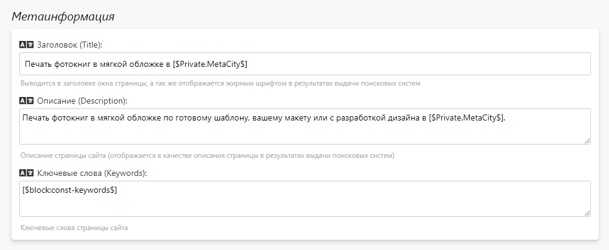
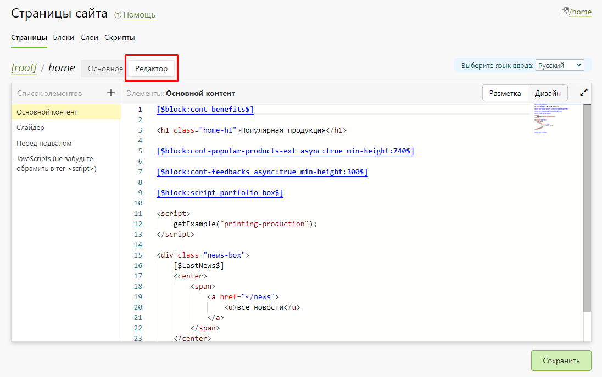
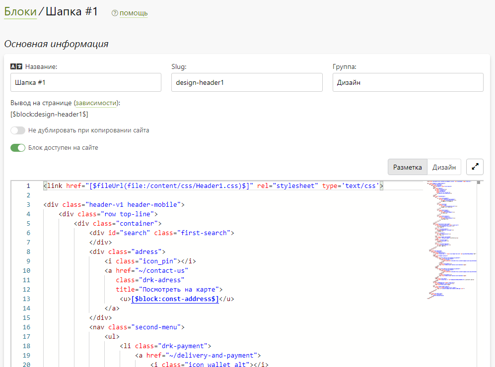
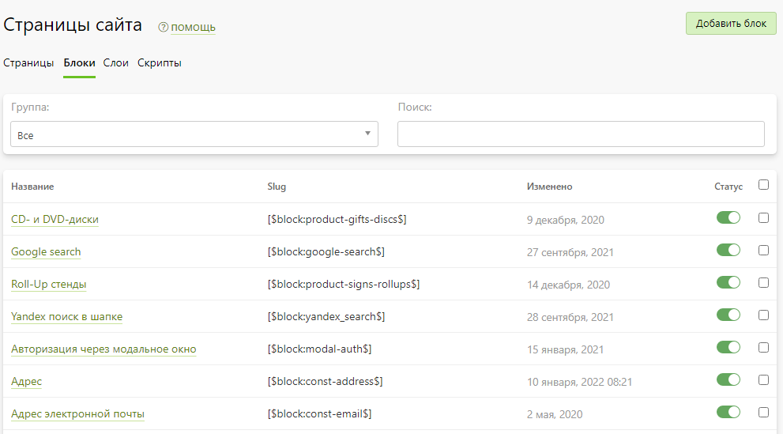
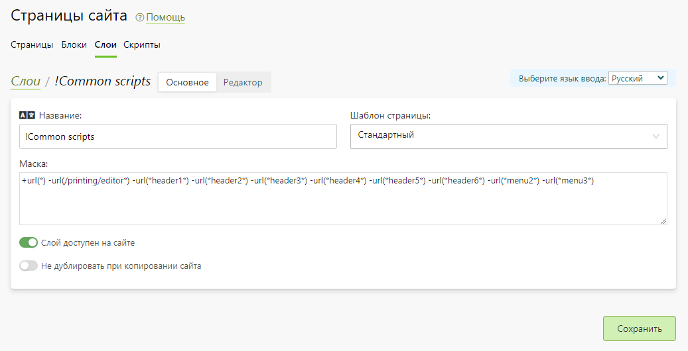
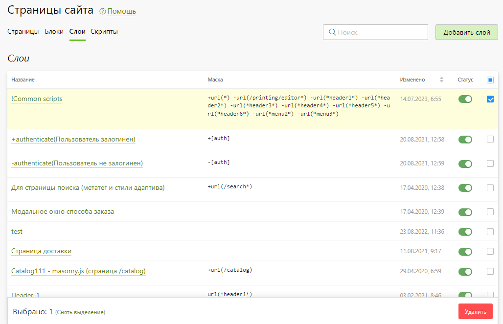

# Страницы сайта

## Список страниц
* 
* В данном разделе представлен список всех страниц сайта, сгруппированных в папки по уникальным адресам.
* Также в этом разделе можно:
    + Добавить новую страницу.
    + Перейти в карточку любой страницы.
    + Включить или выключить любую страницу.
    + Дублировать выделенные страницы.
    + Удалить выделенные страницы.
* 

## Карточка страницы
* __Содержание__
    + [Основная информация](/cms/pages?id=Основная-информация)
    + [Хлебные крошки](/cms/pages?id=Хлебные-крошки)
    + [Метаинформация](/cms/pages?id=Метаинформация)
    + [Редактор страницы](/cms/pages?id=Редактор-страницы) 

### Основная информация
* Страница - это страница сайта, доступная по уникальному адресу.

* Ниже перечислены основные параметры страницы.
* __Название__ - название страницы в панели управления, которое в том числе используется в качестве заголовка `H1`, если его нет в содержимом страницы и не задано поле "Заголовок".
* __Тип контента__ - тип содержимого страницы, который указывается в ответе сервера в заголовке "content-type".
    + __HTML__ - рекомендуем оставлять данный тип.
    + __XML__
    + __JS__
    + __JSON__
* __Шаблон страницы__ - предзаданный набор компоновки секций страницы:
    + __Стандартный__ - страница со всеми секциями.
    + __Без шапки и подвала__ - страница без двух обязательных секций "Шапка" и "Подвал".
    + __Пустой__ - страница с одной обязательной секцией "Контент" и без загрузки стандартных скриптов и стилей.
* __Заголовок__ - заголовок, который используется в качестве тега `H1`, если его нет в содержимом страницы.
* __Название в хлебных крошках__ - название страницы, которое выводиться в динамически формируемых хлебных крошках согласно настройкам раздела CMS.
* __Каноническая ссылка__ - ссылка, размещаемая в теге каночиности, которая в свою очередь размещается в секции `<head>` страницы сайта (`<link rel="canonical" href="https://example.com/sample-page/" />`).
* __Адрес в интернете__ - уникальный адрес страницы на сайте. Через "зависимости" можно посмотреть список используемых на странице блоков.

* К странице могут быть применены следущие настройки:
* + __Страница доступна на сайте__ - включить доступность страницы для посетителей и поисковых роботов.
* + __Отображать каноническую ссылку__ - размещать каноническую ссылку в заголовке страницы.
* + __Не дублировать при копировании сайта__ - выключить копирование данной страницы при копировании сайта.

### Хлебные крошки
* В данном разделе можно переопределить навигационные цепочки для текущей страницы. На странице они выводятся через константу `[$breadcrumbs$]`.
* Для использования стандартной навигации вы можете оставить данный раздел незаполненным.

### Метаинформация
* В данном разделе задается метаинформация страницы для поисковых систем (метаинформация) - заголовок, описание и ключевые слова.

### Редактор страницы
* В данной разделе задается содержимое секций, из которых формируется страница сайта. По умолчанию содержимое задается в виде HTML-разметки, которая также может содержать стили и скрипты.

## Карточка блока
* Блок - это произвольная HTML-разметка (+ стили + скрипты), которая может быть многократно использована на различных страницах сайта. Использование блоков позволяет минимизировать разметку страниц, делая ее более читабельной и лаконичной. Ниже перечислены основные параметры блока.
### Основная информация
* __Название__ - название блока в панели управления.
* __Slug__ - уникальный идентификатор блока на сайте.
* __Группа__ - название группы, в которую относиться данный блок. Задание групп для блоков позволяет фильтровать их на странице списка.
* __Вывод на странице__ - константа, позволяющая выводить на страницу содержимое блока. Через "зависимости" можно посмотреть список страниц, в которых используется данный блок.
* __Не дублировать при копировании сайта__ - выключить дублирование данной страницы при копировании сайта.
* __Блок доступен на сайте__ - включение доступности блока на страницах сайта.
* __Содержимое__ - HTML-разметка блока.

## Список блоков
* В данном разделе представлен список всех блоков сайта, которые можно фильтровать либо по группе, либо по строке поискового запроса.
* Также в этом разделе можно:
    + Добавить новый блок.
    + Перейти в карточку любого блока.
    + Включить или выключить доступность любого блока на сайте.
    + Дублировать выделенные блоки.
    + Удалить выделенные блоки.
* 

## Карточка слоя
* __Содержание__
    + [Описание](/cms/pages?id=Описание)
    + [Основная информация](/cms/pages?id=Основная-информация-2)
    + [Работа с маской](/cms/pages?id=Работа-с-маской)

### Описание
* Слой - это наборы HTML-разметки, которые автоматически добавляются к предзаданным секциям страницы в момент их отрисовки при соответствии адреса страницы заданной маске слоя. Ниже перечислены основные параметры блока.

### Основная информация
* __Название__ - название слоя в панели управления.
* __Шаблон страницы__ - предзаданный набор компоновки секций страницы.
* __Маска__ - регулярное выражение, определяющее адрес страницы сайта.
* __Не дублировать при копировании сайта__ - выключить копирование данного слоя при копировании сайта.
* __Слой доступен на сайте__ - включение доступности слоя на страницах сайта.
* __Поля разметки__ - HTML-разметка для каждой секции страницы.

### Работа с маской
* Для задания маски используются следующие термины и формулировки:
   + Регулярное выражение может состоять из нескольких правил. Если они прописаны в одну строку, то между ними применяется условие "И", а если в несколько - "ИЛИ".
   + __Знак "\*"__ - возможность следования любых символов в адресе искомой страницы (неточное совпадение).
   + `url(адрес)` или `+url(адрес)` - задание страницы с указанием ее относительного адреса, к которой нужно применять слой. Пример: `url(/user/cart)`.
   + `-url(адрес)` - задание страницы с указанием ее относительного адреса, к которой не нужно применять слой (в то время как к остальным страницам его применять нужно ). Пример: `url(/user/*) -url(/user/cart)`.
   + `[auth]` – применение слоя только к авторизованным пользователям;
   + `-[auth]` – применение слоя только к не авторизованным пользователям;
   + `[company]` – применение слоя только к клиентам, зарегистрированным в качестве организаций.
   + `-[company]` – применение слоя только к клиентам, зарегистрированным в качестве частных лиц;
   + `[mobile]` – применение слоя только к мобильной версии сайта;
   + `-[mobile]` – применение слоя только к настольной версии сайта.

* Приведем несколько примеров задания маски:
   + `url(*)` – применение слоя к любой странице сайта.
   + `url(*editor*)` – применение слоя к страницам, в адресе которых есть слово "editor".
   + `url(*editor*) -url(*approve*)` – применение слоя к страницам, в адресе которых есть слово "editor", за исключением страниц, в адресе которых есть слово "approve". В данном примере слой будут выводиться на страницах всех редакторов, но не будет выводиться на страницах утверждения макета.
   + `url(/user/cart)` – применение слоя только к странице корзины.
   + `url(/news/*)` – применение слоя к любым страницам новостей, за исключением страницы списка новостей.
   + `url(/news*)` – применение слоя к любым страницам новостей, включая страницу списка новостей.
   + `url(*) [auth]` – применение слоя к любым страницам сайта, но только для авторизованных посетителей.

## Список слоев
* В данном разделе представлен список всех слоев сайта, которые можно фильтровать либо по группе, либо по строке поискового запроса.
* Также в этом разделе можно:
    + Добавить новый слой.
    + Перейти в карточку любого слоя.
    + Включить или выключить доступность любого слоя на сайте.
    + Удалить выделенные слои.
* 

## Скрипты
* В данном разделе находятся три блока для размещения скриптов:
    + Блок для размещения в теге head сайта (код подтверждения собственности сайта).
    + Блок для размещения в нижней части сайта (счетчик посещений и код соц. сетей).
    + Блок для размещения на странице оплаты (расчет конверсии продаж).
* 