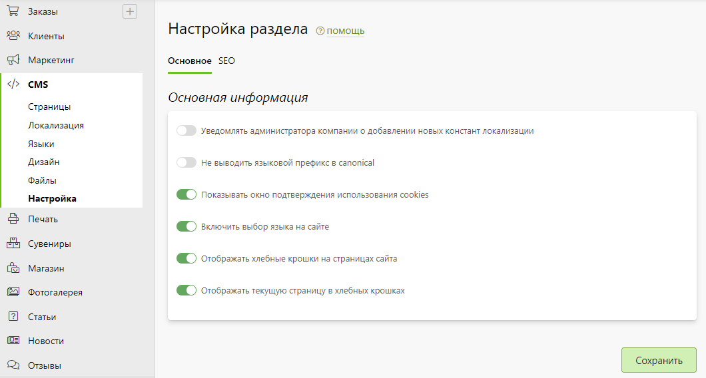

# Настройка

## Основная информация
* В данном разделе представлены общие настройки системы управления сайтом.

## Метаинформация
* В данном разделе задается метаинформация для поисковых систем - заголовок, описание и ключевые слова, которые по умолчанию используются для всех страниц сайта, если она у них не задана.
* Также есть возможность продублировать метаинформацию на все страницы сайта.
