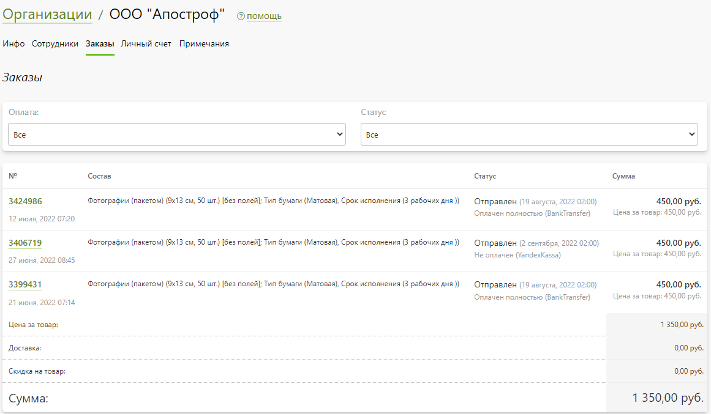

# Организации
## Карточка клиента
* __Содержание__
    + [Инфо](/customers/b2b?id=Основная-информация)
        + [Основная информация](/customers/b2b?id=Основная-информация)
        + [Сайты, где доступна организация](/customers/b2b?id=Сайты-где-доступна-организация)
        + [Объединение компаний](/customers/b2b?id=Объединение-компаний)
        + [Реквизиты юридических лиц](/customers/b2b?id=Реквизиты-юридических-лиц)
    + [Сотрудники](/customers/b2b?id=Список-сотрудников)
    + [Заказы](/customers/b2b?id=Список-заказов)
    + [Личный счет](/customer/b2b?id=Личный-счет)
    + [Примечания](/customers/b2b?id=Примечания-для-сотрудников)

### Инфо
#### Основная информация
* __Статус__ - положение клиента в системе:
    + __Зарегистрирован__ - устанавливается автоматически при регистрации клиента в системе.
    + __Проверен__ - может быть установлен сотрудником вручную, при оплате первого заказа, либо автоматически при регистрации, согласно настройкам раздела.
    + __Опасен__ - устанавливается сотрудником вручную, когда требуется дополнительная проверка заказов клиента, предоплата или согласование сроков исполнения.
    + __Заблокирован__ - устанавливается сотрудником вручную. Клиент с таким статусом не сможет совершить заказ на сайте.

* __Название__ - наименование организации, которая может включать в себя несколько юридических лиц.
* __Эл. почта__ - электронная  почта организации.
* __Телефон__ - контактный телефон организации.
* __Реквизиты по умолчанию__ - банковские реквизиты организации, которые будут использоваться для формирования платежных документов на сайте по умолчанию.
* __Дополнительный номер__ - внутренний номер клиента в системе, либо же назначенный сотрудником вручную (либо по API). Например, это может быть номер клиента во внешней системе для его идентификации.
* __Менеджер заказов__ - сотрудник компании, являющийся персональным менеджером.
* __Минимальный баланс для предупреждения__ - минимальная сумма на счете, при достижении которой система ежедневно отправляет уведомления организации о критическом балансе.
* __Порядок оплаты заказов__ -  
* __Битрикс24 ID__ - номер организации в CRM-системе Битрикс24.
* __Фактический адрес__ -  адрес фактического нахождения организации.

#### Сайты, где доступна организация
В данном разделе задается список сайтов, на которых данная организация выводится в качестве клиента.

#### Объединение компаний
Функция "_поглотить_" объединяет действующую компанию с найденной по поисковому запросу. Все заказы, сотрудники, реквизиты и операции по личному счету переносятся в выбранную организацию.

#### Реквизиты юридических лиц
* В данном разделе представлен список банковских реквизитов всех юридических лиц организации. При оплате заказа по безналичному расчету он (заказ) привязывается не только к организации, но и к ее  реквизитам. 

* Реквизиты можно добавлять, редактировать, дублировать и удалять. При регистрации клиента на сайте реквизиты могут автоматически заполняться по названию организации, ИНН или ОГРН.

### Список сотрудников
* Перечень сотрудников организации, в том числе являющихся частными лицами. Оформить заказ на сайте сотрудник может как частное лицо, либо от лица организации.
* Каждый сотрудник обладает одной из перечисленных ролей:
    + __Администратор__ - имеет доступ к списку всех заказов компании, изменению ролей сотрудников, редактированию данных организации, приглашению других пользователей.
    + __Супервайзер__ - имеет доступ к списку всех заказов компании, доступ к приглашению других пользователей.
    + __Менеджер__ - доступно только создание заказов от лица организации.
    + __Гость__ - числится в списке сотрудников организации без возможности создания заказов.
* Сотрудники с ролью в "Администратор" и "Супервайзер" имеют дополнительный функционал на сайте в личном кабинете по управлению данными организации.
* Также в панели управления в списке сотрудников можно отметить тех, кто будет получать уведомления о совершении заказов другими сотрудниками организации.

### Список заказов
* Список заказов, оформленных сотрудниками организации, которые можно отфильтровать состоянию оплаты и статусу заказа.

### Личный счет
* Состояние личного счета со списком операций пополнения и списания в качестве оплаты за заказ.

### Примечания для сотрудников
* Список комментариев сотрудников компании в отношении клиента с возможностью размещения новых.

## Список клиентов
В данном разделе представлен список организаций с возможностью их фильтрации и выполнения ряда действий.

### Фильтрация
*    + __Регистрация__ - место регистрации клиента:
        - На сайте или в приложении.
        - Только на сайте.
        - Только в приложении.
    + __Сайт__ - название сайта, где он был зарегистрирован.
    + __Тип__ - тип клиента:
        - Все - полный перечень клиентов.
        - Заказавшие - клиенты, оформившие заказ на сайте.
        - Потенциальные - клиенты, еще не оформившие заказ, но имеющие добавленные товары в корзину.
        - Посетители - клиенты, не оформившие заказ и не имеющие товаров в корзине.
        - Подписчики - клиенты, согласившиеся получать новостную рассылку (на странице регистрации или в профиле клиента).

### Действия
* В правом верхнем углу расположена кнопка, позволяющая выполнить следующие действия:
    + Добавить нового клиента с указанием названия организации и ее реквизитов (опционально).
    + Скачать список клиентов в виде эксель-таблицы.
    + Сменить статус организации.
    + При выделении организаций в правом нижнем углу появляется кнопка, позволяющая удалить выбранные организации.
    
* В списке клиентов можно изменить статус и перейти в карточку организации.

* При выделении клиентов из списка в правом нижнем углу появляются кнопки, позволяющие выполнить следующие условия:
    + Назначить менеджера для выбранных клиентов.
    + Удалить выбранных клиентов.