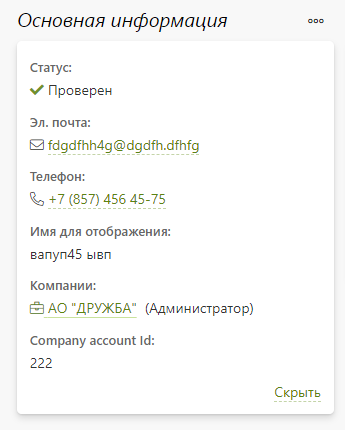
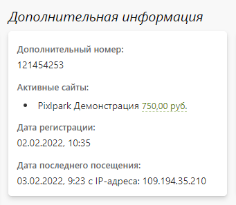
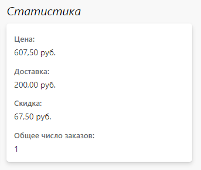

# Частные лица
## Карточка клиента
* __Содержание__
    + [Инфо](/marketing/customers?id=Основная-информация)
        + [Основная информация](/marketing/customers?id=Основная-информация)
        + [Доп. информация](/marketing/customers?id=Доп.-информация)
        + [Статистика](/marketing/customers?id=Статистика)
        + [Скидки](/marketing/customers?id=Скидки)
        + [Последние заказы](/marketing/customers?id=Последние-заказы)
        + [Товары в корзине](/marketing/customers?id=Товары-в-корзине)
    + [Заказы](/marketing/customers?id=Список-заказов)
    + [Скидки](/marketing/customers?id=Доступные-скидки)
    + [Личный счет](/marketing/customers?id=Личный-счет)
    + [Файлы](/marketing/customers?id=Загруженные-файлы)
    + [Увведомления](/marketing/customers?id=История-уведомлений)
    + [Примечания](/marketing/customers?id=Примечания-для-сотрудников)

### Основная информация
* __Статус__ - положение клиента в системе:
    + __Зарегистрирован__ - устанавливается автоматически при регистрации клиента в системе.
    + __Проверен__ - может быть установлен сотрудником вручную, при оплате первого заказа, либо автоматически при регистрации, согласно настройкам раздела.
    + __Опасен__ - устанавливается сотрудником вручную, например, когда требуется дополнительная проверка заказов клиента, предоплата или согласование сроков исполнения.
    + __Заблокирован__ - устанавливается сотрудником вручную. Клиент с таким статусом не сможет совершить заказ на сайте.

> В разделе "Заказы" рядом с именем клиента всегда выводится иконка, соответствующая его статусу.

* __Эл. почта__ - электронная  почта клиента.
* __Телефон__ - мобильный телефон клиента.
* __Имя для отображения__ - заданное сотрудником имя клиента, либо заданное самим клиентом ФИО.
* __Дополнительный номер__ - внутренний номер клиента в системе, либо же назначенный сотрудником вручную (либо по API). Например, это может быть номер клиента во внешней системе для его идентификации.
* __Менеджер заказов__ - сотрудник компании, который является персональным менеджером.
* __Активные сайты__ - список сайтов, на которых клиент был зарегистрирован или авторизован, с отображением средств на личном счете по каждому из них.
* __Дата регистрации__ - дата и время регистрации в системе.
* __Дата последнего посещения__ - дата, время и IP-адрес, с которого клиент последний раз заходил на сайт.
<table>
<tr valign="top">
<td>  </td>
<td>  </td>
<td>  </td>
</tr>
</table>

### Товары в корзине
* Список товаров в корзине клиента по данному сайту компании.

### Список заказов
* Список заказов клиента, которые можно отфильтровать по сайту, с которого заказ был оформлен, состоянию оплаты и статусу заказа.

### Доступные скидки
* Список скидок, которые либо сейчас, либо ранее были доступны клиенту.

### Личный счет
* Состояние личного счета со списком операций пополнения и списания в качестве оплаты за заказ.

### Загруженные файлы
* Список файлов, загруженных в систему клиентом, или сформированных системой для работы редакторов, которые можно скачать или удалить.

### Отправленные письма
* Список сформированных и отправленных по эл. почте клиенту писем-уведомлений.

### Отправленные SMS-сообщения
* Список сформированных и отправленных SMS-уведомлений.

### Примечания для сотрудников
* Список комментариев сотрудников компании в отношении клиента с возможностью размещения новых.

## Список клиентов

### Фильтрация
* Список клиентов с возможностью фильтрации по следующим критериям:
    + __Регистрация__ - место регистрации клиента:
        - На сайте или в приложении.
        - Только на сайте.
        - Только в приложении.
    + __Сайт__ - название сайта, где он был зарегистрирован.
    + __Тип__ - тип клиента:
        - Все - полный перечень клиентов.
        - Заказавшие - клиенты, оформившие заказ на сайте.
        - Потенциальные - клиенты, еще не оформившие заказ, но имеющие добавленные товары в корзину.
        - Посетители - клиенты, не оформившие заказ и не имеющие товаров в корзине.
        - Подписчики - клиенты, согласившиеся получать новостную рассылку (на странице регистрации или в профиле клиента).

### 2. Действия
* В правом верхнем углу расположена кнопка, позволяющая выполнить следующие действия:
    + Добавить нового клиента, указав его имя, фамилию, эл. почту, мобильный телефон, пароль и организацию. Последнее поле заполняется, когда требуется добавить клиента в качестве сотрудника организации (новой или существующей).
    + Скачать список клиентов в виде эксель-таблицы.
    + Скачать расширенный список клиентов в виде эксель-таблицы и доп. полями.
    + Скачать статистику по заказам - список клиентов с количеством выданных заказов и их суммой.
    + Загрузить список клиентов из эксель-файла.
    + Сменить статус клиента.

* В списке клиентов можно изменить статус и перейти в карточку частного лица.

* При выделении клиентов из списка в правом нижнем углу появляются кнопки, позволяющие выполнить следующие условия:
    + Назначить менеджера для выбранных клиентов.
    + Удалить выбранных клиентов.