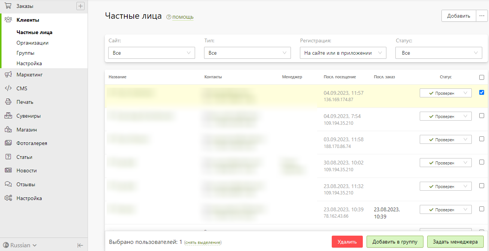
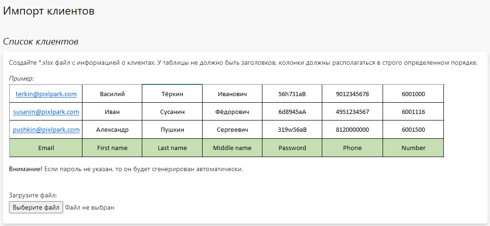

# Частные лица
## Карточка клиента
* __Содержание__
    + [Инфо](/customers/b2c?id=Инфо)
    + [Заказы](/customers/b2c?id=Список-заказов)
    + [Скидки](/customers/b2c?id=Доступные-скидки)
    + [Личный счет](/customer/b2c?id=Личный-счет)
    + [Файлы](/customers/b2c?id=Загруженные-файлы)
    + [Увведомления](/customers/b2c?id=История-уведомлений)
    + [Примечания](/customers/b2c?id=Примечания-для-сотрудников)

### Инфо
* __Содержание__
    + [Общая информация](/customers/b2c?id=Общая-информация)
    + [Информация о продажах](/customers/b2c?id=Информация-о-продажах)

#### Общая информация
* __Статус__ - положение клиента в системе (отображается в виде иконки напротив имени оформителя в списке заказов):
    + __Зарегистрирован__ - устанавливается автоматически при регистрации клиента в системе.
    + __Проверен__ - может быть установлен сотрудником вручную, при оплате первого заказа, либо автоматически при регистрации, согласно настройкам раздела.
    + __Опасен__ - устанавливается сотрудником вручную, например, когда требуется дополнительная проверка заказов клиента, предоплата или согласование сроков исполнения.
    + __Заблокирован__ - устанавливается сотрудником вручную. Клиент с таким статусом не сможет совершить заказ на сайте.

* __Эл. почта__ - электронная  почта клиента.
* __Телефон__ - мобильный телефон клиента.
* __Имя для отображения__ - заданное сотрудником имя клиента, либо заданное самим клиентом ФИО.
* __Дополнительный номер__ - внутренний номер клиента в системе, либо же назначенный сотрудником вручную (либо по API). Например, это может быть номер клиента во внешней системе для его идентификации.
* __Битрикс24 ID__ - номер клиента в CRM-системе Битрикс24.
* __Менеджер заказов__ - сотрудник компании, который является персональным менеджером.
* __Активные сайты__ - список сайтов, на которых клиент был зарегистрирован или авторизован, с отображением средств на личном счете по каждому из них.
* __Дата регистрации__ - дата и время регистрации в системе.
* __Дата последнего посещения__ - дата, время и IP-адрес, с которого клиент последний раз заходил на сайт.
* __Статистика__ - информация о всех выданных заказах клиента: их количество, стоимость, сумма доставки и скидки.

#### Информация о продажах
* __Скидки__ - список доступных скидок.
* __Заказы__ - список последних заказов.
* __Товары в корзине__ - список продуктов в корзине.

### Список заказов
* В данном разделе представлен список заказов клиента, которые можно отфильтровать по сайту, с которого заказ был оформлен, состоянию оплаты и статусу заказа.

### Доступные скидки
* В данном разделе представлен список скидок, которые либо сейчас, либо ранее были доступны клиенту.

### Личный счет
* В данном разделе представлено состояние личного счета со списком операций пополнения и списания в качестве оплаты за заказ.

### Загруженные файлы
* В данном разделе представлен список файлов, загруженных в систему клиентом, или сформированных системой для работы редакторов, которые можно скачать или удалить.

### Уведомления
* В данном разделе представлен список отправленных уведомлений с возможностью их фильтрации по типу (по почте или SMS) и статусу отправки.

### Примечания для сотрудников
* Список комментариев сотрудников компании в отношении клиента с возможностью размещения новых.

## Список клиентов
* В данном разделе представлен список клиентов с возможностью их фильтрации и выполнениЯ ряда действий.

### Фильтрация
*    + __Регистрация__ - место регистрации клиента:
        - На сайте или в приложении.
        - Только на сайте.
        - Только в приложении.
    + __Сайт__ - название сайта, где он был зарегистрирован.
    + __Тип__ - тип клиента:
        - Все - полный перечень клиентов.
        - Заказавшие - клиенты, оформившие заказ на сайте.
        - Потенциальные - клиенты, еще не оформившие заказ, но имеющие добавленные товары в корзину.
        - Посетители - клиенты, не оформившие заказ и не имеющие товаров в корзине.
        - Подписчики - клиенты, согласившиеся получать новостную рассылку (на странице регистрации или в профиле клиента).

### Действия
* В правом верхнем углу расположена кнопка, позволяющая выполнить следующие действия:
    + Добавить нового клиента, указав его имя, фамилию, эл. почту, мобильный телефон, пароль и организацию. Последнее поле заполняется, когда требуется добавить клиента в качестве сотрудника организации (новой или существующей).
    + Скачать список клиентов в виде эксель-таблицы.
    + Скачать расширенный список клиентов в виде эксель-таблицы и доп. полями.
    + Скачать статистику по заказам - список клиентов с количеством выданных заказов и их суммой.
    + Загрузить список клиентов из эксель-файла.
    + Сменить статус клиента.

* В списке клиентов можно изменить статус и перейти в карточку частного лица.

* При выделении клиентов из списка в правом нижнем углу появляются кнопки, позволяющие выполнить следующие условия:
    + Задать менеджера для выбранных клиентов.
    + Удалить выбранных клиентов.

## Импорт клиентов
* __Содержание__
    + [Описание](/customers/b2c?id=Описание)
    + [Список клиентов](/customers/b2c?id=Список-клиентов-1)
    + [Настройка импорта](/customers/b2c?id=Настройка-импорта)

### Описание
* В случае миграции интернет-магазина со сторонней платформы на Pixlpark зачастую требуется также перенестии и клиентскую базу. Для этого предусмотрен механизм импорта клиентов из внешнего эксель-файла, который вызывается нажатием кнопки "..." (рядом с кнопкой "Добавить") на странице списка частных лиц.

### Список клиентов
* Загрузка эксель-файла со списком клиентов, данные которых расположены в строго определенном порядке по столбцам (сама таблица не должна содержать заголовков):
    + Эл. почта.
    + Имя.
    + Фамилия.
    + Отчество.
    + Пароль.
    + Мобильный телефон (без пробелов и прочих разделителей, например “79069475081”).
    + Дополнительный номер.
* 

### Настройка импорта
* Задание параметром импрота клиентов:
    + Формат пароля - алгоритм шифрования пароля.
    + Привязка к сайтам - список сайтов, которые будут считаться активными для импортированных клиентов (см. карточку частного лица).
    + Обновлять данные, если пользователь с такой эл. почтой уже существует.
    + Переводить импортированных пользователей в проверенные.
    + Отправлять импортированным пользователем уведомления о регистрации.

* 