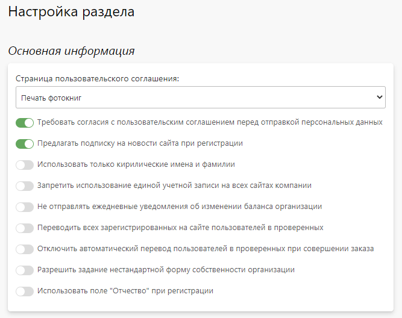
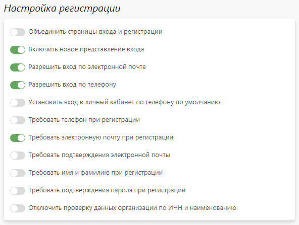
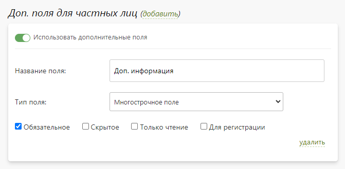
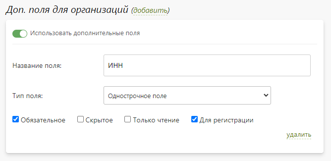

# Настройка

## Основная информация
В данном разделе представлены настройки, влияющие на общую логику обработки данных клиентов.

## Настройка регистрации
В данном разделе представлены настройки, влияющие на процесс регистрации клиентов на сайте.

## Доп. поля для частных лиц
* В данном разделе задается список дополнительных полей для частных лиц, которые отображаются на странице регистрации и личном кабинете.
* Каждое поле обладает следующим набором характеристик:
    + __Название поля__.
    + __Тип поля__:
        - Однострочное.
        - Многострочное.
        - Флаг (галочка).
        - Выпадающий список.
        - Дата.
    + __Поведение__:
        - Обязательное - обязательное для заполнения.
        - Скрытое - доступное для редактирования и просмотра только в панели управления.
        - Только чтение - доступное только для просмотра (редактируется в панели управления).
        - Для регистрации - отображается клиенту только на странице регистрации.

## Доп. поля для организаций
В данном разделе задается список дополнительных полей для организаций, которые отображаются на странице регистрации и личном кабинете (администратора организации).
