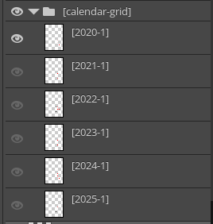
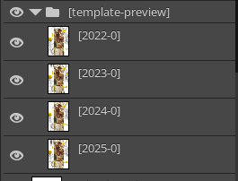
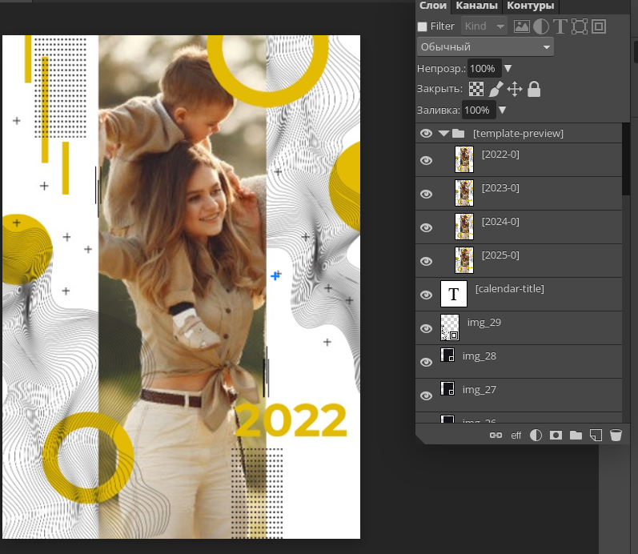
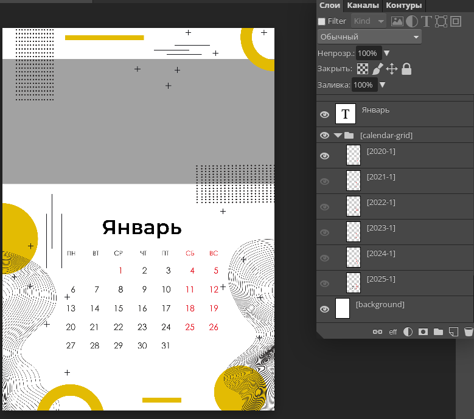

# Создание PSD-шаблонов для календарей

> Для создания PSD-шаблона для календарей можно использовать функционал, описанный в [общей информации о PSD шаблонах](/design/psd-general) с дополнениями, описанными ниже.

## Основная информация
* Шаблон календаря включает в свою структуру папку `[calendar-grid]`, в которой находятся графические слои с календарными сетками. При этом каждый слой должен именоваться `[2022-1]`, где "2022" – год, "1" – месяц.
* К примеру, в шаблоне (на один месяц) на 4 года, в папке `[calendar-grid]` должны быть 4 слоя: `[2022-1]`, `[2023-1]`, `[2024-1]`, `[2025-1]`. При этом все слои, кроме первого, должны быть скрыты.

* Если обложка календаря содержит год, то в качестве названия данного текстового слоя рекомендуем использовать константу `[calendar-title]`. В этом случае предзаданный год будет заменен на выбранный клиентом стартовый год календаря.
* Для того чтобы год на превью календаря менялся автоматически, необходимо использовать папку `[template-preview]`, содержащую слои календарных сеток с именами вида `[2022-0]`, где "2022" – год, "0" – обложка.

## Пример шаблона
* Обложка:

* Вы можете [скачать данный шаблон](https://pixlpark.ru/content/images/faq/polygraphy/calendars-cover.zip), а также [посмотреть его в редакторе](https://demo.pixlpark.ru/printing/wall-calendars/a4-vert/template-5471530/editor?q=1&p=13&ws=d751713988987e9331980363e24189ce).

* Разворот:

* Вы можете [скачать данный шаблон](https://pixlpark.ru/content/images/faq/polygraphy/calendars-reversal.zip), а также [посмотреть его в редакторе](https://demo.pixlpark.ru/printing/wall-calendars/a4-vert/template-5471530/editor?q=1&p=13&ws=d751713988987e9331980363e24189ce).