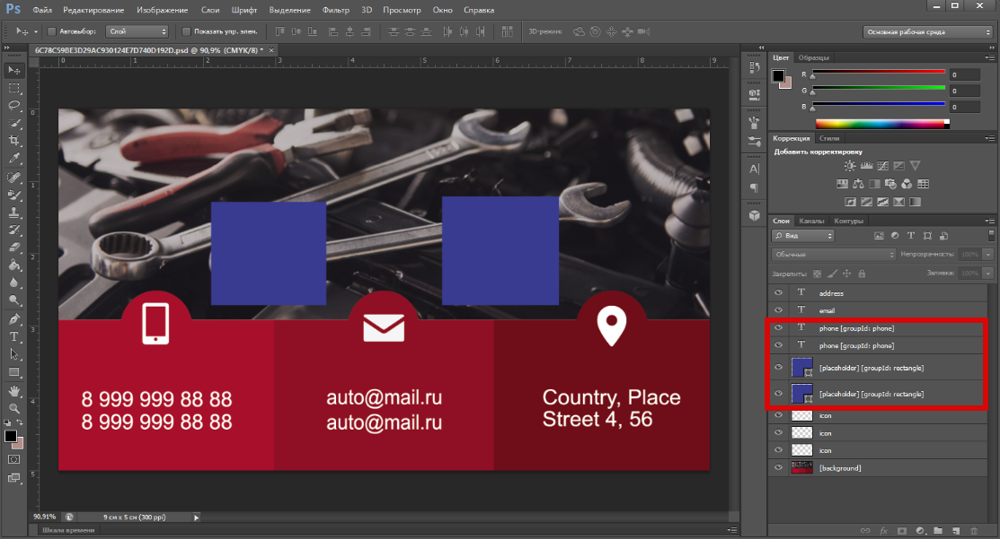

# Общая информация о PSD-шаблонах

## Основная информация
* В данной статье рассмотрены основные аспекты подготовки шаблона в формате PSD. Эти рекомендации и требования применимы к листовой печати, многостраничной продукции (фотокнигам, календарям) и сувенирам.
* По своей структуре шаблон может содержать растровые, текстовые и векторные слои, которые в редакторе будут преобразованы в растровые картинки.
* Разрешение также задается при создании шаблона. Для обычной листовой продукции достаточно 300 dpi, а для широкоформатной печати можно снизить его вплоть до 150 dpi.
* Отметим, что шаблоны, подготовленные в цветовой модели CMYK, в редакторе будут отображаться в модели RGB, но в файле для печати первоначальные значения CMYK цветов шаблона сохранятся.
* Важно, чтобы PSD-файл сохранялся в режиме максимальной совместимости файлов.

!> При подготовке шаблона не допустимо:   1. Применять эффекты для слоев.   2. Задавать прозрачность (opacity).   3. Использовать 16-битное цветовое пространство.
  Если слой использует эффекты или прозрачность, то перед загрузкой PSD-файла в редактор слой необходимо растрировать.

## Работа с графикой
* Растровые и векторные слои в редакторе всегда отображаются под текстовыми слоями.
* Доступные префиксы для графических слоев: 
    + `[locked]` – запрещает перемещать и удалять слой.
    + `[nonprintable]` – отображает данный слой в редакторе, но не включает в превью и в итоговый файл для печати.
    + `[template-preview]` – отображает данный слой в качестве обложки шаблона на его странице, но не выводит в редакторе.
    + `[align: Top | TopRight | Right | BottomRight | Bottom | BottomLeft | Left | TopLeft]` – задает выравнивание элементу, согласно одному из указаных значений.
    + `[background]` – считает данный слой фоновым, т.е. располагает самым нижним слоем. Все остальные слои будут располагаться над ним. Слой с этим префиксом автоматически расширяется на всю поверхность печати. Данное изображение будет отображаться в панели инструментов во вкладке "Фон".
    + `[foreground]` – считает данный слой обложкой, т.е. располагает всегда самым верхним слоем. Все остальные слои всегда будут располагаться под ним. Любые операции (редактирование, перемещение, удаление) с данным слоем невозможны.
    + `[placeholder]` – предзаданная область для загрузки пользовательских изображений. Пользователь может загрузить любое изображение (логотип или фотографию) вместо предзаданного, и оно будет вписано в границы области. Подробнее об использовании данного префикса написано в [статье про шаблоны для фотокниг](/design/photobooks). 
> Варианты настройки плейсхолдера:
> + Плейсхолдер в форме прямоугольника или квадрата, расположенный под прямым углом.  
Требуют отрисовки дополнительного контура и привязки к плейсхолдеру. В случае наличия пересекающихся плейсхолдеров необходимо отрисовать контур для каждого из них, а после - привязать контуры друг к другу. 
[Cкачать пример шаблона](https://pixlpark.ru/content/images/faq/polygraphy/books_simple_example.zip) или [посмотреть в редакторе](https://demo.pixlpark.ru/printing/softcover-photobooks/15x20-soft/template-6258067/editor).
> + Плейсхолдер в форме сложной фигуры. 
Отрисовка контура может осуществляться не пером, а инструментом создания фигур с последующим сохранением контура выделенной фигуры из ее слоя.  
[Cкачать пример шаблона](https://pixlpark.ru/content/images/faq/polygraphy/soft-book_example.zip) или [посмотреть в редакторе](https://demo.pixlpark.ru/printing/softcover-photobooks/15x20-soft/template-6258074/editor).
> + [Плейсхолдер с рамкой над изображением](/design/photobooks?id=Шаблон-с-рамками) 
[Cкачать пример шаблона](https://pixlpark.ru/content/images/faq/polygraphy/kollage_example.zip) или [посмотреть в редакторе](https://demo.pixlpark.ru/printing/collages/30x40/template-520445/editor).
> + Плейсхолдер в форме прямоугольника или квадрата, расположенный под углом. 
Загружаемое в плейсхолдер фото располагается под соответствующим углом и не поворачивается вручную внутри плейсхолдера. 
[Cкачать пример шаблона](https://pixlpark.ru/content/images/faq/polygraphy/books_example.zip) или [посмотреть в редакторе](https://demo.pixlpark.ru/printing/softcover-photobooks/15x20-soft/template-1531567/editor).

## Работа с текстом
* Текстовые слои в редакторе всегда отображаются над графическими слоями.

* Доступные префиксы для текстовых слоев: 
    + `[locked]` – запрещает перемещать и удалять слой.
    + `[optional]` – не выводит данный слой в выходном изображении редактора, если он не был изменен в нем.
    + `[align: Top | TopRight | Right | BottomRight | Bottom | BottomLeft | Left | TopLeft]` – задает выравнивание тексту, согласно одному из указаных значений.

* Размер текста нужно устанавливать в Adobe Photoshop только при помощи изменения кегля, то есть растягивать и сжимать текст при помощи трансформации нельзя.

* Короткий текст необходимо использовать для текстов длиной не более одной строки с необходимым типом выравнивания (по левому краю / по центру / по правому краю). Блочный текст можно использовать для любых текстовых блоков с выравниванием по левому краю.

* Обращаем внимание, что для сохранения введенных пользователем данных в редакторе при переключении шаблона одинаковые по семантике слои должны быть именованы идентично.  
 <!-- Например, есть два PSD-файла, которые содержат слой "email". Если пользователь в редакторе в шаблоне вписал свою почту, то при смене шаблона в редакторе введенное значение будет перенесено в новый шаблон.  -->

* Для создания шаблона можно использовать любые бесплатные шрифты из [Google Fonts](https://fonts.google.com/).
* Также можно использовать собственные шрифты, которые предварительно нужно загрузить в базу шрифтов. Подробнее о загрузке шрифтов можно прочитать в разделе ["Печать - Настройка - Шрифты"](/print/settings?id=Шрифты)

## Связанные плейсхолдеры или текстовые слои
* Текстовые слои или плейсхолдеры возможно связать между собой. Связанные объекты на уровне шаблона должны принадлежать к одной группе, задаваемой в названии слоя. В таком случае, при редактировании одного слоя из группы, содержимое остальных слоев этой же группы будет меняться автоматически. 
* Префикс для создания группы в слое:
    + `[groupId: GroupName]` - название группы.

#### Пример шаблона с использованием `groupID` 
