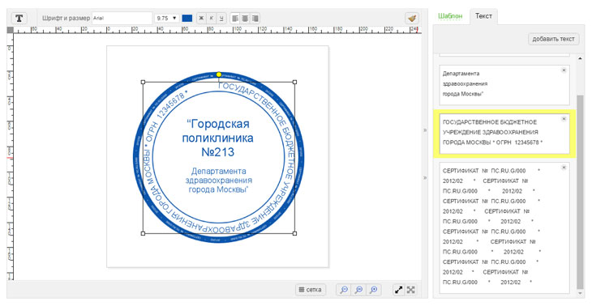
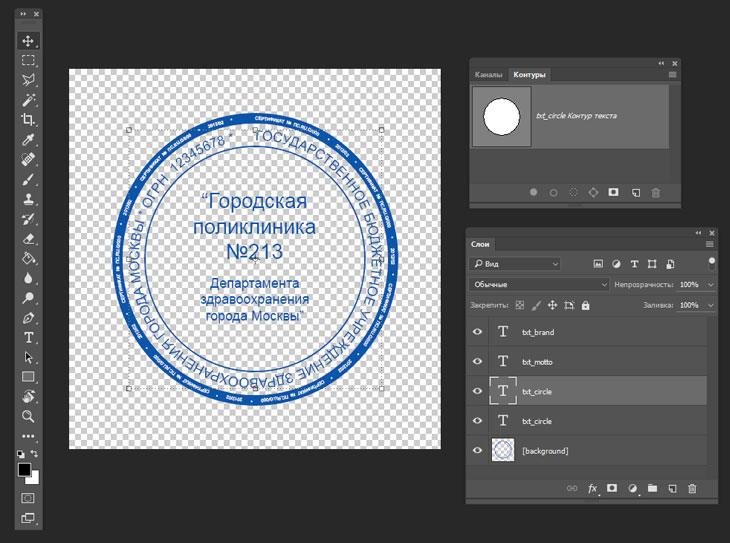
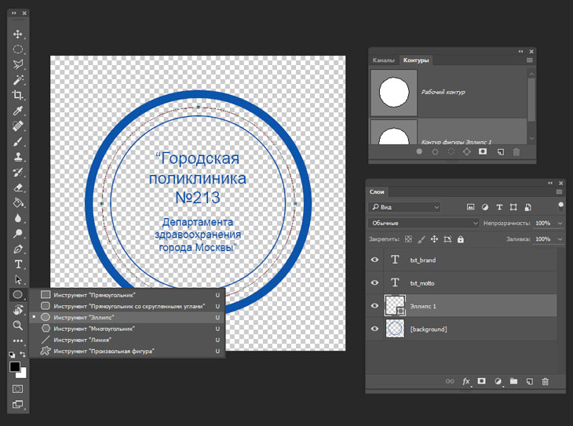
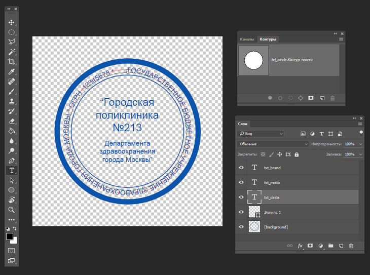
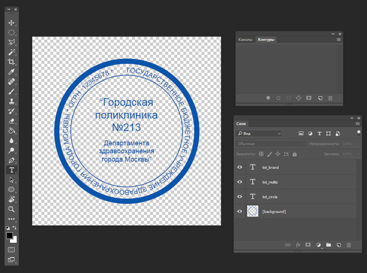

# Создание PSD-шаблонов для печатей и штампов

> Для создания PSD-шаблона для печатей и штампов использовать функционал, описанный в [общей информации о PSD шаблонах](/design/psd-general) с дополнениями, описанными ниже.

## Основная информация
> Данный тип шаблонов поддерживается только в старом редакторе дизайнов.

* __Текст по контуру__ – это текст, расположенный по периметру произвольной фигуры. Данная функция применяется для создания шаблонов печатей и штампов. С помощью этого метода можно разместить текст с поворотом или взять другую фигуру для расположения текста.

* Для создания текста по контуру никаких дополнительных констант не требуется. Все что необходимо сделать - это создать контур в панели "Контуры". Для начала посмотрим, как выглядит готовый макет.

* Создать контур для текста можно несколькими способами. Наверное, самый быстрый способ – это создать фигуру и вставить текст по ее окружности с помощью инструмента "Текст". 

* Если выбрать инструмент "Текст" и нажать на контур фигуры, появится точка начала текста. Далее можно добавить любую надпись.
На этом примере видно, что текст сохранил контур фигуры (окружности).

* Фигура нам уже не нужна, ее можно удалить.

## Специфика шаблона
* Для создания текста по контуру вы можете использовать инструмент "Перо" (вызывается нажатием латинской буквы «P»).
* По умолчанию в редакторе точка начала текста всегда находится на отметке 12 часов, т. е. сверху, и на данный момент изменить ее нельзя. То есть нужно рассчитывать, что текст, расположенный по фигуре, всегда будет начинаться сверху.