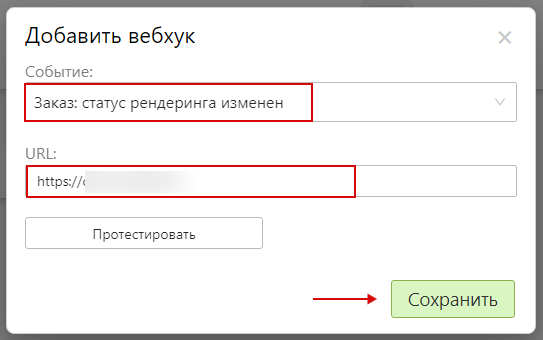

<!-- # Внедрение редактора во внешний интернет-магазин -->
<!-- * Любой редактор сервиса Pixlpark (включая механизм выбора шаблонов или принтов) может быть встроен во внешний сайт (интернет-магазин) 
Пример такой интеграции можно посмотреть на сайте [puzzlesprint.com](https://puzzlesprint.com/custom-puzzles/). -->

<!-- ## Общий алгоритм интеграции
* 1. Администратор в панели управления Pixlpark создает необходимый товар, который имеет свою уникальную ссылку в редактор.
* 2. Администратор в магазине создает страницу товара, размещая в ней iframe со ссылкой в редактор из п.1.
* 3. Клиент заходит в карточку товара магазина, тем самым запуская онлайн-редактор.
* 4. Клиент в онлайн-редакторе создает дизайн товара, нажимает кнопку "__Продолжить__", а после перенаправляется в корзину магазина, где уже находится заказываемый им товар.
* 5. Клиент завершает оформление заказа в магазине.
* 6. Администратору приходит уведомление от Pixlpark о поступившем заказе. Уведомление содержит общую информацию, а также ссылки на архив заказа и страницу заказа в панели управления Pixlpark.


## Техническая интеграция
* 1. Для динамического подключения редактора через iframe (формирования корректной ссылки) к разным продуктам интернет-магазина необходимо программно получать информацию о товарах и категориях, созданных в сервисе Pixlpark. Для этого можно использовать API, работа с которым описана в [соседнем разделе](/dev/api.md).<br>
Метод API `Products / GetProductCategoriesList` возвращает категории печати, `Products / GetProductsListByCategory` - продукты категории, а `Templates / GetTemplateSets` - доступные шаблоны.

* 2. Для обмена данными между онлайн-редактором (сервисом Pixlpark) небходимо:<br>
    2.1. К магазину подключить библиотеку jquery, а также плагин [jQuery postMessage](http://benalman.com/projects/jquery-postmessage-plugin/).<br>
    2.2. В панель управления Pixlpark в раздел `CMS / Сервисы` в поле "Скрипт, размещаемый в нижней части сайта" разместить код:
    ```html	
    <script type ="text/javascript" src="/content/js/jquery.ba-postmessage.min.js"></script>
    <script>
    $(document).ready(function () {
        if ($('.shopping-cart-container').length > 0) {
            $.postMessage($('#shoppingCartUser').val(), "http://yoursite.com/test", window.frames['pixlpark_frame']);
        }
    });
    //  http://yoursite.com/test – страница Сайта, обрабатывающая запрос от Сервиса
    </script>
    ```
    2.3. На страницах магазина разместить код:
    ```html						
    <script type="text/javascript">
    $(document).ready(function () {
        /* Обработка сообщения, полученного из iframe */
        $.receiveMessage(function (e) {
            var userId = e.data;
            // после этого можно закрыть iframe и сделать запрос по API к Сервису для получения информации о заказанном товаре
        });
    });
    </script>
    ```		
						
* 3. После создания дизайна и нажатии кнопки "Продолжить" в онлайн-редакторе сервис Pixlpark отправляет сообщение с Id-пользователя в магазин. На стороне интернет-магазина необходимо закрыть iframe с редактором.<br>
Т.к. в сервисе Pixlpark фактически формируется своя корзина, то для работы с ней нужно будет использовать длва метода API: `Shopping Cart / GetByUserId` и `Shopping Cart / DeleteShoppingCartItem`.
* 4. После оформления клиентом заказа в интернет-магазине необходимо инициировать создание заказа в сервисе Pixlpark, вызвав метод API `Orders / CreateOrder`.
* 5. При изменении параметров заказа или клиентских данных в интернет-магазине необходимо инициировать смену этих данных в сервисе Pixlpark, вызывая соответствующие методы API. -->

# Внедрение редактора дизайнов на внешний сайт

* Редактор дизайнов возможно использовать на внешнем (относительно сайта в сервисе Pixlpark) сайте. Например, на сайтах использующих WordPress, 1С-Битрикс, Joomla и прочие CMS.
* Редактор встраивается в несколько шагов:
    1. [Настройка платформы Pixlpark](/dev/editor?id=Настройка-платформы-Pixlpark).
    2. [Реализация аутентификации](/dev/editor?id=Реализация-аутентификации).
    3. [Встраивание редактора на страницу сайта](/dev/editor?id=Встраивание-редактора-на-страницу-сайта).
    4. [Получение файлов к печати](/dev/editor?id=Получение-файлов-к-печати).

## Настройка платформы Pixlpark
* Сайт в сервисе Pixlpark и внешний сайт должны быть подготовлены согласно следующим требованиям:
    + Сайт содержит доступные и настроенные категорию продукта и продукт с уникальной ссылкой в редактор, который необходимо интегрировать.
    + Внешний сайт должен работать на протоколе HTTPS.
    + Сайт должен работать на протоколе HTTPS (в разделе "__Настройка / Домены__" должна быть включена опция "__Использовать защищенное соединение (HTTPS)__").
    + Сайт находится на поддомене внешнего сайта, куда необходимо интегрировать редактор. Подробнее о настройках доменного имени можно узнать на [странице](https://docs.pixlpark.ru/#/site/domains).
    + В подразделе "__Основные настройки__" раздела "__Настройки / Доступ__" включена опция "__Разрешить встраивать сайт на внешние ресурсы (сайт должен работать с защищенным протоколом HTTPS и на поддомене ресурса)__" и указан внешний домен с протоколом.
    + В подразделе "__Доступность API__" раздела "__Настройки / Доступ__" включена опция "__Разрешить доступ к данным через API__".

* Интеграция необходимого редактора с внешним сайтом осуществляется при помощи идентификатора продукта, который может быть двух видов:
    + "__ID__" - уникальный идентификатор продукта. При удалении с сайта в сервисе Pixlpark продукта с указанным в интегрируемом редакторе ID на внешнем сайте редактор не будет работать.
    + "__categoryUrlName__" и "__productUrlName__" - идентификатор категории продукта и идентификатор продукта в URL. При отсутствии указания "__productUrlName__" редактор будет инициализирован первым доступным продуктом категории продукта.

## Реализация аутентификации
* Внешний редактор запускается в двух режимах: __Гость__ и __Пользователь__.
    + __Гость__ <br> В данном режиме доступны все функции редактора, за исключением сохранения дизайнов. Перед сохранением дизайна редактор запрашивает токен пользователя при помощи вызова метода `config.auth.getToken` (должен возвращать `Promise <string>`). Режим запускается при условии установления параметра `config.auth.userToken = null` в конфигурации редактора. Также, для данного режима необходимо реализовать метод `config.auth.getToken()` перед сохранением дизайна для получения токена пользователя.
    + __Пользователь__ <br> В данном режиме доступны все функции редактора. Режим запускается при условии установления параметра `config.auth.userToken` отличного от пустой строки или от `null` в конфигурации редактора. Далее, указанный токен будет проверен на сервере. В случае, если валидация токена не осуществится, редактор прекратит свою работу.

* Для получения токена пользователя необходимо реализовать взаимодействие с API Pixlpark.
* В случае, если пользователь аутентифицирован на внешнем сайте, необходимо получить или создать (при отсутствии данного пользователя на сайте в сервисе Pixlpark) через API Pixlpark и получить внешний токен:
    + `GET api.pixlpark.com/users/byEmail` и/или `POST api.pixlpark.com/users/create`.
    + `GET /users/{id}/frontendToken`.
* В случае, если пользователь не аутентифицирован на внешнем сайте, необходимо его зарегистрировать и создать его копию на сайте в сервисе Pixlpark.
    + `GET api.pixlpark.com/users/byEmail` и/или `POST api.pixlpark.com/users/create`.
    + `GET /users/{id}/frontendToken`.

## Встраивание редактора на страницу сайта
* Редактор встраивается в три этапа:
    1. [Подготовка страницы внешнего сайта](/dev/editor?id=Подготовка-страницы-внешнего-сайта).
    2. [Определение конфигурации редактора](/dev/editor?id=Определение-конфигурации-редактора).
    3. [Описание конфигурационного файла](/dev/editor?id=Получение-файлов-к-печати).

### Подготовка страницы внешнего сайта
* 
    + [Встраивание редактора с одним продуктом](/dev/editor?id=Подготовка-страницы-внешнего-сайта-для-встраивания-редактора-для-одного-продукта)
    + [Встраивание редактора с несколькими продуктами](/dev/editor?id=Подготовка-страницы-внешнего-сайта-для-встраивания-редактора-для-нескольких-продуктов)

#### Подготовка страницы внешнего сайта для встраивания редактора для одного продукта
* Для встраивания редактора на страницу внешнего сайта необходимо создать контейнер согласно коду
```html
    <div id="editorContainer" class="editor-container loading-wheel"></div>
```
* и добавить его в разметку страницы внешнего сайта. Редактор заполнит весь размер контейнера.
* Далее, добавить на страницу стилевые правила: 
```css
 .btn {background: #fff;border: solid 1px #ccc !important;box-shadow: #ddd 0 0 3px;color: #000 !important;}

 body {font-family: sans-serif;padding: 10px 40px}
 @keyframes cssload-spin {100% {transform: rotate(360deg);transform: rotate(360deg)}}

 .editor-container.error {border: solid 1px #983a3a;box-shadow: #e15959 0 0 3px;}
 .editor-container .error-message {position: relative;margin: 20px;text-align: left;color: #000000;font-family: monospace;
            z-index: 1000000000;background: #ffcece;padding: 10px 20px;border: solid 1px #a52020;}

 .editor-container {width: 65%; height: 600px; position: relative; border: solid 1px #ccc; box-shadow: #efefef 0 0 14px;}
 .loading-wheel:before {
        position:absolute;top:50%;left:50%;content:'';z-index:1112;display:block;width:32px;height:32px;margin:-16px 0 0 -16px;
        border: 2px solid rgb(117,117,117);border-radius: 50%;border-left-color: transparent;border-right-color: transparent;
        animation: cssload-spin 500ms infinite linear;
  }
 .loading-wheel:after{position:absolute;top:0;left:0;bottom:0;right:0;content:'';background:#fff;z-index:1111;opacity:.9;display:block}
```
* Затем, добавить скрипт для загрузки редактора на страницу внешнего сайта.
```js
    <script src="https://ваш-сайт-в-Pixlpark/api/externalEditor/js" onerror="onPxpError('Error while loading init script')" onload="onPxpLoaded()"></script>
```
> Скрипт необходимо расположить ближе к подвалу в разметке страницы.

#### Подготовка страницы внешнего сайта для встраивания редактора для нескольких продуктов
* Для встраивания редактора с несколькими продуктами на страницу внешнего сайта необходимо создать разметку согласно коду
```html
    <fieldset id="materialSelector" class="editor-products">
        <label class="editor-products__label">
            <input type="radio" name="editor" value="ID" checked> <!-- ID - id продукта 1-->
            Продукт 1
        </label>

        <label class="editor-products__label">
            <input type="radio" name="editor" value="ID"> <!-- ID - id продукта 2-->
            Продукт 2
        </label>
    </fieldset>
    <div id="editorContainer" class="editor-container loading-wheel"></div>
```
* и добавить еe в разметку страницы внешнего сайта. Редактор заполнит весь размер контейнера.
* Далее, добавить на страницу стилевые правила: 
```css
 .btn {background: #fff;border: solid 1px #ccc !important;box-shadow: #ddd 0 0 3px;color: #000 !important;}

 body {font-family: sans-serif;padding: 10px 40px}
 @keyframes cssload-spin {100% {transform: rotate(360deg);transform: rotate(360deg)}}

 .editor-products {box-sizing:border-box;display:flex;flex-wrap:wrap;align-items:baseline;padding:10px}
 .editor-products__label {margin: 0 15px}

 .editor-container.error {border: solid 1px #983a3a;box-shadow: #e15959 0 0 3px;}
 .editor-container .error-message {position: relative;margin: 20px;text-align: left;color: #000000;font-family: monospace;
            z-index: 1000000000;background: #ffcece;padding: 10px 20px;border: solid 1px #a52020;}
 .editor-container {width: 65%; height: 600px; position: relative; border: solid 1px #ccc; box-shadow: #efefef 0 0 14px;}
 .loading-wheel:before {
        position:absolute;top:50%;left:50%;content:'';z-index:1112;display:block;width:32px;height:32px;margin:-16px 0 0 -16px;
        border: 2px solid rgb(117,117,117);border-radius: 50%;border-left-color: transparent;border-right-color: transparent;
        animation: cssload-spin 500ms infinite linear;
  }
 .loading-wheel:after{position:absolute;top:0;left:0;bottom:0;right:0;content:'';background:#fff;z-index:1111;opacity:.9;display:block}
```
* Затем, добавить скрипт для загрузки редактора на страницу внешнего сайта.
```js
    <script src="https://ваш-сайт-в-Pixlpark/api/externalEditor/js" onerror="onPxpError('Error while loading init script')"></script>
```
> Скрипт необходимо расположить ближе к подвалу в разметке страницы.


### Определение конфигурации редактора
* 
    + [Встраивание редактора с одним продуктом](/dev/editor?id=Определение-конфигурации-редактора-для-одного-продукта)
    + [Встраивание редактора с несколькими продуктами](/dev/editor?id=Определение-конфигурации-редактора-для-нескольких-продуктов)

#### Определение конфигурации редактора для одного продукта
* Определить конфигурацию редактора на странице внешнего сайта необходимо при помощи кода:
```js
const container = document.getElementById('editorContainer');
const designEditorConfig = {
    product: {
        productUrlName: "идентификатор_продукта", //например, "50x90-one-sided"
        categoryUrlName: "идентификатор_категории_продукта", //например, "businesscards-template"
    },
    auth: {
        getToken: () => {
            return new Promise((resolve, reject) => {
                var token = prompt('Enter user auth token:');
                if (token.length > 0)
                    resolve(token);
                else
                    reject();
            })
        }
    },
    ui: {
        layoutMode: "auto",
        //header: null
    },
    events: {
        onError: (error) => { onPxpError(error); },
        onReady: () => {
            console.log("Editor ready");
            container.classList.remove("loading-wheel")
            console.log("Current user", window.editor.userInfo);
        },
        onCartItemCreated: (response) => {
            var confirm = window.confirm(`Положили товар: ${response.shoppingCartItemId}. Перейти в корзину?`);
            if (confirm) {
                window.location.href = originUrl + response.redirectUrl;
            }
        },
        onPriceChanged: (newPrice) => {
            console.log("New price recieved", newPrice);
            document.getElementById("externalPrice").innerHTML = newPrice.totalPriceString
        }
    },
}
// Обработчик ошибок
function onPxpError(error) {
    container.classList.remove("loading-wheel")
    container.classList.add("error")
    const errorDiv = document.createElement("div");
    errorDiv.className = "error-message"
    errorDiv.innerText = error;
    container.appendChild(errorDiv)
}
// Этот код вызывается после загрузки скрипта редактора
function onPxpLoaded() {
    var editor = pxp.external.createDesignEditor(container, designEditorConfig);
    editor.render();
    window.editor = editor;
}
```
> Скрипт необходимо расположить после скрипта загрузки редактора.

#### Определение конфигурации редактора для нескольких продуктов
* Определить конфигурацию редактора на странице внешнего сайта необходимо при помощи кода:
```js
    function initEditor(materialId) {
        const container = document.getElementById('editorContainer');
        const designEditorConfig = {
        product: {
            id: materialId, 
            design: {
            },
        },
        auth: {
            getToken: () => {
                return new Promise((resolve, reject) => {
                    var token = prompt('Enter user auth token:');
                    if (token.length > 0)
                        resolve(token);
                    else
                        reject();
                })
            }
        },
        ui: {
            layoutMode: "auto",
            //header: null
        },
        events: {
            onError: (error) => { onPxpError(error); },
            onReady: () => {
                console.log("Editor ready");
                container.classList.remove("loading-wheel")
                console.log("Current user", window.editor.userInfo);
            },
            onCartItemCreated: (response) => {
                var confirm = window.confirm(`Положили товар: ${response.shoppingCartItemId}. Перейти в корзину?`);
                if (confirm) {
                    window.location.href = originUrl + response.redirectUrl;
                }
            },
            onPriceChanged: (newPrice) => {
                console.log("New price recieved", newPrice);
                document.getElementById("externalPrice").innerHTML = newPrice.totalPriceString
            }
        },
        };       
        var editor = pxp.external.createDesignEditor(container, designEditorConfig);
        editor.render();
        window.editor = editor;
    }
// Обработчик ошибок
function onPxpError(error) {
    container.classList.remove("loading-wheel")
    container.classList.add("error")
    const errorDiv = document.createElement("div");
    errorDiv.className = "error-message"
    errorDiv.innerText = error;
    container.appendChild(errorDiv)
}
// Изменение продукта в редакторе
function updateMaterial(){
			var fieldset = document.getElementById("materialSelector");
			var materialId = [...fieldset.querySelectorAll("input")].find((input)=> input.checked).value;
			if (materialId != null){
				if (window.editor != null && window.editor.editor != null){
					window.editor.editor.destroy();
				}
				initEditor(parseInt(materialId));
			}	
		}
document.getElementById("materialSelector").addEventListener("change", updateMaterial);
updateMaterial();
```
> Скрипт необходимо расположить после скрипта загрузки редактора.

### Описание конфигурационного файла

```js
interface IDesignEditorConfig {
    // Конфигуратор интерфейса редактора 
    ui?: {
        // Задает тип интерфейса: обычный или мобильный
        // Возможные значения: "auto", "desktop", "mobile"
        // Значение по умолчанию: "auto"
        layoutMode: "auto" | "desktop" | "mobile" | null;

        // Выводит предупреждение при покидании страницы
        // Значение по умолчанию: true
        captureWindowUnload?: boolean;

        // Настройка верхней панели редактора. При значении null панель не выводится.
        header?: {
            // Отображать кнопку домой
            // Значение по умолчанию: true
            homeButton?: boolean;

            // Изображение для кнопки домой. Если значение не указано или равно null будет установлен логотип из настройки сайта
            // Значение по умолчанию: null
            homeButtonImageUrl?: string | null;

            // Отображение хлебных крошек
            // Значение по умолчанию: true
            breadCrumbs?: boolean;

            // Отображение кнопки "Сохранить"
            // Значение по умолчанию: true
            saveButton?: boolean;

            // Отображение кнопки "Предпросмотр"
            // Значение по умолчанию: true
            previewButton?: boolean;

            // Отображение кнопки "Заказать"
            // Значение по умолчанию: true
            addToCartButton?: boolean;

            // Отображение цены в кнопке "Заказать"
            // Значение по умолчанию: true
            price?: boolean;
        } | null;
    },

    // События редактора
    events?: {
        // Вызывается после того, как товар был добавлен в корзину.
        onCartItemCreated?: (state: { redirectUrl: string; shoppingCartItemId: number; userId: number;}) => void,

        // Вызывается при изменениях в редакторе
        onStateChanged?: (event: HistoryEvent) => void,

        // Вызывается после того как редактор загружен и готов к работе
        onReady?: () => void,

        // Вызывается при изменении цены
        onPriceChanged?: (newPrice: { totalPrice: number; totalPriceString: string; quantity: number; }) => void,

        // Вызывается при возникновении непредвиденной ошибки
        onError?: (error: string) => void,
    },

    // Настройка товара
    product: {
        // ID продукта. Можно указать ID либо categoryUrlName и productUrlName
        id?: number,
        // Количество разворотов у продукта
        pages?: number | null,

        // Часть URL категории товара
        categoryUrlName?: string,

        // Часть URL товара
        productUrlName?: string,

        // Кол-во товара. При отсутствии значения редактор устанавливает кол-во по умолчанию
        quantity?: number,

        // Внешняя калькуляция цены. При самостоятельном расчете цены необходимо реализовать этот метод
        // Метод необходимо вызвать, когда нужно отобразить цену
        calculatePrice?: (state: IVectorEditorPriceCalculatorInfo) => Promise<{ totalPrice: number; totalPriceString: string; quantity: number; }>,

        // Загрузка дизайна
        design: {
            // ID шаблона для загрузки при инициализации
            templateId?: number;

            // Состояние которое необходимо загрузить. Например, элемент корзины или сохраненный дизайн
            state?: IDesignEditorState | null,
            
            // Клипарты
            clipart?: {
                // Идентификатор клипарта 
                clipartSetId: number,

                // Идентификатор файла клипарта 
                clipartFileId: number
            }
        }
    }

    // Аутентификация
    auth: {
        // Этот метод будет вызван если не задан userToken и необходим зарегистрированный пользователь
        getToken: () => Promise<string>,

        // Токен зарегистрированного пользователя
        // При его указании редактор попробует войти под этим токеном
        // Если не получится, редактор завершит работу с ошибкой
        userToken?: string,
    }
}

//Конфигурация для внешней калькуляции стоимости
interface IVectorEditorPriceCalculatorInfo {
    // Конфигурация стоимости зоны печати
    surfaces: IVectorEditorSurfacePriceInfo[];
    // Общее количество зон печати
    totalSurfaceCount: number;
    // Общее количество заполненных зон печати
    totalFilledSurfaceCount: number;
}

// Конфигурация стоимости зоны печати
interface IVectorEditorSurfacePriceInfo {
    // Индекс поверхности
    index: number;
    // Индекс зоны печати
    zoneIndex: number;
    // Название зоны печати
    zoneName: string;
    // Ширина зоны печати
    zoneWidth: number;
    // Высота зоны печати
    zoneHeight: number;
    // Цена зоны печати
    zonePrice: number;
    // Заполненность зоны печати
    isFilled: Boolean;
}
```

## Получение файлов к печати
* После нажатия кнопки "__Заказать__" в модальном окне утверждения дизайна редактора, заказываемый продукт добавляется в корзину Pixlpark. Затем отображается реализованный на внешнем сайте хэндлер `onCartItemCreated`, в который передается идентификатор пользователя (`userId`) и идентификатор позиции корзины (`shoppingCartItemId`) Pixlpark.
* Далее, в `onCartItemCreated` необходимо:
    + Закрыть редактор (например, если он был в div-элементе).
    + Добавить позицию в корзину внешнего сайта.
    + Инициировать подготовку файлов для печати.
* При желании к позиции корзины внешнего сайта можно прикрепить превью созданного дизайна, которое находится у соответствующего элемента корзины Pixlpark. Для этого нужно с помощью [API-метода](https://docs.pixlpark.ru/#/dev/api) __Get By UserId__ (/cart/{userId}) получить всю корзину, а уже затем найти интересующий элемент по `shoppingCartItemId`.
* Отметим, что корзина Pixlpark хранится ровно 14 дней. После чего ее содержимое удаляется. Поэтому, на внешнем сайте надо либо предусмотреть аналогичную логику с уведомлением клиента об очистке корзины, либо в этот срок инициировать подготовку файлов для печати.
* Подготовка файлов к печати в свою очередь состоит из нескольких этапов:
1. С помощью [API-метода](https://docs.pixlpark.ru/#/dev/api) __Create Order__ (/orders/create) необходимо создать заказ, передав в качестве его параметров __userId__, __shoppingCartItemId__ и __shippingId__, где __shippingId__ - это идентификатор любой активной доставки, определенной в панели управления Pixlpark в разделе "__Настройка / Доставка / Способы доставки__".

2. В панели управления Pixlpark в разделе "__Маркетинг / Уведомления / Настройка вебхуков__" добавить вебхук "__Заказ: статус рендеринга изменен__", указав URL-адрес для отправки информации о появлении нового готового к печати заказа.

3. Реализовать обработчик для вебхука выше, который будет содержать ссылку на архив заказа с файлами для печати (`DownloadLink`). 