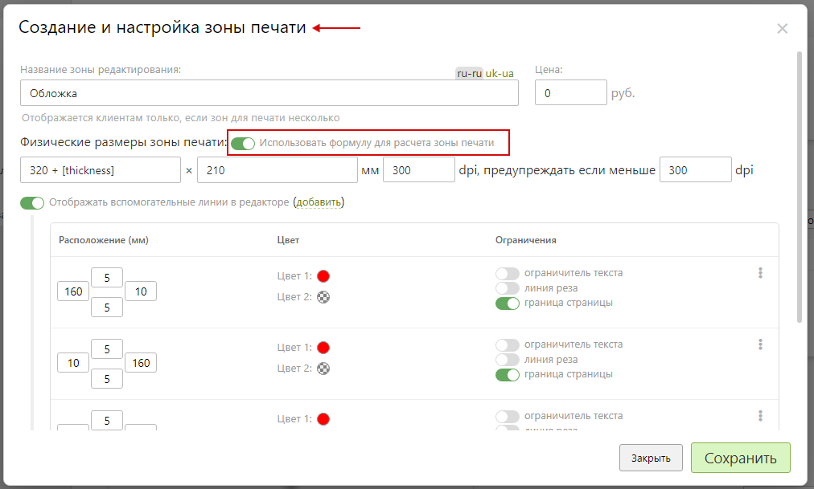

# Редактор дизайнов
* Редактор используется для самостоятельной настройки дизайна продукта или использования какого-либо шаблона.

#### Настройка редактора с автоматическим увеличением ширины обложки
* Для настройки автоматического увеличения ширины обложки необходимо использовать формулу для расчета ширины обложки.
* Для этого в разделе "__Редактор__" необходимого товара (фотокниги) в подразделе "__Поверхности печати__" открыть зону печати "__Обложка__".

* Затем, в настройках зоны печати включить "__Использовать формулу для расчета зоны печати__". 

* После, скорректировать начальную ширину обложки согласно формуле:
```	formula
Ширина обложки = ширина обложки без корешка + константа [thickness],
где
ширина обложки без корешка = ширина обложки готового изделия с учетом корешка - (минимальное количество разворотов * толщина корешка одного разворота). 
```

!>Толщину разворота необходимо указать в настройках поверхности для разворотов.
* 
* Далее, нажать "__Сохранить__".

#### Настройка редактора с постраничным рендерингом
* Для настройки постраничного рендеринга в разделе "__Редактор__" необходимого товара в подразделе "__Поверхности печати__" открыть зону печати для разворота.

* Далее, в настройках зоны печати включить "__Зона рендеринга не совпадает с зоной редактирования__".

* Затем, внести данные:
    + __X__, __Y__ - координаты левой верхней точки зоны рендеринга.
    + __Ширина__ - ширина зоны рендеринга.
    + __Высота__ - высота зоны рендеринга.
* 
> Добавить новую зону можно при помощи "__Добавить__".
* 
> Для разделения разворота на две страницы с перекрытием в 10 мм, необходимо указать две зоны рендеринга. При этом каждая зона рендеринга должна быть на 10 мм больше половины разворота. Дополнительно для второй зоны рендеринга необходимо сместить координату __Х__ на 10 мм левее середины разворота.
* 