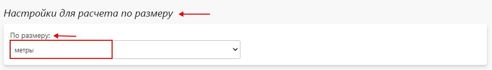
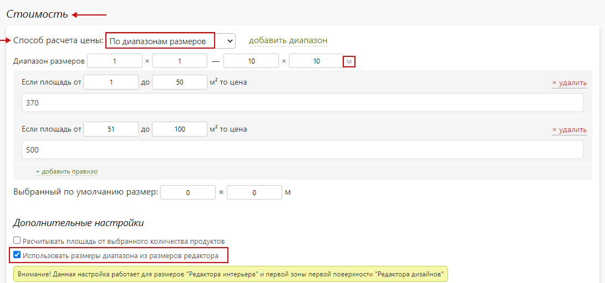

# Редактор интерьера

#### Настройки для расчета по размеру
> Данная функция используется для размеров "Редактора интерьера" и первой зоны первой поверхности "Редактора дизайнов".
* Выбор единицы измерения в опции позволяет указать значение диапазона размеров при расчете цены "По диапазонам размеров" в позиции опции в нужной единице измерения.

* Для этого в подразделе "__Дополнительные настройки__" необходимо включить "__Использовать размеры диапазона из размеров редактора__".
