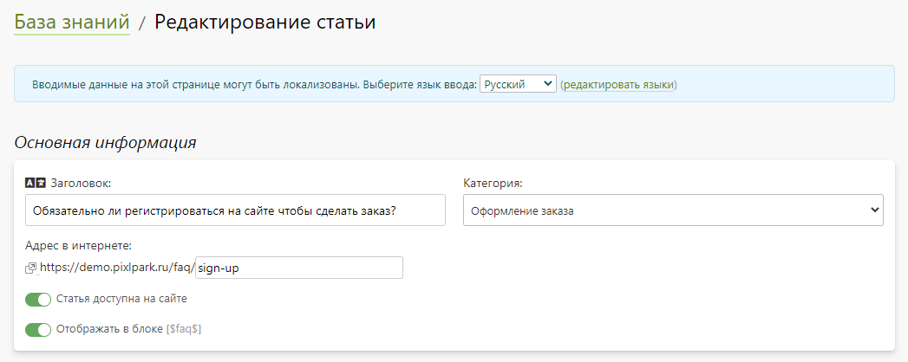
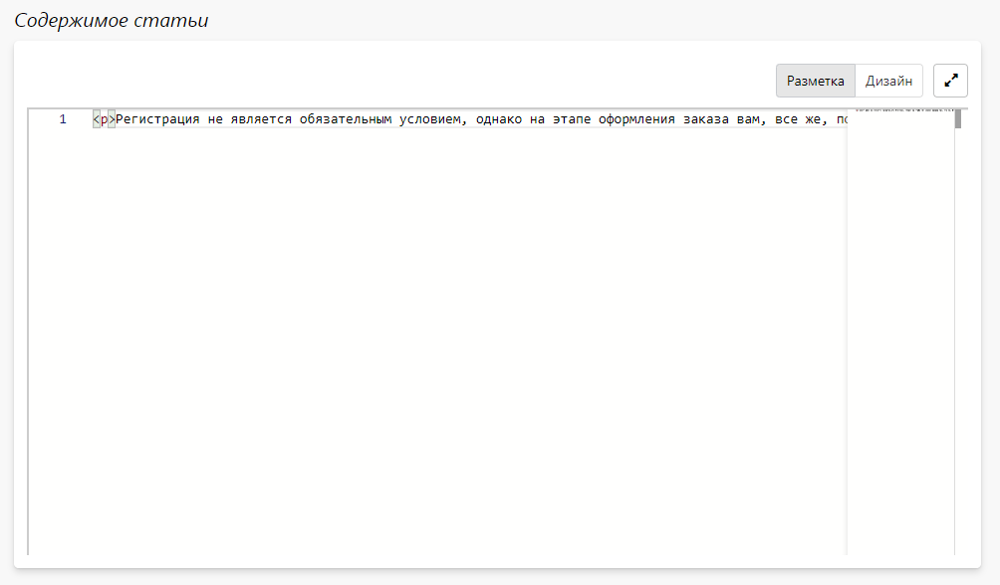
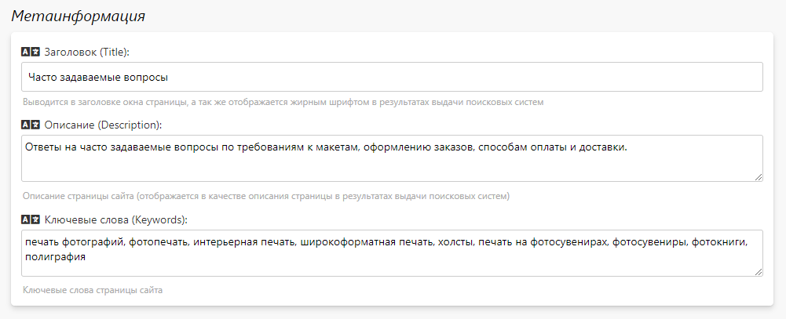
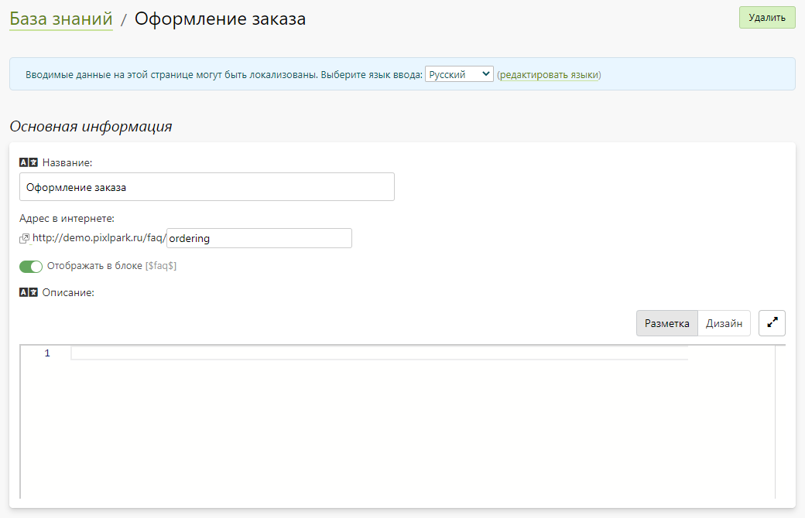
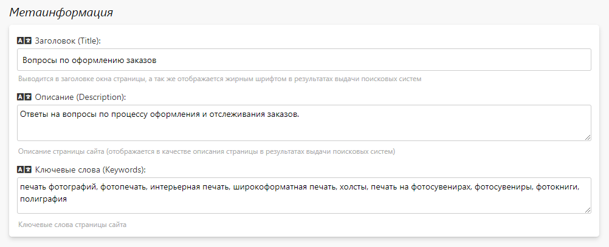
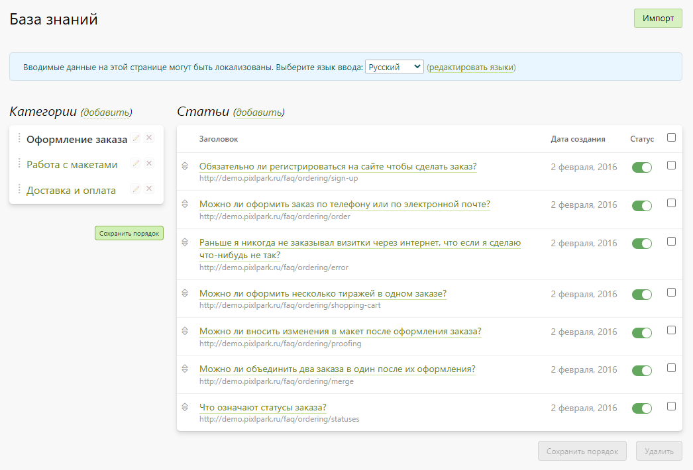

# База знаний
## Описание
* База знаний - это раздела сайта, доступный по адресу [/faq](https://demo.pixlpark.ru/faq), на котором публикуется дополнительная информация о правилах работы сайта, особенностях оформления заказа, сроках производства, способах доставки, вариантах оплаты и требованиях к макетам. 
* Статьи в базе знаний могут группироваться по категориям. И в зависиммости от настроек выводиться либо все сразу на единой странице, либо каждая на своей.
* Отметим, что блок с названием категорий и содержимым статей можно выводить на произвольной странице сайта через константу `[$faq$]`.

## Карточка статьи
### Основная информация
* __Заголовок__ - заголовок, который используется в качестве `H1`, если его нет в содержимом статьи.
* __Категория__ - категория, в которой размещается данная статья
* __Адрес в интернете__ - уникальный адрес статьи на сайте.
* __Статья доступна на сайте__ - отображать статью на сайте в указанной категории.
* __Отображать в блоке `[$faq$]`__ - отображать статью в блоке, формируемом через константу `[$faq$]`.

### Содержимое статьи
* В данной разделе задается содержимое статьи. По умолчанию содержимое задается в виде HTML-разметки, которая также может содержать стили и скрипты.

### Метаинформация
* В данном разделе задается информация для поисковых систем (метаинформация) - заголовок, описание и ключевые слова.

## Карточка категории

### Основная информация
* __Название__ - название категории, которое отображается на сайте и в панели управления.
* __Адрес в интернете__ - уникальный адрес статьи на сайте. 
* __Отображать в блоке `[$faq$]`__ - отображать категорию в блоке, формируемом через  константу `[$faq$]`.
* __Описание__ - описание категории в виде HTML-разметки, которая также может содержать стили и скрипты.

### Метаинформация
* В данном разделе задается информация для поисковых систем (метаинформация) - заголовок, описание и ключевые слова, которые используются по умолчанию для категорий и всех вложенных статей, если она у них не задана. Однако для каждой статьи можно задать свою собственную информацию.

## Список статей и категорий
* В данном разделе представлен список категорий и статей в каждой из них.
* Также в этом разделе можно:
    + Импортировать весь раздел с другого сайта.
    + Добавить новую категорию.
    + Перейти в карточку категории
    + Изменить порядок следования категорий.
    + Удалить любую категорию со вложенными в нее статьями.
    + Добавить новую статью.
    + Перейти в карточку статьи.
    + Включить или выключить публикацию статьи на сайте.
    + Изменить порядок следования статей в категории.
    +Удалить выбранные статью.

