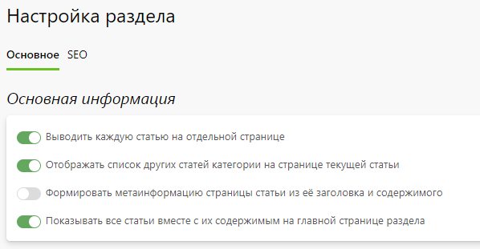
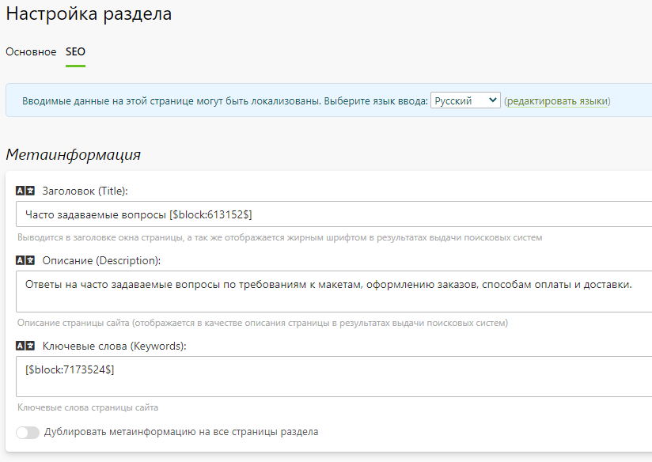

# Настройка
## Основная информация
* В данном разделе представлены общие настройки базы знаний.

## Метаинформация
* В данном разделе задается информация для поисковых систем (метаинформация) - заголовок, описание и ключевые слова, которые используются по умолчанию для всех категорий и статей, если она у них не задана. Однако для каждой категории и статьи  можно задать свою собственную информацию.
