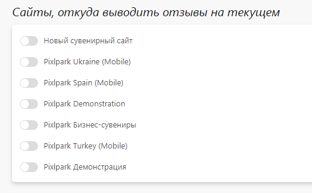

# Настройка

## Основная информация
* В данном разделе представлены общие настройки гостевой книги.

## Сайты с внешними отзывами
* В данном разделе представлен список сайтов, с которых можно автоматически выводить отзывы на текущем. 
*
> Данный механизм используется для запуска федеральных проектов, чтобы при публикации отзывов на одном сайте они автоматически отображались на других региональных.

## Метаинформация
* В данном разделе задается информация для поисковых систем (метаинформация) - заголовок, описание и ключевые слова, которые по умолчанию используются для всех страниц гостевой книги.
