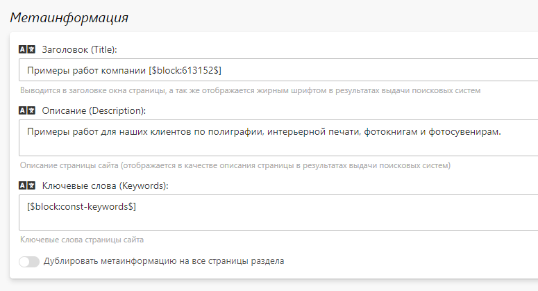

# Настройка
## Основная информация
* В данном разделе представлены общие настройки фотогалереи.

## Метаинформация
* В данном разделе задается информация для поисковых систем (метаинформация) - заголовок, описание и ключевые слова, которые используются по умолчанию для всех категорий, если она у них не задана. Однако для каждой категории можно задать свою собственную информацию.
