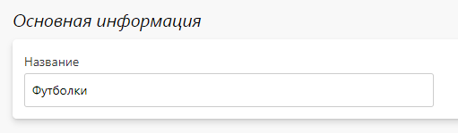
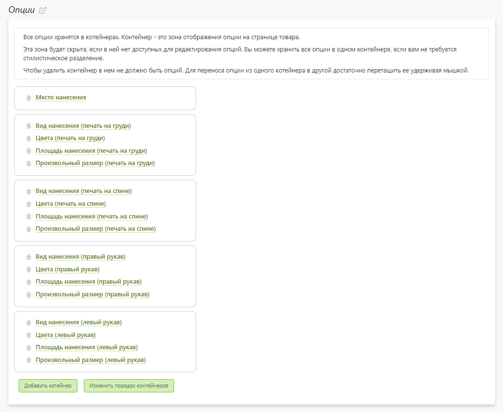
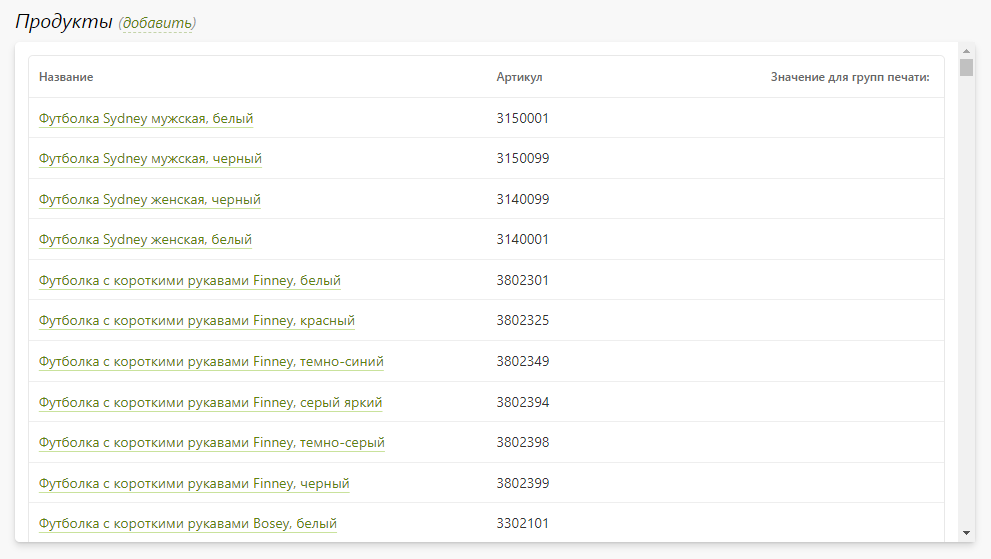
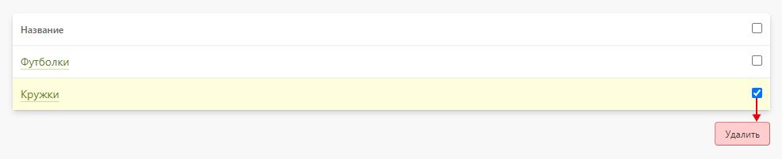

# Группы печати
## Карточка группы
* Группа печати - это набор продуктов с одинаковым списком видов нанесения и общей настроенной логикой расчета стоимости печати.
* Настроенная группа печати на сайте в карточке товара выводиться в виде калькулятора под таблицей размеров и цен.

### Основная информация
* В данном разделе задается название группы печати.

### Опции
* В данном разделе задается расчет стоимости печати, основанный на опциях.  
* Для большей наглядности на сайте:
    + Опции объединяются в контейнеры.
    + У контейнеров задается порядок следования друг за другом.
    + У опций в контейнерах также задается порядок следования. 
* Сама настройка опций описывается в документации в разделе "Печать".

### Продукты
* В данном разделе находятся продукты, относящиеся к группе печати.

## Список групп
* В данном разделе представлен список групп печати.
* Также в этом разделе можно:
    + Добавить новую группу печати.
    + Перейти в группу печати.
    + Удалить выделенные группы печати.
* 