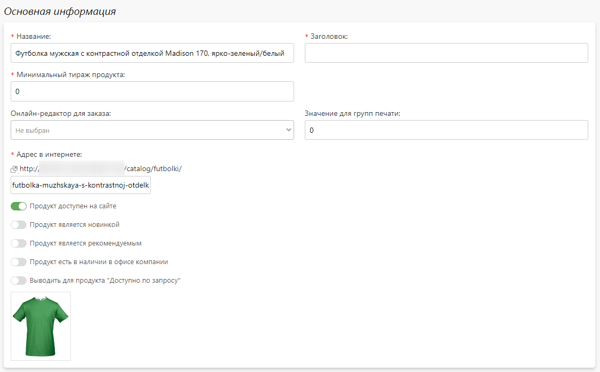

# Продукты

## Описание
* Сувениры - это раздел сайта, доступный по адресу [/catalog](https://demo.pixlpark.ru/catalog), предназначенный для продажи корпоративной сувенирной продукции.
* Структура разделя и вся продукция формируется на основании данных, получаемых от подключенных [поставщиков сувениров](https://pixlpark.ru/features/gifts).
* Однако, помимо стандартной продукции есть возможность добавить свою собственную (как вручную поштучно, так и загрузив ее из эксель-файла).

## Карточка продукта

### Базовая информация
* В данном разделе представлена информация о товаре, получаемая от поставщика.

### Основная информация
* В данном разделе представлены общие настройки продукта.
* Особое внимание стоит обратить на настройку "__Привязать к продукту онлайн-конструктор__", которая позволяет привязать к товару настроенный продукт из раздела "__Печать__". После чего на сайте в карточке продукта отобразится ссылка для оформления заказа через онлайн-редактор.

### Правила тиражности
* В данном разделе задаются или переопределяются правила тиражность для товара.
* Описание настройки правил тиражности представлены в [настройках раздела](/gift/settings?id=Правила-тиражности).

### Описание товара
* В данном разделе задается описание продукта, которое выводится на сайте в карточке товара под кнопками заказа.

### Метаинформация
* В данном разделе задается информация для поисковых систем (метаинформация) - заголовок, описание и ключевые слова, которые используются на сайте в карточке товара.

## Карточка категории

### Список подкатегории
* В данном разделе представлен список подкатегорий, каждая из которых содержит название, адрес на сайте, список поставщиков и продуктов, находящихся в ней.
* Также в этом разделе можно:
    + Перейти в карточку подкатегории.
    + Включить или выключить подкатегорию вместе со всеми продуктами.

### Собственные продукты
* В данном разделе представлен список собственных продуктов.
* Также в этом разделе можно:
    + Добавить новый продукт.
    + Перейти в карточку продукта.
    + Включить или выключить размещение продукта на сайте.
* 

### Продукты поставщиков
* В данном разделе представлен список продуктов поставщиков.
* Также в этом разделе можно:
    + Перейти в карточку продукта.
    + Включить или выключить размещение продукта на сайте.
* 

### Основная информация
* В данном разделе представлены общие настройки категории или подкатегории.

### Правила тиражности
* В данном разделе задаются или переопредяются правила тиражности для подкатегорий и продуктов.
* Описание настройки правил тиражности представлены в [настройках раздела](/gift/settings?id=Правила-тиражности).

### Описание категории
* В данном разделе задаются два описания в HTML-формате, которые выводятся на сайте на странице категории перед списком продуктов и после него .

### Метаинформация
* В данном разделе задается информация для поисковых систем (метаинформация) - заголовок, описание и ключевые слова, которые используются как для страницы категории, так и по умолчанию для всех подкатегорий и всех продуктов, если она у них не задана. Однако для каждой подкатегории и каждого продукта можно задать свою собственную информацию.

## Список категорий
* В данном разделе представлен весь список категорий и подкатегорий продуктов.
* Также в этом разделе можно:
    + Перейти в карточку категории.
    + Перейти в карточку подкатегории.
* 