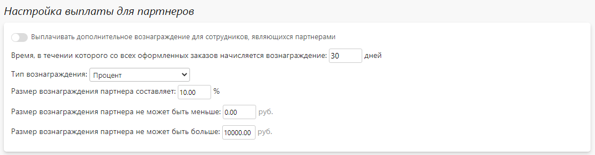

# Партнерская программа

## Настройка
* __Содержание__
    + [Описание](/marketing/affiliates?id=Описание)
    + [Основная информация](/marketing/affiliates?id=Основная-информация)
    + [Настройка выплаты для партнеров](/marketing/affiliates?id=Настройка-выплаты-для-партнеров)
    + [Настройка выплаты для сотрудников](/marketing/affiliates?id=Настройка-выплаты-для-сотрудников)
    + [Правила выплаты](/marketing/affiliates?id=Правила-выплаты)

### Описание
* Суть партнерской программы заключается в том, чтобы предоставлять участникам программы уникальные ссылки для перехода на сайт (или коды, которые вводятся на странице регистрации или корзины), а затем выплачивать вознаграждение за привлеченных клиентов или совершенные ими заказы.
* При переходе клиента по партнерской ссылке он привязывается к партнеру на определенное количество дней, заданное в настройках программы. Затем партнеру начисляются вознаграждения за оформленные клиентом заказы.
* Помимо активации партнера по ссылке есть возможность вводить партнерский код на странице регистрации или корзины, в зависимости от настройки программы.

### Основная информация
* В данном разделе представлены основные настройки партнерской программы.

### Настройка выплаты для партнеров
* В данном разделе представлены единые настройки выплаты для всех партнеров, которые можно переопределить для каждого из них по отдельности.

### Настройка выплаты для сотрудников
* В данном разделе представлены единые настройки выплаты для всех сотрудников-партнеров, которые можно переопределить для каждого из них по отдельности.
* Предусмотрено три сценария начисления вознаграждения:
    + Связанные курьерские службы и ТК - сотрудник является партнером заказа,  доставляемого курьерской службой или транспортной компанией, к которой, в свою очередь, привязан данный сотрудник.
    + Связанные точки выдачи - сотрудник является партнером заказа, в качестве доставки у которого выбрана точка выдачи, к которой, в свою очередь, привязан данный сотрудник.
    + Прочие способы доставки - сотрудник является партнером заказа, доставка которого не привязана к сотруднику.

### Правила выплаты
* По умолчанию размер вознаграждения в виде процента или максимальной суммы , который задается в блоке настроек выплаты, един для всех товаров. 
* Однако, в данном разделе можно задать товары, процент вознаграждения по которым отличается от единых настроек. Здесь же, помимо процента для каждого товара, можно задать и максимальный размер  вознаграждения.

## Карточка партнера
* __Содержание__
    + [Основная информация](/marketing/affiliates?id=Основная-информация-1)
    + [Настройка выплаты для партнеров](/marketing/affiliates?id=Настройка-выплаты-для-партнеров-1)
    + [Настройка выплаты для сотрудников](/marketing/affiliates?id=Настройка-выплаты-для-сотрудников-1)
    + [Правила выплаты](/marketing/affiliates?id=Правила-выплаты-1)
    + [Партнерский счет](/marketing/affiliates?id=Партнерский-счет)
    + [Связанные клиенты](/marketing/affiliates?id=Связанные-клиенты)
    + [Связанные купоны](/marketing/affiliates?id=Связанные-купоны)

### Основная информация
* В данном разделе задается:
    + Активность партнера на сайте, т.е. начислять ли партнеру вознаграждение за привлеченных клиентов и их заказы.
    + Партнерский код и уникальная партнерская ссылка на сайт.

### Настройка выплаты для партнеров
!> Данный раздел предусмотрен только для партнеров, не являющихся сотрудниками компании.
* В данном разделе переопределяются общие настройки выплаты для партнера.

### Настройка выплаты для сотрудников
!> Данный раздел предусмотрен только для партнеров, являющихся сотрудниками компании.
* В данном разделе переопределяются общие настройки выплаты для сотрудников-партнеров.

### Правила выплаты
* В данном разделе переопределяются общие правила выплаты для партнера.

### Партнерский счет
* Состояние партнерского счета со списком операций пополнения (вознаграждение за заказ) и списания (перевод на личный счет).

### Связанные клиенты
* Список клиентов, которые зарегистрировались на сайте либо по партнерской ссылке, либо путем ввода партнерского кода.

### Связанные купоны
* Список купонов, сформированных партнером в рамках скидки для друга.

## Список партнеров
* В данном разделе представлен перечень  партнеров.
* Также на странице можно:
    + Добавить нового партнера.
    + Перейти в карточку партнера.
    + Активировать или деактивировать любого партнера.
    + Скачать список партнеров. 

* 