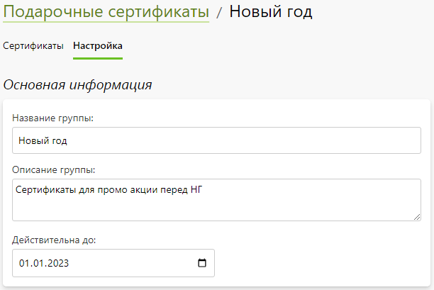
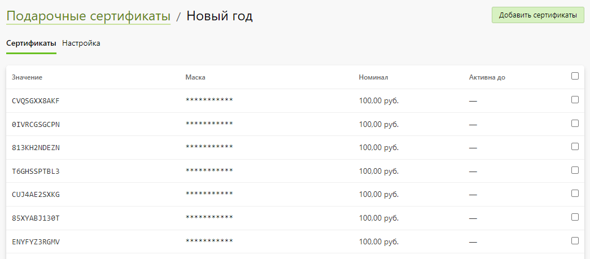
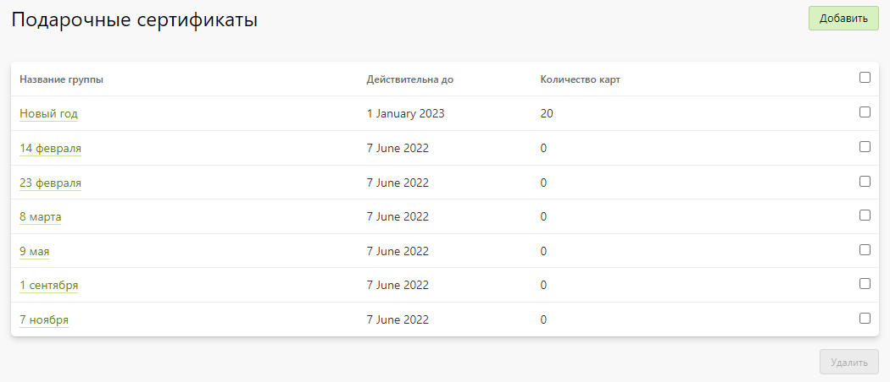

# Подарочные сертификаты

## Карточка группы
* __Содержание__
    + [Описание](/marketing/certificates?id=Описание)
    + [Основная информация](/marketing/certificates?id=Основная-информация)
    + [Список сертификатов](/marketing/certificates?id=Список-сертификатов)

### Описание
* Группа объединяет в себе сертификаты одной акции или события. 
* Сами сертификаты активируются на сайте на странице корзины или в личном кабинете. После активации его номинал зачисляется на личный счет.

### Основная информация
* __Название группы__ - название группы сертификатов, которое выводится только в панели управления.
* __Описание группы__ - описание группы сертификатов, которое выводится только в панели управления.
* __Действительна до__ - дата, до которой можно активировать сертификат.

### Список сертификатов
* В данном разделе представлен список сертификатов, который позволяет:
    + Добавить один купон, сгенерировать несколько или импортировать список из эксель-файла.
    + Скачать все сертификаты в виде списка.
    + Удалить выделенные сертификаты.

## Список групп
* В данном разделе представлен список групп сертификатов, который позволяет:
    + Добавить группу.
    + Перейти в карточку группы.
    + Удалить выделенные группы.

