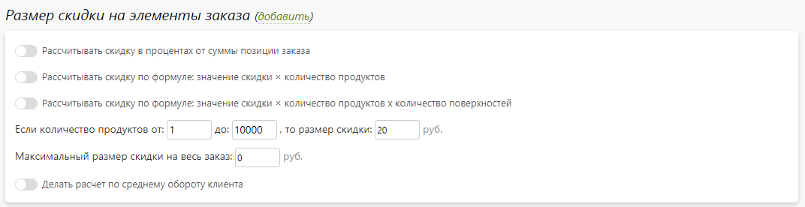
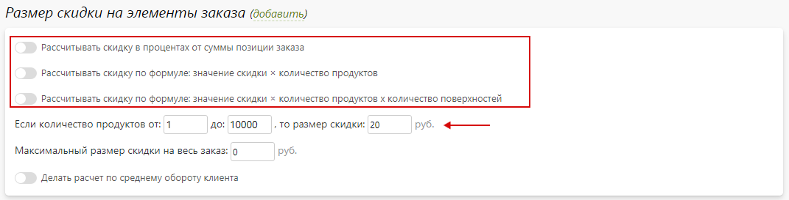
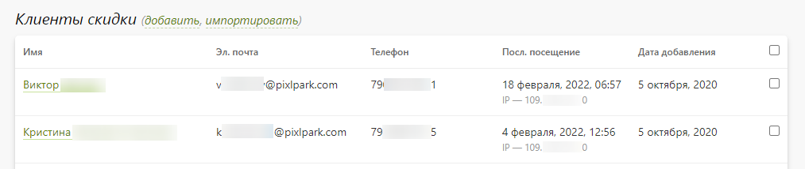
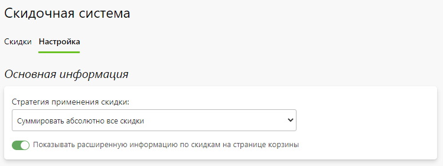

# Скидочная система

## Карточка скидки
* __Содержание__
    + [Основная информация](/marketing/discounts?id=Основная-информация)
    + [Ограничения](/marketing/discounts?id=Ограничения)
    + [Размер скидки на элементы заказа](/marketing/discounts?id=Размер-скидки-на-элементы-заказа)
    + [Размер скидки на доставку](/marketing/discounts?id=Размер-скидки-на-доставку)
    + [История заказов](/marketing/discounts?id=История-заказов)
    + [Клиенты](/marketing/discounts?id=Клиенты)
    + [Купоны](/marketing/discounts?id=Купоны)

### Основная информация
* __Название на сайте__ - название скидки, которое выводиться на сайте.
* __Название в панели управления__ - название скидки, которое выводиться в панели управления.
* __Ссылка на страницу с информацией о скидке__ - ссылка на страницу, которая выводится в корзине в случае включения функции отображения на ней расширенной информации по скидке.
* __Эл. почта для уведомления о добавлении клиента в скидку или активации купона__ - адрес электронной почты, на которую будет отправляться уведомление (если оно включено) о добавлении клиента в скидку или активации купона (вместо стандартных подписчиков).
* __Количество применений__ - количество раз применения скидки для заказа:
    + Неограниченно.
    + Одноразово.
    + N раз (с заданием количества).
    + Один раз на клиента.
    + N раз на клиента (с заданием количества).
    + Только на первый заказ.
    + Один раз на купон.
    + Заданное количество раз на купон.
* __Тип скидки__ - основной тип скидки:
    + __Общая скидка__ - скидка применяется для всех клиентов, удовлетворяющих заданным ограничениям.
    + __Купонная скидка__ - скидка применяется только после активации купона, который вводиться клиентом на странице корзины.
    + __Персональная скидка__ - скидка применяется только для клиентов, добавленных в данную скидку.
* __Описание__ - расширенная информации о скидке, отображающаяся в корзине при включении соответствующей функции в настройках системы скидок.
* __Скидка доступна на сайте__ - скидка доступна на сайте, если иное не задано ограничениями.
* __Отправлять уведомления о добавлении клиента в скидку или активации купона__ - оставлять логику работы уведомлений без изменений. Выключая данную настройку соответствующие уведомления отправляться не будут, даже если они включены.
* __Допускать суммирование данной скидки с другими__ - разрешить применение данной скидки одновременно с другой (если у нее также включена данная настройка).
* __Использовать в качестве бонусной программы__ - вместо применения скидки к текущему заказа класть ее значение на личный счет клиента для применения к последующим заказам. Вся логика расчета с личного счета определяется соответствующим способом оплаты.
* __Суммировать тиражность одинаковых позиций в корзине__ - суммировать количество идентичных добавленных в корзину позиций.

### Ограничения
* В данном разделе представлены настройки, позволяющие:
    + __Ограничить доступность скидки по типу заказчиков__:
        - Всем (клиентам, сотрудникам и партнерам).
        - Только клиентам, являющимся физическими лицами.
        - Только клиентам, являющимся организациям.
        - Только клиентам (всем).
        - Только сотрудникам.
        - Только партнерам.
    + __Ограничить доступность скидки по тому, где был оформлен заказ__:
        - Везде (и на сайте, и в приложении).
        - Только на сайте.
        - Только в приложении.
    + __Ограничить доступность скидки суммой__:
        - Скидочных товаров.
        - Всего заказа.
        - Всего заказа с учетом применения других скидок.
    + __Ограничить доступность скидки по датам и часам__:
        - По дням недели.
        - По праздникам.
        - По времени заказа в течение дня.
    + __Ограничить доступность скидки по количеству товаров за определенный период__.
    + __Ограничить доступность скидки по количеству продуктов и страниц__:
        - По количеству продуктов (тиражу).
        - По количеству страниц в продукте.
        - По общему количеству страниц в продукте.
    + __Ограничить доступность скидки по категориям товаров из разделов "Печать" / "Сувениры" / "Магазин"__.
    + __Ограничить доступность скидки по опциям из раздела "Печать"__.
    + __Ограничения доступность скидки по способам доставки__.
    + __Ограничения доступность скидки по способам оплаты__.
* 

### Размер скидки на элементы заказа
* В данном разделе представлены настройки, позволяющие:
    + Задать значение скидки на элемент заказа в зависимости от тиражности:
        - процент от суммы позиции заказа и ограничение максимального размера скидки.
        - фиксированное значение согласно формуле: значение скидки * количество продуктов.
        - фиксированное значение согласно формуле: значение скидки * количество продуктов * количество поверхностей.
    + Ограничить максимальный размер скидки на весь заказ.
    + Задать значение скидки в зависимости от среднего оборота клиента по выданным с момента регистрации заказам.
* 
> При отсутствии включенных способов расчета скидки, скидка предоставляется на весь заказ в количестве указанного размера согласно тиражности.
* 

### Размер скидки на доставку
* В данном разделе представлены настройки, позволяющие:
    + Применять скидку на доставку, если в заказе находятся товары из выбранных категорий.
    + Задать значение скидки на доставку:
        - процент от суммы позиции заказа и ограничение максимального размера скидки.
        - фиксированное значение согласно формуле: значение скидки * количество продуктов.
        - фиксированное значение согласно формуле: значение скидки * количество продуктов * количество поверхностей.
* 

### История заказов
* В данном разделе представлен список заказов, к которым была применена определенная скидка.

### Клиенты
!> Данный раздел предусмотрен только для персональных скидок.

* В блоке "__Основная информация__" представлены следующие настройки:
* __Стратегия добавления клиентов в скидку__ - алгоритм добавления клиентов в скидку:
    + __Не добавлять автоматически__ - добавлять клиента в скидку только через панель управления.
    + __Добавлять, если заказ совершен в период__ - добавлять в скидку клиента, который совершал заказ в заданный период времени (скидка применится уже к следующему заказу).
    + __Добавлять, если сумма совершенных заказов превышает значение__ - добавлять в скидку клиента, сумма всех заказов которого превышает пороговое значение (при условии, что все эти заказы проходили через заданный статус).
* __Добавить в скидку текущих клиентов__ - предоставлять данную скидку всем клиентам, которые удовлетворяют критериям.

* В блоке "__Клиенты скидки__" представлен список клиентов, для которых доступна данная скидка.
* Также в данном разделе можно:
    + Добавить в скидку одного нового клиента, ранее зарегистрированного в системе.
    + Добавить в скидку нескольких клиентов, ранее зарегистрированных в системе, по эл. почте.
    + Перейти в карточку клиента.
    + Удалить выделенных клиентов.
* 

### Купоны
!> Данный раздел предусмотрен только для купонных скидок.
* В нем представлен список купонов, которые можно:
    + __Фильтровать до доступности__ - все, активированные или неактивированные купоны.
    + __Фильтровать по типу__ - все, одноразовые или многоразовые купоны.
    + __Искать по строке__ -  где "\_" - любой символ, "%" - любая последовательность.
    + __Скачивать список купонов__.
    + __Привязывать выделенные купоны к партнеру__.
    + __Удалять все или выделенные купоны__.
* 
* Также есть возможность добавить:
    + Один купон.
    + Сгенерировать несколько по маске.
    + Импортировать список из эксель-файла.
* 

## Список скидок
* В данном разделе представлен список скидок, которые можно отфильтровать:
    + __По доступности__ - все, только включенные или только выключенные скидки.
    + __По типу скидки__ - все, общие, персональные или купонные скидки.

* Также на странице можно:
    + Добавить новую скидку.
    + Перейти в карточку скидки.
    + Включить или выключить любую скидку.
    + Дублировать выделенные скидки.
    + Удалить выделенные скидки.
* 

## Настройка
* __Содержание__
    + [Основная информация](/marketing/discounts?id=Основная-информация-1)
    + [Скидка для заказчика за репост](/marketing/discounts?id=Скидка-для-заказчика-за-репост)
    + [Скидка для друга за первый заказ](/marketing/discounts?id=Скидка-для-друга-за-первый-заказ)

### Основная информация
* __Стратегия применения скидки__ - алгоритм выбора и применения одной или нескольких скидок:
    + __Суммировать абсолютно все скидки__ - применять к заказу одновременно все подходящие скидки.
    + __Применять одну максимальную скидку__ - применять к заказу только одну скидку, имеющую максимальный размер.
    + __Суммировать все суммирующиеся скидки__ - применять к заказу либо одну максимальную скидку, либо одновременно все суммирующиеся (что дает большее значение).
* __Показывать расширенную информацию по скидкам на странице корзины__ - данная настройка позволяет выводить на странице корзины название и описание скидки, активированный купон с возможностью его деактивации, сумму всех совершенных заказов, а также последующую персональную скидку в зависимости от объема заказов.
* __Рассчитывать скидки через Mindbox__ - включить расчет скидок через внешний маркетинговый сервис [Mindbox](https://mindbox.ru/).

### Скидка для заказчика за репост
* Данная скидка работает следующим образом:
    + На сайте на странице корзины или в личном кабинете в разделе "__Мои скидки__" выводится блок, состоящий из кнопок социальных сетей "__Поделиться__", поля для ввода адреса поста и кнопки "__Получить скидку__".
    + При нажатии кнопки "__Поделиться__" идет публикация в соц. сеть той страницы, которая указана в настройках данной скидки в "__Ссылка для репоста__". Например, это может быть либо главная страница, либо страница акции.
    + Далее, клиент копирует адрес поста соц. сети в соответствующее поле блока этой скидки на странице корзины и нажимает кнопку "__Получить скидку__".
    + После чего к нему автоматически применяется скидка, выбранная в поле "__Купонная скидка__". Это достигается за счет генерации и активации одноразового купона, куда в качестве значения передается введенный клиентом адрес поста.
    + После оформления заказа с примененной скидкой за репост сотрудник компании проверяет наличие поста в соц. сети от данного клиента (по полю "значение" у купона). Если пост не находится, то сотрудник вправе отменить данную скидку для заказа.
* 

### Скидка для друга за первый заказ
* Данная скидка работает следующим образом:
    + На сайте в личном кабинете в разделе "__Мои скидки__" расположена соответствующая секция и кнопка "__Поделиться скидкой__".
    + При нажатии кнопки в появившемся модальном окне клиенту необходимо указать имя друга, его электронную почту, и нажать кнопку "__Поделиться__".
    + Далее другу отправляется письмо с купоном от указанной скидки в поле "__Купонная скидка__". Отметим, что данный купон генерируется автоматически, а его создателем является клиент, пригласивший друга.
    + После того как друг активирует купон из письма и оформит первый заказ, клиенту на личный счет начисляется вознаграждение либо в виде процента от заказа, либо в виде фиксированной суммы. Размер и тип расчета вознаграждения задается в настройках скидки.
* 