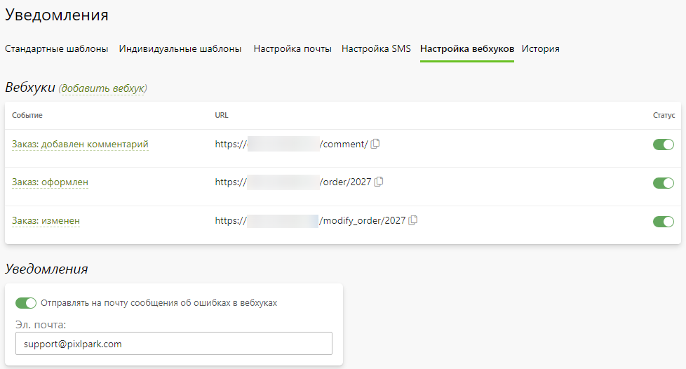

# Уведомления

## Стандартные шаблоны
* __Содержание__
    + [Описание](/marketing/notifications?id=Описание)
    + [Карточка шаблона](/marketing/notifications?id=Карточка-шаблона)
        + [Основная информация](/marketing/notifications?id=Основная-информация)
        + [Ограничения](/marketing/notifications?id=Ограничения)
        + [Шаблон письма](/marketing/notifications?id=Шаблон-письма)
        + [Шаблон SMS-сообщения](/marketing/notifications?id=Шаблон-SMS-сообщения)
    + [Список шаблонов](/marketing/notifications?id=Список-шаблонов)

### Описание
* В сервисе Pixlpark существует множество стандартных событий, на совершение которых предусмотрена отправка уведомлений клиентам и сотрудникам компании по почте или смс. Текст такого уведомления называется шаблоном и может быть изменен в карточке шаблона. Шаблоны разделяются на отправляемые сотрудникам компании и отправляемые клиентам. В содержимом уведомлений разрешается использовать специальные параметры, взамен которых при отправке письма подставляются данные клиентов, заказов, доставок, скидок и компании.

### Карточка шаблона

#### Основная информация
* __Отправлять уведомление по эл.почте__ - отправлять уведомление по электронной почте. Если данное уведомление предназначено для компании, то дополнительно можно задать список сотрудников, которым нужно отправлять его в обязательном порядке.
* __Отправлять уведомление по SMS__ - отправлять уведомление по SMS. Если данное уведомление предназначено для компании, то дополнительно можно задать список сотрудников, которым нужно отправлять его в обязательном порядке.
* __Отправлять уведомление получателю заказа по эл. почте__ - отправлять уведомление получателю заказа по адресу электронной почты, которую он может задать на странице доставки (если включена соответствующая настройки в разделе "__Заказы / Настройка / Оформление заказов__").
* __Отправлять копию письма на__ - список адресов, которым также необходимо отправлять уведомление по электронной почте, помимо предопределенных получателей.
* __Не отправлять копию письма на__ - список адресов, которые необходимо исключить из отправки уведомления по электронной почте.

#### Ограничения
* В данном разделе представлены настройки, позволяющие:
    + Ограничить отправку уведомления типами заказчиков: 
        - частное лицо;
        - организация;
        - сотрудник.
    + Ограничить отправку уведомления статусами оплаты (если уведомление связано с изменением состояния заказа): 
        - не оплачен;
        - частично оплачен;
        - оплачен полностью;
        - отложен.
* 

#### Шаблон письма
* __Тема письма__ - текст, размещаемый в заголовке письма.
* __Формат письма__ - тип письма (__TXT__ или __HTML__).
* __Текст письма__ - текст, размещаемый в теле письма.

#### Шаблон SMS-сообщения
* __Текст SMS-сообщения__ - текст сообщения.

### Список шаблонов
* В данном разделе представлен список стандартных шаблонов уведомлений для компании и клиентов.
* Также на странице можно:
    + Перейти в карточку шаблона.
    + Включить или отключить отправку уведомления по эл. почте.
    + Включить или отключить отправку уведомления по SMS.
* 

## Индивидуальные шаблоны
* __Содержание__
    + [Описание](/marketing/notifications?id=Описание-1)
    + [Карточка шаблона](/marketing/notifications?id=Карточка-шаблона-1)
        + [Основная информация](/marketing/notifications?id=Основная-информация-1)
        + [Шаблон письма](/marketing/notifications?id=Шаблон-письма-1)
    + [Список шаблонов](/marketing/notifications?id=Список-стандартных-шаблонов-1)

### Описание
* Помимо стандартных событий Pixlpark, есть возможность определить свои собственные (в разделе "__Заказы / Настройка / Управление заказами &rarr; Правила обработки заказов__").
* При настройке правила, согласно которому при выполнении определенных условий клиенту будет отправляться уведомление, можно выбрать индивидуальный шаблон.

### Карточка шаблона

#### Основная информация
* __Название__ - название индивидуального шаблона.
* __Тип письма__ - тип письма:
    + __Письмо по эл. почте__ - отправка письма по эл. почте
    + __SMS-сообщение__ - отправка SMS-сообщения.
    + __Комментарий к заказу__ - добавление комментария к заказу.
* __Отправлять уведомление__ - отправлять уведомление клиенту.

#### Шаблон письма
* __Тема письма__ - текст, размещаемый в заголовке письма.
* __Формат письма__ - тип письма (__TXT__ или __HTML__).
* __Текст письма__ - текст, размещаемый в теле письма.

### Список шаблонов
* В данном разделе представлен список индивидуальных шаблонов уведомлений для клиентов.
* Также на странице можно:
    + Добавить новый шаблон.
    + Перейти в карточку шаблона.
    + Включить или отключить отправку уведомления.
    + Удалить выделенные шаблоны.
* 

## Настройка почты
* __Содержание__
    + [Основная информация](/marketing/notifications?id=Основная-информация-2)
    + [Почтовый сервер](/marketing/notifications?id=Почтовый-сервер)
    + [Настройка почтового сервера](/marketing/notifications?id=Настройка-почтового-сервера)

### Основная информация
* __Название сайта__ - название сайта, которое выводится в панели управления, в шаблонах уведомлений и в шаблонах документов для печати из раздела "__Заказы__" через переменную `%Company_Name%`.
* __Телефон__ - телефон, который выводится в шаблонах уведомлений и в шаблонах документов для печати из раздела "__Заказы__" через переменную `%Company_Phone%`.
* __Эл. почта__ - электронная почта, которая выводится в шаблонах уведомлений и в шаблонах документов для печати из раздела "__Заказы__" через переменную `%Company_Email%`.
* __По возможности использовать в качестве обратного адреса письма эл. адрес доставки__ - автоматическая подстановка в качестве обратного адреса эл. почты письма почты пункта выдачи заказа, выбранного клиентом.

### Почтовый сервер
* В данном разделе можно выбрать почтовый сервер для отправки уведомлений по эл. почте:
    + __Системный__ - почтовый сервер сервиса Pixlpark.
    + __SendSay__ - почтовый сервер сервиса [SendSay](https://sendsay.ru/).
    + __SMTP__ - собственный почтовый сервер.
* 

* Также по нажатию кнопки "__Проверить__" можно осуществить отправку тестового письма для проверки работоспособности сервера.
* 

### Настройка почтового сервера
* В данном разделе задаются настройки выбранного в предыдущем пункте почтового сервера:
    + __Системный__:
* 
    + __SendSay__:
* 
    + __SMTP__:
* 

## Настойка SMS
* В данном разделе выбирается интегрированный сервис отправки SMS-сообщений и задаются параметры взаимодействия.

## Настойка вебхуков
* В данном разделе представлен список настроенных вебхуков, каждый из которых характеризуется:
    + Статусом активности.
    + Событием сервиса, при котором он срабатывает.
    + URL-адресом, куда отправляется запрос с данными измененного объекта в формате JSON.

* Каждый вебхук можно удалить, включить или выключить, изменить событие или URL-адрес, а также протестировать, отправив данные по номеру заказа.
* Также можно настроить уведомление на эл. почту об ошибках отправки данных.

## История
* В данном разделе представлен список отправленных уведомлений с возможностью их фильтрации по типу (по почте или SMS) и статусу отправки.
