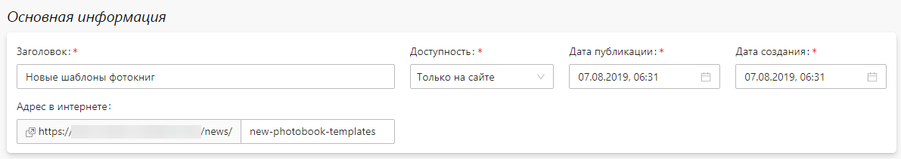
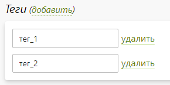
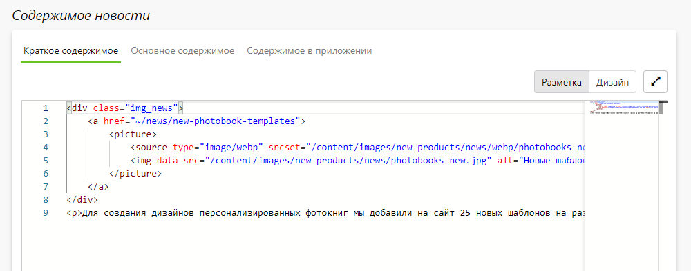
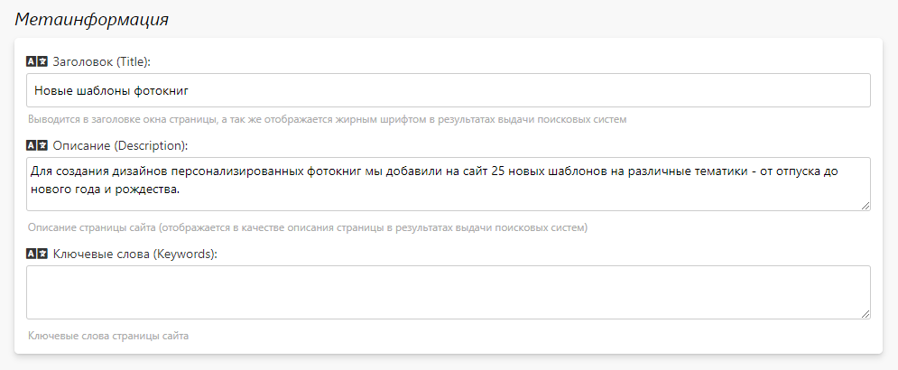
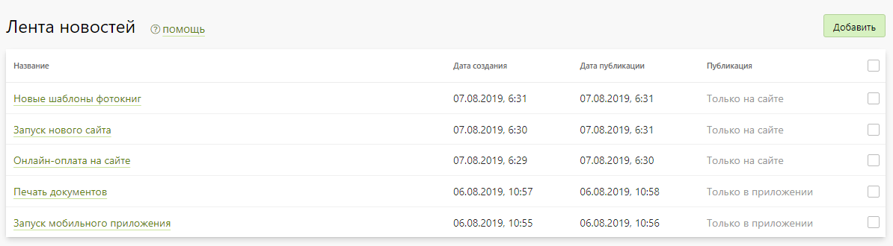

# Лента новостей
## Описание
* Новости - это раздела сайта, доступный по адресу [/news](https://demo.pixlpark.ru/news), на котором публикуется информация о проводимых акциях и новинках компании. 

## Карточка новости
### Основная информация
* __Заголовок__ - заголовок, который используется в качестве `H1`, если его нет в содержимом новости.
* __Доступность__ - показатель того, где будет публиковаться новость:
    + Везде (на сайте и в приложении).
    + Только на сайте.
    + Только в приложении.
    + Нигде.
* __Дата создания__ - дата создания новости, которую можно изменить. Изменение даты публикации новости требуется при переносе новостей со старого сайта на новый, запускаемый на Pixlpark.
* __Адрес в интернете__ - уникальный адрес новости на сайте. 

### Теги
* В данном разделе задается список тегов (меток) для новости. Если хотя бы для одной новости заданы теги, то на сайте на странице списка новостей справа выводиться облако тегов, работающее как фильтр. Также на странице отдельной новости выводятся заданные теги с возможности перехода в список по выбранному тегу.

> Данный механизм применяется, например, для разделения новости по типу - "новости", "акции", "блог".

### Содержимое новости
* В данном разделе задается:
    + Краткое содержимое новости, отображаемое на странице списка новостей.
    + Полное содержимое новости, отображаемое на странице новости.
    + Содержимое в новости приложении (в виде Markdown-разметки).
*

### Метаинформация
В данном разделе задается информация для поисковых систем (метаинформация) - заголовок, описание и ключевые слова.

## Список новостей
* В данном разделе представлен список всех новостей (с датой создания, заголовком, местом публикации и кратким содержимым).
* Также в этом разделе можно:
    + Добавить новую новость.
    + Перейти в карточку новости.
    + Удалить любую новость.
*