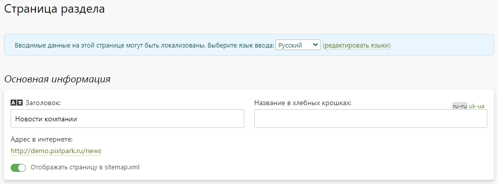

# Страница раздела
## Описание
* В данном разделе можно сконфигурировать страницу [списка новостей](https://demo.pixlpark.ru/news), доступной по адресу "__/news__".  
* Для простоты понимания можно представить, что страница новостей - это обычная страница сайта, обладающая теми же самыми свойствами.

## Основная информация
* __Заголовок__ - заголовок, который используется в качестве `H1`, если его нет в содержимом страницы.
* __Название в хлебных крошках__ - название страницы в навигационной цепочке, которая выводится через константу `[$breadcrumbs$]`. Если название не задано, то используется заголовок.
* __Адрес в интернете__ - адрес страницы на сайте.
* __Отображать страницу в sitemap.xml__ - включить страницу в файл sitemap.xml, который используется для информирования поисковых систем о наличии на сайте данной страницы.

## Содержимое страницы
* В данной разделе задается содержимое секций, из которых формируется страница сайта. По умолчанию содержимое задается в виде HTML-разметки, которая также может содержать стили и скрипты. Список новостей автоматически встраивается в самый низ секции "__Основной контент__".
