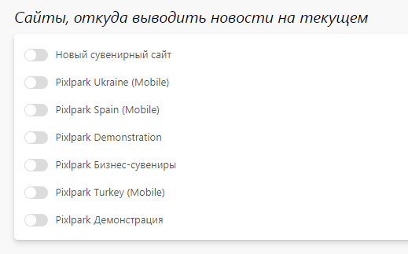

# Настройка

## Основная информация
* В данном разделе представлены общие настройки ленты новостей.

## Сайты, откуда выводить новости на текущем
* В данном разделе представлен список сайтов, с которых можно автоматически выводить отзывы на текущем. 
*
> Данный механизм используется для запуска федеральных проектов, чтобы при публикации новостей на одном сайте они автоматически отображались на других региональных.

## Метаинформация
* В данном разделе задается информация для поисковых систем (метаинформация) - заголовок, описание и ключевые слова, которые используются по умолчанию для всех новостей, если она у них не задана. Однако для каждой новости можно задать свою собственную информацию.
