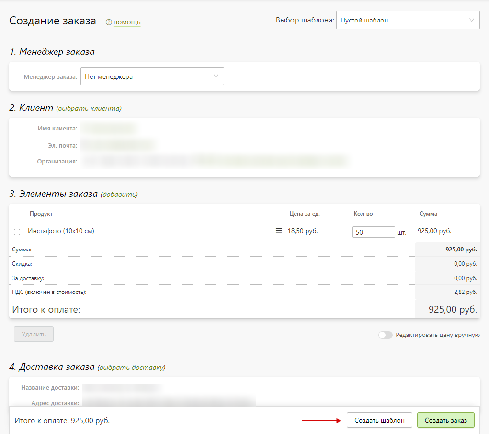
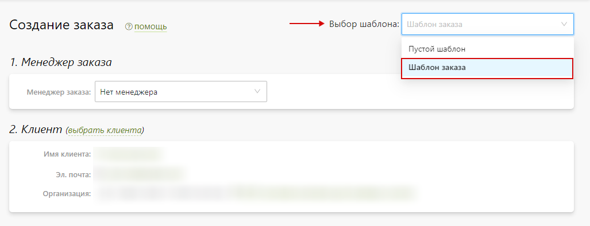

# Создание шаблона заказа
## Описание
* Шаблон заказа позволяет ускорить создание заказа в панели управления Pixlpark. Данные, доступные сохранения в шаблоне:
    + Информация о клиенте.
    + Элементы заказа.
    + Доставка заказа.
    + Оплата заказа.
    + Тип заказа.

## Создание шаблона
* Для создания шаблона необходимо заполнить форму аналогично [созданию заказа](~/orders/create?id=Заполнение-формы), а после - нажать "__Создать шаблон__".

* При необходимости шаблон используется для создания заказа. Для этого на странице создания заказа его необходимо выбрать в поле "__Выбор шаблона__", а после - дополнить поля необходимой информацией и создать заказ.
