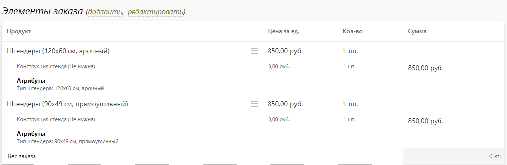
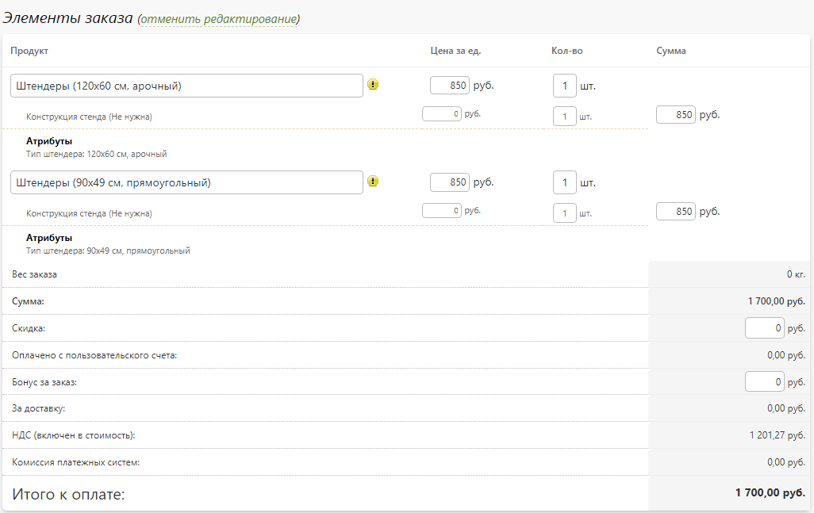
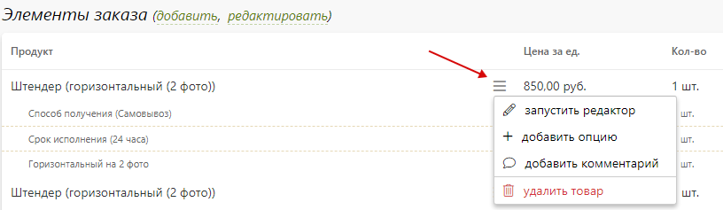
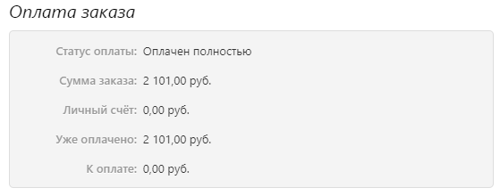

# Карточка заказа

## Основная информация
* __Тип заказа__
    + __Обычный заказ__ - заказ продукции от зарегистрированного пользователя. Данный тип автоматически устанавливается при оформлении заказа через сайт, когда пользователь проходит все этапы: формирования корзины, регистрации, выбора  доставки и оплаты. Также этот тип может выбираться сотрудником компании при регистрации заказа через панель управления.
    + __Коммерческое предложение__ - намерение зарегистрированного или анонимного пользователя в последующем оформить обычный заказ с указанными характеристиками. Данный тип устанавливается только через панель управления. Например, при расчете заказа по телефону (чтобы в последующем при повторном обращении заказчика можно было найти данный расчет, сменить тип заказа и указать данные покупателя).
    + __Быстрый заказ__ - заказ продукции со страницы корзины сайта без необходимости проходить процедуру регистрации, выбора доставки и оплаты. Данный тип устанавливается при оформлении заказа через модальное окно “Быстрый заказ” в корзине, если такая функция включена в настройках сервиса ("__Заказы / Настройка / Оформление заказов → Быстрый заказ__").
    + __Заказ с формы__ - заказ нетипизированной продукции без необходимости проходить процедуру создания дизайна или загрузки макета в редакторе, формирования корзины, регистрации, выбора доставки и оплаты. Данный тип устанавливается при оформлении заказа через модальное окно “Быстрый заказ” в шапке сайте, на произвольной странице или в калькуляторе через ссылку “оставить заявку.”
    + __Пополнение счета частного лица__ - заказ на пополнение счета частного лица. Данный тип устанавливается при оформлении заказа на пополнение баланса из раздела “Личный счет” профиля пользователя.”
    + __Пополнение счета организации__ - заказ на пополнение счета организации. Данный тип устанавливается при оформлении заказа на пополнение баланса из раздела “Личный счет” профиля пользователя. Организации создается либо при задании данных компании в форме регистрации, либо в профиле клиента. При этом регистрирующий клиент становится ее администратором.

* __Источник заказа__
    + __Сайт__ - заказ оформлен на сайте.
    + __Приложение__ - заказ оформлен в мобильном приложении.
    + __Панель управления__ - заказ оформлен в панели управления.
    + __Запрос по API__ - заказ оформлен через программный интерфейс.

* __Статус заказа__ - состояние исполнения заказа. Ознакомиться со списком статусов и алгоритмом их смены можно в разделе "[Смена статуса заказа](/orders/edit?id=_10-Смена-статуса-заказа)".

* __Статус оплаты__ - состояние оплаты заказа. Ознакомиться с механизмом редактирования оплаты можно в разделе "[Оплата заказа](/orders/edit?id=_7-Оплата-заказа)".

* __Связи с заказами__ - список связанных заказов с текущим. Заказы автоматически считаются связанными после разделения сборного заказа на несколько составных или при отправке заказа на подряд. Также можно самостоятельно привязать указанные заказы к текущему. Например, если эти заказы требуют единой отправки транспортной компанией до получателя (когда клиент по ошибке вместо одного заказа оформил несколько).

* __Подрядчик__ - сотрудник компании с ролью "Подрядчик", назначенный исполнителем заказа. Исполнителю доступны только его заказы. В профиле сотрудника для роли "Подрядчик" можно задать ограничения по списку продукции раздела "__Печать__". Также в разделе "__Настройка / Управление заказами → Основная информация__" можно включить автоматическое назначение подрядчика исходя из позиций заказа и списка сотрудников с данной ролью. Например, если на продукты заказа существует только один подрядчик, то он автоматически будет назначен системой. В противном случае сотрунику компании необходимо будет вручную выбрать подрядика из списка возможных.

* __Менеджер заказа__ - сотрудник компании, назначенный менеджером заказа. В зависимости от настроек раздела "__Настройка / Управление заказами → Основная информация__",  менеджер может видеть либо все заказы, либо только свои. Также менеджером автоматически может назначаться тот сотрудник, который зарегистрировал клиента, оформившего данный заказ.

* __Партнер__ - клиент, являющийся участником партнерской программы, по ссылке или партнерскому коду которого был совершен заказ.
* 

> Некоторые описанные блоки могут быть скрыты из-за специфики заказа или настроек сервиса.

## Элементы заказа

#### Позиции и стоимость
* __Позиции заказа__ - список товаров, содержащихся в заказе (наименование, цена за единицу, количество и сумма).

* __Стоимостные характеристики__ - стоиомсть всех позиций, размер скидка, сумма оплаты с личного счета, сумма начисленных бонусов, стоимость доставки, размер НДС, комиссия платежной системы и итоговая сумма к оплате.

### Добавить позицию
* При нажатии ссылки "__добавить__" около заголовка "Элементы заказа" в появившемся модальном окне можно добавить новую позицию к заказу:
    + Продукт раздела "[Печать](/print/products)".
    + Продукт раздела "[Магазин](/shop/products)".
    * Произвольный товар.
* 

### Редактировать позицию
*  При нажатии ссылки "__редактировать__" около заголовка "Элементы заказа" появляется возможность изменения наименования, стоимости, количества и итоговой суммы каждой позиции заказа. Также напротив каждой позиции есть кнопка ("бургер"), позволяющая редактировать сам товар.

### Редактировать товар
* __Запустить редактор__ - внести изменение в товар через редактор, который использовался при оформлении заказа (после внесения изменений архив заказа будет обновлен в течение 15-20 мин.).
* __Добавить комментарий__ - указать дополнительную информацию, которая впоследствии может быть отображена в сопроводительном документе.
* __Добавить опцию__ - добавить к товару доступную опцию.
* __Удалить опцию__ - удалить опцию у товара.
* __Удалить товар__ - удалить позицию заказа.

## Доступные действия
* __Смотреть обложку__ - просмотр единой иллюстрации по всем позициям заказа.

* __Скачать заказ__ - скачивание архива заказа с подготовленными к печати файлами. При определенных настройках архив заказа может также содержать исходные файлы, загруженные клиентом.

* __Изменить статус__ - смена текущего статуса заказа либо на один из следующих по [цепочке](/orders/edit?id=_10-Смена-статуса-заказа), либо на произвольный через пункт "Все статусы".

* __Распечатать документ__ - скачивание сопроводительного документа по заказу на основании одного из доступных [шаблонов](/orders/settings?id=%d0%a8%d0%b0%d0%b1%d0%bb%d0%be%d0%bd%d1%8b-%d0%b4%d0%be%d0%ba%d1%83%d0%bc%d0%b5%d0%bd%d1%82%d0%be%d0%b2).

* __Повторить заказ__ - повторное оформление заказа со всеми его настройками и ценами.

* __Отправить в Битрикс24__ - передача данных по заказу в CRM-систему [Битрикс24](/integration/crm?id=Битрикс24).

* __Отправить в ASystem__ - передача данных по заказу в ERP-систему [ASystem](/integration/crm?id=asystem).

* __Отправить в Axiom__ - передача данных по заказу в ERP-систему [Axiom](/integration/crm?id=axiom).

* __Отправить в HelloPrint__ - передача данных по заказу в ERP-систему [HelloPrint](/integration/crm?id=helloprint).

> Некоторые описанные действия могут быть недоступны из-за специфики заказа или настроек сервиса.

## Примененные скидки
* __Название скидки__ - наименование скидки, которая была активирована для заказа.

* __Значение скидки__ - сумма, на которую уменьшилась стоимость заказа.

> Данный раздел отображается, только если к заказу были примененны какие-либо скидки.

## Параметры заказа
* __Дополнительный номер__ - по умолчанию дополнительным номер заказа совпадает с основным. Но, его можно заменить на любой другой. Иногда в дополнительном номере заказа хранят номер из финансовой или ERP-системы для сопоставления заказов (например, в случае интеграции посредством  API).

* __Статус заказа__ - текущий статус заказа.

* __Дата оформления__ - дата и время оформления заказа пользователем в часовом поясе, указанном в региональных настройках сайта.

* __Дата выдачи__ - дата и время выдачи заказа, которые выставляется либо автоматически при назначении заказу статуса "__Выдан__", либо вручную сотрудником компании, либо рассчитывается автоматически согласно настройкам системы (раздел "__Настройка / Управление заказами → Время исполнения заказов__").

* __Клиент__ - клиент, который считается владельцем заказа. Владельца заказа можно изменить, выбрав либо частное лицо из списка пользователей, либо зарегистрировав новое. В частности функция изменения нужна при смене типа заказа с "коммерческого предложения" на "обычный заказ".

## Доставка заказа
* __Содержание__
    + [Основная информация](/orders/settings?id=Основная-информация-1)
    + [Редактирование доставки](/orders/settings?id=Редактирование-доставки)

#### Основная информация
* __Способ доставки__
    + __Точка выдачи__ - собственный или партнерский пункт выдачи заказа.
    + __Транспортная компания__ - транспотрная компания с возможность доставки на пункт выдачи или по адресу клиента.
    + __Курьерская служба__ - служба логистики с доставкой заказа по адресу клиента.

* __Получатель заказа__ - ФИО и телефон человека, указанного в качестве получателя заказа на странице доставки. По умолчанию получатель заказа совпадает с оформителем.

* __Адрес доставки__ - полный адрес доставки или точки выдачи заказа.

* __Название доставки__ - название, время работы, телефон, адрес и дополнительная информация выбранного способа доставки.

* __Изменение доставки__ - при нажатии ссылки "__изменить__" около заголовка откроется страница редактирования доставки.

#### Редактирование доставки
* Данный раздел содержит два основных блока:
    + __Основная информация__ - позволяет изменять способ и стоимость доставки заказа.
    
    + __Данные о доставке__ - содержит детальную информацию о способе доставки и данные получателя заказа.
    

## Оплата заказа
* __Содержание__
    + [Основная информация](/orders/settings?id=Основная-информация-2)
    + [Редактирование оплаты](/orders/settings?id=Редактирование-оплаты)

#### Основная информация
* __Статус оплаты__
    + __Не оплачен__ - по заказу еще не поступала оплата.
    + __Частично оплачен__ - заказ оплачен лишь частично (например, при изменении стоимости заказа его статус оплаты может быть автоматически изменен с "оплачен полностью" на "частично оплачен").
    + Оплачен полностью - по заказу поступила оплата полностью.

* __Способ оплаты__
    + __Наличные при получении__ - заказ был или будет оплачен при получении.
    + __Банковский перевод__ - заказ был оплачен по счету.
    + __Счет частного лица__ - заказ был оплачен со счета частного лица.
    + __Счет организации__ - заказ был оплачен со счета организации.

* __Сумма оплаты__ - сумма внесенной предоплаты и остаток к оплате.

* __Изменение оплаты__ - при нажатии ссылки "изменить" около заголовка откроется страница редактирования оплаты.

#### Редактирование оплаты
* На каждую оплату с сайта или зачисление денег через панель управления в системе создается новый объект, именуемый счетом. При онлайн-оплате деньги автоматически зачисляются на баланс компании платежного сервиса, а соответствующий счет в системе помечается оплаченным (или частично оплаченным на фактическую сумму платежа).

* __Оплата заказа__ - в данном блоке представлена общая информация по оплате заказа.
    + __Статус оплаты__ - текущий статус оплаты.
    + __Сумма заказа__ - итоговая стоимость заказа.
    + __Личный счет__ - сумма оплаты с личного счете.
    + __Уже оплачено__ - сумма внесенной предоплаты.
    + __К оплате__ - сумма, оставшаяся к оплате.
* 

* __Внесение оплаты__ - в данном блоке отмечается поступление оплаты по заказу.
    + __Сумма к оплате__ - вносимая сумма оплаты (она зачисляется либо на последний счет с таким же способом оплаты, либо на создаваемый новый).
    + __Способ оплаты__ - способ оплаты по текущему поступлению средств.
    + __Плательщик__ - реквизиты юр. лица клиента, с которых было произведено текущее поступление (при выбранном способе оплаты - банковский перевод).
    + __Получатель__ -  реквизиты юр. лица компании, на которые было произведено текущее поступление (при выбранном способе оплаты - банковский перевод; реквизиты задаются в разделе "Настройка / Оплтата / Реквизиты").
    + __Комментарий__ - комментарий к оплате.
* 

* __Ожидание оплаты__ - в данном блоке создается счет на оплату (на сайте в личном кабинете при нажатии у заказа ссылки "оплатить" клиенту автоматически будет предложено совершить оплату на указанную суммы и выбраным способом оплаты).
    + __Сумма к оплате__ - сумма формируемого счета, ожидающего оплаты от клиента.
    + __Способ оплаты__ - ожидаемый способ оплаты (данный способ будет автоматически выбран при попытке оплаты заказа клиентом через личный кабинет).
    + __Плательщик__ - реквизиты юр. лица клиента, с которых будет ожидаться поступление (при выбранном способе оплаты - банковский перевод).
    + __Получатель__ -  реквизиты юр. лица компании, на которые будет ожидаться поступление (при выбранном способе оплаты - банковский перевод; реквизиты задаются в разделе "Настройка / Оплтата / Реквизиты").
    + __Комментарий__ - дополнительная информация по оплате.
* 

* __Счета на оплату__ - список всех счетов (оплаченных и неоплаченных) по заказу. Любой счет можно удалить, скачать или добавить к нему комментарий.

## Обсуждение
* Данный раздел служит как для обмена сообщениями и файлами между клиентом и сотрудниками компании, так и для согласования/утверждения макета, когда по заказу требуется разработка уникального дизайна.

* __Доступные действия__
    + __Смотреть макет__ - утвержденный клиентом макет заказа (по умолчанию совпадает с обложкой).
    + __Следить за комментариями__ - подписаться на получение уведомлений о появлении новых комментариев к заказу.
    + __Добавить комментарий__ - добавить новый комментарий к заказу, который может быть как скрыт, так и виден клиенту.

* __Лента обсуждения__
    + Список сообщений от клиента и сотрудников компании, упорядоченных по времени.
    + Сотрудник компании может запросить утверждение клиентом своего сообщения (например, если он содержит предложенный вариант дизайна макета).
    + Клиент может либо утвердить сообщение сотрудника, либо отклонить его.

* __Прикрепленные файлы__
    + Список прикрепленных к заказу файлов, которые в том числе доступны клиенту для скачивания.
    + Сотрудник компании может отметить загружаемый файл как утвержденный клиентом макет заказа.
* 

## История
* __Фильтр__ - фильтрация зафиксированных событий по типу:    
    + __Общее__ - изменение содержимого, оплаты или статуса заказа.
    + __Доставка__ - изменение доставки заказа.
    + __Подряд__ - передача заказа на подряд.

* __Лента событий__ - список зафиксированных событий со следующими данными:
    + __Дата__ - дата события.
    + __Статус__ - производственный статус заказа.
    + __Имя__ - сотрудник, инициировавший изменение.
    + __Комментарий__ - системный комментарий.
* 

## Смена статуса заказа
* В системе существует набор предопределенных статусов заказов и алгорирм их изменения:

* В соответствии с представленной схемой все заказы автоматически каждые 2 недели изменяют статус от "__Оформлен__" до "__Доставлен на точку выдачи__" . Под этим статусом подразуевается как собственные точки выдачи, так и пункты выдачи транспортных компаний. 

* Из "__Доставлен на точку выдачи__" в "__Выдан__" заказ переходит через 23 недели, при этом за неделю до смены статуса администраторам компании отправляется об этом уведомление. 

* Переопределить стандартную логику автоматической смены статуса можно в разделе "__Заказы / Настройка / Управление заказами → Правила обработки заказов__".

* Также можно изменить и наборы самих статусов. Для этого в профиле сотрудника необходимо указать доступные ему статусы заказа. В итоге, например, схема изменения статуса заказа может выглядеть следующим образом:

