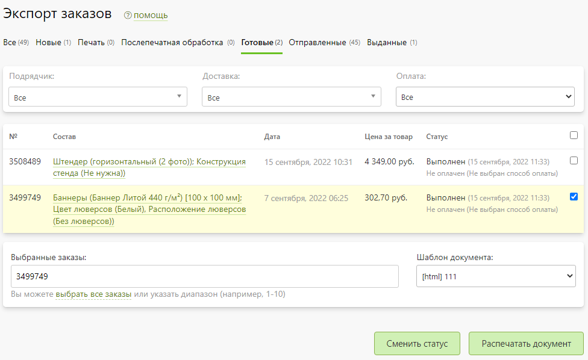

# Экспорт заказов
* Данный раздел предназначен для пакетного выполнения действий над заказами:
    + __Смена статуса__ - сменить статус для выбранных заказов либо на следующий по производственной цепочке, либо на произвольный.
    + __Распечатка документа__ - сформировать единый файл на основании указанного шаблона документа для выбранных заказов.

* Для удобства выбора заказов из списка предусмотрена их фильтрация:
    + __По статусу__ - выбор статуса: все, новые, печать, послепечатная обработка, готовые, отправленные, выданные.
    + __По подрядчику__ - выбор подрядчика для заказа.
    + __По доставке__ - выбор способа доставки.
    + __По оплате__ - выбор состояния оплаты: все, оплаченные, не оплаченные и частично оплаченные.

* Данный функционал может быть полезен, например, для формирования технологических карт или транспортных документов для отпечатанных заказов, а также для смены статуса доставленных заказов курьером компании.

