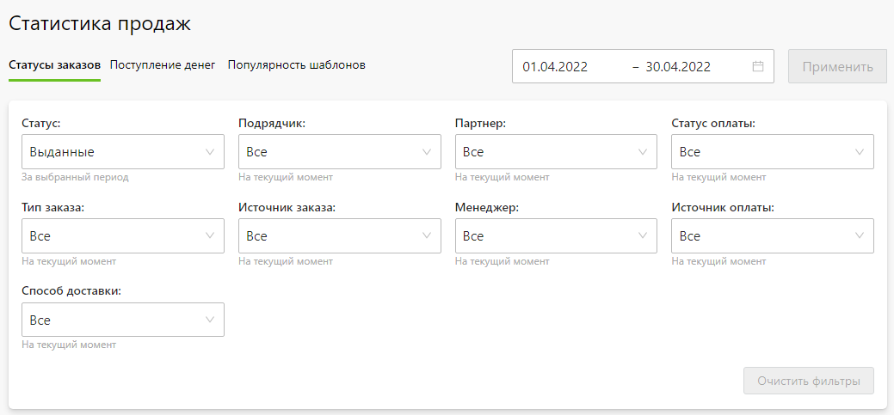
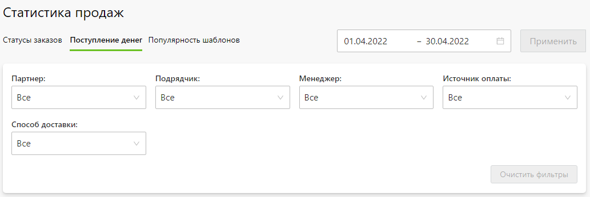

# Статистика продаж

## Статусы заказов
* В данном разделе представлена общая статистика по заказам, отражающая объем продаж в заданном временном интервале.

* Он содержит три основных блока:
    + __Фильтр__ - критерии, по которым нужно получить статистику в заданном временном интервале.
    
    + __Статистика__ - агрегированные данные по заказам, соответствующим фильтру.
    
    + __Продукция__ - категории продуктов и товаров в разрезе количества и стоимости.
    

* Отметим, что заданный временной интервал применяется только к статусу заказа. Т.е. в указанном интервале у заказа должен быть такой статус. А все остальные фильтры - это текущее состояние заказа.

* Также в блоке "__Статистика__" можно:
    + __Скачать статистику по заказам__ - скачать список заказов в эксель-файле.
    + __Скачать детализацию по заказам__ - скачать список заказов с доп. полями в эксель-файле.
    + __Скачать список товаров__ - скачать список объединенных по группам категорий в эксель-файле.

## Поступление денег
* В данном разделе представлена информация о поступлении денежных средств по заказам в заданном временном интервале. Она, например, позволяет проводить сверки по остаткам в кассе, на расчетном счету или на балансе платежной системы.

* Раздел содержит три основных блока:
    + __Фильтр__ - критерии, по которым нужно получить статистику в заданном временном интервале.
    
    + __Статистика__ - агрегированные данные по поступлениям средств по источникам оплаты, способам доставки и подрядным заказам.
    
    + __Поступления по заказам__ - список поступлений денежных средств по заказам с указанием номера заказа, его состава, способа оплаты, суммы, даты и менеджера.
    

* Также в блоке "__Статистика__" можно скачать список поступлений по заказам в эксель-файле.

## Популярность шаблонов
* В данном разделе представлена информация о популярности шаблонов при оформлении заказов. Например, эта информация может быть полезна при пополнении банка дизайнов, выбирая при разработке новых шаблонов наиболее популярные тематики.

* Раздел содержит три основных блока:
    + __Фильтр__ - критерии, по которым нужно получить статистику в заданном временном интервале.
    
    + __Статистика__ - диаграмма популярности шаблонов, соответствующим фильтру.
    
    + __Список шаблонов__ - список шаблонов с процентной долей использования и количеством заказов.
    

* Также в блоке "__Статистика__" можно скачать список шаблонов с информацией об их популярности в эксель-файле.
