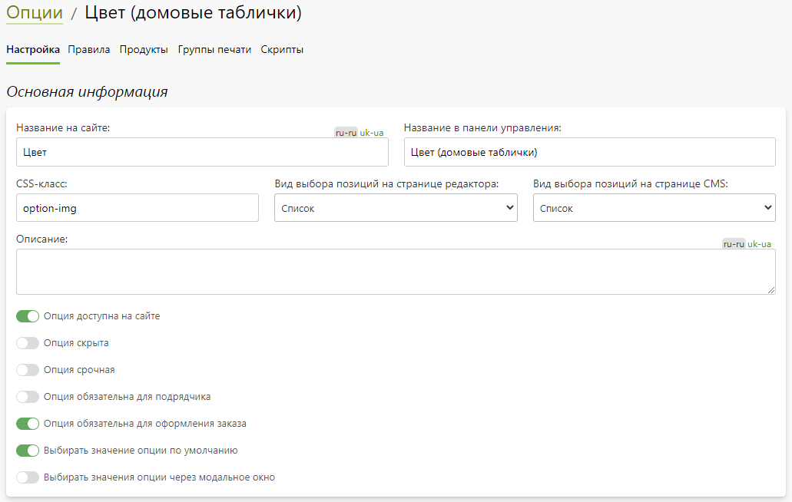
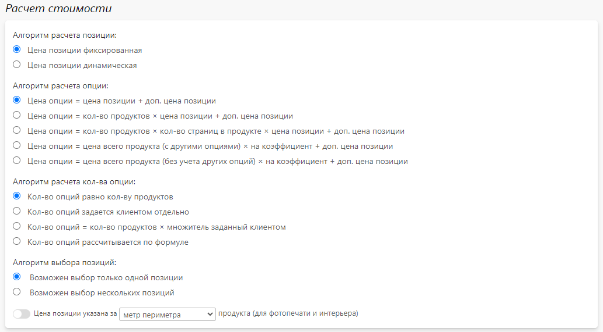
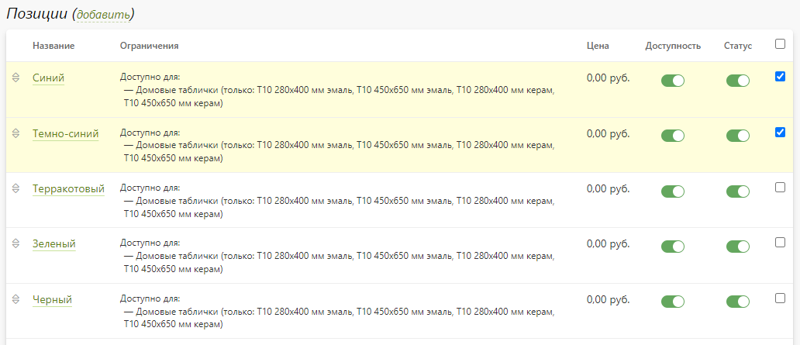
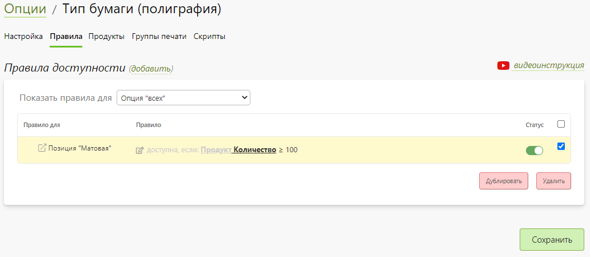
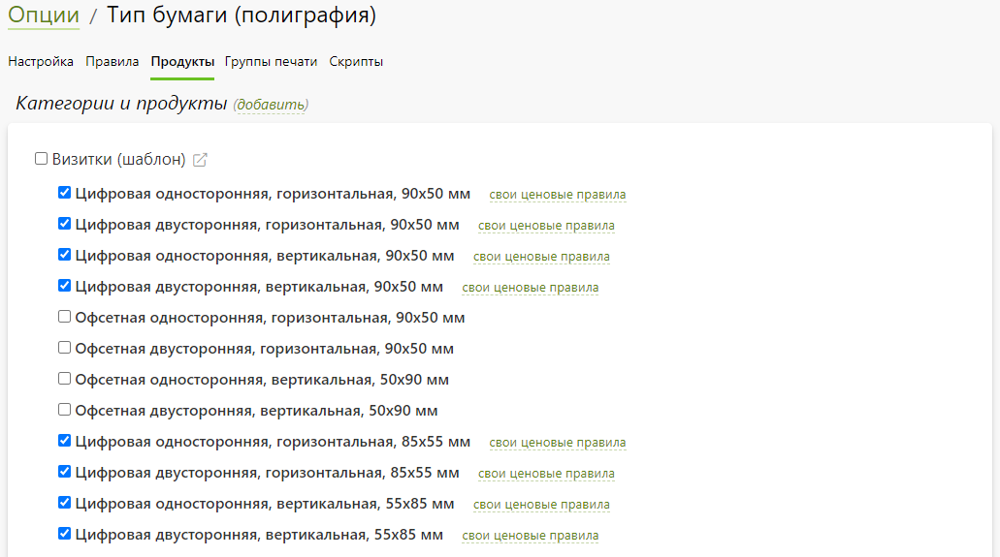
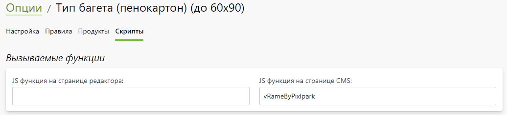
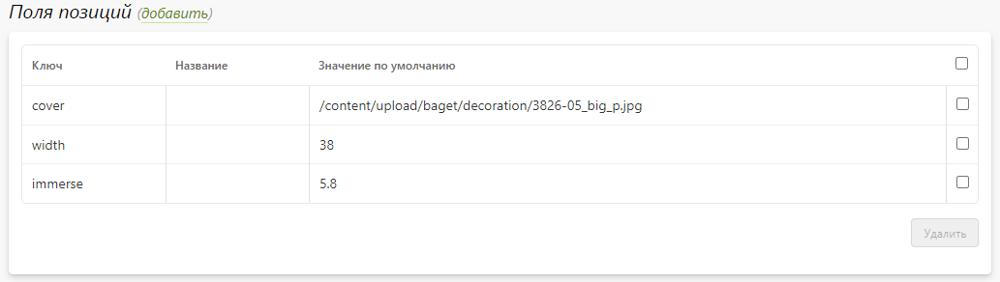

# Калькуляция

## Опции
* __Содержание__
    + [Карточка опции](/print/calculations?id=Карточка-опции)
    + [Карточка позиции](/print/calculations?id=Карточка-позиции)
    + [Список опций](/print/calculations?id=Список-опций)

### Карточка опции
* __Содержание__
    + [Описание](/print/calculations?id=Описание)
    + [Основная информация](/print/calculations?id=Основная-информация)
    + [Расчет стоимости](/print/calculations?id=Расчет-стоимости)
    + [Позиции](/print/calculations?id=Позиции)
    + [Правила доступности](/print/calculations?id=Правила-доступности)

#### Описание
* __Опции__ - это дополнительный механизм ценообразования, который применяется к продуктам.
* Опции бывают двух типов:
    + __Единственная позиция__ - посетитель сайта выбирает опцию по принципу "Да / Нет". Например, это может быть услуга ламинации.
    + __Список позиций__ - посетитель сайта выбирает одно из значений опции. Например, это может быть выбор бумаги для печати.
* В зависимости от выбранного значения опции, к цене продукта прибавляется дополнительная сумма, согласно заданному алгоритму.
* В зависимости от настроек калькулятора, опции могут выводиться в нем аналогично атрибутам или названию товаров. Также опции выводятся на странице редактора (или в зависимости от настроек, на следующей странице после редактора).

#### Основная информация
* __Название на сайте__ - название опции на сайте, которое выводится либо перед списком ее позиций, либо в виде переключателя "Да / Нет".
* __Название в панели управления__ - название опции в панели управления, которое может содержать техническую информацию. Например, продукты, для которых она применима.
* __CSS-класс__ - CSS-класс, который будет добавляться на сайте к div-элементу, содержащему опцию со всеми ее позициями. Задание класса позволяет изменять внешний вид отображения опций.
* __Вид выбора позиций на странице редактора__ - внешний вид выбора значения опции на странице редактора:
    + Список из радио-кнопок.
    + Выпадающий список.
* __Вид выбора позиций на странице CMS__ - внешний вид выбора значения опции на странице CMS, следующей за редактором:
    + Список из радио-кнопок.
    + Выпадающий список.
* __Описание__ - текстовое описание опции, которое выводится на сайте под ее названием.
* __Опция доступна на сайте__ - выбор опции доступен на сайте и в калькуляторе, и в редакторе (или следующей за редактором странице CMS, если это предусмотрено настройками категории).
* __Опция скрыта__ - выбор опции не отображается на сайте, однако она продолжает участвовать в расчетах стоимости. Функция применяется, когда нужно ввести какую-то надбавку (в виде фиксированного значения или рассчитанного по формуле).
* __Опция срочная__ - опция участвует в расчете времени исполнения заказа. Данная настройка доступна, только если включен функционал оценки времени исполнения заказа (секция "__Время исполнения заказа__" раздела "__Заказы / Настройка &rarr; Управление заказами__") и в точках выдачи задано время работы (секция "__Время работы__"). После включения функции в позициях появляется секция "__Время исполнения__", где можно задать производственное время в часах.
* __Опция обязательна для подрядчика__ - при наследовании продукта с данной опцией на другой сайт унаследованная опция является обязательной для выбора.
* __Опция обязательна для оформления заказа__ - выбор значения опции является обязательным в калькуляторе или в редакторе для оформления заказа.
* __Выбирать значение опции по умолчанию__ - если опция является обязательной для оформления заказа, то согласной этой настройке, у нее будет выбираться позиция либо заданная по умолчанию, либо первая в списке.
* __Выбирать значения опции через модальное окно__ - выбирать позицию опции в редакторе в модальном окне.
* __Использовать опцию для именования выходных файлов__ - именовать выходной файл редактора с помощью значения выбранного словаря, указанного в позиции. Данная настройка работает только при включении в категории "__Использовать опции для формирования имен выходных файлов__", а также наличии хотя бы одного словаря в разделе "__Оборудование / Словари__".
* 

#### Расчет стоимости
* В данном разделе задаются алгоритмы расчета позиций, опций, количества опций и выбора товара.
* __Алгоритм расчета позиции__:
    + Цена позиции фиксированная
    + Цена позиции динамическая
* __Алгоритм расчета опции__:
    + Цена опции = цена позиции + доп. цена позиции
    + Цена опции = кол-во продуктов × цена позиции + доп. цена позиции
    + Цена опции = кол-во продуктов × кол-во страниц в продукте × цена позиции + доп. цена позиции
    + Цена опции = цена всего продукта (с другими опциями) × на коэффициент + доп. цена позиции
    + Цена опции = цена всего продукта (без учета других опций) × на коэффициент + доп. цена позиции
* __Алгоритм расчета кол-ва опции__:
    + Кол-во опций равно кол-ву товаров
    + Кол-во опций задается клиентом отдельно
    + Кол-во опций = кол-во товара × множитель заданный клиентом
    + Кол-во опций рассчитывается по формуле
* __Алгоритм выбора позиций__:
    + Возможен выбор только одной позиции
    + Возможен выбор нескольких позиций
* 

#### Позиции
* В данном разделе представлен список позиций опции. Здесь можно:
    + Добавить новую позицию, задав ее название и цену.
    + Перейти в карточку позиции.
    + Включить или выключить доступность позиции на сайте.
    + Изменить порядок следования позиций на сайте.
    + Установить позицию, которая будет на сайте выбрана по умолчанию.
    + Дублировать выделенные позиции.
    + Дублировать выделенные позиции.
* 

#### Правила доступности
* В данном разделе задаются правила доступности опции и позиций опции.
* В редакторе правил можно задать условия доступности или недоступности опции или позиции опции в зависимости от:
    + __Характеристик товара__: цена, количество экземпляров, количество страниц, общее количество страниц, количество фотографий, ширина и высота редактора.
    + __Характеристик опций__: цена, количество, доступность и значение привязки (задается в разделе "__Категории и продукты__" напротив каждого продукта). При этом можно выбрать любую опцию, связанную с любым продуктом из раздела "__Категории и продукты__".
    + __Характеристик позиций__: цена, доп. цена, итоговая цена, количество, рассчитанное значение, ширина диапазона, высота диапазона, доступна, выбрана. При этом можно выбрать любую позицию опции, указанную в характеристиках.
    + __Переменных__: список переменных из раздела "__Калькуляция / Переменные__", используемых для произвольных размеров опций.
* Если в списке правил доступности срабатывает хотя бы одно, то этого достаточно для применения опции или позиции опции.
* Также рекомендуем ознакомиться с видео-инструкцией по настройке правил:
* 

<table>
<tr>
<td width="800"><iframe width="800" height="400" src="https://www.youtube.com/embed/IoIObUpXHPg" frameborder="0" allowfullscreen></iframe></td>
</tr>
</table>

#### Категории и продукты
* В данном разделе задаются категории и продукты, для которых применима данная опция. 
* 

#### Группы печати
* В данном разделе задаются группы печати, созданный в модуле "__Сувениры__", для которых применима выбранная опция. 
* Если модуль "__Сувениры__" не подключен, то раздел не выводится.
* 

#### Вызываемые функции
* В данном разделе задаются JS-функции, которые будут вызываться после рендера данной опции либо на произвольной странице CMS, либо на странице редактора.
* 

#### Поля позиций
* В данном разделе задаются поля, которые затем отобразятся в карточке позиции:
    + __Ключ__ - строковый идентификатор поля, который используется для получения значения поля на клиенте.
    + __Название__ - заголовок поля, который отображается в карточке позиции.
    + __Значение по умолчанию__ - значение поля, которое формируется на странице CMS, если оно не будет задано в карточке опции.
* Например, поля позиций могут быть использованы для визуализации выбора позиции опции.
* 

### Карточка позиции
#### Основная информация
* __Название на сайте__ - название позиции, которое выводится на сайте в списке позиций (под названием опции).
* __Название в панели управления__ - название позиции, которое выводится в панели управления. Для удобства работы данное поле может содержать сокращенное название и технические характеристики (например, продукт, для которого она доступна).
* __Название в папке заказа__ - название позиции (на латинице), которое может использоваться вместо "названия на сайте" при формировании названия папки элемента заказа. 
* __Позиция доступна на сайте__ - выбор позиции доступен на сайте. При его отключении становятся недоступными все зависимые опции.
* __Включить зависимые опции__ - включить отображение всех зависимых опции так, словно они не зависят от данной позиции. Но фактическое отображение зависимых опций будет зависеть от их собственных настроек.
* __Разрешить загрузку файла к позиции__ - добавить возможность загрузки файла клиентом к позиции на сайте.

#### Ограничения
* В данном разделе представлены настройки, позволяющие:
    + Ограничить доступность позиции определенными продуктами, выбранными у опции в разделе "__Категории и продукты__".
    + Ограничить доступность позиции определенными способами доставки. Т.е. на сайте при оформлении заказа на странице доставки будут доступны только те способы, которые возможны согласно выбранным значениям опций элементов корзины.

#### Правила доступности
* В данном разделе задаются правила доступности позици.
* В редакторе правил можно задать условия доступности или недоступности позиции опции в зависимости от:
    + __Характеристик товара__: цена, количество экземпляров, количество страниц, общее количество страниц, количество фотографий, ширина и высота редактора.
    + __Характеристик опций__: цена, количество, доступность и значение привязки (задается в разделе "__Категории и продукты__" напротив каждого продукта). При этом можно выбрать любую опцию, связанную с любым продуктом из раздела "__Категории и продукты__".
    + __Характеристик позиций__: цена, доп. цена, итоговая цена, количество, рассчитанное значение, ширина диапазона, высота диапазона, доступна, выбрана. При этом можно выбрать любую позицию опции, указанную в характеристиках.
    + __Переменных__: список переменных из раздела "__Калькуляция / Переменные__", используемых для произвольных размеров опций.
* Если в списке правил доступности срабатывает хотя бы одно, то этого достаточно для применения позиции опции.
* Также рекомендуем ознакомиться с видео-инструкцией по настройке правил:
<table>
<tr>
<td width="800"><iframe width="800" height="400" src="https://www.youtube.com/embed/IoIObUpXHPg" frameborder="0" allowfullscreen></iframe></td>
</tr>
</table>

#### Стоимость
* В данном разделе задается стоимость, которая зависит от алгоритма расчета позиции, заданного в опции в разделе "__Расчет стоимости__".
* В случае, если в опции в качестве алгоритма расчета позиции выбрано "__Цена позиции фиксированная__", то в данном разделе задаются численные значения цены и доп. цены.
* Если же выбрано "__Цена позиции динамическая__", то для позиции можно определить один из нескольких способов расчета стоимости:
    + __По тексту пользователя__ - стоимость рассчитывается исходя из введенного пользователем текста на сайте, где каждый символ обладает своей ценой.
    + __По фиксированным размерам__ - стоимость рассчитывается исходя из выбранного пользователем размера, где каждый из них обладает своей ценой.
    + __По диапазонам размеров__ - стоимость рассчитывается исходя из заданного клиентом размера, который будет соответствовать одному из предзаданных диапазонов со своей ценой за единицу площади.
    + __По страницам документа__ - стоимость рассчитывается исходя из размеров страниц загруженного документа (которые могут отличаться от заданных размеров в настройках продукта) со своей ценой за единицу площади.
    + __По формуле__ - стоимость рассчитывается исходя из заданной формулы.
* Более детально рассмотреть способы настройки расчета опций можно в разделе "[Разработчикам / Примеры настройки калькулятора](/dev/example)".

#### Габариты
* В данном разделе задаются габариты продукта, которые формируются при выборе позиции с учетом базовых значений, заданных в карточке продукта. Суммарные значения является итоговыми габаритами продукта, которые, в свою очередь, передаются в транспортную компанию для расчета стоимости доставки.

#### Оформление
* В данном разделе описание позиции:
    + __Для калькулятора__ - выводится в калькуляторе под значением позиции (только если продукты выбираются через кнопки).
    + __Для подсказки калькулятора__ - выводится в калькуляторе в поп-ап окне, появляющемся при наведении на иконку вопроса у позиции.
    + __Для редактора__ - выводится в редакторе под значением позиции, если их переключение настроено в виде радио-кнопок.

### Список опций
* В данном разделе представлен список скидок, которые можно отфильтровать:
    + __По категории__ продуктов;
    + __По продукту__ выбранной категории;
    + __По подрядчику__ (сотруднику с ролью "[подрядчик](/profile/staff?id=Глобальные-роли)", привязанному к категориям).
    + __По доступности__:
        - Все;
        - Используемые;
        - Неиспользуемые.
* Также на странице можно:
    + Добавить новую опцию, указав название и ее тип (единственная позиция или список позиций).
    + Перейти в карточку любой опции.
    + Включить или выключить доступность любой опции на сайте.
    + Обновить цены выделенных опций, задав коэффициент и величину округления для цены опции и позиций опции.
    + Дублировать выделенные опций.
    + Удалить выделенные опций.

## Подформулы
### Карточка подформулы
#### Описание
* __Промежуточная формула__ - это формула, которую можно использовать в других формулах или самих промежуточных формулах. 
* Промежуточные формулы используются в опциях с алгоритмом расчета позиции "__Цена позиции динамическая__" для задания стоимости позиции.
* Использование промежуточных формул позволяет создавать конструкции, которые можно использовать в нескольких местах одновременно без дублирования. Так, например, если есть три опции, то в каждой можно использовать промежуточную формулу. И все изменения в ней автоматически применяются ко всем трем опциям.
* Итоговое значение промежуточной формулы может принимать значение числа или логической переменной (истина или ложь). Первый можно использовать везде, второй - только в формулах правил отображения опций.
* В промежуточных формулах можно использовать различные данные, однако, если в формуле есть данные опции, которая не используется в товаре, то ее итоговое значение будет по умолчанию (для чисел - 0, для логических значений - ложь).
* В редакторе формулы другие промежуточные формулы можно использовать из блока "__подформулы__".

#### Основная информация
* __Уникальное имя__ - имя, по которому можно обращаться к промежуточной формуле из других формул.
* __Название__ - название промежуточной формулы.
* __Категория__ - название категории промежуточной формулы, которое используется лишь для фильтрации формул на странице списка.
* __Описание__ - описание промежуточной формулы.
* __Текст формулы__ - содержимое промежуточной формулы.

### Список подформул
* В данном разделе представлен список промежуточных формул, которые можно отфильтровать по категории.
* Также на странице можно:
    + Добавить новую формулу, указав уникальное имя и название.
    + Перейти в карточку любой формулы.
    + Дублировать выделенные формулы.
    + Удалить выделенные формулы.

## Переменные
### Карточка переменной
#### Описание
* __Переменная__ - это величина, которая может использоваться в формулах и подформулах для расчета стоимости позиции опции.
* Переменная может быть либо константой, заданной в панели управления, либо числом из диапазона, задаваемым клиентом на сайте.
* Например, константой может быть курс валют, стоимость бумаги или приладки, а задаваемым чистом - расстояние между люверсами для широкоформатной печати.

#### Основная информация
* __Уникальное имя__ - имя, по которому можно обращаться к переменной из других формул.
* __Название на сайте__ - название переменной на сайте, которое будет выводиться перед полем ввода на сайте в калькуляторе (если тип данных "значение из диапазона").
* __Название в панели управления__ - название переменной в панели управления. Для удобства работы данное поле может содержать сокращенное название и технические характеристики (например, опцию или продукт, для которого оно применимо).
* __Размерность__ - размерность переменной, которое будет выводиться после строки ввода на сайте в калькуляторе (если тип данных "значение из диапазона").
* __Категория__ - название категории переменной, которое используется лишь для фильтрации переменных на странице списка.
* __CSS-класс__ - CSS-класс, который присваивается div-элементу на сайте в калькуляторе, содержащему название и поле ввода переменной.
* __Тип возвращаемого значения__ - тип числового значения переменной.
    + __Целое число__.
    + __Дробное число__.
* __По умолчанию__ - возвращаемое значение переменной по умолчанию.
* __Тип данных__ - тип данных переменной:
    + __Значение из диапазона__ - переменная возвращает значение в калькуляторе, заданное клиентом на сайте, которое ограничено диапазоном.
    + __Константина__ - переменная возвращает заданное значение в поле "По умолчанию".
* __Мин. значение__ - минимальное значение диапазона.
* __Макс. значение__ - максимальное значение диапазона.

### Список переменных
* В данном разделе представлен список переменных, которые можно отфильтровать по категории.
* Также на странице можно:
    + Добавить новую переменную, указав название на сайте и в панели управления.
    + Перейти в карточку любой переменной.
    + Удалить выделенные переменное.