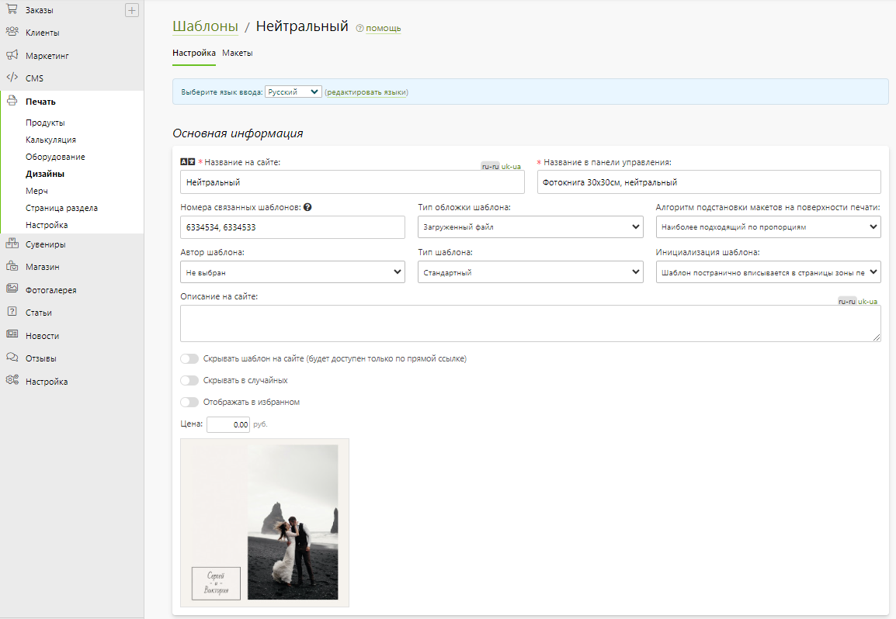
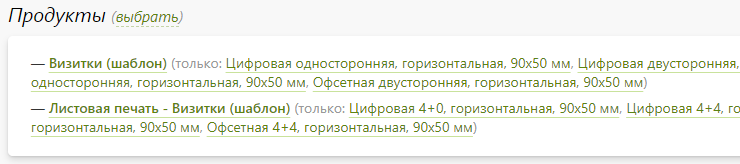
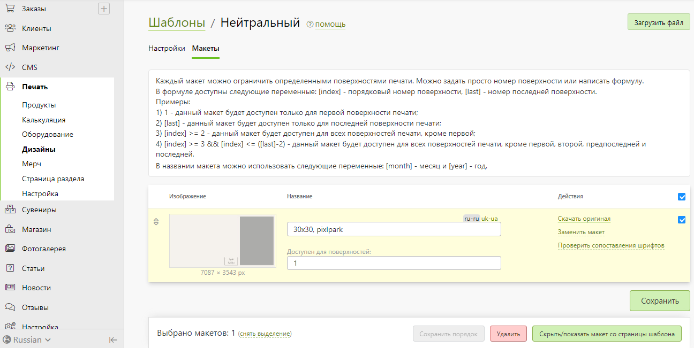

# Дизайны

## Шаблоны
* __Содержание__
    + [Список шаблонов](/print/designs?id=Список-шаблонов)
    + [Карточка шаблона](/print/designs?id=Карточка-шаблона)

### Список шаблонов
* В данном разделе представлен список шаблонов, которые можно отфильтровать:
    + __По сайту__, на которых они доступны.
    + __По редактору__, используемому в продуктах, для которых они применимы.
    + __По категории__ продуктов, для которых они применимы.
    + __По продуктам__ выбранной ранее категории, для которых они применимы.
    + __По тегу__, заданному для них.
    + __По типу__ шаблона (свои, авторские).

* Создать шаблон можно с помощью кнопки "Добавить шаблон". Шаблон создается тремя способами:
    1. Один (без предварительной загрузки макетов).
    2. Несколько с загрузкой PSD-макетов, где каждый макет загружается в отдельный шаблон.
    3. Импорт шаблонов.
* 

* Также на странице можно:
    + Отметить шаблон "избранным" (звездочка), чтобы на сайте в списке шаблона выводился первым.
    + Дублировать выбранные шаблоны.
    + Задать цену для выбранных шаблонов.
    + Привязать выбранные шаблоны к продуктам.
    + Привязать выбранные шаблоны к тегам.
    + Скопировать выбранные шаблоны на другой сайт.
    + Выбрать шаблоны, которые будут отображаться в подборке случайных шаблонов.
    + Удалить шаблоны.

### Карточка шаблона
* __Содержание__
    + [Основная информация](/print/designs?id=Основная-информация)
    + [Печать переменных данных](/print/designs?id=Печать-переменных-данных)
    + [Персонажи шаблона](/print/designs?id=Персонажи-шаблона)
    + [Теги](/print/designs?id=Теги)
    + [Продукты](/print/designs?id=Продукты)
    + [Метаинформация](/print/designs?id=Метаинформация)
    + [Макеты](/print/designs?id=Макеты)
* >  Подробнее о подготовке шаблонов можно узнать в разделе ["Дизайнерам"](/design/psd-general).

#### Основная информация

* __Шаблон__ - это типовой дизайн продукта, на основании которого клиент создает собственное оформление. Например, клиент изменяет текст, загружает свои фотографии или даже добавляет новые элементы оформления.

* __Название на сайте__ - название шаблона, которое выводится на сайте на странице списка шаблонов при наведении на него, на странице шаблона в виде заголовка и в редактора при наведении на шаблон во вкладке "__Шаблоны__".

* __Название в панели управления__ - название шаблона в панели управления. Для удобства работы данное поле может содержать сокращенное название и технические характеристики (например, размер).

* __Номера связанных шаблонов__ - номера связанных шаблонов, перечисленные через запятую. Номер шаблона можно узнать в адресной строке при открытии страницы шаблона в панели управления. Например, если адрес страницы оканчивается на "`/templates/2622444/edit`", то "__2622444__" и будет номером шаблона. При открытии страницы онлайн-редактора на сайте в адресной строке может передаваться номер шаблона, который будет загружаться в редактор для текущего товара. Однако если этот шаблон не связан с товаром, то вместо него по очереди будут пытаться загрузиться  шаблоны, связанные с ним и товаром. Данный механизм связывания используется для шаблонов одного дизайна, но разных форматов. Он нужен, чтобы при переключении товара на сайте в редакторе выбранный шаблон перестраивался под нужный формат товара.
* __Тип обложки шаблона__ - файл, отображаемый в качестве обложки на странице списка шаблонов:
    + Первый макет шаблона.
    + Загруженный файл.
* __Алгоритм подстановки макетов на поверхность печати__ - автматический выбор макета для поверхности печати:
    + Наиболее подходящий по пропорциям.
    + По порядку.
* __Автор шаблона__ - сотрудник компании с ролью "__Дизайнер__", который будет являться автором шаблона. Если у шаблонов задано более одного автора, а на странице списка шалонов на сайте их фильтрация производиться через группу тегов (панель слева), то первой группой тегой будет идти выбор автора. Также данный механизм может использоваться для начисления автору вознаграждения. Для этого в разделе "__Заказы / Статистика / Популярность шаблонов__" в скачиваемой статистике по шаблонам будет указан автор каждого из них. А вознаграждение может быть рассчитано вручную либо от стоимости заказов, либо от цены самого шаблона.
* __Тип шаблона__ - типизация шаблона, влияющая на логику работы редактора:
    + __Стандартный__ - шаблон, в котором макеты по умолчанию последовательно применяются к поверхностям печати продукта. В разделе "Дизайнерам" представлены статьи для подготовки макетов [листовой печати](/design/businesscards) и [фотокниг](/design/photobooks).  
    Пример: [фотокнига](https://demo.pixlpark.ru/printing/hardcover-photobooks-templates/for-15x20-hard), [визитка](https://demo.pixlpark.ru/printing/sheet-printing-templates/for-90x50-one-sided), [футболка](https://demo.pixlpark.ru/printing/t-shirts-cliparts/for-man-white).
    + __Календарь__ - шаблон, в котором макеты применяются к поверхностям печати продукта с дополнительной логикой. В разделе "Дизайнерам" представлена статья для подготовки макетов [календарей](/design/calendars). Настройка шаблона позволяет клиентам при запуске редактора дизайнов выбирать стартовый и конечный год, а в старом редакторе - еще и месяца.  
    Пример: [перекидной календарь](https://demo.pixlpark.ru/printing/wall-calendars-templates/for-a4-vert), [календарь-плакат](https://demo.pixlpark.ru/printing/poster-calendars-templates/for-a2-vert).
    + __Именная фотокнига__ - шаблон, в котором макеты применяются к поверхностям печати продукта с абсолютно уникальной логикой, учитывая имя, пол и цвет волос ребенка главного персонажа, информацию о которых редактор должен получить заранее. В разделе "Дизайнерам" представлена статья для подготовки макетов [именных фотокниг](/design/named-photobooks).  
    Пример: [детская именная фотокнига](https://demo.pixlpark.ru/photobooks/personalized).
* __Инициализация шаблона:__
    + __Согласно настройкам товара__
    + __Шаблон целиком вписывается в зону печати без вылетов__
    + __Шаблон целком заполнет зону печати без вылетов__
    + __Шаблон постранично вписывается в страницы зоны печати без вылетов__ - элементы шаблона будут системно распределены по страницам и вписаны в поверхность печати.
    + __Шаблон постранично заполняет страницы зоны печати без вылетов__ - элементы шаблона будут системно распределены по страницам и заполнят поверхности печати.
* __Описание на сайте__ - текстовое описание, выводимое на сайте на странице шаблона. С помощью описания можно сделать страницу шаблона более уникальной для поисковых систем, что в свою очередь отразиться на ранжировании в поисковой выдаче.
* __Скрывать шаблон на сайте__ - не выводить шаблон на странице списка шаблонов. Однако, страница шаблона по прежнему будет доступна по прямой ссылке (также как и использование шаблона в редакторе по прямой ссылке с передачей его номера в адресной строке). Данная функция может быть полезна для создания непубличных корпоративных дизайнов.
* __Скрывать шаблон в блоке случайных шаблонов__ - не выводить шаблон в блоке случайных шаблонов. Однако, страница шаблона по прежнему будет доступна по прямой ссылке (также как и использование шаблона в редакторе по прямой ссылке с передачей его номера в адресной строке). Данная функция может быть полезна для создания непубличных корпоративных дизайнов.
* __Цена__ - стоимость шаблона, которая выводится на странице списка и учитывается при создании заказа.
* __Обложка шаблона__ - иллюстрация, которая отображается в качестве шаблона на странице списка.

#### Печать переменных данных
* __Печать переменных данных (VDP)__ - возможность оформления печатной продукции таким образом, что каждый экземпляр тиража обладает индивидуальными данными, при этом общие текстовые и графические элементы остаются неизменными.
* Данная технология применяется, например, для печати бейджей сотрудников компании.
* 
* Отметим, что реализация данной функции в Pixlpark имеет ряд ограничений:
    + Поддерживается только в старом редакторе дизайнов;
    + Применяется только для одностраничной продукции;
    + Доступна только для шаблонов с типом "стандартный".
* __Включить печать переменных данных__ - активация данной функции на сайте в редакторе для данного шаблона. При ее включении при первичном посещении редактора будет появляться модальное окно для заполнения данных сотрудников. Также это модальное окно может быть вызвано позднее по нажатию кнопки "__Заполнить данные__".
* __Название группы полей__ - заголовок для группы полей в модальном окне, заполняемых на каждого сотрудника. Для нумерации сотрудников можно использовать переменную "__#__". Например, значение поля может быть "__Сотрудник #__".
* __Поля__ - список полей, заполняемых на каждого сотрудника:
    + __Имя слоя шаблона__ - название текстового слоя в макете шаблона, куда при создании дизайна будет подставляться значение поля ввода.
    + __Заголовок__ - название поле ввода, которое будет выводиться рядом с ним в модальном заполнения данных по сотрудникам.

#### Персонажи шаблона
* В данном разделе содержатся настройки только для шаблонов с типом "__Именная фотокнига__".
* В нем можно запретить оформление заказа без задания всех персонажей именной фотокниги, а также задать самих персонажей.
* 

#### Теги
* В данном разделе отображаются и выбираются теги для шаблона, которые в свою очередь определяются в разделе ["Теги дизайнов"](/print/designs?id=Теги-2).
* 
* 

#### Продукты
* В данном разделе можно выбрать продукты, для которых применим шаблон.
* 
* 

#### Метаинформация
* В данном разделе задается информация для поисковых систем (метаинформация) - заголовок, описание и ключевые слова, которые используются для страницы шаблона.
* 

#### Макеты
* В данном разделе загружаются макеты шаблона в PSD-формате.
    + __PSD__  - графический файл, состоящий из растровых и текстовых слоев, которые можно изменять в редакторе.
* Каждый макет можно ограничить определенными поверхностями печати через параметр "__Доступен для поверхностей__". Можно задать просто номер поверхности или написать формулу.
* В формуле доступны следующие переменные: 
    + `[index]` - порядковый номер поверхности;
    + `[last]` - номер последней поверхности.
* Примеры:
    + `1` - данный макет будет доступен только для первой поверхности печати;
    + `[last]` - данный макет будет доступен только для последней поверхности печати;
    + `[index] >= 2` - данный макет будет доступен для всех поверхностей печати, кроме первой;
    + `[index] >= 3 && [index] <= ([last]-2)` - данный макет будет доступен для всех поверхностей печати, кроме первой, второй, предпоследней и последней.

* 

* Также на странице можно:
    + Загрузить макет;
    + Просмотреть и увеличить обложку макета, которая будет отображаться на сайте на странице шаблона и в редакторе;
    + Задать название макета, которое будет отображаться на сайте на странице шаблона и в редакторе;
    + Задать месяц в шаблоне (если тип шаблона - "календарь").
    + Скачать оригинал макета;
    + Заменить макет;
    + Изменить порядок следования на сайте, который используется по умолчанию, если не заданы ограничения доступности по поверхностям печати;
    + Скрыть выбранные макеты на сайте со страницы шаблона и из редактора.
    + Удалить выбранные макеты.

## Календари

* Данный раздел находится в стадии разработки. 
* 

## Клипарты
* __Содержание__
    + [Карточка клипарта](/print/designs?id=Карточка-клипарта)
    + [Список клипартов](/print/designs?id=Список-клипартов)

### Карточка клипарта
* __Содержание__
    + [Основная информация](/print/designs?id=Основная-информация-1)
    + [Теги](/print/designs?id=Теги-1)
    + [Продукты](/print/designs?id=Продукты-1)
    + [Изображения](/print/designs?id=Изображения)

#### Основная информация
* __Клипарт__ - это растровое изображение, которое может использоваться при создании дизайна в онлайн-редакторе.

* __Название__ - наименование категории клипартов.
* __Тип изображений__ - тип изображений категории:
    + __Дизайн__ - выводится на сайте на странице клипартов и во вкладке "Клипарты" онлайн-редактора Представляет собой готовый дизайн для печати.
    + __Фон__ - выводится на сайте во вкладке "Фон" онлайн-редактора.
    + __Декор__ - выводится на сайте во вкладке "Стикеры" онлайн-редактора.

#### Теги
* В данном разделе для категории клипартов задаются теги из раздела "Теги дизайнов".

#### Продукты
* В данном разделе для категории клипартов задаются продукты, для которых они будут доступны на сайте.

#### Изображения
* В данном разделе представлены растровые изображения (клипарты).
* Также на странице можно:
    + Загрузить новые изображения.
    + Изменить названия изображений.
    + Изменить порядок следования изображений на сайте.
    + Скачать оригинальные изображения.
    + Удалить выбранные изображения.
* 

### Список клипартов
* В данном разделе представлен список категорий, которые можно отфильтровать:
    + __По категории__, товары которой имеют связь с какой-либо категорией клипартов.
    + __По товару__ из выбранной ранее категории, у которого есть связь с какой-либо категорией клипартов.
    + __По тегу__, который задан у какой-либо категории клипартов.
* 

* Также на странице можно:
    + Добавить новую категорию.
    + Перейти в карточку категории.
    + Изменить порядок следования категорий на сайте.
    + Удалить выбранные категории.
    + Удалить дубликаты категорий.

## Теги
* Для удобства выбора шаблонов на сайте предусмотрена их тегизация, которая может быть двух типов:
    + __Облаком тегов__ - возможен выбор только одного тега с последующей фильтрацией шаблонов по нему.
    
    + __Группами тегов__ - возможен выбор нескольких тегов с последующей фильтрацией шаблонов по ним по условию "И". Т.е. останутся только те шаблоны, каждый из которых отмечен всеми выбранными тегами. В данном случае объединение тегов в семантические группы дает большую информативность и удобство работы с ними.
    

* На сайте на странице выбора шаблонов выводятся только теги, которые существуют у шаблонов текущей категории. А применяемый тип тегизации зависит от того, есть ли у тегов группы, или нет.
* В данном разделе представлены теги и группы тегов. Когда ни одной группы не задано, то теги отображаются в виртуальной группе "Без группы".
* Группы можно добавлять, редактировать, удалять и изменять порядок следования на сайте. При удалении группы все ее теги перемещаются в виртуальную группу "Без группы".
* Каждый тег имеет следующие характеристики:
    + __ID__ - системный идентификатор.
    + __Название__ - название тега.
    + __URL__ - идентификатор, участвующий в формировании адреса страницы шаблонов с данным тегом.
    + __CSS-класс__ - дополнительная информация для брендирования страницы шаблонов.
* Список тегов позволяет:
    + Фильтровать теги:
        - По типу дизайна: все, шаблоны, клипарты.
        - По категории печати: все, любая категория.
    + Добавлять новый тег без привязки к дизайну.
    + Редактировать данные любого тега.
    + Изменять порядок следования тегов на сайте.
    + Перемещать выделенные теги в любую группу.
    + Удалять неиспользуемые теги.
    + Удалять выделенные теги.

## Описания
* Страницы шаблонов на сайте хоть и обладают уникальным набором дизайнов, но по умолчанию не воспринимаются поисковыми системами уникальными из-за большого дублирования контента. Как следствие, такие страницы склеиваются в поисковой выдаче.
* Соответственно, для повышения уникальности страниц шаблонов в данном разделе можно задать для них разные заголовки (`H1`), описание (идущее после заголовка) и метаинформацию. Причем набор этой информации может быть уникальным для каждой категории продуктов и выбранного клиентом тега шаблонов.
