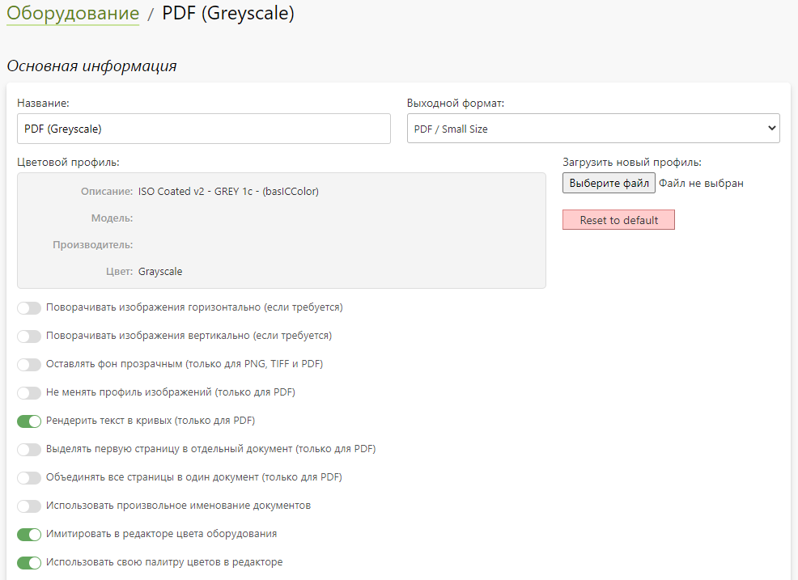
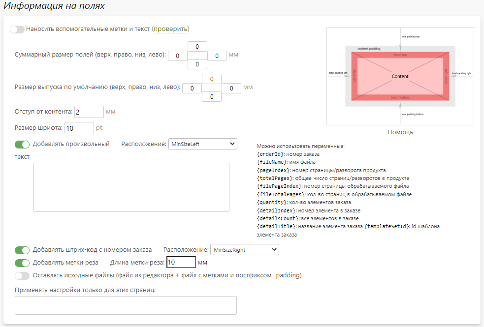
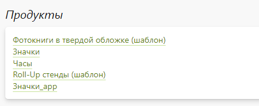
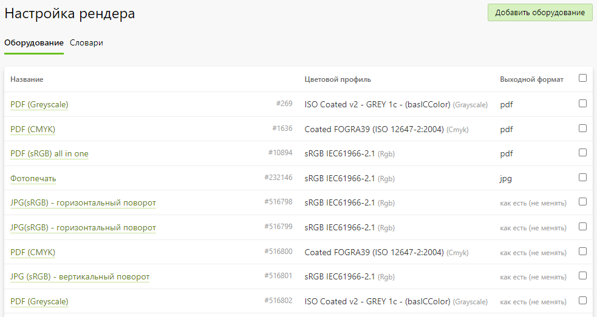
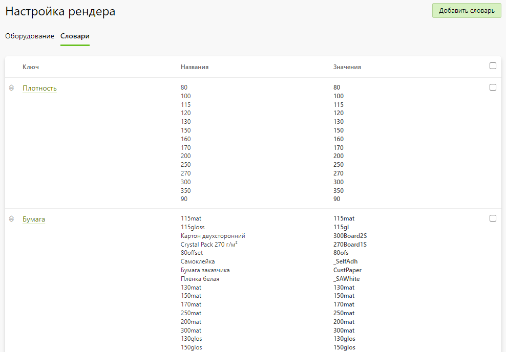
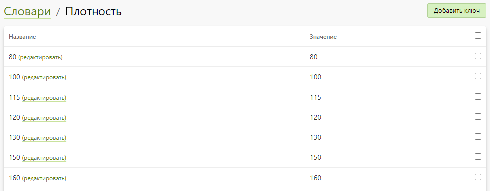

# Настройка рендера

## Карточка оборудования
* __Содержание__
    + [Основная информация](/orders/settings?id=Основная-информация)
    + [Информация на полях](/orders/settings?id=Информация-на-полях)
    + [Продукты](/orders/settings?id=Продукты)

### Основная информация
* __Оборудование__ - это набор настроек, отвечающих за формирование выходных файлов из редакторов. Ниже рассмотрим эти настройки.

* __Название__ - название оборудования.
* __Выходной формат__ - формат выходного файла:
    + __Как есть__ - сохраняет загруженные клиентом файлы без изменений (для редактора проверки макетов).
    + __PDF / Small Size__ - сохраняет выходной файл в PDF-формате со всеми настройками оборудования, однако, умеет работать только с документами небольших размеров.
    + __PDF / Without Profile__ - сохраняет выходной файл в PDF-формате со всеми настройками оборудования, однако, не учитывает загруженный цветовой профиль.
    + __PNG__ - сохраняет выходной файл в PNG-формате, однако, поддерживает только цветовую модель RGB.
    + __JPEG__ - сохраняет выходной файл в JPEG-формате.
    + __TIFF__ - сохраняет выходной файл в TIFF-формате.
* __Цветовой профиль__ - задание цветовой модели, в которой нужно сохранить выходное изображение. По умолчанию применяется профиль sRGB.
* __Поворачивать изображения горизонтально (если требуется)__ - поворачивать вертикальные выходные изображение на 90 градусов (функцию поддерживают редактор книг по требованию, старый редактор дизайнов, редактор интерьера и редактор фотопечати).
* __Поворачивать изображения вертикально (если требуется)__ - поворачивать горизонтальные выходные изображение на 90 градусов (функцию поддерживают редактор книг по требованию, редактор дизайнов (старый), редактор интерьера, редактор фотопечати).
* __Оставлять фон прозрачным (только для PNG, TIFF и PDF)__ - заменять в выходном файле белый фон на прозрачный (функцию поддерживают редактор книг по требованию, старый редактор дизайнов и редактор интерьера).
* __Не менять профиль изображений (только для PDF)__ - не приводить цветовой профиль конечного изображения к указанному в оборудовании, оставив исходное цветовую модель (функцию поддерживают редактор именных фотокниг, редактор проверки макетов, редактор фотокниг по требованию и редактор фотопечати).
* __Рендерить текст в кривых (только для PDF)__ - сохранять текст не в виде растра, а в виде кривых (функцию поддерживают: редактор дизайна, старый редактор дизайна, редактор интерьера и редактор книг по требованию).
* __Выделять первую страницу в отдельный документ (только для PDF)__ - сохранять первую страницу дизайна одним документом, а все остальные - другим (функцию поддерживают редактор дизайна, старый редактор дизайна, редактор интерьера и редактор книг по требованию).
* __Объединять все страницы в один документ (только для PDF)__ - сохранять все страницы дизайна в виде одного документа (функцию поддерживают редактор дизайна, старый редактор дизайна, редактор интерьера и редактор книг по требованию).
* __Использовать произвольное именование документов__ - задать шаблон именования файлов с использованием параметра "`{index}`", вместо которого будет подставляться номер страницы дизайна, начиная с "1" (функцию поддерживают старый редактор дизайна, редактор интерьера и редактор книг по требованию).
* __Имитировать в редакторе цвета оборудования__ - применять ко всем изображениям редактора заданный цветовой профиль (функцию поддерживает только старый редактор дизайнов).
* __Использовать свою палитру цветов в редакторе__ - задать свою палитру цветов для заливки фона(функцию поддерживает только старый редактор дизайнов).

### Информация на полях
* В данном разделе настраивается формирование полей и вывод сопроводительной информации на них.

### Продукты
* В данном разделе задаются продукты, для которых будет применяться оборудование при формировании выходных файлов редактора.

## Список оборудования
* В данном разделе представлен список оборудования.
* Также на странице можно:
    + Добавить новое оборудование.
    + Перейти в карточку любого оборудования.
    + Удалить выделенные оборудования.

## Словари
* __Содержание__
    + [Создание словарей](/orders/settings?id=Создание-словарей)
    + [Использование словарей](/orders/settings?id=Использование-словарей)

### Создание словарей
* __Словарь__ - это набор данных вида "ключ-значения", которые используются при именовании выходных файлов редактора.
* На странице списка словарей можно:
    + Добавить новый словарь, задав его название.
    + Перейти в карточку словаря, которая представляет собой список из названия и значения ключа.
    + Удалить выбранные словари.

* В карточке словаря можно:
    + Добавить пару "ключ-значение", указав его название и значение.
    + Редактировать пару "ключ-значение".
    + Удалить выбранные пары "ключ-значение".

### Использование словарей
* Для именования выходных файлов редактора в зависимости от параметров продукта необходимо выполнить следующие действия:
1. В [карточке продукта](/print/products) в настройках включить "Использовать опции для формирования имен выходных файлов".
1. В карточках связанных с продуктом опции включить "Использовать опцию для именования выходных файлов". Затем выбрать один из созданных ранее словарей.
1. В карточке позиции опции выбрать пару "ключ-значение" по названию ключа.
* При оформлении заказа на сайте имена выходных файлов редактора будут состоять из значений ключей словарей, выбранных в связанных опциях.