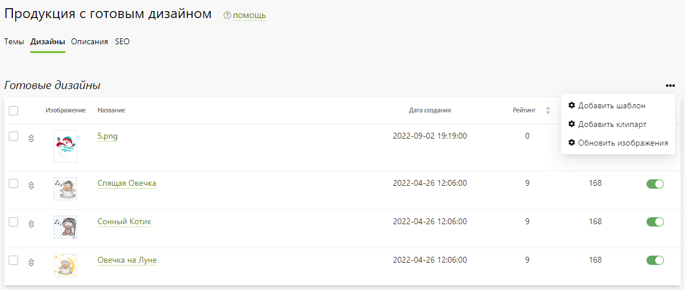
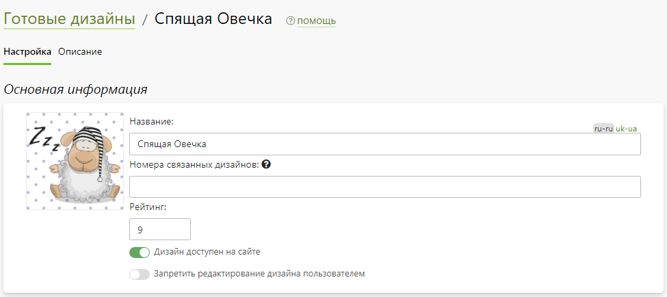

# Продукция с готовым дизайном
## Описание
* __Мерч__ - это обособленный раздел на сайте для продажи [продукции с готовым дизайном](https://demo.pixlpark.ru/designs), доступный по адресу "__/designs__". При этом карточки товаров автоматически формируются в соответствии с банком готовых тематических дизайнов и продуктов, подходящих для их нанесения. Товар можно приобрести "как есть" или внеся изменение в готовый дизайн (например, добавив поздравление).
* В отличие от уже имеющихся на сайте страниц шаблонов и клипартов страница продукции с готовыми дизайнами имеет наглядную визуализацию, удобную навигацию (как по тематикам, так и по продуктам одного дизайна), а также динамические карточки товаров, поддающиеся индексации и ранжированию в поисковых системах.

## Темы 
* В данном разделе представлен список тем готовых дизайнов, которые могут иметь неограниченную вложенность. Однако, мы не рекомендуем использовать вложенность больше второго уровня.

* Добавление новых тем осуществляется при помощи кнопки "__Добавить__" в выпадающем меню.
* Добавление или удаление вложенных подразделов осуществляется при помощи расположенных у соответствующего раздела кнопок "__Добавить__" / "__Удалить__".
* Редактирование существующих тем осуществляется через карточку "__Редактирование темы__", появляющуюся при нажатии на тему. Помимо изменения названий, также возможно выбрать принадлежащие ей дизайны.

## Дизайны
* __Содержание__
    + [Список дизайнов](/print/merch?id=Список-дизайнов)
    + [Карточка дизайна](/print/merch?id=Карточка-дизайна)

### Список дизайнов
* В данном разделе представлен список готовых дизайнов.

* В список могут быть добавлены любые шаблоны и клипарты при помощи кнопки "__Добавить__" в выпадающем меню. Также при помощи данного меню можно обновить изображения.
* При добавлении их можно привязать к теме, а также оставить или выключить существующие у клипартов или шаблонов привязки к продуктам.

* Также в разделе можно:
    + Перейти в карточку дизайна.
    + Включить или выключить доступность любого дизайна на сайте.
    + Включить выделенные дизайны.
    + Удалить выделенные дизайны.
    + Привязать выделенные дизайны к продуктам.

### Карточка дизайна
* __Содержание__
    + [Основная информация](/print/merch?id=Основная-информация)
    + [Мерч](/print/merch?id=Мерч)
    + [Описание](/print/merch?id=Описание)

#### Основная информация
* __Обложка__ - иллюстрация дизайна.
* __Название__ - название дизайна, которое выводится на сайте.
* __Номера связанных дизайнов__ - номера дизайнов, которые будут отображаться в блоке "Товары с этим же дизайном".
* __Рейтинг__ - рейтинг дизайна, согласно которому он сортируется на сайте.
* __Дизайн доступен на сайте__ - доступность или недоступность дизайна на сайте.
* __Запретить редактирование дизайна пользователем__ - запрет на редактирование дихайна пользователем.

#### Мерч
* В данном разделе отображается список готовой продукции с дизайнами (мерч). 
* Каждый такой продукт формируется комбинацией текущего дизайна и выбранных продуктов раздела "__Печать__".

* Список мерча позволяет:
    + Добавлять новый продукт для данного дизайна.
    + Изменить название мерча.
    + Перейти в карточку продукта на сайт (в отдельной вкладке).
    + Перейти в карточку продукта в панели управления (в отдельной вкладке).
    + Включить или выключить доступность мерча на сайте.
    + Установить мерч по умолчанию (товар, к которому будет применяться дизайн и отображение на сайте по умолчанию).
    + Включить выделенные мерчи.
    + Удалить выделенные мерчи.
* 

#### Описание
* В данном разделе описание дизайна, которое отображается на сайте в карточке товара в блоке "__О товаре__".
* Отметим, что блок "__О товаре__" карточки товара формируется из двух частей, следующих друг за другом - из описания продукта и из описания дизайна.

## Описания
* В данном разделе задаются описания продуктов, которые отображаются в карточках товаров на сайте в блоке "__О товаре__".
* Задать описание можно как единовременно для всех продуктов выбранной категории, так и индивидуально для каждого. 
* Отметим, что блок "__О товаре__" карточки товара формируется из двух частей, следующих друг за другом - из описания продукта и из описания дизайна.

## Метаинформация
В данном разделе задается информация для поисковых систем (метаинформация) - заголовок, описание и ключевые слова, которые используются по умолчанию для всех карточек товаров на сайте.
