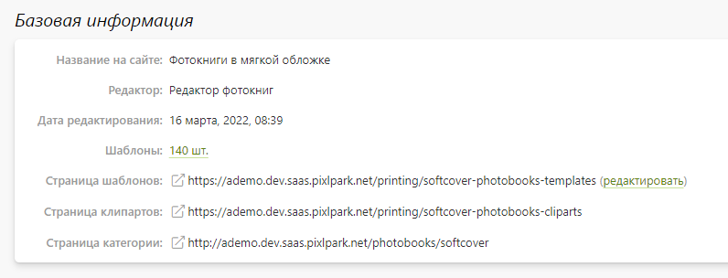
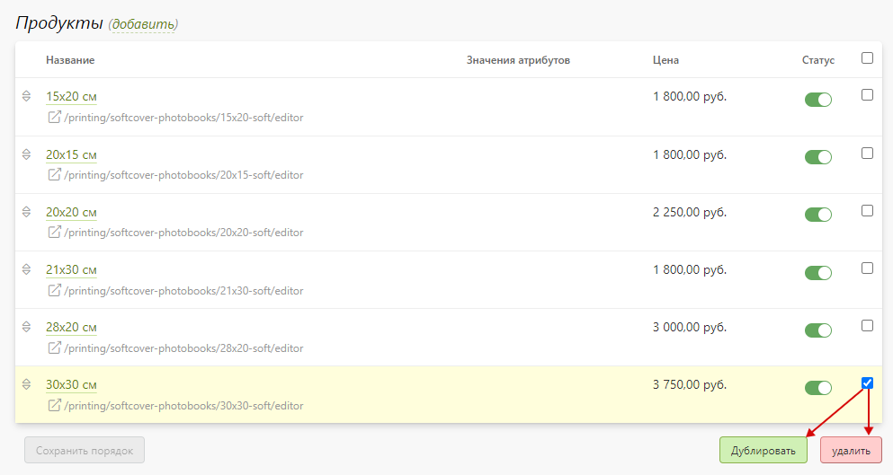
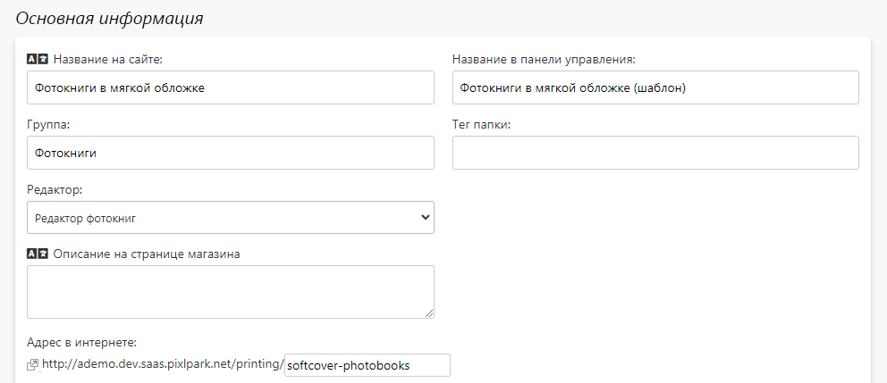
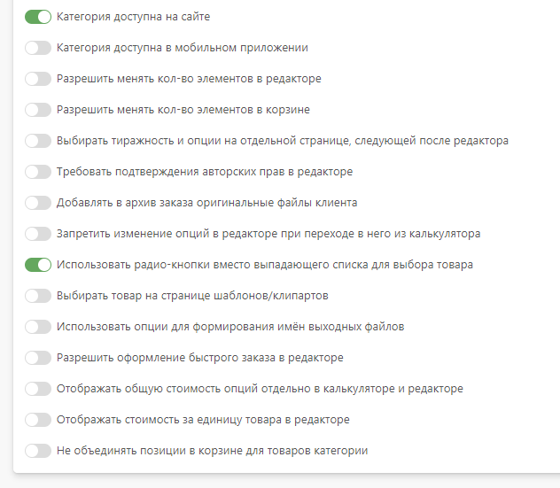
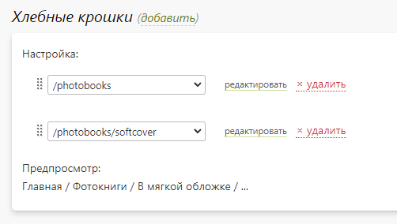
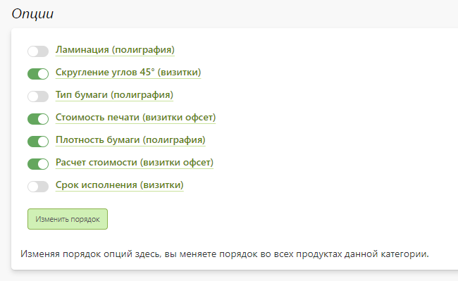
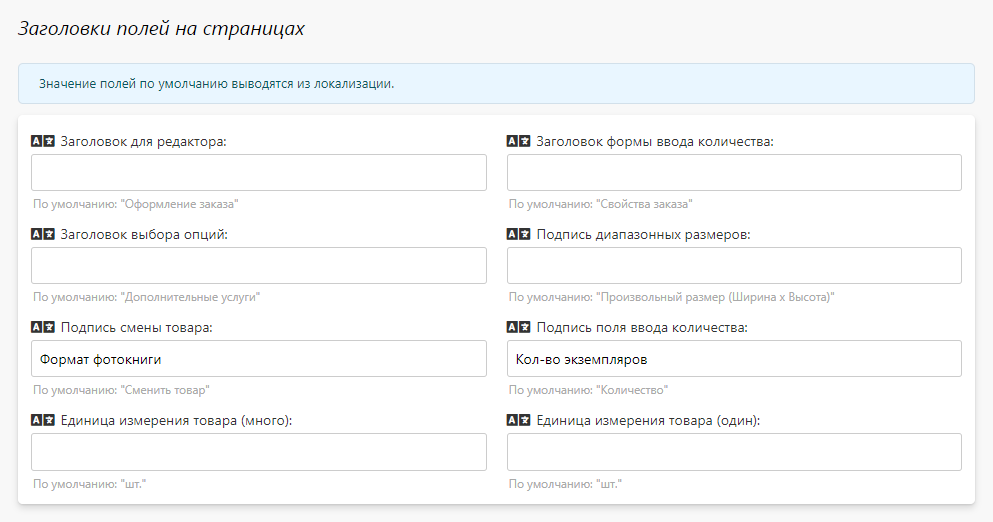
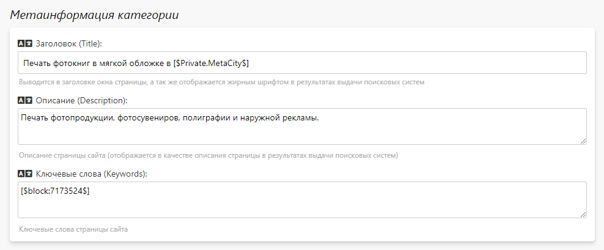
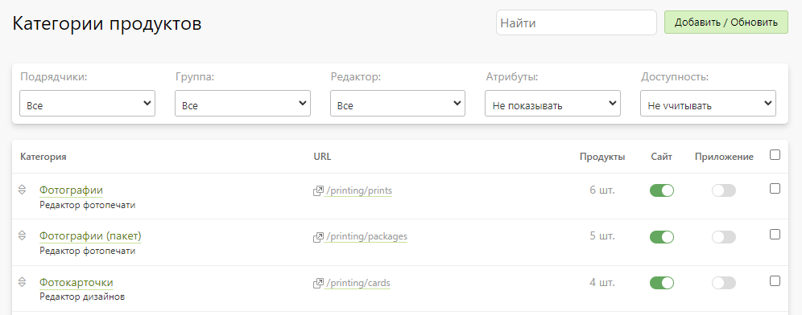

# Продукты
## Карточка категории
* __Содержание__
    + [Продукты](/orders/settings?id=Продукты)
    + [Настройка](/orders/settings?id=Настройка)   
    + [Редактор](/orders/settings?id=Редактор)
    + [Калькулятор](/orders/settings?id=Калькулятор)
    + [Атрибуты](/orders/settings?id=Атрибуты)
    + [Дизайны](/orders/settings?id=Дизайны)

### Продукты
* __Содержание__
    + [Базовая информация](/orders/settings?id=Базовая-информация)
    + [Список продуктов](/orders/settings?id=Список-продуктов)   

#### Базовая информация
* В данном разделе содержится базовая информация про категорию:
    + Название категории на сайте.
    + Используемый редактор для приема заказов.
    + Дата последнего изменения категории.
    + Количество прикреплённых шаблонов.
    + Адрес карточки продукта (категории) на сайте.
    + Адрес страницы шаблонов на сайте.
    + Адрес страницы клипартов на сайте.
* 

#### Список продуктов
* В данном разделе представлен список продуктов категории.
* Также на странице можно:
    + Добавить новый продукт:
        - с дублированием существующего;
        - с нуля.
    + Перейти в карточку продукта.
    + Включить или выключить доступность продукта на сайте.
    + Изменить порядок следования продуктов на сайте.
    + Дублировать выделенные продукты.
    + Удалить выделенные продукты.
* 

### Настройка 
#### Основная информация
* В данном разделе представлены основные настройки категории. Рассмотрим некоторых из них более детально.
* __Название на сайте__ - название категории, которое используется при именовании позиции корзины и заказа. Также может использоваться в калькуляторе при отсутствии задания названия категории в его настройках.
* __Название в панели управления__ - название категории в панели управления. В отличии от названия на сайте может содержать в себе еще способ приема заказа.
* __Название в папке заказа__ - название категории (на латинице), которое может использоваться вместе "названия на сайте" при формировании названия папки элемента заказа. 
* __Группа__ - название группы категорий, которое используется для фильтрации категорий на странице списка, а также для формирования в мобильном приложении экрана выбора группы товаров перед выбором категории.
* __Редактор__ - онлайн-редактор для приема заказов на продукцию данной категории.
* __Описание для мерча__ - текстовое описание, которое выводится на сайте в карточке мерча (продукта с готовым дизайнов)  при отсутствии аналогичной записи у продукта.
* __Адрес в интернете__ - адрес страницы карточки продукта на сайте; здесь задается уникальный идентификатор категории, который впоследствии будет участвовать в формирования уникального адреса страницы шаблонов, редактора и идентификатора калькулятора для данной категории. Допустимо использовать цифры `[0-9]`, латиницу в нижнем регистре `[a-z]`, нижнее подчеркивание `[_]`, дефис `[-]` и точку `[.]`.

#### Страница категории
* В данном разделе задается страница, которая будет выступать на сайте карточкой продукта. Это может быть либо системная страница со строго ограниченным дизайном и набором управляющих элементов, либо произвольная страница из раздела CMS с абсолютно уникальной логикой поведения.
* Мы рекомендуем использовать вариант с произвольной страницей CMS (по образу и подобию тех, которые существуют на демо-сайте Pixlpark).

#### Хлебные крошки
* В данном разделе осуществляется формирование навигационной цепочки для системных страниц, с которыми работает посетитель сайта до корзины пользователя.
* По правилам хорошего тона хлебные крошки должны содержать полную навигацию от главной страницы сайта до текущего местоположения. 

#### Опции
* В данном разделе представлен список опций для продуктов категории.
* Каждую из опций можно либо включить, либо выключить для всех товаров категории, а также изменить их порядок следования на сайте.

#### Заголовки полей на страницах
* В данном разделе можно переопределить различные заголовки полей для категории, которые отображаются на сайте в процессе оформления заказа.
* По умолчанию используются единые для всех категорий константы локализации.

#### Метаинформация
* В данном разделе задается информация для поисковых систем (метаинформация) - заголовок, описание и ключевые слова, которые используются для системной страницы категории и страницы редактора.

### Редактор
> Данный подраздел уникальный для каждого редактора.

#### Основная информация
* В данном разделе задаются общие параметры работы редактора для всех продуктов категории. Однако их можно переопределить для каждого продукта в отдельности.

#### Настройка поверхностей
* В данном разделе задаются настройки поверхностей печати для редактора дизайнов.

#### Настройка меню
* В данном разделе задаются настройки бокового меню для редактора дизайнов.

#### Настройка редактора
* В данном разделе задаются параметры работы старого редактора дизайнов для настольной и мобильной версии сайта.

#### Проверка растровых документов
* В данном разделе задаются параметры проверки растровых документов, загружаемых в редактор проверки макетов.

#### Проверка PDF документов
* В данном разделе задаются параметры проверки PDF документов, загружаемых в редактор проверки макетов.

#### Настройка рендера
* В данном разделе задается формат или настроенное оборудование для формирования выходных файлов редактора.
* В сервисе предусмотрено несколько стандартных форматов:
    + TIFF (sRGB)
    + JPEG (sRGB)
    + PNG (sRGB)
    + PDF (sRGB)

#### Вкладки редактора
* В данном разделе задаются ссылки, которые отображаются в редакторе в виде вкладок над его рабочей областью.
* Это необходимо для того, чтобы посетитель сайта имел возможность изменять способ заказа, находясь в редакторе, в случае, когда для одного продукта существует несколько категорий с разными типами редакторов. 
* Данный механизм работает для всех редакторов, кроме редактора дизайнов.

#### Дополнительные поля
* В данном разделе задаются дополнительные поля, которые отображаются в редакторе под рабочей областью. Данные, заполненные посетителем сайта в этих полях, в последствии отображаются в заказе в виде сопроводительной информации.
* Данный механизм работает для всех редакторов, кроме редактора дизайнов.

### Калькулятор
#### Калькулятор Pixlpark
* __Калькулятор Pixlpark__ - это стандартный механизм расчета стоимости продукции, основанный на стоимости самих продуктов и связанных с ними опциях.
* Для каждой категории можно определить несколько вариантов поведения калькулятора. Например, для настольной и мобильной версии внешний вид и логика может отличаться. Наборы настроек для каждого варианта поведения называются представлениями.
* Калькулятор устанавливается на страницы сайта путем размещение одного из нескольких скриптов:
    + `[$calculator(category:%URL-Category%)$]` - для представления "`default`", где `%URL-Category%` - задаваемая часть адреса страницы категории.
    + `[$calculator(category:%URL-Category%, config:%Config-Name%)$]`, для представления "`%Config-Name%`", где `%URL-Category%` - задаваемая часть адреса страницы категории.
* Настройки калькулятора сгруппированы в несколько блоков:
    + __Основная информация__ - задаются общие настройки калькулятора.
    + __Продукты__ - задаются настройки работы с продуктами, включающие работу с категориями, атрибутами и товарами.
    + __Тиражи__ - задаются настройки работы с тиражностью, включающие работу с поверхностями и формулами их преобразования.
    + __Опции__ - задаются настройки работы с опциями.

#### Калькулятор 1С:Полиграфия
* __Калькулятор 1С:Полиграфия__ - это механизм расчета стоимости продукции, основанный на импортируемых данных (ценах), называемых шаблонами, из 1С:Полиграфия. Сами шаблоны в формате CSV загружаются в карточках продуктов.
* Для каждой категории можно определить лишь один вариант поведения калькулятора (представление).
* Калькулятор устанавливается на страницы сайта путем размещение одного из нескольких скриптов:
    + `[$poly1ccalculator(category:%URL-Category%)$]` - где `%URL-Category%` - задаваемая часть адреса страницы категории.
    + `[$poly1ccalculator(category:%URL-Category%, materialId:%Product-ID%)$]` - где `%URL-Category%` - задаваемая часть адреса страницы категории, `%Product-ID%` - идентификатор продукта, с которым должен запуститься калькулятор.
    + `[$poly1ccalculator(category:%URL-Category%, materialId:%Product-ID%, afterLoadFunction)$]` - где `%URL-Category%` - задаваемая часть адреса страницы категории, `%Product-ID%` - идентификатор продукта, с которым должен запуститься калькулятор, `afterLoadFunction` - JS-функция, запускаемая после создания калькулятора на странице сайта.
* Настройки калькулятора сгруппированы в несколько блоков:
    + __Основная информация__ - задаются общие настройки калькулятора.
    + __Продукты__ - задаются настройки работы с продуктами.

#### Калькулятор ASystem
* __Калькулятор ASystem__ - это механизм расчета стоимости продукции, основанный на импортируемых данных (ценах), называемых шаблонами, из ASystem. Для каждого продукта в ASystem предусмотрел индивидуальный шаблон, который можно выбрать из списка возможных в карточке продукта.
* Для каждой категории можно определить лишь один вариант поведения калькулятора (представление).
* Калькулятор устанавливается на страницы сайта путем размещение одного из нескольких скриптов:
    + `[$asystemcalculator(category:%URL-Category%)$]` - где `%URL-Category%` - задаваемая часть адреса страницы категории.
    + `[$asystemcalculator(category:%URL-Category%, materialId:%Product-ID%)$]` - где `%URL-Category%` - задаваемая часть адреса страницы категории, `%Product-ID%` - идентификатор продукта, с которым должен запуститься калькулятор.
    + `[$asystemcalculator(category:%URL-Category%, materialId:%Product-ID%, afterLoadFunction)$]` - где `%URL-Category%` - задаваемая часть адреса страницы категории, `%Product-ID%` - идентификатор продукта, с которым должен запуститься калькулятор, `afterLoadFunction` - JS-функция, запускаемая после создания калькулятора на странице сайта.
* Настройки калькулятора сгруппированы в несколько блоков:
    + __Основная информация__ - задаются общие настройки калькулятора.
    + __Продукты__ - задаются настройки работы с продуктами.

#### Калькулятор AXIOM
* __Калькулятор AXIOM__ - это механизм расчета стоимости продукции, основанный на импортируемых данных (ценах), называемых шаблонами, из AXIOM. Для каждого продукта в AXIOM предусмотрел индивидуальный шаблон, который можно выбрать из списка возможных в карточке продукта. 
* Для каждой категории можно определить лишь один вариант поведения калькулятора (представление).
* Калькулятор устанавливается на страницы сайта путем размещение одного из нескольких скриптов:
    + `[$axiomculator(category:%URL-Category%)$]` - где `%URL-Category%` - задаваемая часть адреса страницы категории.
    + `[$axiomculator(category:%URL-Category%, materialId:%Product-ID%)$]` - где `%URL-Category%` - задаваемая часть адреса страницы категории, `%Product-ID%` - идентификатор продукта, с которым должен запуститься калькулятор.
    + `[$axiomculator(category:%URL-Category%, materialId:%Product-ID%, afterLoadFunction)$]` - где `%URL-Category%` - задаваемая часть адреса страницы категории, `%Product-ID%` - идентификатор продукта, с которым должен запуститься калькулятор, `afterLoadFunction` - JS-функция, запускаемая после создания калькулятора на странице сайта.
* Настройки калькулятора сгруппированы в несколько блоков:
    + __Основная информация__ - задаются общие настройки калькулятора.
    + __Продукты__ - задаются настройки работы с продуктами.

#### Калькулятор HelloPrint
* __Калькулятор HelloPrint__ - это механизм расчета стоимости продукции, основанный на импортируемых данных (ценах), называемых шаблонами, из HelloPrint. Для каждого продукта в HelloPrint предусмотрел индивидуальный шаблон, который можно выбрать из списка возможных в карточке продукта.
* Для каждой категории можно определить лишь один вариант поведения калькулятора (представление).
* Калькулятор устанавливается на страницы сайта путем размещение одного из нескольких скриптов:
    + `[$helloprintcalculator(category:%URL-Category%)$]` - где `%URL-Category%` - задаваемая часть адреса страницы категории.
    + `[$helloprintcalculator(category:%URL-Category%, materialId:%Product-ID%)$]` - где `%URL-Category%` - задаваемая часть адреса страницы категории, `%Product-ID%` - идентификатор продукта, с которым должен запуститься калькулятор.
    + `[$helloprintcalculator(category:%URL-Category%, materialId:%Product-ID%, afterLoadFunction)$]` - где `%URL-Category%` - задаваемая часть адреса страницы категории, `%Product-ID%` - идентификатор продукта, с которым должен запуститься калькулятор, `afterLoadFunction` - JS-функция, запускаемая после создания калькулятора на странице сайта.
* Настройки калькулятора сгруппированы в несколько блоков:
    + __Основная информация__ - задаются общие настройки калькулятора.
    + __Продукты__ - задаются настройки работы с продуктами.

#### Основная информация
* __Атрибуты__ - это характеристики продукта, описывающие его семантику. Использование атрибутов упрощает выбор нужного продукта в калькуляторе или редакторе - вместо выбора нужного продукта из длинного списка посетителю сайта потребуется лишь выбрать значения нескольких атрибутов.
> Например, на демонстрационном сайта Pixlpark есть категория "Холсты в раму", содержащая 288 продуктов. Вместо неудобного выбора нужного продукта из большого списка требуется лишь выбрать значения нескольких атрибутов: ориентация, размер, цвет рамы и паспорту.

* В данном разделе задается список атрибутов для всех продуктов категории, а также их логика отображения и поведения на сайте. Значения атрибутов задаются в карточках продуктов.

### Дизайны 
#### Основная информация
* В данном разделе задается общее поведение страницы списка шаблонов и клипартов на сайте.

#### Настройки отображения
* В данном разделе задается логика отображения элементов на странице списка шаблонов и клипартов на сайте.

## Карточка продукта
### Настройка 
#### Базовая информация
* В данном разделе содержится базовая информация про:
    + Используемый редактор для приема заказов.
    + Дата последнего изменения категории.
    + Адрес карточки продукта (категории) на сайте.

#### Основная информация
* В данном разделе представлены основные настройки продукта. Рассмотрим некоторых из них более детально.
* __Название на сайте__ - название продукта, которое используется при именовании позиции корзины и заказа. Также может использоваться в калькуляторе, если название продукта не задано в его настройках.
* __Название в панели управления__ - название продукта в панели управления. В отличие от названия на сайте, может содержать в себе дополнительную техническую информацию (например, значение атрибутов).
* __Название в папке заказа__ - название продукта (на латинице), которое может использоваться вместе "названия на сайте" при формировании названия папки элемента заказа. 
* __Название в имени выходного файла__ - название продукта на латинице, которое может использоваться вместе "названия на сайте" при формировании имени выходного файла при включенной настройке категории "Использовать опции для формирования имен выходных файлов".
* __Описание в системной странице категории__ - описание, которое выводится в таблице выбора продуктов на системной странице категории.
* __Описание в калькуляторе__ - описание, которое выводится у товара в калькуляторе в случае выбора параметра "Внешний вид товаров" в "Описание для калькулятора".
* __Вывод цены на странице__ - константа вывода стоимости продукта (с заданным тиражом и количеством страниц) на произвольную страницу CMS.
* __Вывод цены с опциями__ - константа вывода стоимости продукта вместе с минимально возможными значениями по цене и обязательными к выбору опциями на произвольную страницу CMS.
* __Вывод цены за единицу товара__ - константа вывода стоимости единицы продукта (с заданным тиражом и количеством страниц) на произвольную страницу CMS.
* __Адрес в интернете__ - адрес страницы редактора на сайте для текущего продукта; здесь задается уникальный идентификатор продукта, который участвует в формировании адреса. Допустимо использовать цифры `[0-9]`, латиницу в нижнем регистре `[a-z]`, нижнее подчеркивание `[_]`, дефис `[-]` и точку `[.]`.
* __Вес продукта__ - вес продукта, который учитывается при расчете стоимости доставки.
* __Обложка__ - иллюстрация, которая отображается в корзине для позиции заказа; используется для всех редакторов, кроме текущего и старого редактора дизайнов, а также редактора интерьера.

#### Тиражность
* В данном разделе задается расчет стоимости продукции, а также алгоритм выбора тиража на сайте.
* Предусмотрено несколько вариантов тиражности:
    + __Произвольный тираж__ - стоимость одного продукта может быть разной для заданных диапазонов тиражности. Данный вариант применим, например, для фотокниг.
    + __Предзаданные тиражи__ - наборы тиражей с фиксированной стоимостью.  Данный вариант применим, например, для визиток.
    + __Тиражи другого продукта__ - в этом случае продукт использует настройки тиражности другого выбранного продукта.
* Для многостраничных продуктов (например, фотокниг) можно задать минимальное и максимальное количество страниц с шагом роста и дополнительной стоимостью одной страницы. При этом при задании цены в вариантах тиражности учитывается стоимость продукта с минимальным количеством страниц.

#### Опции
* В данном разделе представлен список опций для данного продукта.
* Каждую из опций можно либо включить, либо выключить, а также изменить их порядок следования на сайте.

#### Шаблон ASystem | 1С:Полиграфия | HelloPrint | AXIOM
* Данный раздел отображается только если подключена интеграция с одной из перечисленных ERP-систем.
* В нем можно либо выбрать шаблон продукта, полученный с сервера учетной системы, либо загрузить его самостоятельно (1С:Полиграфия).

### Калькулятор
* В данном разделе для выбранного продукта можно переопределить настройки калькулятора, заданные в карточке категории для всех ее продуктов.

### Атрибуты
* В данном разделе для каждого атрибута, определенного в карточке категории, задаются:
    + __Значения атрибутов__;
    + __Описание__:
        - __Для калькулятора__ - выводится в калькуляторе под значением атрибута (только если продукты выбираются через кнопки).
        - __Для подсказки калькулятора__ - выводится в калькуляторе в поп-ап окне, появляющемся при наведении на иконку вопроса у позиции.
        - __Для редактора__ - выводится в редакторе под значением атрибута, если их переключение настроено в виде радио-кнопок.

## Список категорий
* В данном разделе представлен список категорий продуктов, которые можно отфильтровать:
    + __По группе__, задаваемой в настройках категории.
    + __По редактору__, используемому товарами категории для приёма заказов.
    + __По подрядчику__, связанному с какими-либо категориями.
    + __По доступности__ категории на сайте или в приложении.
        - __Не учитывать__ - все категории.
        - __Везде__ - категории, доступные и на сайте, и в приложении.
        - __Нигде__ - категории, которые нигде не доступны.
        - __Только на сайте__ - категории, доступные только на сайте.
        - __Только в приложении__ - категории, доступные только в приложении.
        - __На сайте или в приложении__ - категории, доступные на сайте или в приложении.

* Также в блоке фильтра последним элементом расположен блок "__Атрибуты__", в зависимости от которого в списке категорий будут или не будут отображаться их атрибуты.
* В левом верхнем углу расположена кнопка "__Добавить / Обновить__", которая позволяет выполнить следующие действия:
    + __Скопировать категорию с демо-сайта__ со всеми товарами и связанными с ними опциями.
    + __Дублировать существующую категорию__ со всеми товарами и связанными с ними опциями. В зависимости от настроек продукты дублированной категории могут наследоваться от исходной.
    + __Создать новую категорию__ с заданием её названия и выбором редактора.
    + __Обновить данные выбранных категорий__, для чего нужно:
        - Экспортировать данные выбранных категорий в эксель-файл.
        - Изменить данные в эксель-файле:
            - Во вкладке "__Категории__" можно изменить название и URL-адрес категорий.
            - Во вкладке "__Товары__" можно изменить название, URL-адрес, тиражность и стоимость товаров.
            - Во вкладке "__Опции__" можно изменить название опций, а также название и стоимость их позиций.
        - Импортировать данные по категориям из эксель-файла.

* Также на странице можно:
    + Перейти в карточку любой категории.
    + Включить или выключить доступность любой категории для сайта или приложения.
    + Изменить порядок следования категорий на сайте и в приложении.
    + Обновить цены выбранных категорий.
    + Дублировать выбранные категории (без наследования, но со всеми продуктами и опциями).
    + Удалить выбранные категории.
* Т.к. стоимость продукции не является дискретной величиной, то для обновления цен вводятся новые понятия:
    + __Тип цены__:
        - Базовая цена продукта.
        - Цена шага роста многостраничного продукта.
        - Цена поверхности.
        - Цена опции.
        - Цена позиции опции.
    + __Коэффициент__, на который нужно умножить каждый тип цены.
    + __Округление__ стоимости после применения коэффициента:
        - До четырех знаков после запятой.
        - До трех знаков после запятой.
        - До двух знаков после запятой.
        - До одного знака после запятой.
        - До целых.
        - До десятков.
        - До сотен.

