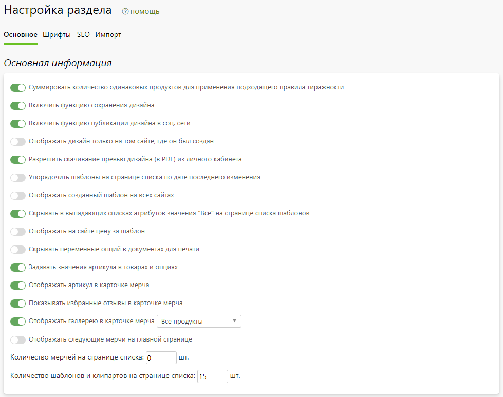
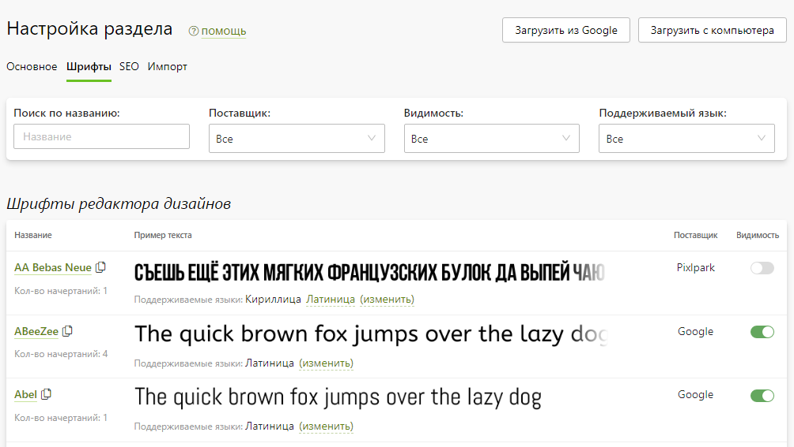
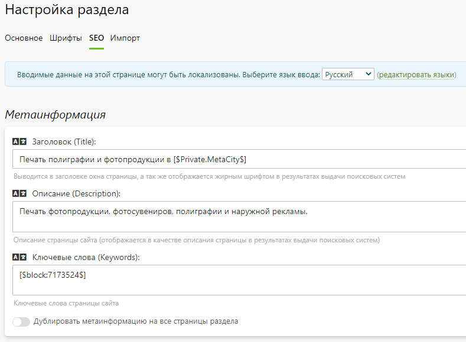
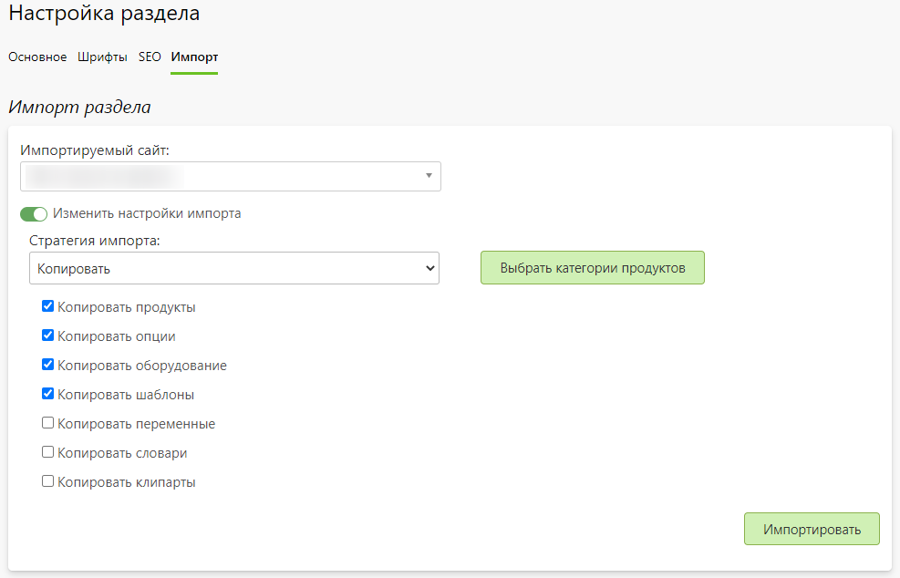

# Настройка
## Основная информация
* В данном разделе представлены общие настройки продуктов, дизайнов, мерча и редакторов.

## Шрифты
* В данном разделе представлены нестандартные шрифты, которые можно включить для редактора дизайнов.
* Также на странице можно:
    + Загрузить сторонний шрифт из Google.
    + Загрузить свой шрифт с компьютера.
    + Скачать любой шрифт на компьютер.
    + Выключить или включить доступность любого шрифта.
* 

## Метаинформация
* В данном разделе задается информация для поисковых систем (метаинформация) - заголовок, описание и ключевые слова, которые используются по умолчанию для всех категорий и продуктов, если она у них не задана. Однако для каждой категории и продукта можно задать свою собственную информацию.

## Импорт
* В данном разделе можно импортировать категории и продукты с одного из существующих сайтов в текущий.
 
* __Импортируемый сайт__ - сайт, из которого будет производиться импорт (по умолчанию просто копируются продукты, опции, оборудование и шаблоны).
 
* __Стратегия импорта__:
    + __Копировать__ - обычное копирование продуктов.
    + __Наследовать__ - копирование продуктов с наследованием от копируемого сайта.
    + __Копировать с наследованием__ - для товаров без наследования работает так же как и "Наследовать". Если же копируется сайт, у которого продукты уже наследуются, то на новом сайте продукты будут унаследованы от первоисточника.
 
* __Выбрать категории продуктов__ - выбор копируемых категорий продуктов.
 
* __Выбор копируемых объектов__:
    + продукты;
    + опции;
    + оборудование;
    + шаблоны;
    + клипарты;
    + переменные;
    + словари.
* 