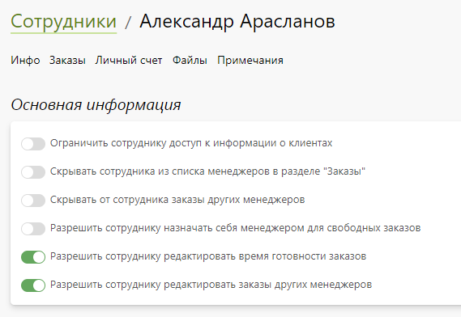
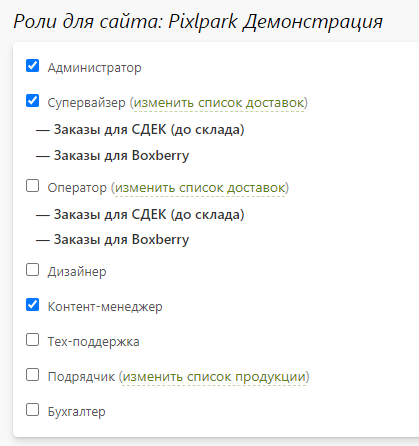

# Доступ к панели управления

## Карточка сотрудника
* __Содержание__
    + [Основная информация](/profile/staff?id=Основная-информация)
    + [Настройка интерфейса](/profile/staff?id=Настройка-интерфейса)
    + [Доступные статусы заказов](/profile/staff?id=Доступные-статусы-заказов)
    + [Глобальные роли](/profile/staff?id=Глобальные-роли)
    + [Локальные роли](/profile/staff?id=Локальные-роли)

### Основная информация
* В данном разделе представлены общие настройки, касаемые доступа сотрудника к заказам и клиентам.

### Настройка интерфейса
* В данном разделе задается внешний вид страницы списка заказов в панели управления, а также отображение заказов в личном кабинете на сайте, менеджером которых выступает сотрудник.

### Доступные статусы заказов
* В данном разделе задаются доступные для сотрудника статусы заказов. В зависимости от этого перестраивается интерфейс панели управления - изменяется набор предзаданных групп и фильтров по заказам.
* Сотрудник будет видеть только заказы, находящиеся в одном из перечисленных статусов. Сменить статус заказа он сможет только на следующий по цепочке, но из заданного списка.

> Данный механизм используется для упрощения интерфейса у сотрудников и минимизации ошибок работы с заказами. Например, можно разграничить область видимости и управления заказами для менеджеров, специалистов производства и логистики. А некоторым небольшим компаниям может быть вообще достаточно нескольких статусов: новый, в работе, выполнен, выдан и отменен.

### Глобальные роли
* В данном разделе определяются роли сотрудника для всех сайтов компании:
    + __Администратор__ - полный доступ к сервису.  
    Роль администратора используется для настройки мобильного приложения, работы с  финансовым документам и администрированию доступа сотрудников к панели управления.
    + __Супервайзер__ - полный доступ к разделам заказов и клиентов.
    Роль супервайзера используется для обработки любых заказов, их экспорта, а также анализа статистики продаж.
    + __Оператор__ - доступ к разделам заказов и клиентам (кроме подраздела статистики и экспорта); если у оператора заданы ограничения по доставкам, то ему доступны только заказы с указанными видами доставок.      
    Роль оператора используется для обработки заказов. Если у компании несколько точек выдачи, то для каждой из них заводится отдельная учетная запись, чтобы разграничить доступ к заказам. Также операторы могут выступать менеджерами заказов. С помощью персональных настроек можно ограничить доступ менеджера только к своим и свободным заказам (с возможностью их назначения на себя).
    + __Дизайнер__ - доступ только к назначенным заказам, клиентам и шаблонам; дизайнеру можно назначать любые заказы, переводя их в статус "Разработка дизайна".  
    Роль дизайнера используется для тех заказов, по которым требуется либо создание уникального дизайна, либо редактирование макета клиента. Согласование результата работы происходит в обсуждении заказа.
    + __Контент-менеджер__ - доступ ко всем разделам, кроме заказов и клиентов.  
    Роль контент-менеджера используется для администрирования сайта и обработки обратной связи.
    + __Подрядчик__ - доступ только к назначенным заказам; если у оператора заданы ограничения по продуктам, то ему доступны для назначения только заказы с указанными продуктами.  
    Роль подрядчика используется для передачи заказов сторонним производствам. В этом случае сотрудник сторонней компании будет получать на почту уведомления о поступлении заказов. Их он сможет скачивать либо по ссылке из письма, либо из панели управления.
    + __Бухгалтер__ - доступ к разделам заказов и клиентов без возможности изменения заказов (кроме изменения оплаты).  
    Роль бухгалтера используется для разнесения безналичных оплат и подготовке отчетов по продажам (в том числе с целью начисления заработной платы сотрудникам).
* 

### Локальные роли
* В данном разделе задаются роли сотрудника для данного сайта, включая настройки ограничений по доставкам (для операторов) и по продуктам (для подрядчиков).

## Список сотрудников
* В данном разделе представлен список сотрудников, которых можно отфильтровать по роли и сайту.
* Также на странице можно:
    + Добавить нового сотрудника.
    + Перейти в карточку сотрудника.
    + Удалить выбранных сотрудников.
* 

## Доступ к панели управления
* В данном разделе задаются правила доступа к панели управления по IP-адресам или подсетям, с которых сотрудник пытается войти в панель управления.

* На странице вы можете удалить или добавить правило, введя его название и IP-адрес.

> Данный механизм используется в том случае, если вы хотите усилить безопасность вашего сайта и клиентской базы. Например, ограничить доступ только офисными компьютерами. Или же сотрудниками, работающими удаленно со статическими IP-адресами.