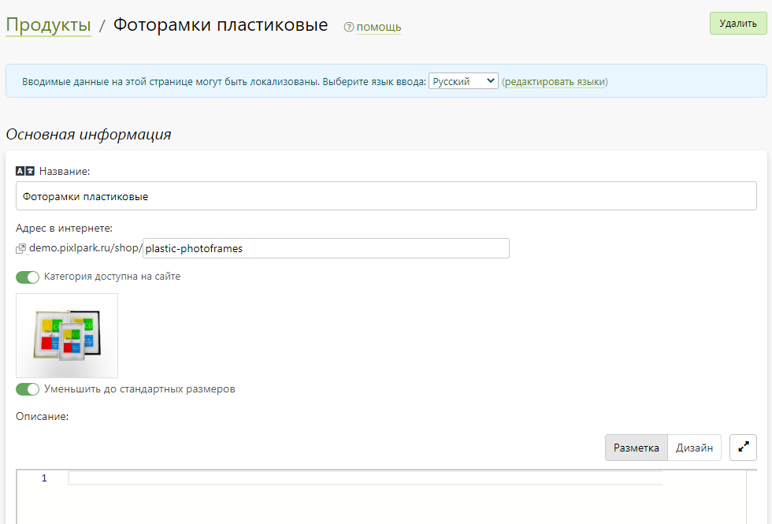

# Продукты
## Описание
* Магазин - это раздел сайта, доступный по адресу [/shop](https://demo.pixlpark.ru/shop), предназначенный для продажи готовой продукции.
* Структура магазина не имеет иерархической вложенности категорий и тонкой настройки фильтрации продуктов внутри самой категории, что ограничивает применение данного раздела продажей небольшого ассортимента товаров (десятки или сотни позиций).
* Например, магазин удачно подойдет для продажи фоторамок, фотоальбомов и прочих аксессуаров.

## Карточка продукта
### Основная информация
* В данном разделе задаются основные параметры продукта:
    + Название.
    + Производитель (из списка производителей).
    + Артикул.
    + Адрес в интернете.
    + Доступность на сайте.
    + Добавлять при отображении цены "от".
    + Обложка (иллюстрация) с возможностью автоматического уменьшения размера до стандартного.
*

### Описание продукта
* В данном разделе задается описание продукта в формате HTML, которое на сайте выводится в карточке товара справа от иллюстраций.

### Метаинформация
* В данном разделе задается информация для поисковых систем (метаинформация) - заголовок, описание и ключевые слова.

### Доп. изображения
* В данном разделе загружаются иллюстрации продукта, которые выводятся на сайте в карточке товара в виде слайдера слева от описания.

### Параметры
* В данном разделе задаются параметры, связанные с категорией продукта. Они выводяться на сайте в карточке товара под описанием продукта.

### Цена
* В данном разделе определяется стратегия формирования стоимости продукта, которая может быть:
    + Фиксированной для всех его свойств.
    + Динамической, в зависимости от выбранных свойств.
* В случае выбора динамической цены, правила задаются в виде набора свойств и соответствующей им стоимости продукта. Любое из заданных правил можно как включить или отключить, так и удалить.
* На сайте в карточке товара свойства выводятся в виде списков под параметрами. В зависимости от выбранных значений, изменяется цена (если она динамическая, в соответствии с настройками для данного продукта).

## Карточка категории
### Основная информация
* В данном разделе задаются основные параметры категории:
    + Название.
    + Адрес в интернете.
    + Доступность на сайте.
    + Обложка (иллюстрация).
    + Описание (HTML-формат), которое выводится на сайте на странице категории.
*

### Параметры
* В данном разделе выводится список параметров, связанных с выбранной категорией. Привязку любых параметров к данной категории можно изменить.

### Свойства
* В данном разделе выводится список свойств, связанных с выбранной категорией.  Привязку любых свойств к данной категории можно изменить.

### Метаинформация
* В данном разделе задается информация для поисковых систем (метаинформация) - заголовок, описание и ключевые слова, которые используются как для страницы категории, так и по умолчанию для всех продуктов категории, если она у них не задана. Однако для каждого продукта можно задать свою собственную информацию.

## Список категорий и продуктов
* В данном разделе представлен список категорий и продуктов в каждой из них.
* Также в этом разделе можно:
    + Добавить новую категорию.
    + Перейти в карточку категории.
    + Изменить порядок следования категорий.
    + Удалить любую категорию со вложенными в нее продуктами.
    + Добавить новый продукт по шаблону другого продукта, либо с нуля.
    + Импортировать список продуктов из эксель-файла.
    + Отфильтровать список продуктов по производителю.
    + Отсортировать  список продуктов по цене.
    + Перейти в карточку продукта.
    + Включить или выключить публикацию любого продукта на сайте.
    + Дублировать выделенные продукты.
    + Удалить выделенные продукты.

