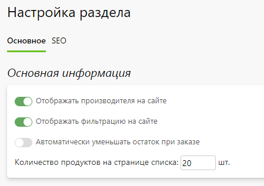
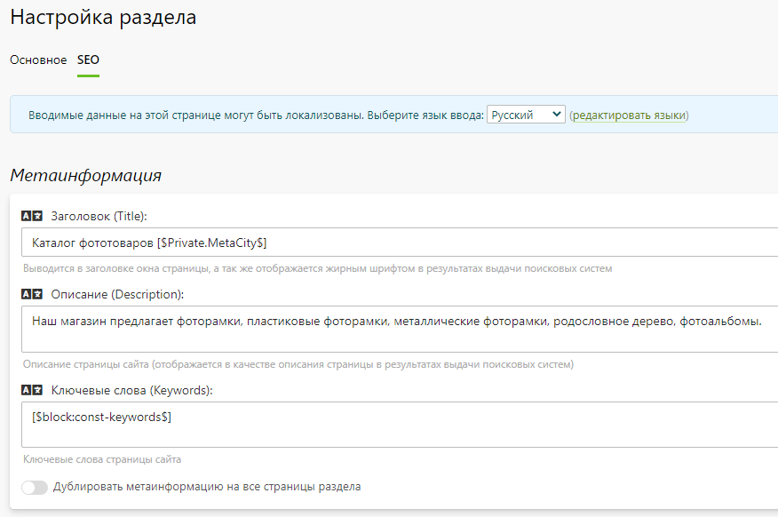

# Настройка
## Основная информация
* В данном разделе представлены общие настройки магазина готовой продукции.

## Метаинформация
* В данном разделе задается информация для поисковых систем (метаинформация) - заголовок, описание и ключевые слова, которые используются по умолчанию для всех категорий и продуктов, если она у них не задана. Однако, для каждой категории и продукта можно задать свою собственную информацию.
